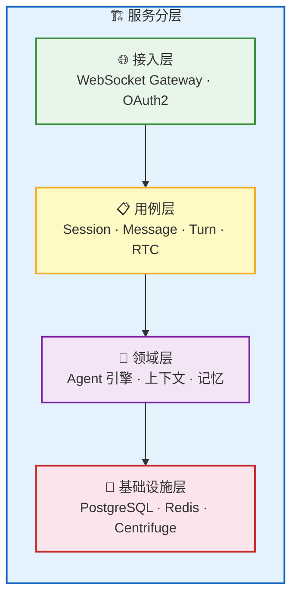
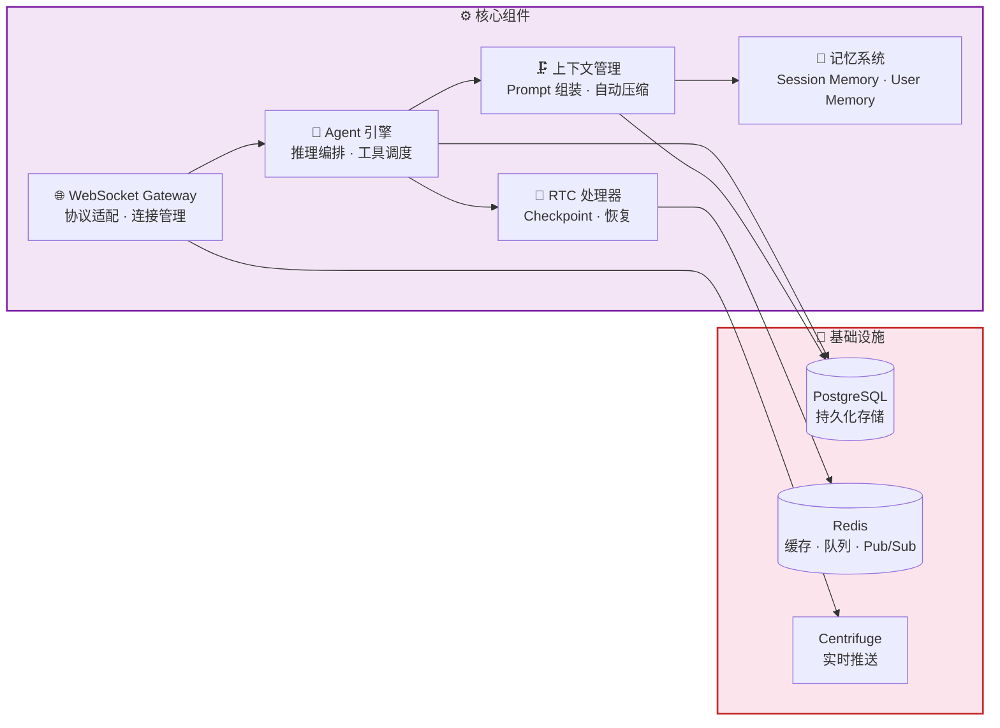
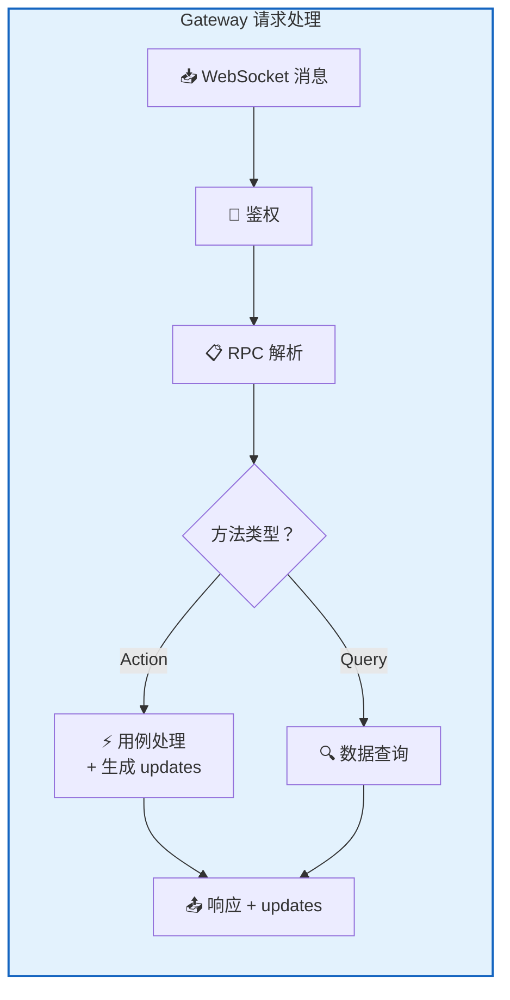
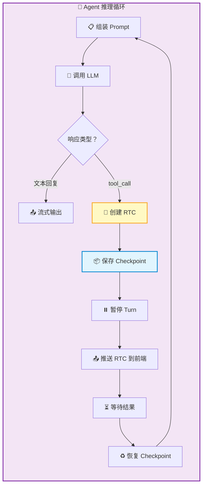
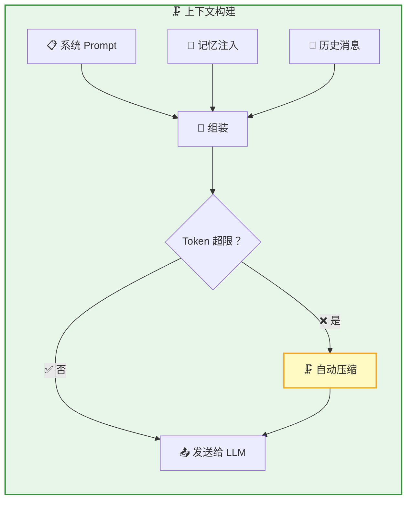
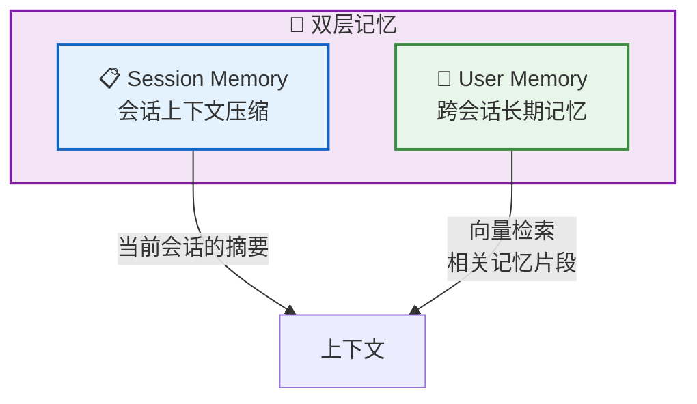
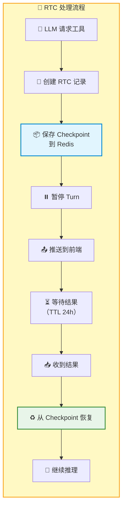
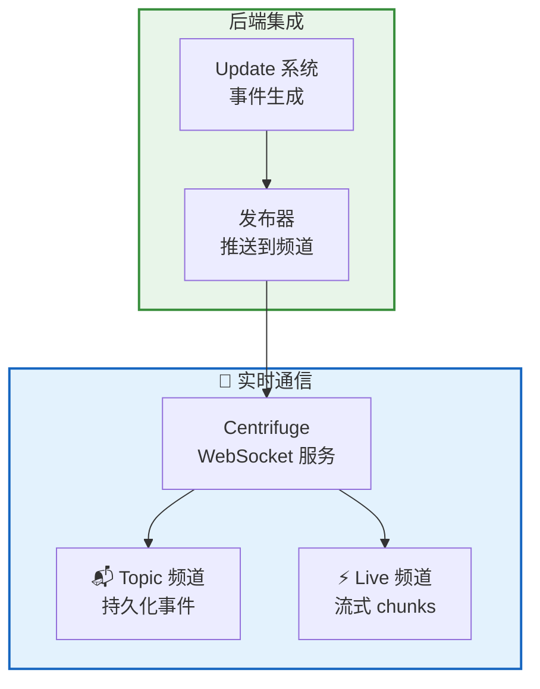

RTC Agent Server 是一个 **Go 服务**，负责 AI 推理编排、上下文管理、实时通信和工具调用调度。核心组件包括 WebSocket Gateway、Agent 引擎、上下文管理、记忆系统和 RTC 处理器。

## 服务分层

| 层 | 职责 | 关键模块 |
|:--:|------|----------|
| 🌐 **接入层** | 协议适配、认证鉴权 | WebSocket Gateway、OAuth2 Handler |
| 📋 **用例层** | 业务编排、RPC 处理 | Session / Message / Turn / RTC 用例 |
| 🤖 **领域层** | AI 推理、状态管理 | Agent 引擎、上下文管理、记忆系统 |
| 💾 **基础设施层** | 数据持久化、消息传递 | PostgreSQL、Redis、Centrifuge |

---

## 核心组件

### WebSocket Gateway

Gateway 是前后端通信的入口，管理所有 WebSocket 连接和 RPC 路由。

| 职责 | 说明 |
|------|------|
| **连接管理** | 处理 WebSocket 建连、鉴权、心跳、断线 |
| **RPC 路由** | 将 18 个 RPC 方法分发到对应的用例处理 |
| **事件推送** | 将 Agent 产生的事件通过 Centrifuge 推送到前端 |
| **RTC 中转** | 将 AI 的工具调用请求转发到前端，接收执行结果 |

### Agent 引擎

Agent 引擎是 AI 推理的核心——组装 Prompt、调用 LLM、处理工具调用、管理推理循环。

| 能力 | 说明 |
|------|------|
| **推理循环** | 调用 LLM → 处理响应 → 工具调用 → 继续推理，直到生成最终回复 |
| **工具调度** | 管理 6 个内置工具（ls / read / write / grep / find / script） |
| **流式输出** | 实时将 LLM 输出推送到前端 |
| **子代理** | 复杂任务自动拆解，多个专业子代理并行工作 |

### 上下文管理

上下文管理负责构建发送给 LLM 的完整 Prompt，并在对话过长时自动压缩。

| 功能 | 说明 |
|------|------|
| **Prompt 组装** | 系统提示 + 记忆 + AGENT.md + 历史消息 |
| **自动压缩** | 上下文接近 Token 限制时，自动摘要早期对话 |
| **手动压缩** | 通过 `v1.session.compact` RPC 触发 |
| **记忆注入** | 从记忆系统检索相关片段注入上下文 |

### 记忆系统

双层记忆架构，让 AI 同时拥有短期和长期记忆。

| 类型 | 范围 | 存储 | 用途 |
|------|:----:|:----:|------|
| **Session Memory** | 单会话 | 数据库 | 长对话的上下文压缩摘要 |
| **User Memory** | 跨会话 | 向量数据库 | 用户偏好、历史事实的长期记忆 |

### RTC 处理器

RTC 处理器管理工具调用的完整生命周期——从创建 RTC 记录到保存 Checkpoint、暂停 Turn、等待结果、恢复推理。

| 特性 | 说明 |
|------|------|
| **Checkpoint** | 保存当前推理状态到 Redis，TTL 24 小时 |
| **崩溃恢复** | 服务端重启后可从 Checkpoint 恢复 |
| **串行执行** | 同一会话内 RTC 严格串行，避免文件冲突 |
| **100% 送达** | 前端结果提交无限重试，幂等保证 |

---

## 实时通信层

| 组件 | 职责 |
|------|------|
| **Centrifuge** | WebSocket 服务端，管理频道订阅和消息分发 |
| **Update 系统** | 每次数据变更生成 Update 事件 |
| **Redis PUB/SUB** | Live 频道的底层传输，低延迟即发即弃 |

---

## 技术栈

| 组件 | 技术 | 用途 |
|------|:----:|------|
| **语言** | Go 1.27 | 主服务语言 |
| **CLI** | Cobra | 命令行框架 |
| **ORM** | GORM | 数据库操作 |
| **数据库** | PostgreSQL | 持久化存储 |
| **缓存** | Redis | Checkpoint、缓冲、Pub/Sub |
| **实时通信** | Centrifuge | WebSocket 服务 |
| **AI SDK** | Anthropic SDK + Eino | Agent 推理 |
| **可观测** | OpenTelemetry + Jaeger | 分布式追踪 |
| **指标** | Prometheus | 监控指标 |

## 下一步

- [前端架构](/docs/architecture/frontend/) — 了解 Web Components 组件体系
- [架构总览](/docs/architecture/) — 返回架构全景
- [Remote Tool Calling](/docs/concepts/rtc/) — 了解 RTC 工具调用的完整机制
- [WebSocket RPC](/docs/protocol/rpc/) — 了解 RPC 方法的详细定义
