RTC Agent Server 是一个 **Go 服务**，负责 AI 推理编排、上下文管理、实时通信和工具调用调度。核心组件包括 WebSocket Gateway、Agent 引擎、上下文管理、记忆系统和 RTC 处理器。

## 服务分层

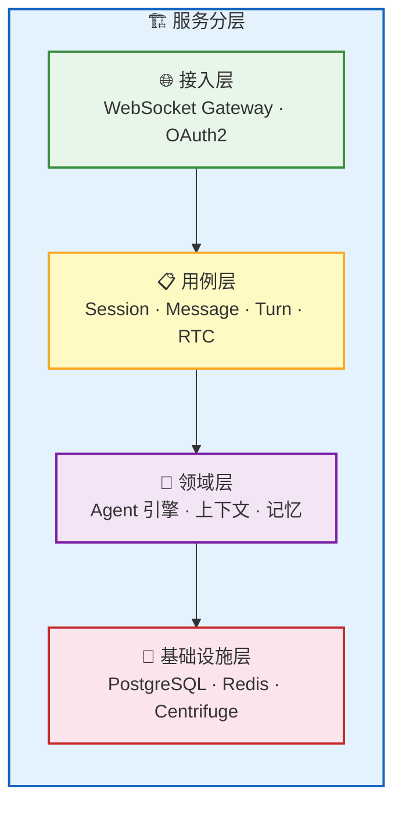

| 层 | 职责 | 关键模块 |
| --- | --- | --- |
| 🌐 **接入层** | 协议适配、认证鉴权 | WebSocket Gateway、OAuth2 Handler |
| 📋 **用例层** | 业务编排、RPC 处理 | Session / Message / Turn / RTC 用例 |
| 🤖 **领域层** | AI 推理、状态管理 | Agent 引擎、上下文管理、记忆系统 |
| 💾 **基础设施层** | 数据持久化、消息传递 | PostgreSQL、Redis、Centrifuge |

> **OAuth2 认证**：系统采用 OAuth2 授权码流程，前端通过 iframe 跳转完成授权，获取 Access Token（1 小时有效）和 Refresh Token（30 天有效）。WebSocket 建连时使用 Access Token 鉴权。详见 [认证流程](/docs/integration/auth)。

## 核心组件

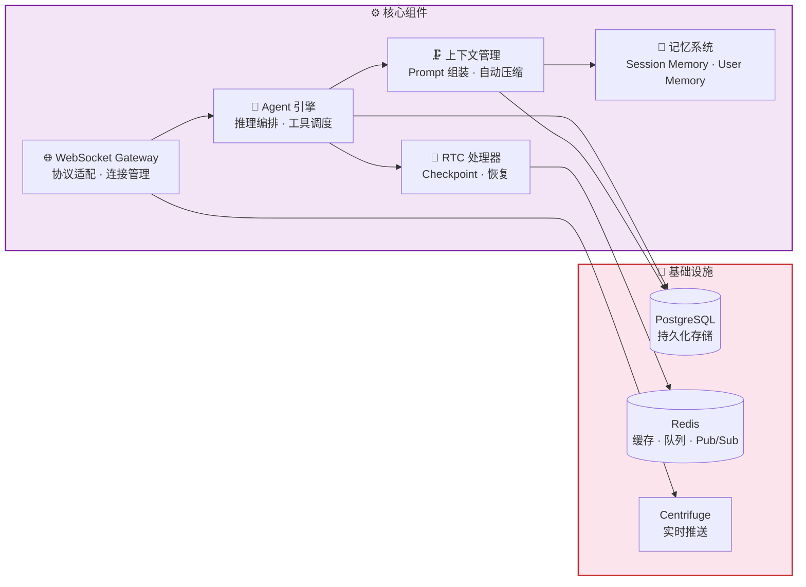

### WebSocket Gateway

Gateway 是前后端通信的入口，管理所有 WebSocket 连接和 RPC 路由。

| 职责 | 说明 |
| --- | --- |
| **连接管理** | 处理 WebSocket 建连、鉴权、心跳、断线 |
| **RPC 路由** | 将 18 个 RPC 方法分发到对应的用例处理 |
| **事件推送** | 将 Agent 产生的事件通过 Centrifuge 推送到前端 |
| **RTC 中转** | 将 AI 的工具调用请求转发到前端，接收执行结果 |

**18 个 RPC 方法分类**：

| 类别 | 方法 |
| --- | --- |
| **Session** | `session.list`, `session.get`, `session.close`, `session.update`, `session.fork`, `session.compact` |
| **Message** | `message.send`, `message.list`, `message.get` |
| **Turn** | `turn.list`, `turn.get`, `turn.stop` |
| **RTC** | `rtc.list`, `rtc.get`, `rtc.update_status`, `rtc.submit_result` |

详见 [WebSocket RPC](/docs/protocol/rpc)。

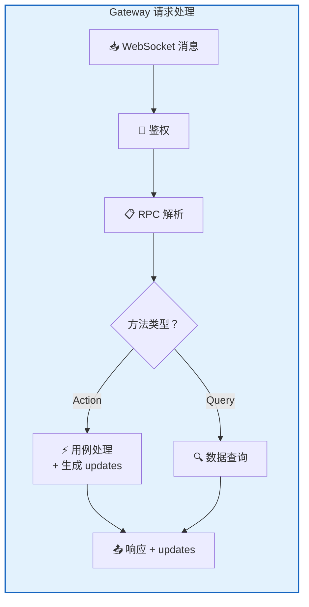

### Agent 引擎

Agent 引擎是 AI 推理的核心——组装 Prompt、调用 LLM、处理工具调用、管理推理循环。

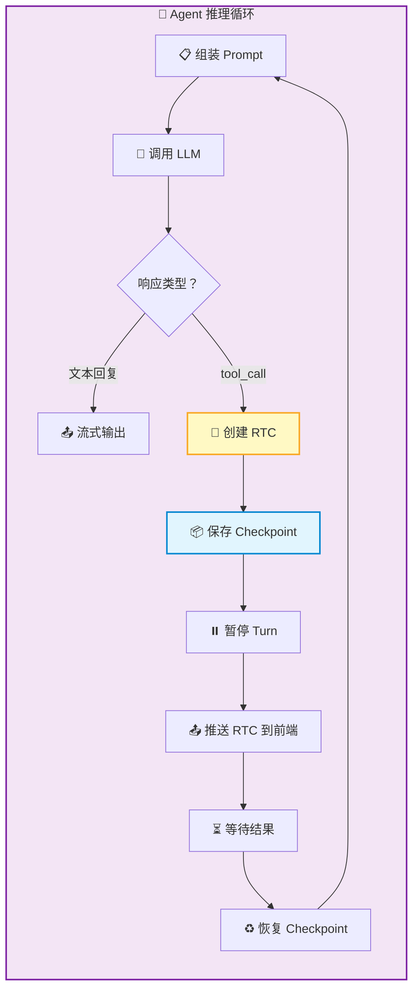

| 能力 | 说明 |
| --- | --- |
| **推理循环** | 调用 LLM → 处理响应 → 工具调用 → 继续推理，直到生成最终回复 |
| **工具调度** | 管理 6 个内置工具（ls / read / write / grep / find / script） |
| **流式输出** | 实时将 LLM 输出推送到前端 |
| **子代理** | 复杂任务自动拆解，多个专业子代理并行工作（详见下文） |

#### 子代理机制

当任务复杂度超过单次推理能力时，Agent 引擎会自动拆解任务，创建子代理并行处理：

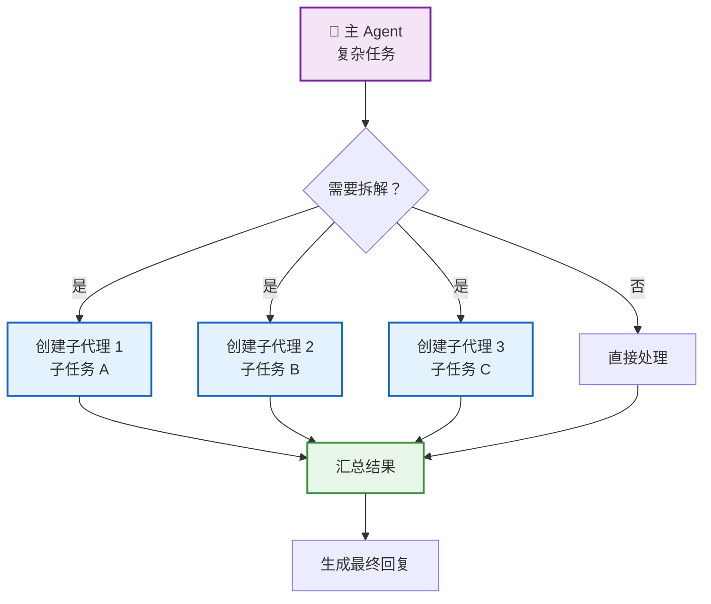

- **独立上下文**：每个子代理有自己的会话和上下文，互不干扰
- **并行执行**：多个子代理可以同时调用 LLM 和工具
- **结果汇总**：主 Agent 收集所有子代理的结果，生成最终回复

### 上下文管理

上下文管理负责构建发送给 LLM 的完整 Prompt，并在对话过长时自动压缩。

#### Prompt 组装

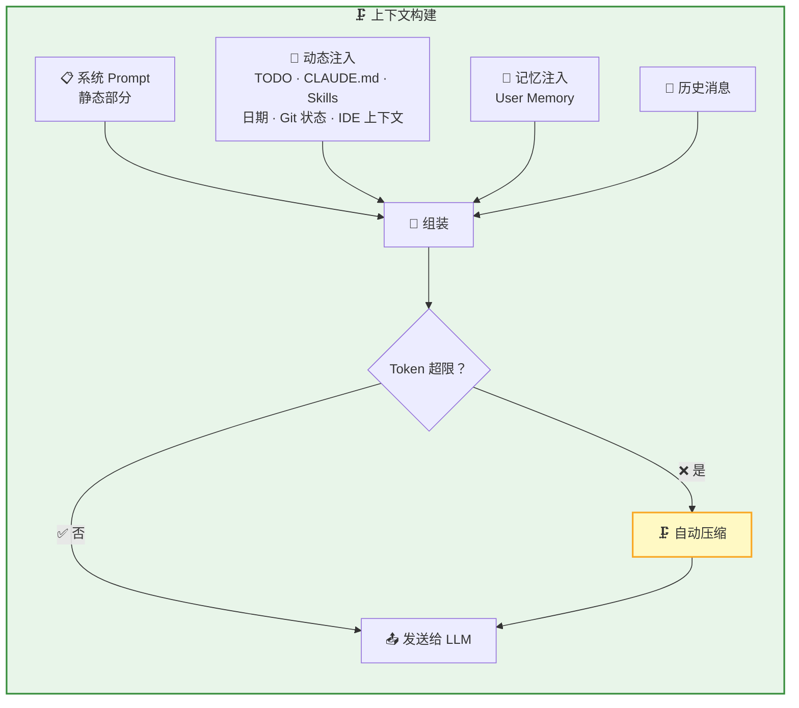

#### 三层压缩策略

当对话长度接近 Token 限制时，系统采用三层递进式压缩：

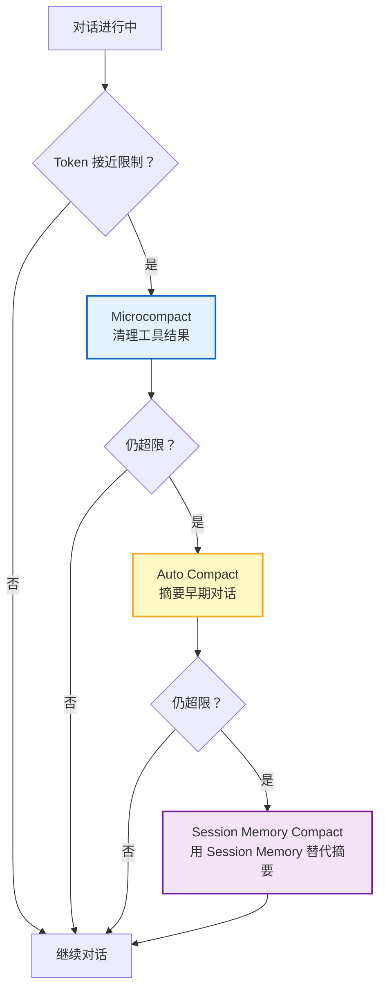

| 策略 | 触发条件 | 压缩方式 | 保留内容 |
| --- | --- | --- | --- |
| **Microcompact** | 工具调用后 | 清理早期工具结果，只保留最近 5 个 | 时间间隔 > 60 分钟的消息 |
| **Auto Compact** | Token 达到阈值 | LLM 摘要早期对话（9 部分结构化摘要） | 最近 10K token + 5 条消息 |
| **Session Memory Compact** | Auto Compact 失败 3 次 | 直接用 Session Memory 作为摘要 | Session Memory 的 5 个分类 |

> **熔断机制**：如果 Auto Compact 连续失败 3 次，系统会停止自动压缩，避免无限循环消耗 Token。

详见 [上下文管理](/docs/features/context-management)。

### 记忆系统

双层记忆架构，让 AI 同时拥有短期和长期记忆。

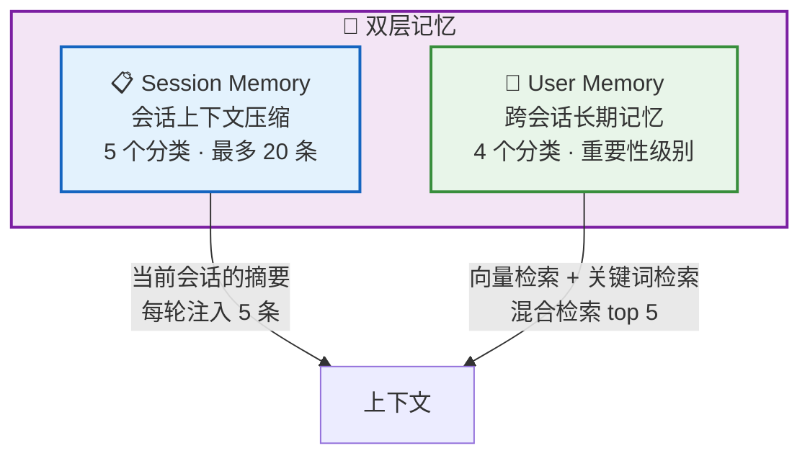

#### Session Memory

每个会话独立维护，用于长对话的上下文压缩：

| 分类 | 说明 |
| --- | --- |
| **decision** | 用户做出的决策和选择 |
| **context** | 当前任务的背景信息 |
| **progress** | 已完成的工作和进度 |
| **issue** | 遇到的问题和阻碍 |
| **learnings** | 从任务中学到的经验 |

- **容量**：最多 20 条，约 12K tokens
- **提取方式**：双轨制——后台 Agent 自动提取 + Agent 主动保存
- **用途**：Session Memory Compact 的摘要来源，每轮对话注入 5 条到上下文

#### User Memory

跨会话的长期记忆，存储用户偏好和历史事实：

| 分类 | 说明 |
| --- | --- |
| **user** | 用户身份信息（角色、专长、偏好） |
| **feedback** | 用户对工作方式的反馈 |
| **project** | 进行中的项目、目标、约束 |
| **reference** | 外部资源指针（URL、文档、工单） |

- **重要性级别**：low / medium / high / critical
- **容量**：最多 1000 条
- **提取方式**：Agent 主动保存
- **检索方式**：混合检索（向量余弦相似度 top-20 + 关键词全文检索 top-20 → RRF 融合 → 重要性加权 → top 5）

详见 [记忆系统](/docs/features/memory)。

### RTC 处理器

RTC 处理器管理工具调用的完整生命周期——从创建 RTC 记录到保存 Checkpoint、暂停 Turn、等待结果、恢复推理。

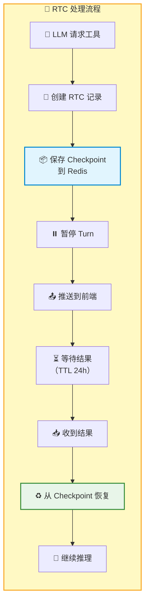

| 特性 | 说明 |
| --- | --- |
| **Checkpoint** | 保存当前推理状态到 Redis，TTL 24 小时 |
| **崩溃恢复** | 服务端重启后可从 Checkpoint 恢复 |
| **串行执行** | 同一会话内 RTC 严格串行，避免文件冲突 |
| **100% 送达** | 前端结果提交无限重试，幂等保证 |

#### 工作模式权限矩阵

不同工作模式下，工具调用的确认策略不同：

| 工具类型 | manual | edit | plan | auto | bypass |
| --- | --- | --- | --- | --- | --- |
| **只读工具**（ls/read/grep/find） | ✅ 自动执行 | ✅ 自动执行 | ✅ 自动执行 | ✅ 自动执行 | ✅ 自动执行 |
| **写工具**（write） | ⚠️ 需确认 | ✅ 自动执行 | ⚠️ 需确认 | ✅ 自动执行 | ✅ 自动执行 |
| **script 工具** | ⚠️ 需确认 | ⚠️ 需确认 | ⚠️ 需确认 | ⚠️ 需确认 | ✅ 自动执行 |

详见 [工作模式](/docs/concepts/work-modes)。

## 实时通信层

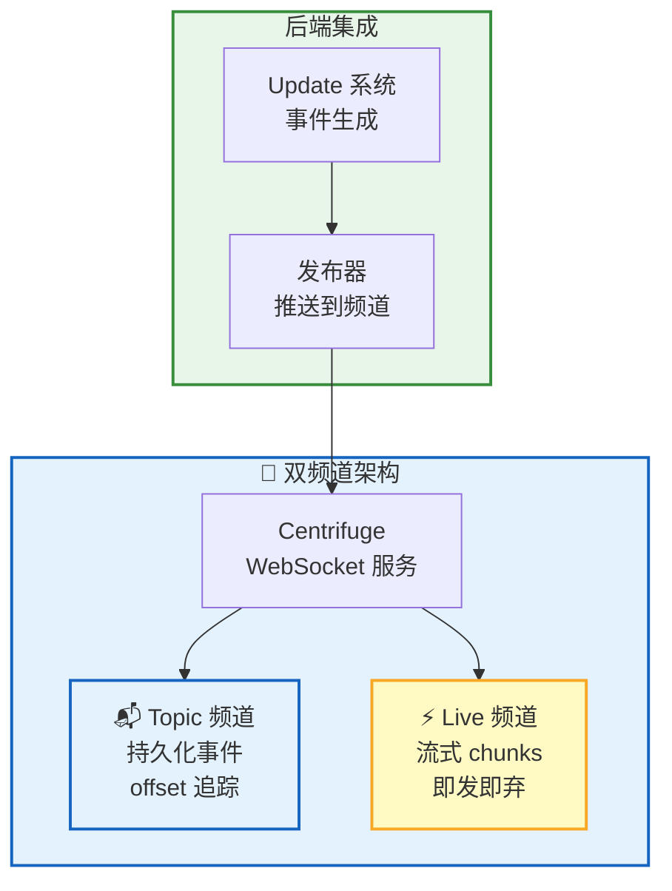

| 频道 | 用途 | 特性 |
| --- | --- | --- |
| **Topic** | 状态变更事件（Session、Message、Turn、RTC） | 持久化、offset 追踪、离线恢复 |
| **Live** | 流式输出中间 chunks | 非持久化、Redis PUB/SUB、低延迟、可丢失 |

### Offset 机制与离线恢复

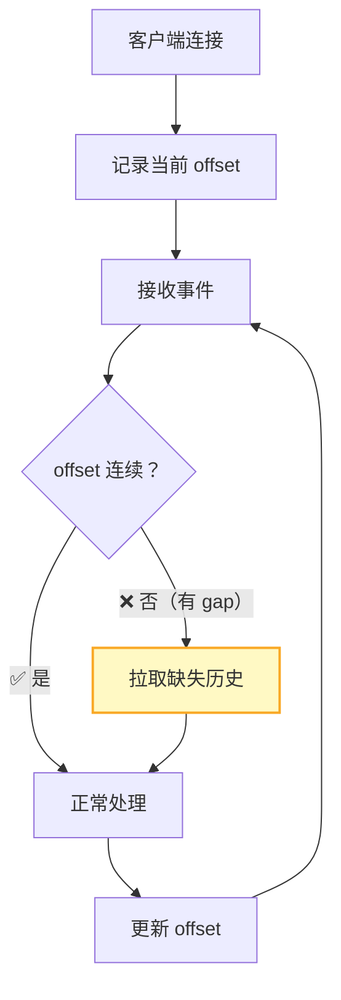

- **短暂断线**（< 5 秒）：重连后自动推送缺失事件
- **长时间断线**：客户端检测 offset gap，主动拉取历史记录
- **Epoch 变化**：服务端重启后 epoch 改变，客户端重置 offset 并重新拉取全量

详见 [实时通信](/docs/features/realtime)。

## 下一步

- [前端架构](/docs/architecture/frontend) — 了解 Web Components 组件体系
- [架构总览](/docs/architecture) — 返回架构全景
- [Remote Tool Calling](/docs/concepts/rtc) — 了解 RTC 工具调用的完整机制
- [WebSocket RPC](/docs/protocol/rpc) — 了解 RPC 方法的详细定义
