RTC Agent Server 是一个 **Go 服务**，负责 AI 推理编排、上下文管理、实时通信、工具调用调度和对象存储。核心组件包括 WebSocket Gateway、Agent 引擎、上下文管理、记忆系统、RTC 处理器和 OSS3 存储引擎。

## 服务分层

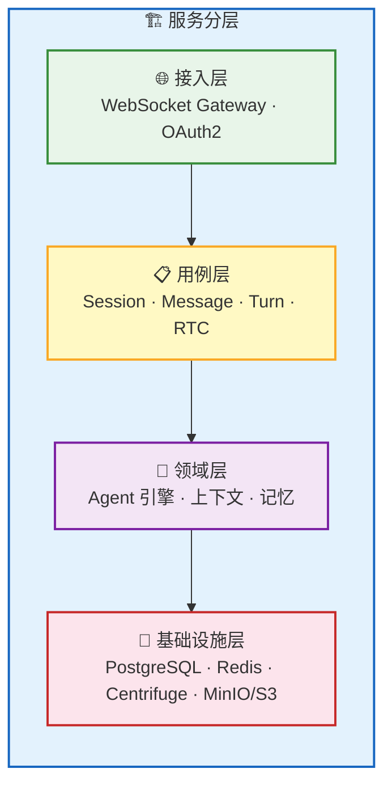
```mermaid
flowchart TD
    subgraph LAYERS["🏗️ 服务分层"]
        direction TB
        L1["🌐 接入层<br/>WebSocket Gateway · OAuth2"]
        L2["📋 用例层<br/>Session · Message · Turn · RTC"]
        L3["🤖 领域层<br/>Agent 引擎 · 上下文 · 记忆"]
        L4["💾 基础设施层<br/>PostgreSQL · Redis · Centrifuge · MinIO/S3"]
    end

    L1 --> L2 --> L3 --> L4

    style LAYERS fill:#e3f2fd,stroke:#1565c0,stroke-width:2px
    style L1 fill:#e8f5e9,stroke:#388e3c,stroke-width:2px
    style L2 fill:#fff9c4,stroke:#f9a825,stroke-width:2px
    style L3 fill:#f3e5f5,stroke:#7b1fa2,stroke-width:2px
    style L4 fill:#fce4ec,stroke:#c62828,stroke-width:2px
```

| 层 | 职责 | 关键模块 |
| --- | --- | --- |
| 🌐 **接入层** | 协议适配、认证鉴权 | WebSocket Gateway、OAuth2 Handler |
| 📋 **用例层** | 业务编排、RPC 处理 | Session / Message / Turn / RTC 用例 |
| 🤖 **领域层** | AI 推理、状态管理 | Agent 引擎、上下文管理、记忆系统 |
| 💾 **基础设施层** | 数据持久化、消息传递、对象存储 | PostgreSQL、Redis、Centrifuge、MinIO/S3 |

> **OAuth2 认证**：系统采用 OAuth2 授权码流程，前端通过弹窗（popup window）跳转完成授权，获取 Access Token（1 小时有效）和 Refresh Token（30 天有效）。WebSocket 建连时使用 Access Token 鉴权。详见 [认证流程](/docs/integration/auth)。

## 核心组件

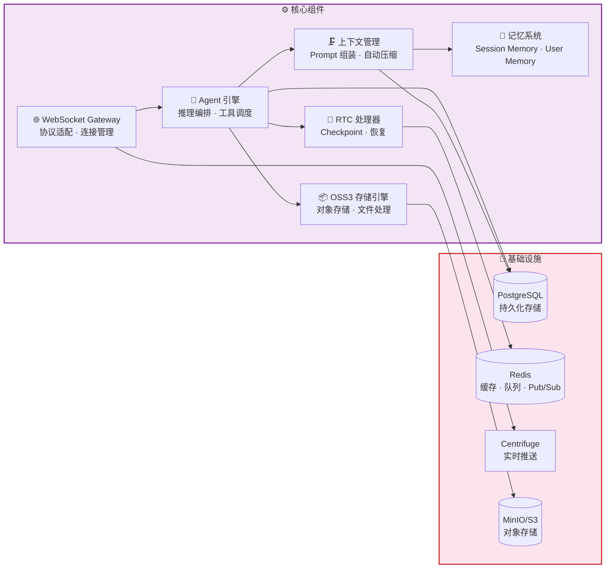
```mermaid
flowchart LR
    subgraph CORE["⚙️ 核心组件"]
        direction TB
        GW["🌐 WebSocket Gateway<br/>协议适配 · 连接管理"]
        AGENT["🤖 Agent 引擎<br/>推理编排 · 工具调度"]
        CTX["🗜️ 上下文管理<br/>Prompt 组装 · 自动压缩"]
        MEM["🧠 记忆系统<br/>Session Memory · User Memory"]
        RTC_P["🔧 RTC 处理器<br/>Checkpoint · 恢复"]
        OSS3["📦 OSS3 存储引擎<br/>对象存储 · 文件处理"]
    end

    subgraph INFRA["💾 基础设施"]
        direction TB
        PG[("PostgreSQL<br/>持久化存储")]
        RD[("Redis<br/>缓存 · 队列 · Pub/Sub")]
        CF["Centrifuge<br/>实时推送"]
        S3[("MinIO/S3<br/>对象存储")]
    end

    GW --> AGENT
    AGENT --> CTX
    CTX --> MEM
    AGENT --> RTC_P
    AGENT --> OSS3
    RTC_P --> RD
    GW --> CF
    AGENT --> PG
    CTX --> PG
    OSS3 --> S3

    style CORE fill:#f3e5f5,stroke:#7b1fa2,stroke-width:2px
    style INFRA fill:#fce4ec,stroke:#c62828,stroke-width:2px
```

### WebSocket Gateway

Gateway 是前后端通信的入口，管理所有 WebSocket 连接和 RPC 路由。

| 职责 | 说明 |
| --- | --- |
| **连接管理** | 处理 WebSocket 建连、鉴权、心跳、断线 |
| **RPC 路由** | 将 17 个 RPC 方法分发到对应的用例处理 |
| **事件推送** | 将 Agent 产生的事件通过 Centrifuge 推送到前端 |
| **RTC 中转** | 将 AI 的工具调用请求转发到前端，接收执行结果 |

**17 个 RPC 方法分类**：

| 类别 | 方法 |
| --- | --- |
| **Session** | `v1.session.list`, `v1.session.get`, `v1.session.open`, `v1.session.close`, `v1.session.update`, `v1.session.fork`, `v1.session.compact` |
| **Message** | `v1.message.send`, `v1.message.list`, `v1.message.get` |
| **Turn** | `v1.turn.list`, `v1.turn.get`, `v1.turn.stop` |
| **RTC** | `v1.rtc.list`, `v1.rtc.get`, `v1.rtc.update_status`, `v1.rtc.submit_result` |

详见 [WebSocket RPC](/docs/protocol/rpc)。

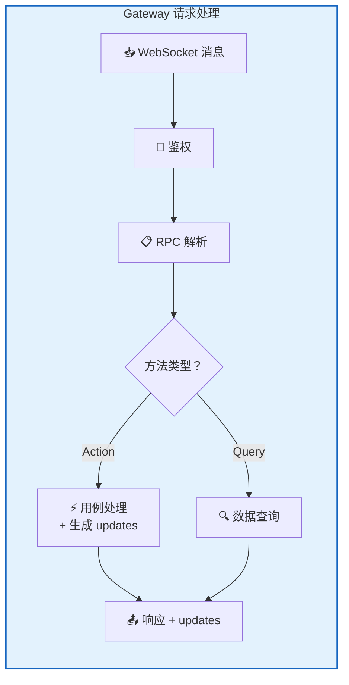
```mermaid
flowchart LR
    subgraph GW_FLOW["Gateway 请求处理"]
        direction TB
        A["📥 WebSocket 消息"] --> B["🔐 鉴权"]
        B --> C["📋 RPC 解析"]
        C --> D{"方法类型？"}
        D -->|"Action"| E["⚡ 用例处理<br/>+ 生成 updates"]
        D -->|"Query"| F["🔍 数据查询"]
        E --> G["📤 响应 + updates"]
        F --> G
    end

    style GW_FLOW fill:#e3f2fd,stroke:#1565c0,stroke-width:2px
```

### Agent 引擎

Agent 引擎是 AI 推理的核心——组装 Prompt、调用 LLM、处理工具调用、管理推理循环。

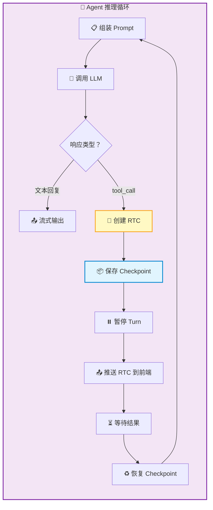
```mermaid
flowchart TD
    subgraph AGENT_FLOW["🤖 Agent 推理循环"]
        direction TB
        A["📋 组装 Prompt"] --> B["🧠 调用 LLM"]
        B --> C{"响应类型？"}
        C -->|"文本回复"| D["📤 流式输出"]
        C -->|"tool_call"| E["🔧 创建 RTC"]
        E --> F["📦 保存 Checkpoint"]
        F --> G["⏸️ 暂停 Turn"]
        G --> H["📤 推送 RTC 到前端"]
        H --> I["⏳ 等待结果"]
        I --> J["♻️ 恢复 Checkpoint"]
        J --> A
    end

    style AGENT_FLOW fill:#f3e5f5,stroke:#7b1fa2,stroke-width:2px
    style E fill:#fff9c4,stroke:#f9a825,stroke-width:2px
    style F fill:#e1f5fe,stroke:#0288d1,stroke-width:2px
```

| 能力 | 说明 |
| --- | --- |
| **推理循环** | 调用 LLM → 处理响应 → 工具调用 → 继续推理，直到生成最终回复 |
| **内置工具** | 文件操作（ls/read/write/grep/find/script）、子代理（subAgent/listSubAgent/stopSubAgent）、用户交互（askUser）、目标管理（goal）、循环任务（loop）等 |
| **多模态理解** | 处理用户消息中的文件附件——图片经 OSS 加载、预处理（EXIF 校正/缩放/压缩）后以 base64 注入 LLM Vision；文本文件经 UTF-8 校验/截断后 XML 包裹追加到 Content（详见下文） |
| **流式输出** | 实时将 LLM 输出推送到前端 |
| **错误反馈** | Turn 失败时自动分类错误，生成结构化 ErrorContent 消息推送给前端（详见下文） |
| **子代理** | 复杂任务自动拆解，多个专业子代理并行工作（详见下文） |

#### 错误反馈 (Error Feedback)

当 Turn 执行失败时，系统自动将错误分类并生成结构化错误消息，前端可渲染为带重试按钮的用户友好提示：

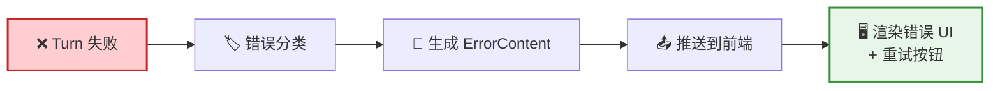
```mermaid
flowchart LR
    A["❌ Turn 失败"] --> B["🏷️ 错误分类"]
    B --> C["📝 生成 ErrorContent"]
    C --> D["📤 推送到前端"]
    D --> E["🖥️ 渲染错误 UI<br/>+ 重试按钮"]

    style A fill:#ffcdd2,stroke:#c62828,stroke-width:2px
    style E fill:#e8f5e9,stroke:#388e3c,stroke-width:2px
```

| 错误分类 | 说明 | 典型场景 |
|:--------:|------|----------|
| `api` | API 调用错误 | 模型返回错误、速率限制 |
| `context` | 上下文相关 | 上下文超长、压缩失败 |
| `network` | 网络错误 | 连接超时、DNS 失败 |
| `permission` | 权限错误 | 认证失败、会话归属不匹配 |
| `stream` | 流式处理错误 | SSE 中断、stream 解析失败 |
| `system` | 系统错误 | 内部异常、数据库错误 |
| `timeout` | 超时错误 | 推理超时、工具执行超时 |
| `tool` | 工具调用错误 | 工具不存在、参数校验失败 |

> 💡 **限流保护**：每个 session 每小时最多 20 条错误消息，防止错误风暴。`debug.show_raw_errors` 配置可控制是否向前端暴露原始错误详情。

详见 [ErrorContent 协议定义](/docs/protocol/rpc/#errorcontent-错误消息)。

#### 子代理机制

当任务复杂度超过单次推理能力时，Agent 引擎会自动拆解任务，创建子代理并行处理：

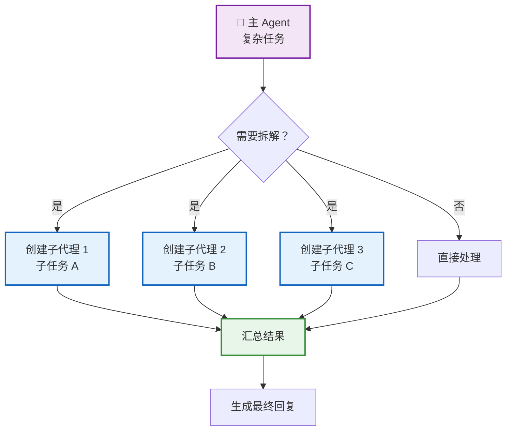
```mermaid
flowchart TD
    A["🧠 主 Agent<br/>复杂任务"] --> B{"需要拆解？"}
    B -->|"是"| C["创建子代理 1<br/>子任务 A"]
    B -->|"是"| D["创建子代理 2<br/>子任务 B"]
    B -->|"是"| E["创建子代理 3<br/>子任务 C"]
    B -->|"否"| F["直接处理"]
    C --> G["汇总结果"]
    D --> G
    E --> G
    F --> G
    G --> H["生成最终回复"]

    style A fill:#f3e5f5,stroke:#7b1fa2,stroke-width:2px
    style C fill:#e3f2fd,stroke:#1565c0,stroke-width:2px
    style D fill:#e3f2fd,stroke:#1565c0,stroke-width:2px
    style E fill:#e3f2fd,stroke:#1565c0,stroke-width:2px
    style G fill:#e8f5e9,stroke:#388e3c,stroke-width:2px
```

- **独立上下文**：每个子代理有自己的会话和上下文，互不干扰
- **并行执行**：多个子代理可以同时调用 LLM 和工具
- **结果汇总**：主 Agent 收集所有子代理的结果，生成最终回复

### 上下文管理

上下文管理负责构建发送给 LLM 的完整 Prompt，并在对话过长时自动压缩。

#### Prompt 组装

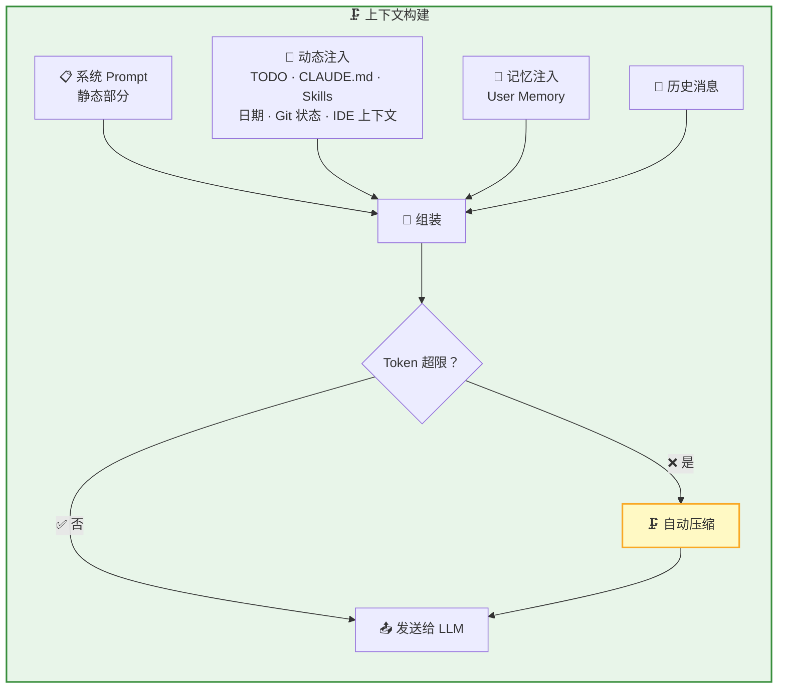
```mermaid
flowchart LR
    subgraph CTX_FLOW["🗜️ 上下文构建"]
        direction TB
        A["📋 系统 Prompt<br/>静态部分"] --> D["🧩 组装"]
        B["🔧 动态注入<br/>TODO · CLAUDE.md · Skills<br/>日期 · Git 状态 · IDE 上下文"] --> D
        C["🧠 记忆注入<br/>User Memory"] --> D
        E["💬 历史消息"] --> D
        D --> F{"Token 超限？"}
        F -->|"✅ 否"| G["📤 发送给 LLM"]
        F -->|"❌ 是"| H["🗜️ 自动压缩"]
        H --> G
    end

    style CTX_FLOW fill:#e8f5e9,stroke:#388e3c,stroke-width:2px
    style H fill:#fff9c4,stroke:#f9a825,stroke-width:2px
```

#### 压缩策略

当对话长度接近 Token 限制时，系统采用递进式压缩：

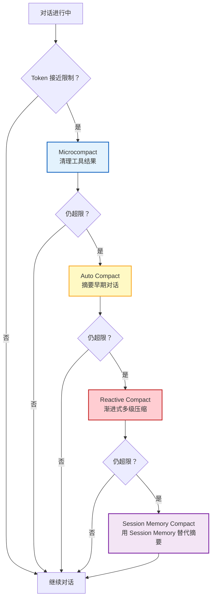
```mermaid
flowchart TD
    A[对话进行中] --> B{Token 接近限制？}
    B -->|否| C[继续对话]
    B -->|是| D[Microcompact<br/>清理工具结果]
    D --> E{仍超限？}
    E -->|否| C
    E -->|是| F[Auto Compact<br/>摘要早期对话]
    F --> G{仍超限？}
    G -->|否| C
    G -->|是| H[Reactive Compact<br/>渐进式多级压缩]
    H --> I{仍超限？}
    I -->|否| C
    I -->|是| J[Session Memory Compact<br/>用 Session Memory 替代摘要]
    J --> C

    style D fill:#e3f2fd,stroke:#1565c0,stroke-width:2px
    style F fill:#fff9c4,stroke:#f9a825,stroke-width:2px
    style H fill:#ffcdd2,stroke:#c62828,stroke-width:2px
    style J fill:#f3e5f5,stroke:#7b1fa2,stroke-width:2px
```

| 策略 | 触发条件 | 压缩方式 | 成本 |
| --- | --- | --- | :---: |
| **Microcompact** | 工具调用后 | 清理早期工具结果，只保留最近 5 个 | 零 |
| **Auto Compact** | Token 达到阈值 | LLM 摘要早期对话（9 部分结构化摘要） | 一次 LLM 调用 |
| **Reactive Compact** | Auto Compact 后仍超标 | 渐进式多级压缩（3 级，从零成本到激进裁剪） | 零 ~ 一次 LLM |
| **Session Memory Compact** | Auto Compact 触发时 | 直接用 Session Memory 作为摘要 | 零 |

> 💡 **性能优化**：Strategic Cache Breakpoints 在消息列表关键位置设置缓存断点，压缩后 LLM prompt cache hit rate 从 0% 提升至 75%，input cost 降低约 69%。

详见 [上下文管理](/docs/features/context-management)。

### 记忆系统

双层记忆架构，让 AI 同时拥有短期和长期记忆。

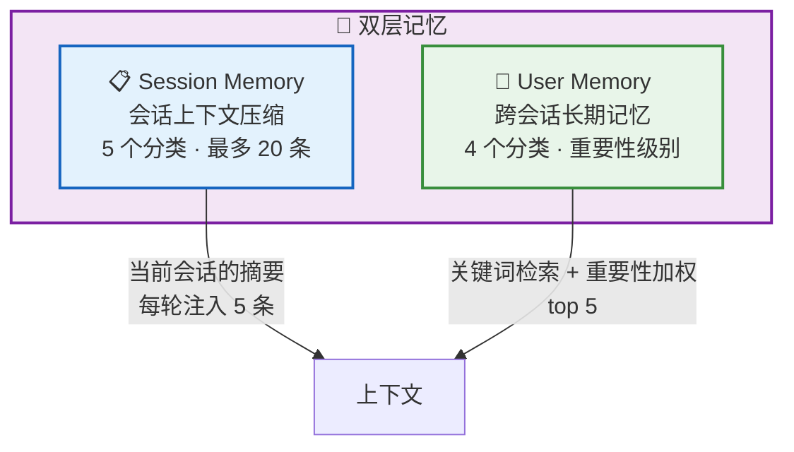
```mermaid
flowchart TD
    subgraph MEMORY["🧠 双层记忆"]
        direction TB
        SM["📋 Session Memory<br/>会话上下文压缩<br/>5 个分类 · 最多 20 条"]
        UM["🧬 User Memory<br/>跨会话长期记忆<br/>4 个分类 · 重要性级别"]
    end

    SM -->|"当前会话的摘要<br/>每轮注入 5 条"| CTX["上下文"]
    UM -->|"关键词检索 + 重要性加权<br/>top 5"| CTX

    style MEMORY fill:#f3e5f5,stroke:#7b1fa2,stroke-width:2px
    style SM fill:#e3f2fd,stroke:#1565c0,stroke-width:2px
    style UM fill:#e8f5e9,stroke:#388e3c,stroke-width:2px
```

#### Session Memory

每个会话独立维护，用于长对话的上下文压缩：

| 分类 | 说明 |
| --- | --- |
| **decision** | 用户做出的决策和选择 |
| **context** | 当前任务的背景信息 |
| **progress** | 已完成的工作和进度 |
| **issue** | 遇到的问题和阻碍 |
| **learnings** | 从任务中学到的经验 |

- **容量**：最多 20 条，约 12K tokens
- **提取方式**：双轨制——后台 Agent 自动提取 + Agent 主动保存
- **用途**：Session Memory Compact 的摘要来源，每轮对话注入 5 条到上下文

#### User Memory

跨会话的长期记忆，存储用户偏好和历史事实：

| 分类 | 说明 |
| --- | --- |
| **user** | 用户身份信息（角色、专长、偏好） |
| **feedback** | 用户对工作方式的反馈 |
| **project** | 进行中的项目、目标、约束 |
| **reference** | 外部资源指针（URL、文档、工单） |

- **重要性级别**：low / medium / high / critical
- **容量**：最多 1000 条
- **提取方式**：Agent 主动保存
- **检索方式**：关键词全文检索 + 重要性加权 → top 5

详见 [记忆系统](/docs/features/memory)。

### RTC 处理器

RTC 处理器管理工具调用的完整生命周期——从创建 RTC 记录到保存 Checkpoint、暂停 Turn、等待结果、恢复推理。

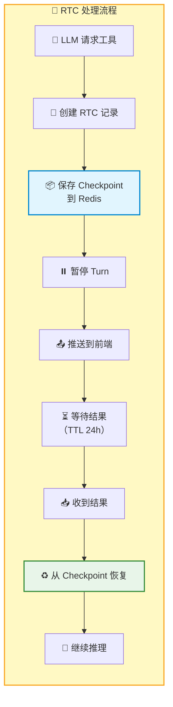
```mermaid
flowchart LR
    subgraph RTC_FLOW["🔧 RTC 处理流程"]
        direction TB
        A["🧠 LLM 请求工具"] --> B["📝 创建 RTC 记录"]
        B --> C["📦 保存 Checkpoint<br/>到 Redis"]
        C --> D["⏸️ 暂停 Turn"]
        D --> E["📤 推送到前端"]
        E --> F["⏳ 等待结果<br/>（TTL 24h）"]
        F --> G["📥 收到结果"]
        G --> H["♻️ 从 Checkpoint 恢复"]
        H --> I["🧠 继续推理"]
    end

    style RTC_FLOW fill:#fff9c4,stroke:#f9a825,stroke-width:2px
    style C fill:#e1f5fe,stroke:#0288d1,stroke-width:2px
    style H fill:#e8f5e9,stroke:#388e3c,stroke-width:2px
```

| 特性 | 说明 |
| --- | --- |
| **Checkpoint** | 保存当前推理状态到 Redis，TTL 24 小时 |
| **崩溃恢复** | 服务端重启后可从 Checkpoint 恢复 |
| **串行执行** | 同一会话内 RTC 严格串行，避免文件冲突 |
| **100% 送达** | 前端结果提交无限重试，幂等保证 |

#### 工作模式权限矩阵

不同工作模式下，工具调用的确认策略不同：

| 工具类型 | manual | edit | plan | auto | bypass |
| --- | --- | --- | --- | --- | --- |
| **只读工具**（ls/read/grep/find） | ✅ 自动执行 | ✅ 自动执行 | ✅ 自动执行 | ✅ 自动执行 | ✅ 自动执行 |
| **写工具**（write） | ⚠️ 需确认 | ✅ 自动执行 | ⚠️ 需确认 | ✅ 自动执行 | ✅ 自动执行 |
| **script 工具** | ⚠️ 需确认 | ⚠️ 需确认 | ⚠️ 需确认 | ⚠️ 需确认 | ✅ 自动执行 |

详见 [工作模式](/docs/concepts/work-modes)。

### 对象存储层

OSS3 包提供 S3 兼容的对象存储抽象，用于管理用户上传的文件附件（图片、文本等）。

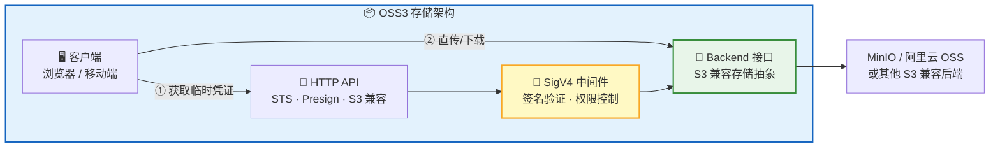
```mermaid
flowchart LR
    subgraph OSS3_ARCH["📦 OSS3 存储架构"]
        direction TB
        CLIENT["🖥️ 客户端<br/>浏览器 / 移动端"]
        API["🔌 HTTP API<br/>STS · Presign · S3 兼容"]
        SIGV4["🔐 SigV4 中间件<br/>签名验证 · 权限控制"]
        BACKEND["💾 Backend 接口<br/>S3 兼容存储抽象"]
    end

    CLIENT -->|"① 获取临时凭证"| API
    CLIENT -->|"② 直传/下载"| BACKEND
    API --> SIGV4 --> BACKEND
    BACKEND --> MINIO["MinIO / 阿里云 OSS<br/>或其他 S3 兼容后端"]

    style OSS3_ARCH fill:#e3f2fd,stroke:#1565c0,stroke-width:2px
    style SIGV4 fill:#fff9c4,stroke:#f9a825,stroke-width:2px
    style BACKEND fill:#e8f5e9,stroke:#388e3c,stroke-width:2px
```

#### Backend 接口

`rtc-oss3.Backend` 定义了 S3 兼容的对象存储操作：

| 操作类别 | 方法 | 说明 |
| --- | --- | --- |
| **基础操作** | `PutObject` / `GetObject` / `DeleteObject` / `HeadObject` | 对象的增删查改 |
| **批量/范围** | `DeleteObjects` / `GetObjectRange` / `ListObjects` / `CopyObject` | 批量删除、范围下载、列表、复制 |
| **分片上传** | `CreateMultipartUpload` / `UploadPart` / `CompleteMultipartUpload` / `AbortMultipartUpload` / `ListParts` | 大文件分片上传 |
| **预签名** | `PresignGet` / `PresignPut` | 生成预签名 URL（服务端代理上传/下载） |
| **生命周期** | `HealthCheck` / `Close` | 健康检查、资源释放 |

> 💡 当前实现为 MinIO 后端，接口设计兼容阿里云 OSS、AWS S3 等所有 S3 协议的存储服务。切换后端只需更换构造函数，无需修改业务代码。

#### HTTP API

| 端点 | 认证方式 | 用途 |
| --- | --- | --- |
| `POST /api/credentials/temporary` | JWT | STS 临时凭证——客户端获取临时 S3 凭证后直传/下载对象 |
| `POST /api/presigned-url` | JWT | 预签名 URL——服务端生成带签名的 GET/PUT URL，有效期可配（默认 1 小时，最长 7 天） |
| `PUT/GET/DELETE/HEAD /{bucket}/{key}` | SigV4 签名 | S3 兼容 API——客户端使用临时凭证直接操作对象 |
| `POST /{bucket}?delete` | SigV4 签名 | 批量删除对象 |
| 分片上传相关 | SigV4 签名 | 大文件分片上传（`?uploads`、`?partNumber`、`?uploadId`） |

> 💡 **两种上传模式**：(1) STS 临时凭证模式——客户端获取临时 AK/SK/Token 后，使用标准 AWS SDK 直接操作 S3；(2) 预签名 URL 模式——服务端生成签名 URL，客户端直接 PUT/GET，无需 SDK。

### 文件附件处理

用户消息中的文件附件（`FileAttachment`）经过端到端处理后注入 LLM 上下文。

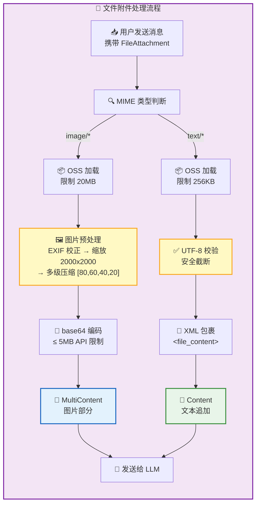
```mermaid
flowchart TD
    subgraph FILE_FLOW["📎 文件附件处理流程"]
        direction TB
        A["📥 用户发送消息<br/>携带 FileAttachment"] --> B["🔍 MIME 类型判断"]
        B -->|"image/*"| C["📦 OSS 加载<br/>限制 20MB"]
        B -->|"text/*"| D["📦 OSS 加载<br/>限制 256KB"]
        C --> E["🖼️ 图片预处理<br/>EXIF 校正 → 缩放 2000x2000<br/>→ 多级压缩 [80,60,40,20]"]
        E --> F["🔐 base64 编码<br/>≤ 5MB API 限制"]
        F --> G["🧩 MultiContent<br/>图片部分"]
        D --> H["✅ UTF-8 校验<br/>安全截断"]
        H --> I["📝 XML 包裹<br/>&lt;file_content&gt;"]
        I --> J["📄 Content<br/>文本追加"]
        G --> K["🧠 发送给 LLM"]
        J --> K
    end

    style FILE_FLOW fill:#f3e5f5,stroke:#7b1fa2,stroke-width:2px
    style E fill:#fff9c4,stroke:#f9a825,stroke-width:2px
    style H fill:#fff9c4,stroke:#f9a825,stroke-width:2px
    style G fill:#e3f2fd,stroke:#1565c0,stroke-width:2px
    style J fill:#e8f5e9,stroke:#388e3c,stroke-width:2px
```

| 文件类型 | 处理管线 | 注入方式 |
| --- | --- | --- |
| **图片**（JPEG/PNG/BMP/TIFF/SVG） | OSS 读取 → Magic bytes 检测 → EXIF 自动校正 → 缩放至 2000x2000 边界 → 多级 JPEG 压缩（80→60→40→20）→ base64 编码（≤ 5MB） | `MultiContent` Image 部分，LLM Vision 直接理解 |
| **文本** | OSS 读取 → UTF-8 校验 → 超限截断（256KB，UTF-8 安全边界） | XML 包裹 `<file_content name="..." type="...">`，追加到 `Content` |
| **其他** | 跳过（日志警告） | — |

> 💡 **并行加载**：多个文件附件使用 goroutine 并行加载，降低多文件场景的延迟。WebP/GIF 格式因解码库限制被拒绝，建议用户转换为 JPEG/PNG。

## 实时通信层

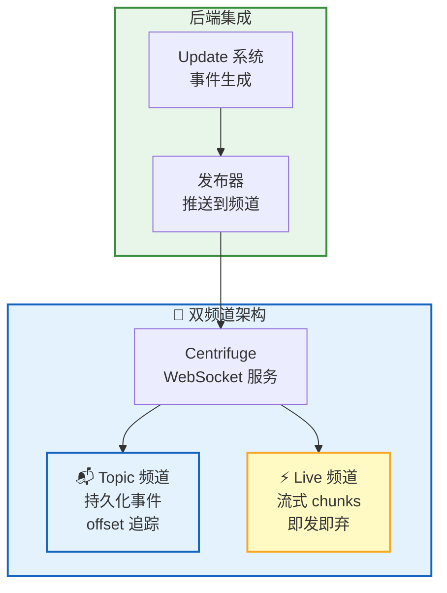
```mermaid
flowchart TD
    subgraph COMM["📡 双频道架构"]
        direction TB
        CF["Centrifuge<br/>WebSocket 服务"]

        CF --> TOPIC["📬 Topic 频道<br/>持久化事件<br/>offset 追踪"]
        CF --> LIVE["⚡ Live 频道<br/>流式 chunks<br/>即发即弃"]
    end

    subgraph BACKEND["后端集成"]
        direction TB
        UPD["Update 系统<br/>事件生成"]
        PUB["发布器<br/>推送到频道"]
    end

    UPD --> PUB --> CF

    style COMM fill:#e3f2fd,stroke:#1565c0,stroke-width:2px
    style BACKEND fill:#e8f5e9,stroke:#388e3c,stroke-width:2px
    style TOPIC fill:#e3f2fd,stroke:#1565c0,stroke-width:2px
    style LIVE fill:#fff9c4,stroke:#f9a825,stroke-width:2px
```

| 频道 | 用途 | 特性 |
| --- | --- | --- |
| **Topic** | 状态变更事件（Session、Message、Turn、RTC） | 持久化、offset 追踪、离线恢复 |
| **Live** | 流式输出中间 chunks | 非持久化、Redis PUB/SUB、低延迟、可丢失 |

### Offset 机制与离线恢复

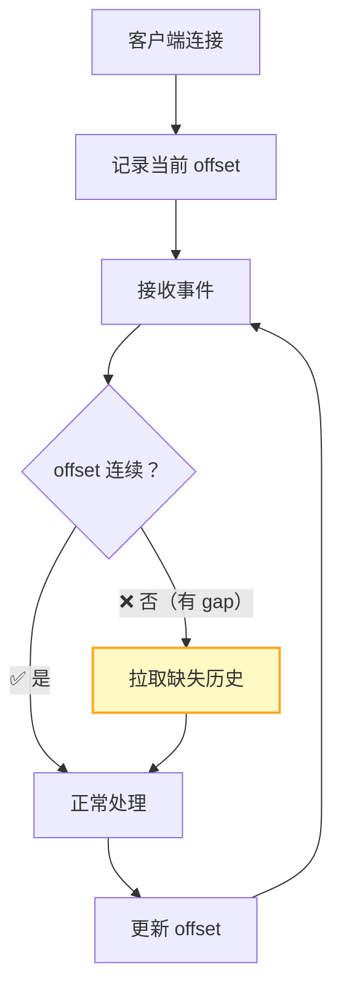
```mermaid
flowchart TD
    A["客户端连接"] --> B["记录当前 offset"]
    B --> C["接收事件"]
    C --> D{"offset 连续？"}
    D -->|"✅ 是"| E["正常处理"]
    D -->|"❌ 否（有 gap）"| F["拉取缺失历史"]
    F --> E
    E --> G["更新 offset"]
    G --> C

    style F fill:#fff9c4,stroke:#f9a825,stroke-width:2px
```

- **短暂断线**（< 5 秒）：重连后自动推送缺失事件
- **长时间断线**：客户端检测 offset gap，主动拉取历史记录
- **Epoch 变化**：服务端重启后 epoch 改变，客户端重置 offset 并重新拉取全量

详见 [实时通信](/docs/features/realtime)。

## 下一步

- [前端架构](/docs/architecture/frontend) — 了解 Web Components 组件体系
- [架构总览](/docs/architecture) — 返回架构全景
- [Remote Tool Calling](/docs/concepts/rtc) — 了解 RTC 工具调用的完整机制
- [WebSocket RPC](/docs/protocol/rpc) — 了解 RPC 方法的详细定义
