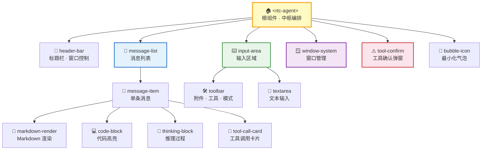
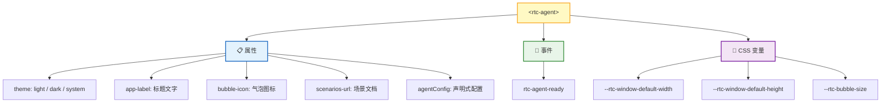
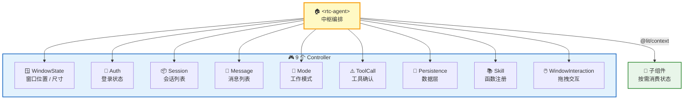
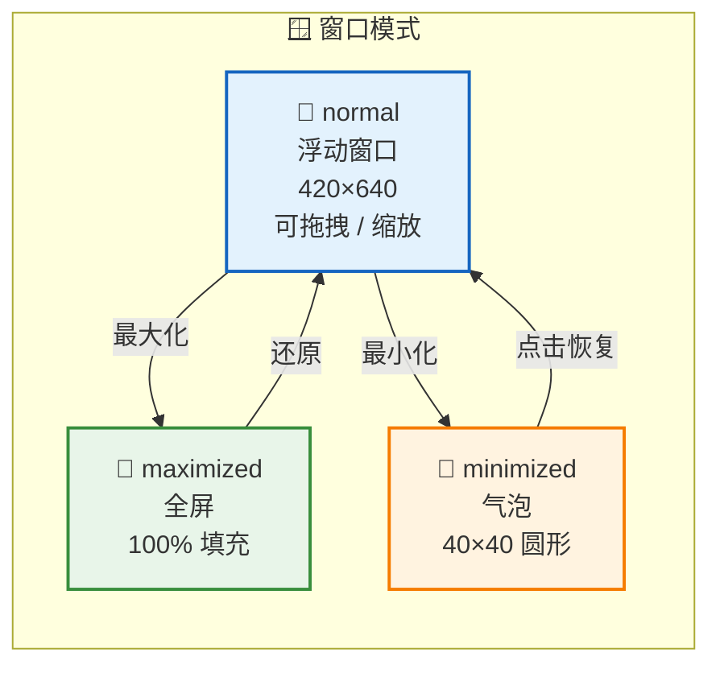
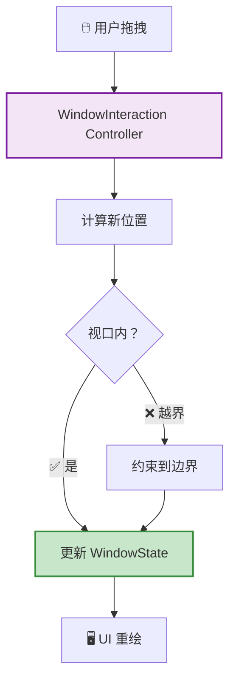
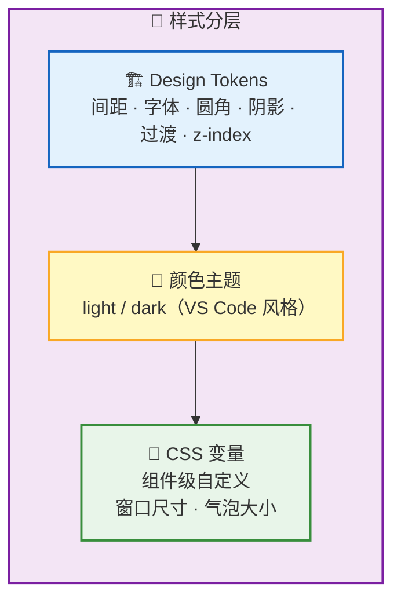
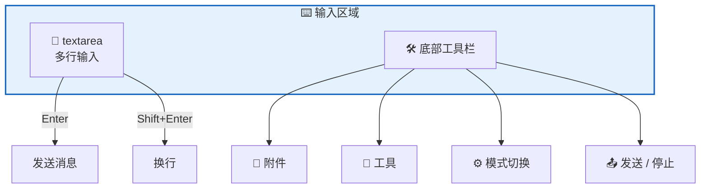
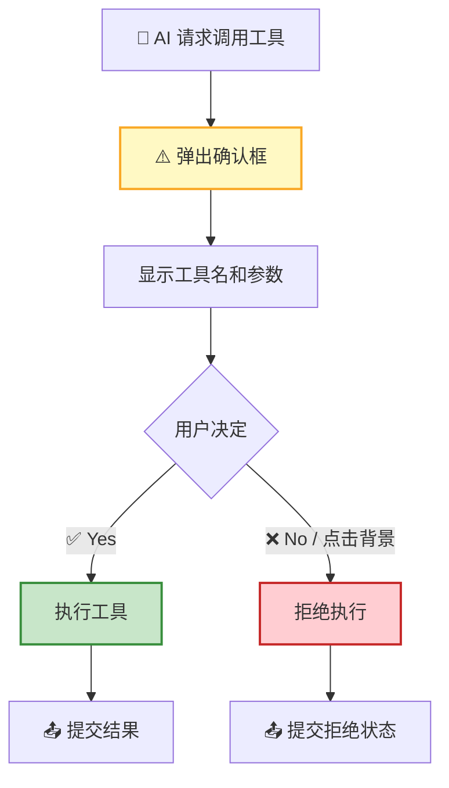

RTC Agent 的前端是一个基于 **Lit Web Components** 构建的组件库。对外只暴露一个 `<rtc-agent>` 组件，内部包含 **16 个子组件**，使用 **9 个 Controller** 管理状态，通过 `@lit/context` 向子组件分发数据。

## 组件架构

## 公开组件

宿主应用只需引入一个组件即可使用全部功能：

| 属性 | 说明 | 示例 |
|------|------|------|
| `theme` | 主题切换 | `light` / `dark` / `system` |
| `app-label` | 标题栏文字 + 气泡 tooltip | `"RTC 助手"` |
| `bubble-icon` | 最小化气泡内的 SVG/HTML | 自定义图标 |
| `scenarios-url` | 场景文档 URL | `"https://..."` |
| `agentConfig` | 声明式函数注册（推荐） | JSON 配置对象 |

---

## 状态管理

### 设计原则

| 原则 | 说明 |
|------|------|
| **Controller 不互相引用** | 每个 Controller 独立管理自己的状态切片 |
| **根组件编排** | `<rtc-agent>` 作为中枢，协调跨 Controller 通信 |
| **Context 分发** | 通过 `@lit/context` 向子组件分发状态，避免 prop drilling |
| **数据层隔离** | Persistence Controller 统一管理 IndexedDB 读写 |

> 💡 **为什么不用全局状态？** Web Components 运行在宿主应用的页面中，可能有多个实例。Controller + Context 保证每个 `<rtc-agent>` 实例的状态完全隔离。

---

## 窗口系统

| 交互 | 实现 |
|------|------|
| **拖拽** | title-bar 作为拖拽手柄 |
| **缩放** | 8 方向 resize |
| **键盘** | 方向键移动，Shift 加速 |
| **视口约束** | 始终保持在可视区域内 |

---

## 样式系统

| 层级 | 内容 | 自定义方式 |
|------|------|------------|
| **Design Tokens** | 间距、字体、圆角、阴影、过渡、z-index | 覆盖 CSS 变量 |
| **颜色主题** | light / dark 两套配色 | `theme` 属性切换 |
| **CSS 变量** | 窗口尺寸、气泡大小 | `--rtc-*` 前缀变量 |

---

## 关键交互

### 输入区域

### 消息列表

| 特性 | 行为 |
|------|------|
| **自动滚动** | 新消息到达时自动滚动到底部 |
| **智能暂停** | 用户手动上滑时暂停自动滚动 |
| **新消息提示** | 用户离开底部时显示"新消息"按钮 |
| **渲染** | Markdown 渲染 + 代码高亮 |

### 工具确认弹窗

## 下一步

- [后端架构](/docs/architecture/backend/) — 了解 Go 服务端的分层设计
- [架构总览](/docs/architecture/) — 返回架构全景
- [Remote Tool Calling](/docs/concepts/rtc/) — 了解前端工具调用的核心协议
- [虚拟文件系统](/docs/concepts/virtual-fs/) — 了解前端 IndexedDB 文件系统
