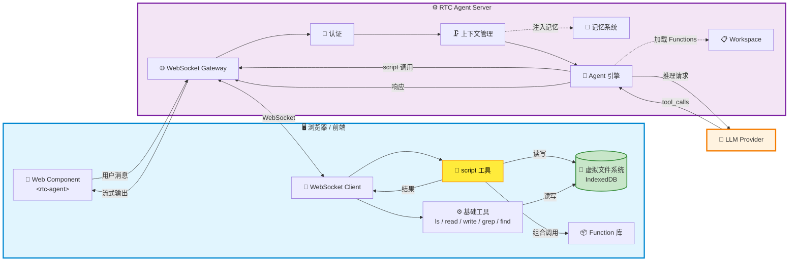
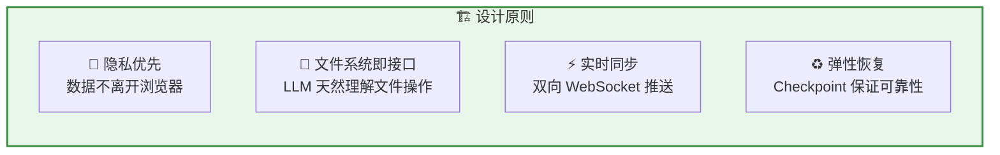
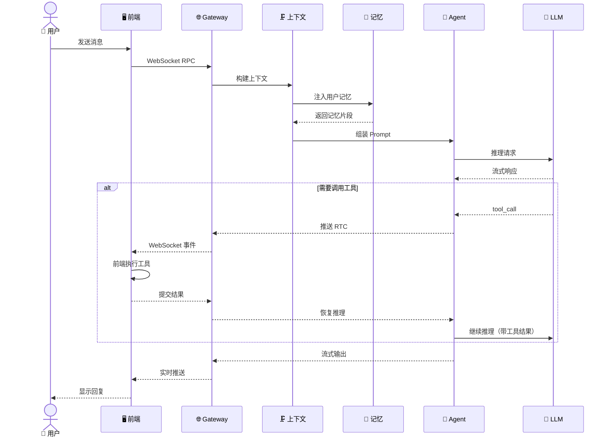
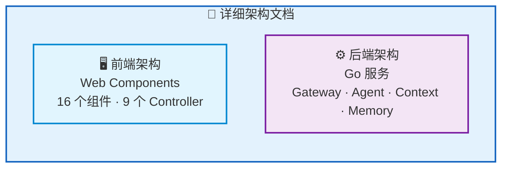

RTC Agent 的架构由三部分组成：**浏览器 / 前端**（虚拟文件系统 + Web Component）、**RTC Agent Server**（Agent 引擎 + 上下文管理 + 实时通信）、**LLM Provider**（AI 推理）。

## 全景架构

## 核心设计原则

| 原则 | 实现方式 | 用户价值 |
|------|----------|----------|
| 🔐 **隐私优先** | 文件操作在前端执行，数据存于 IndexedDB | 敏感数据不上传服务器 |
| 🧩 **文件系统即接口** | AI 通过 `ls`/`read`/`write`/`grep` 操作业务 | 开发者只需维护 Function 文档 |
| ⚡ **实时同步** | Centrifuge 双频道推送 | 用户全程可见 AI 的每一步 |
| ♻️ **弹性恢复** | Redis Checkpoint + 100% 送达保证 | 断网、重启无感知 |

## 请求处理流程

## 技术栈

| 层 | 技术 | 用途 |
|:--:|:----:|------|
| **后端** | Go 1.27 | 主服务语言 |
| **数据库** | PostgreSQL + GORM | 持久化存储 |
| **缓存** | Redis | Checkpoint、流式缓冲、Pub/Sub |
| **实时通信** | Centrifuge WebSocket | 双向推送 |
| **AI 框架** | Anthropic SDK + Eino | Agent 引擎 |
| **前端** | Lit Web Components | 组件化 UI |
| **可观测** | OpenTelemetry + Jaeger + Prometheus | 追踪 + 指标 |

## 架构子页面

## 下一步

- [前端架构](/docs/architecture/frontend/) — Web Components 组件体系、状态管理、窗口系统
- [后端架构](/docs/architecture/backend/) — Go 服务分层、Agent 引擎、上下文管理
- [Remote Tool Calling](/docs/concepts/rtc/) — 了解核心协议的工作机制
- [协议总览](/docs/protocol/) — 了解通信协议的完整定义
