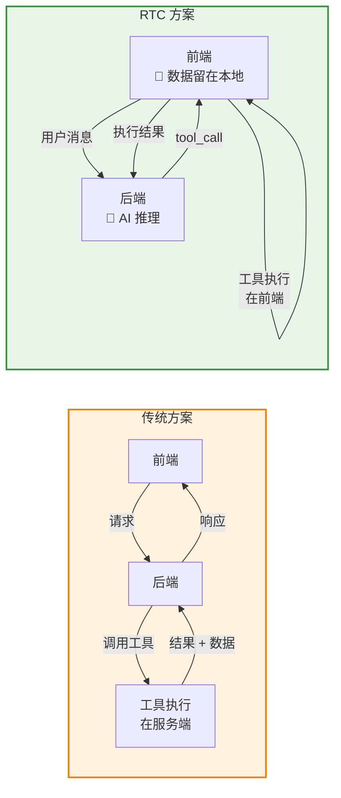
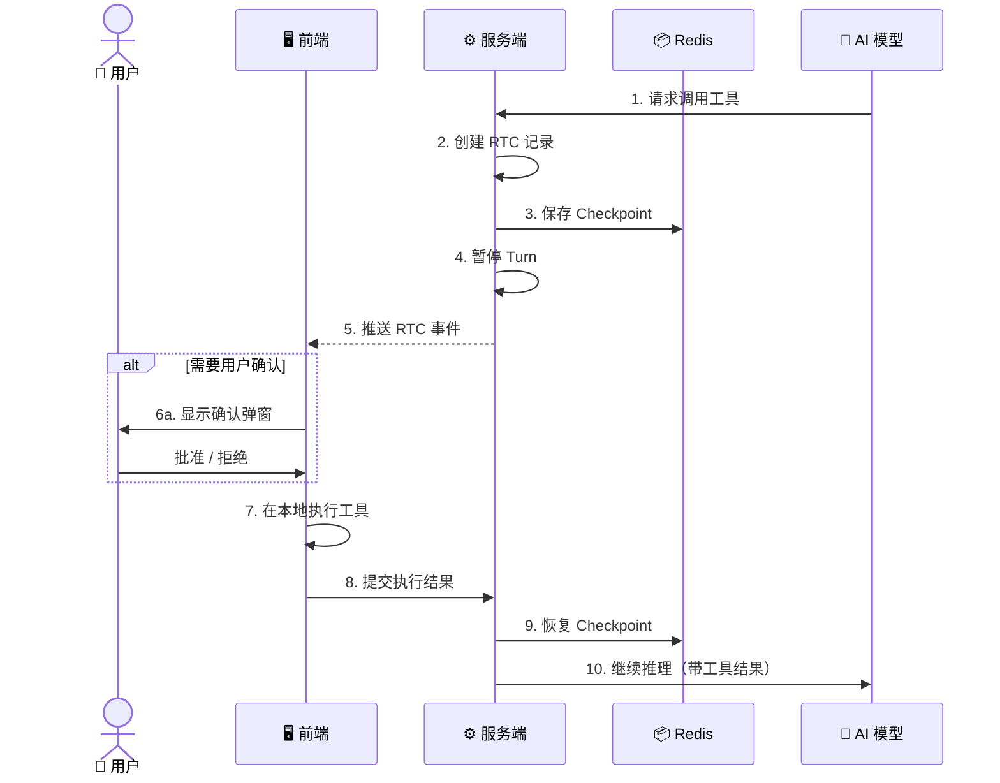
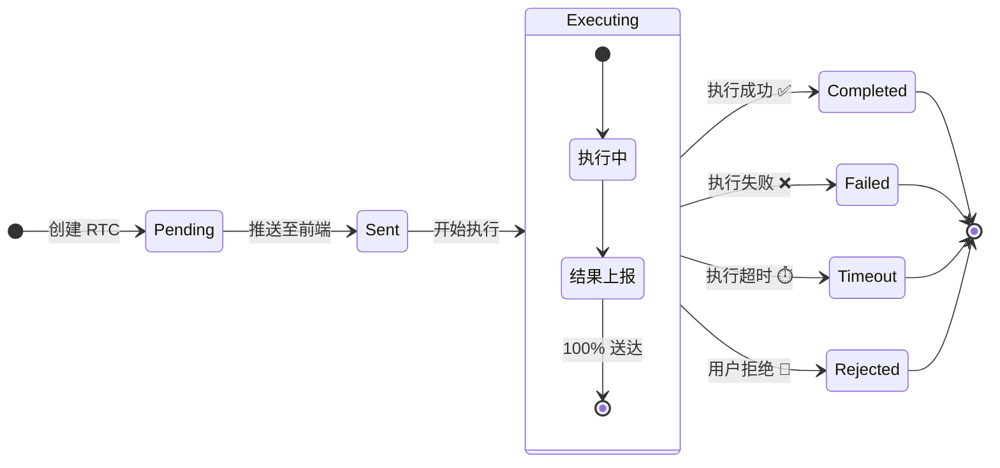
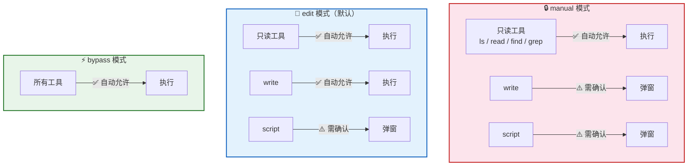
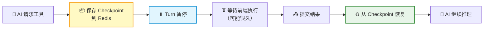
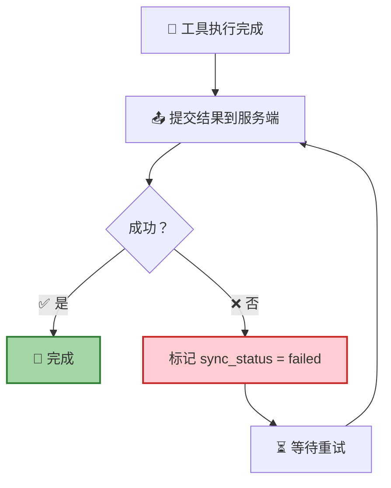
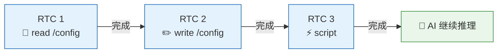

**Remote Tool Calling（RTC）** 是 RTC Agent 的核心协议。它颠覆了传统的调用方向：不是前端调用后端 API，而是 **AI 调用前端工具**——文件读写、脚本执行、业务接口调用，都在用户浏览器内完成。

## 为什么需要 RTC

| | 传统方案 | RTC |
|---|---------|-----|
| **工具执行** | 服务端 | 前端 |
| **数据流向** | 上云 🔒 | 留在用户设备 🔐 |
| **隐私** | 数据经过服务端 | 端到端，数据不出浏览器 |
| **可观测性** | 黑箱 | 用户全程可见 |

## 完整生命周期

一次 RTC 调用经历以下步骤：

> 💡 **关键设计**：服务端在推送 RTC 后将 Turn **暂停**并保存 Checkpoint 到 Redis。即使服务端重启，也能从 Checkpoint 恢复——用户完全无感知。

## 内置工具

RTC 协议定义了 **6 个内置工具**，覆盖文件系统和脚本执行：

| 工具 | 功能 | 关键参数 |
|:----:|------|----------|
| 🔍 `ls` | 列出目录内容 | `path`（默认 `/`） |
| 📖 `read` | 读取文件内容 | `path`，`offset` / `limit`（分页） |
| ✏️ `write` | 写入文件 | `path`、`content`，`mode`（overwrite / append） |
| 🔎 `grep` | 按内容搜索 | `pattern`（正则），`path` |
| 📁 `find` | 按名称搜索 | `pattern`（glob），`path` |
| ⚡ `script` | 执行 JavaScript | `action`（save / run / eval），`code` |

这 6 个工具让 AI 拥有了一个 **完整的文件操作界面**——就像操作本地终端一样操作前端虚拟文件系统。

## 状态机

每个 RTC 调用都有明确的生命周期状态：

| 状态 | AI 看到的提示 | 说明 |
|:----:|:------------:|------|
| `Pending` | `[Tool Pending]` | 等待前端接收 |
| `Sent` | `[Tool Pending]` | 已送达前端 |
| `Executing` | `[Tool Pending]` | 正在执行 |
| `Completed` | 工具输出 | 执行成功，结果回传 |
| `Failed` | `[Tool Error]` | 执行失败 |
| `Timeout` | `[Tool Timeout]` | 执行超时 |
| `Rejected` | `[Tool Rejected]` | 用户拒绝执行 |

## 权限矩阵

不同**工作模式**下，工具的确认策略不同：

| 工具 | manual | edit | plan / auto | bypass |
|------|:------:|:----:|:-----------:|:------:|
| `ls` / `read` / `find` / `grep` | ✅ | ✅ | ✅ | ✅ |
| `write` | ⚠️ 确认 | ✅ | ✅ | ✅ |
| `script` | ⚠️ 确认 | ⚠️ 确认 | ⚠️ 确认 | ✅ |

> 📌 **设计原则**：只读操作始终安全放行；`write` 仅在最高警戒模式下需要确认；`script` 因为可以执行任意代码，除 bypass 外都需要用户确认。

## Checkpoint 机制

RTC 的核心可靠性保障是 **Checkpoint**：

| 特性 | 说明 |
|------|------|
| **存储位置** | Redis，TTL 24 小时 |
| **崩溃恢复** | 服务端重启后可从 Checkpoint 恢复 |
| **用户体验** | 感知为"AI 等待工具结果后继续" |

## 可靠性保证

RTC 结果上报遵循 **100% 送达** 原则：

**为什么必须 100% 送达？** 因为 AI 在等待工具结果才能继续推理。如果结果丢失，AI 会无限等待。

| 机制 | 说明 |
|------|------|
| **无限重试** | 提交失败自动重试，无放弃机制 |
| **幂等保证** | 相同 `client_id` 重复提交返回成功 |
| **指数退避** | 重试间隔 1s → 2s → 4s → ... → 30s 封顶 |

## 顺序执行

同一会话内的 RTC **严格串行**，避免并发导致的文件冲突：

> 当前 RTC 完成后，才会处理下一个。这对用户来说是无感知的——AI 会自然地依次完成每个操作。

## 下一步

- [虚拟文件系统](/docs/concepts/virtual-fs/) — 了解 RTC 工具操作的文件系统
- [工作模式](/docs/concepts/work-modes/) — 了解权限矩阵背后的模式切换
- [会话管理](/docs/features/session/) — 了解 RTC 在会话中的上下文
