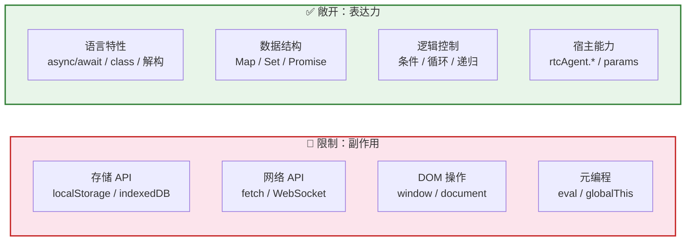
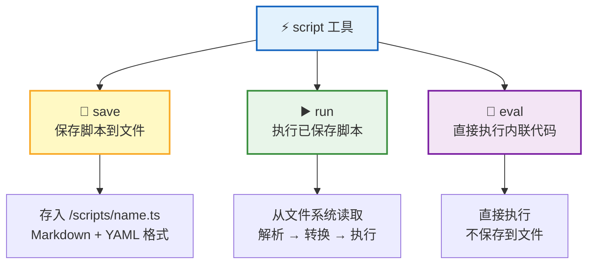
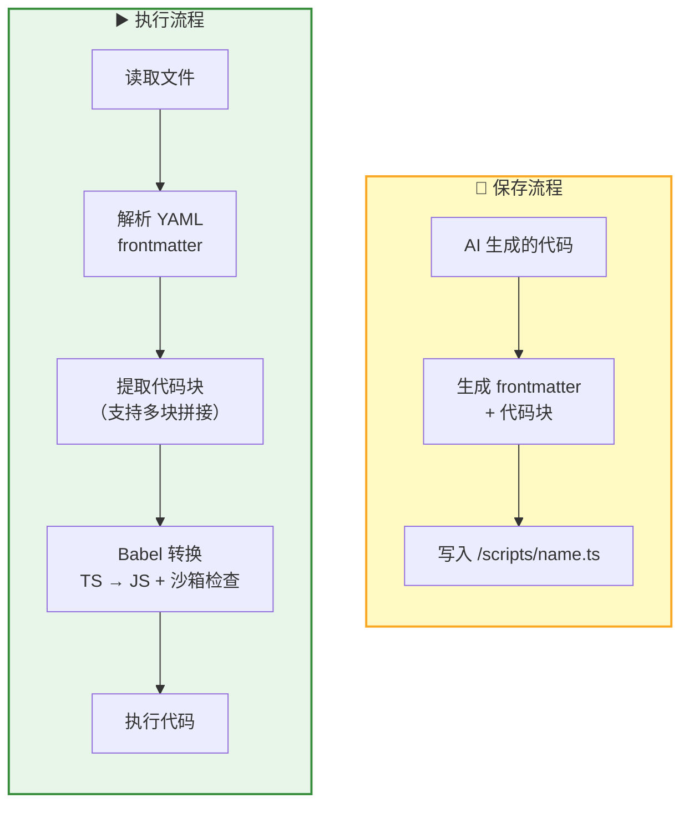
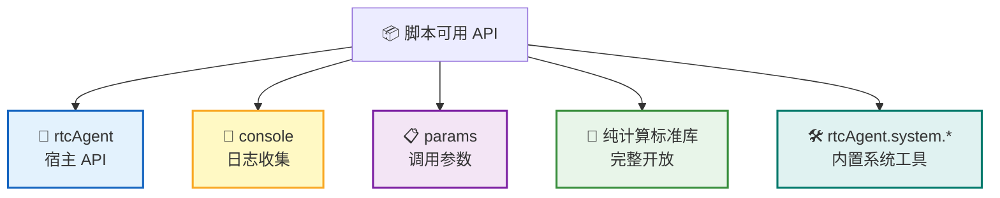
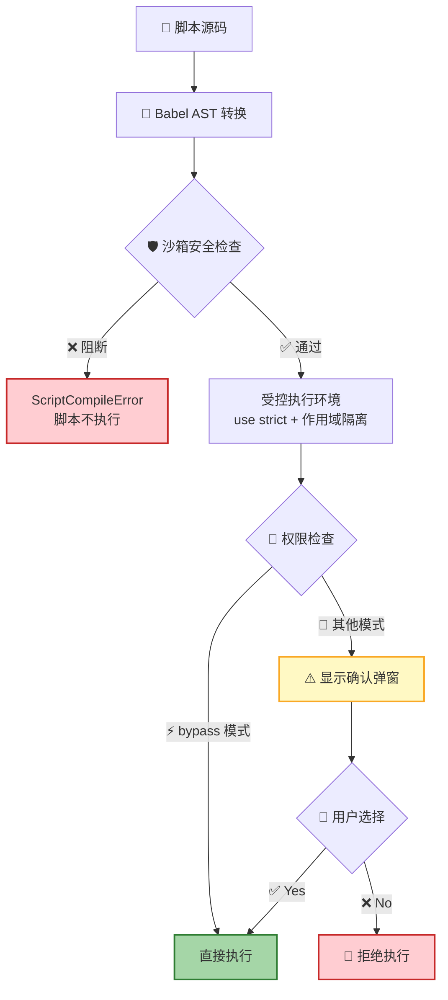
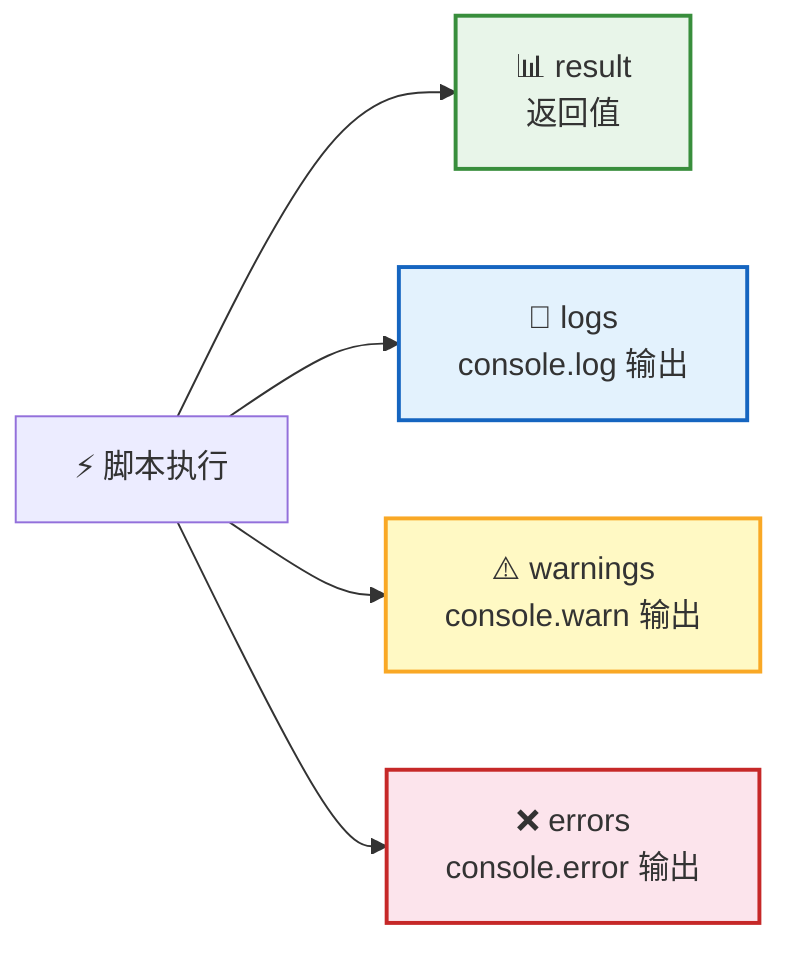

**脚本执行引擎** 让 AI 能在浏览器中执行 JavaScript / TypeScript 代码，将 AI 的能力从"文件读写"扩展到"任意计算"。脚本通过 `rtcAgent.*` 操作 UI、读写虚拟文件系统、调用宿主注册的函数——所有这一切都发生在一个精心设计的沙箱中。

## 核心原则

> 💡 **设计哲学**：LLM 的创造力在逻辑层——数据处理、控制流、`rtcAgent` 调用组合。沙箱限制的是"副作用"（存储/网络/DOM），不是"表达力"（语言/数据结构/逻辑）。这一层完全敞开。

| | 限制 | 敞开 |
|---|------|------|
| **目标** | 防止 LLM 幻觉误用平台 API | 释放 LLM 的逻辑创造力 |
| **手段** | AST 静态阻断 + 权限确认 | 完整语言特性 + 纯计算标准库 |
| **威胁模型** | LLM 幻觉导致的误操作（如误调平台 API） | 非恶意代码注入场景 |

## 三种执行方式

AI 通过 `script` 工具与引擎交互，有三种执行模式：

| Action | 功能 | 必需参数 | 使用场景 |
|:------:|------|----------|----------|
| 📁 `save` | 保存脚本到文件系统 | `name`, `code` | 创建可复用的脚本 |
| ▶️ `run` | 执行已保存的脚本 | `name` | 运行之前写好的脚本 |
| 💬 `eval` | 直接执行内联代码 | `code` | 一次性计算、快速验证 |

## 脚本存储格式

脚本以 **Markdown + YAML frontmatter** 格式存储，兼顾可读性和元数据管理：

保存后的文件格式如下：

| 部分 | 内容 | 用途 |
|------|------|------|
| YAML frontmatter | `name`、`description`、`createdAt` | 元数据存储，便于管理 |
| 代码块 | TypeScript / JavaScript 源码 | 实际执行的代码 |

> 📌 执行时提取代码块中的纯代码，frontmatter 仅用于管理。如果没有代码块，整个文件内容作为代码执行。

## 沙箱 API

脚本执行时可以使用以下 API：

### rtcAgent API（宿主注入）

通过 `rtcAgent.*` 可访问所有已注册的 Function Group，实现完整的 UI 操作能力：

| 方法 | 功能 | 说明 |
|------|------|------|
| `rtcAgent.callFunction()` | 调用已注册的函数 | 触发宿主注册的任何 Function Group |
| `rtcAgent.readFile()` | 读取文件 | 操作虚拟文件系统 |
| `rtcAgent.writeFile()` | 写入文件 | 操作虚拟文件系统 |
| `rtcAgent.listDir()` | 列出目录 | 操作虚拟文件系统 |

> 💡 通过 `rtcAgent.task.create()` 等链式调用，脚本可以操作任何已注册的功能模块。

### 纯计算标准库

沙箱显式注入以下标准库，使 API 表面可审计：

| 类别 | 可用的全局对象/函数 |
|------|-------------------|
| 语言构造器 | Promise, Date, Math, JSON, Array, Object, String, Number, Boolean, Error |
| 数据结构 | Map, Set, WeakMap, WeakSet, RegExp, Symbol, BigInt |
| Error 子类 | TypeError, RangeError, ReferenceError, SyntaxError, URIError, AggregateError |
| 解析与编码 | parseInt, parseFloat, isNaN, isFinite, encodeURIComponent, decodeURIComponent, encodeURI, decodeURI, atob, btoa |
| 工具函数 | structuredClone |
| 特殊值 | NaN, Infinity, undefined |
| URL 解析 | URL, URLSearchParams |
| console | log, warn, error（劫持版，输出同时收集给 AI） |

### 内置 system 工具组

沙箱阻断了 `setTimeout`、`crypto.randomUUID` 等"灰色 API"。为了让脚本仍能用这些常用功能，系统默认注册了 `rtcAgent.system.*` 工具组：

| 函数 | 功能 | 包装的平台 API |
|------|------|---------------|
| `rtcAgent.system.delay(ms)` | 暂停执行指定毫秒数 | setTimeout |
| `rtcAgent.system.uuid(count?)` | 生成 UUID v4（支持批量） | crypto.randomUUID |
| `rtcAgent.system.now()` | 获取当前时间戳（毫秒） | Date.now |
| `rtcAgent.system.random(opts?)` | 生成随机数（支持范围/整数） | Math.random |
| `rtcAgent.system.time(format?)` | 获取格式化时间（iso/locale/ts） | Date |

> 📌 这些工具遵循标准 FunctionDef 规范，AI 通过虚拟文档自动发现，与用户自定义的 Function Group 使用方式一致。

## 安全机制

脚本安全采用 **两层防线**：AST 编译期阻断 + 运行时权限确认。

### 第一层：AST 阶段阻断

沙箱在 Babel 转换阶段**静态阻断**以下类别的 API：

| 类别 | 阻断目标 | 替代方案 |
|------|---------|---------|
| 🗄️ 存储 API | localStorage, sessionStorage, indexedDB, caches, cookieStore | `rtcAgent.readFile` / `writeFile` |
| 🌐 网络 API | fetch, XMLHttpRequest, WebSocket, EventSource, BroadcastChannel | `rtcAgent.callFunction` |
| 🖥️ DOM / 浏览器 | window, self, document, navigator, location, history, alert, confirm, prompt | `rtcAgent`（UI 走 Function 注册） |
| 🔄 元编程 / 逃逸 | eval, Function, globalThis, global | 无需替代 |
| 👷 Worker | Worker, SharedWorker, ServiceWorker, importScripts | 无需替代 |
| ⏱️ 定时器 | setTimeout, setInterval | `rtcAgent.system.delay` |
| 🧠 共享内存 | SharedArrayBuffer, Atomics | 无需替代 |
| 📦 CJS 全局 | require, module, exports, __dirname, __filename | 无需替代 |
| 🔗 原型链逃逸 | `.constructor`, `.__proto__`（含字符串索引形式） | 无需替代 |
| 📥 动态 import | `import(...)` | 无需替代 |
| 🔁 无限循环 | `while`, `do...while`, `for(;;)` | for...of / 有界 for / 数组迭代方法 |

**智能识别**：如果标识符有本地绑定（如用户声明了同名变量 `const fetch = ...`），不会误阻断。TypeScript 类型注解（如 `const fn: Function`）也不触发阻断。

### 第二层：运行时约束

| 约束 | 说明 |
|------|------|
| 🔐 权限 | 除 bypass 外都需要用户确认 |
| ⏱️ 超时 | 默认 30 秒，可自定义 |
| ⏭️ 超时行为 | 放弃等待，不终止脚本（脚本仍在后台运行） |
| 🔒 作用域隔离 | 编译期注入白名单绑定，脚本无法访问未授权的全局变量 |
| 🔐 this 绑定 | `"use strict"` 模式下执行，防止 this 逃逸 |

## 输出收集

脚本执行后，引擎收集完整的执行结果返回给 AI：

| 字段 | 来源 | 用途 |
|------|------|------|
| `result` | 脚本返回值 | AI 获取计算结果 |
| `logs` | console.log | AI 查看调试信息 |
| `warnings` | console.warn | AI 识别潜在问题 |
| `errors` | console.error | AI 处理异常情况 |

> 💡 `console` 是劫持版本——输出正常显示给用户的同时，也会被收集并返回给 AI，让 AI 能"看到"脚本的运行过程。

## 异步支持

脚本完整支持异步编程：

| 特性 | 说明 |
|------|------|
| async / await | 完整支持 |
| 执行包装 | 脚本包装为 async IIFE 执行 |
| Promise | 沙箱提供 Promise 构造器 |
| rtcAgent 调用 | 宿主 API 调用天然支持异步 |

## 下一步

- [Remote Tool Calling](/docs/concepts/rtc/) — 了解脚本执行在 RTC 协议中的位置
- [虚拟文件系统](/docs/concepts/virtual-fs/) — 了解脚本操作的文件系统
- [工作模式](/docs/concepts/work-modes/) — 了解脚本执行的权限控制
