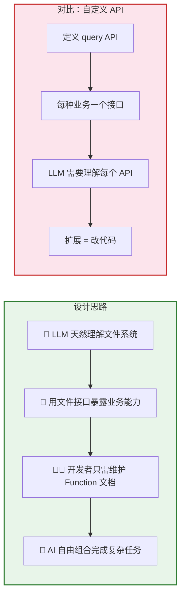
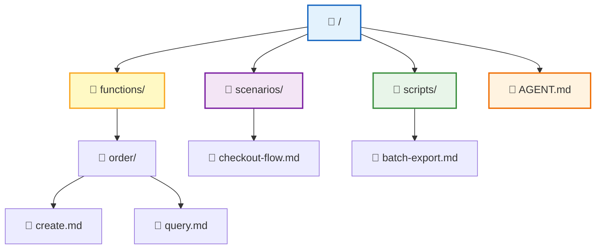
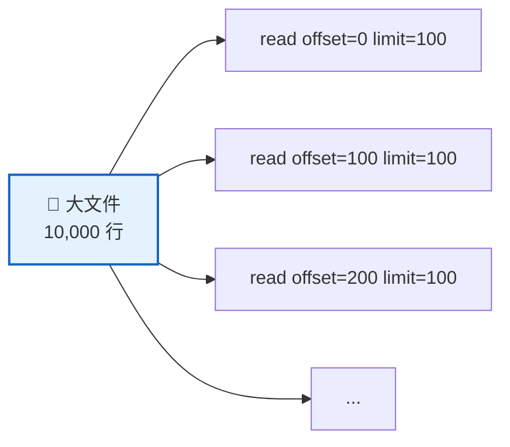
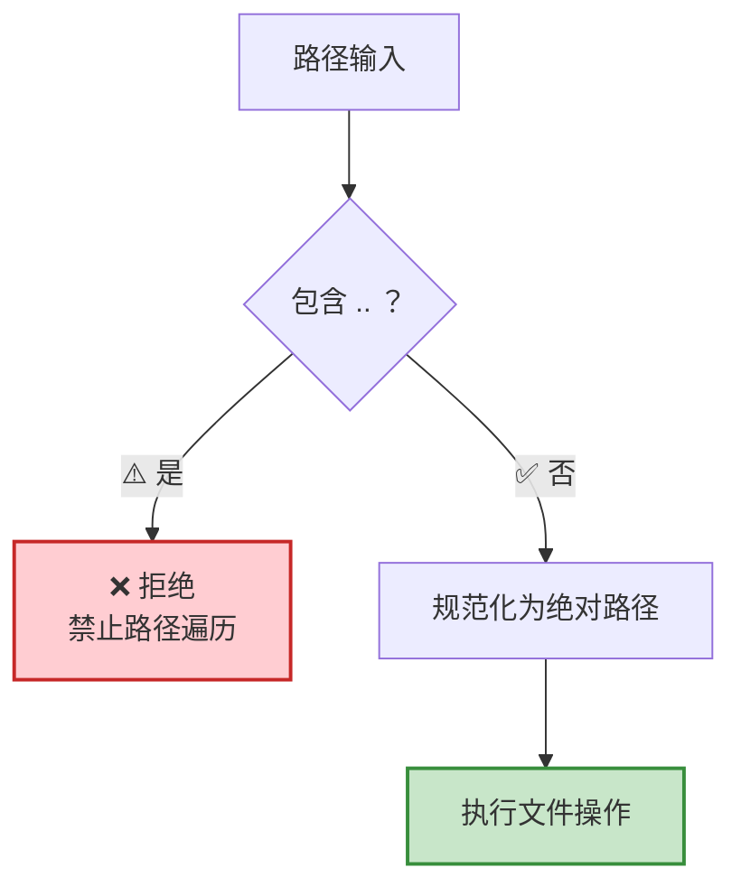
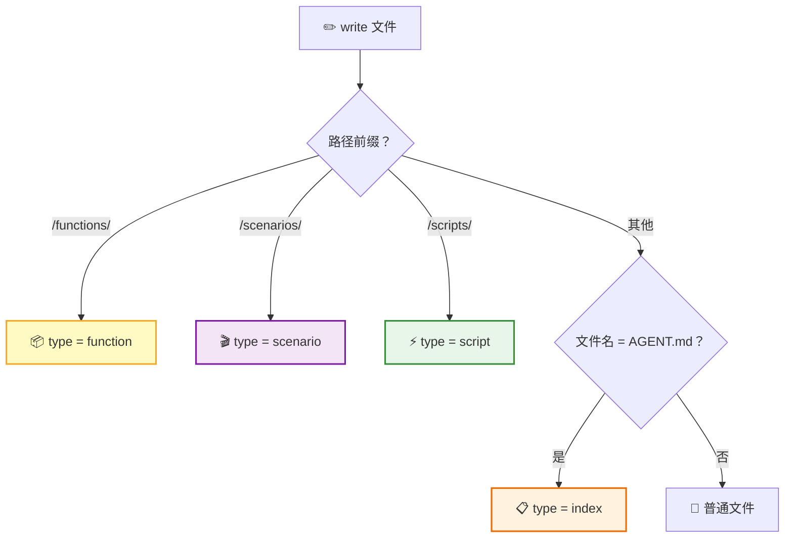
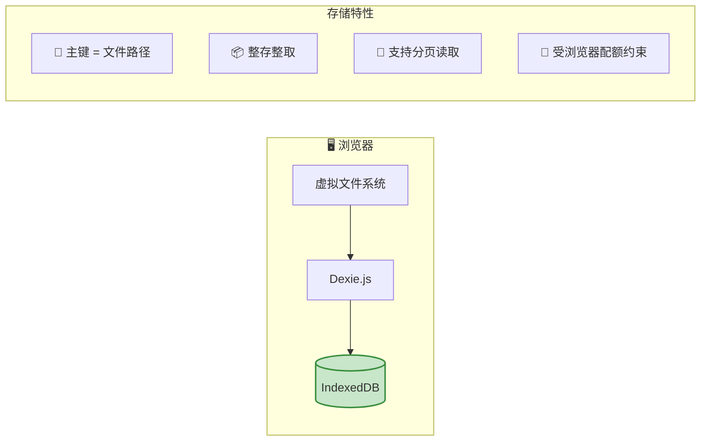
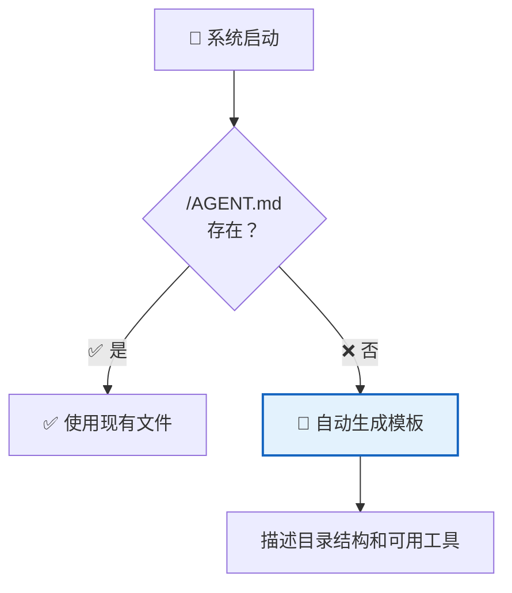

RTC Agent 在浏览器中构建了一个**完整的虚拟文件系统**。AI 通过 `ls`、`read`、`edit`、`grep`、`find` 等工具操作文件，就像操作本地终端一样——但所有数据始终留在用户的浏览器中。

## 为什么用文件系统



> 💡 **核心洞察**：LLM 已经非常擅长操作文件系统。与其让 AI 学习自定义 API，不如给它一个文件系统——它马上就能 `ls`、`read`、`grep`、`write`。

## 目录结构



| 目录 | 用途 | 内容来源 |
|------|------|----------|
| `/functions/` | 函数文档 | 宿主应用注册 Function 后**自动生成** |
| `/scenarios/` | 场景文档 | 业务方提供的 Markdown 工作流 |
| `/scripts/` | 可执行脚本 | AI 通过 `script` 工具保存 |
| `/AGENT.md` | 系统入口 | 自动生成模板，描述目录结构和工具 |

## 文件操作

虚拟文件系统提供 **7 种操作**，覆盖 AI 需要的所有文件交互：

```mermaid
flowchart LR
    subgraph READ["📖 读操作"]
        LS["ls<br/>列出目录"]
        READ["read<br/>读取文件"]
        FIND["find<br/>按名搜索"]
        GREP["grep<br/>按内容搜索"]
    end

    subgraph WRITE["✏️ 写操作"]
        WRITE_OP["write<br/>写入文件"]
        EDIT["edit<br/>精确替换"]
        REMOVE["remove<br/>删除文件"]
    end

    style READ fill:#e3f2fd,stroke:#1565c0,stroke-width:2px
    style WRITE fill:#fff9c4,stroke:#f9a825,stroke-width:2px
```

| 操作 | 功能 | 关键参数 | 状态 |
|:----:|------|----------|:----:|
| `ls` | 列出目录内容 | `path`（默认 `/`） | ✅ 可用 |
| `read` | 读取文件内容 | `path`（必填），`offset` / `limit`（分页） | ✅ 可用 |
| `write` | 创建或写入文件 | `path`、`content`（必填） | ✅ 可用 |
| `edit` | 精确字符串替换 | `path`、`old_string`、`new_string`（必填），`replace_all` | ✅ 可用 |
| `find` | 按文件名搜索 | `pattern`（glob），`path` | ✅ 可用 |
| `grep` | 按文件内容搜索 | `pattern`（正则），详见下方参数表 | ✅ 可用 |
| `remove` | 删除文件 | `path` | 🔒 内部接口 |

> ⚠️ `remove` 是虚拟文件系统的内部接口，当前未作为 RTC 工具暴露给 AI。AI 无法直接删除文件。

### read — 分页读取

大文件支持分页，避免一次性加载过多内容：



| 参数 | 类型 | 必填 | 说明 |
|------|------|:----:|------|
| `path` | string | 是 | 文件的绝对路径 |
| `offset` | integer | 否 | 起始行号（1-indexed），仅在文件过大时提供 |
| `limit` | integer | 否 | 读取行数，仅在文件过大时提供 |

### edit — 精确字符串替换

对文件进行精确的字符串替换，类似 Claude Code 的 Edit 工具。使用前必须先用 `read` 读取过该文件。

| 参数 | 类型 | 必填 | 说明 |
|------|------|:----:|------|
| `path` | string | 是 | 文件的绝对路径 |
| `old_string` | string | 是 | 要被替换的原始文本，必须与文件中的内容完全匹配（包括缩进和空白） |
| `new_string` | string | 是 | 替换后的新文本（必须与 `old_string` 不同） |
| `replace_all` | boolean | 否 | 设为 `true` 替换所有匹配项（默认 `false`）。`old_string` 不唯一时必须使用 |

**使用约束**：

- 必须先使用 `read` 工具读取过文件，否则编辑会失败
- `old_string` 必须在文件中**唯一匹配**，否则需要提供更大的上下文使其唯一，或使用 `replace_all`
- 优先使用 `edit` 修改已有文件，而不是用 `write` 重写整个文件

### grep — 高级搜索

强大的虚拟文件系统内容搜索工具，支持正则表达式、文件过滤、分页和多种输出模式。

| 参数 | 类型 | 必填 | 说明 |
|------|------|:----:|------|
| `pattern` | string | 是 | 正则表达式搜索模式 |
| `path` | string | 否 | 搜索的文件或目录路径（默认根目录 `/`） |
| `glob` | string | 否 | Glob 模式过滤文件（如 `"*.js"`、`"**/*.tsx"`） |
| `type` | string | 否 | 文件类型过滤（如 `"js"`、`"py"`、`"go"`），比 glob 更高效 |
| `output_mode` | string | 否 | 输出模式：`"files_with_matches"`（默认，仅文件路径）、`"content"`（匹配行及上下文）、`"count"`（匹配计数） |
| `-i` | boolean | 否 | 忽略大小写 |
| `-n` | boolean | 否 | 显示行号（需 `output_mode: "content"`，默认 `true`） |
| `-B` | integer | 否 | 显示匹配行之**前**的行数（需 `output_mode: "content"`） |
| `-A` | integer | 否 | 显示匹配行之**后**的行数（需 `output_mode: "content"`） |
| `-C` / `context` | integer | 否 | 显示匹配行**前后**的行数 |
| `head_limit` | integer | 否 | 限制输出条数（默认 250，传 0 为不限制） |
| `offset` | integer | 否 | 跳过前 N 条结果再应用 `head_limit`（默认 0） |
| `multiline` | boolean | 否 | 启用多行模式（`.` 匹配换行符，模式可跨行） |

> 💡 **模式选择建议**：查找文件用 `"files_with_matches"`；查看具体代码用 `"content"` 配合 `-n`、`-C`；统计出现次数用 `"count"`。

## 路径规范



| 规则 | 说明 |
|------|------|
| 根目录 | `/` |
| 分隔符 | `/`（正斜杠） |
| 自动转换 | 所有路径自动转为绝对路径 |
| 路径遍历 | `..` 直接拒绝，不做解析 |
| 目录 | 逻辑概念，不单独存储，通过路径前缀推导 |

## 文件类型推断

文件类型由**路径前缀**自动推断，无需显式指定：



## 存储机制



| 特性 | 说明 |
|------|------|
| 存储引擎 | IndexedDB（Dexie.js 封装） |
| 主键 | 文件路径 |
| 大文件 | 整存整取，支持分页读取 |
| 读取方式 | 每次读取均查询最新数据，无缓存层 |
| 容量 | 受浏览器 IndexedDB 配额约束（通常数百 MB） |

## 初始化



系统启动时自动检查 `/AGENT.md`。如果不存在，会自动生成一个模板文件，向 AI 描述目录结构和可用工具——确保 AI 一上线就知道"文件系统里有什么"。

## 安全约束

| 约束 | 说明 |
|------|------|
| 🔒 路径遍历防护 | `..` 直接拒绝 |
| 🔐 权限控制 | 按[工作模式](/docs/concepts/work-modes/)决定 |
| 💾 容量限制 | 受浏览器 IndexedDB 配额约束 |
| 🚫 无跨域访问 | 文件系统完全隔离在浏览器沙箱内 |
| 🛡️ 用户编辑保护 | 用户手动编辑过的系统文件（如 `/AGENT.md`、`/functions/*.md`）不会被系统自动覆盖，需要用户主动点击"恢复默认"才能重新生成 |

## 下一步

- [Remote Tool Calling](/docs/concepts/rtc/) — 了解 AI 如何调用这些文件操作
- [脚本执行引擎](/docs/concepts/script-engine/) — 了解 `/scripts/` 目录下的脚本如何执行
- [Skill 系统](/docs/features/skill-system/) — 了解 `/functions/` 目录下的函数如何注册
