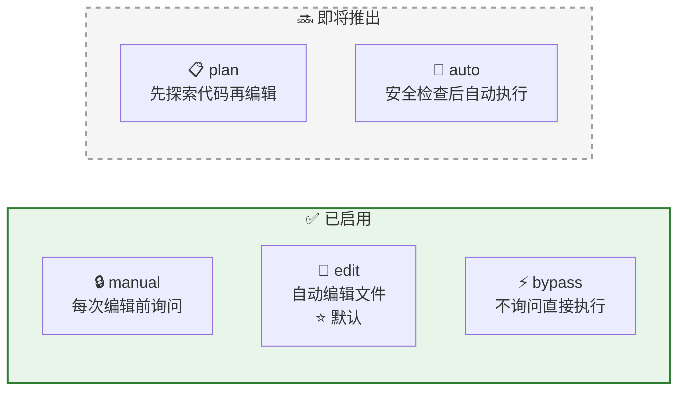
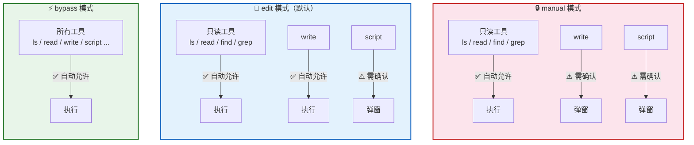
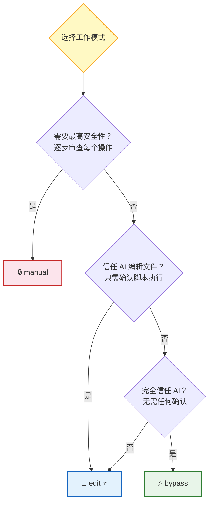
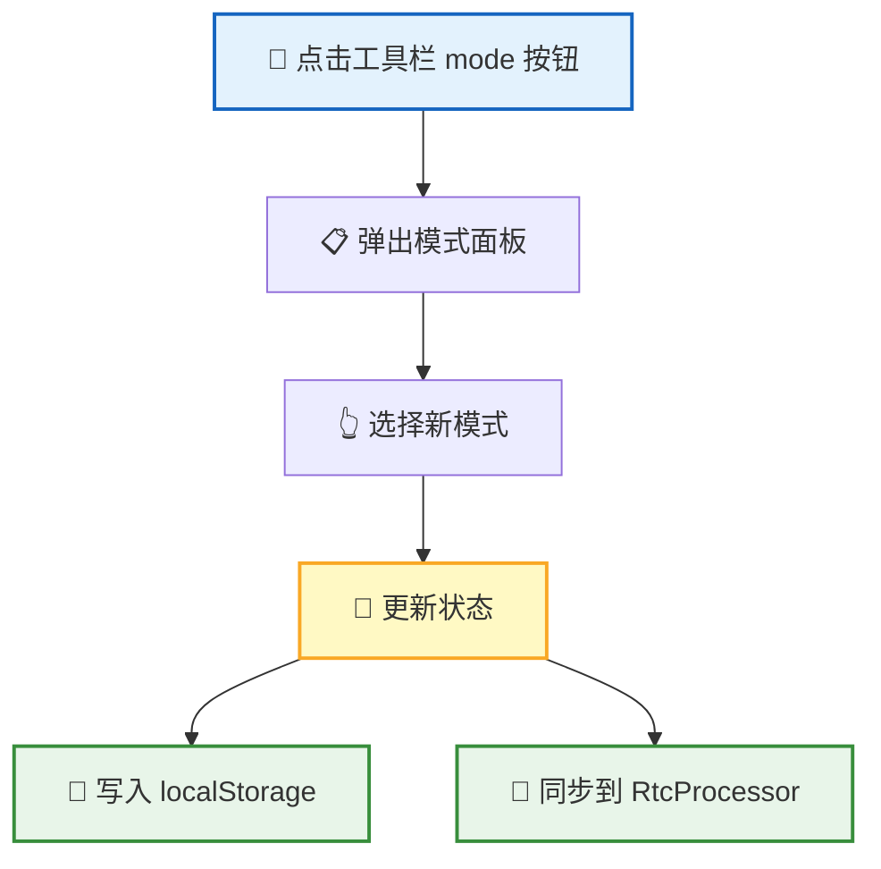
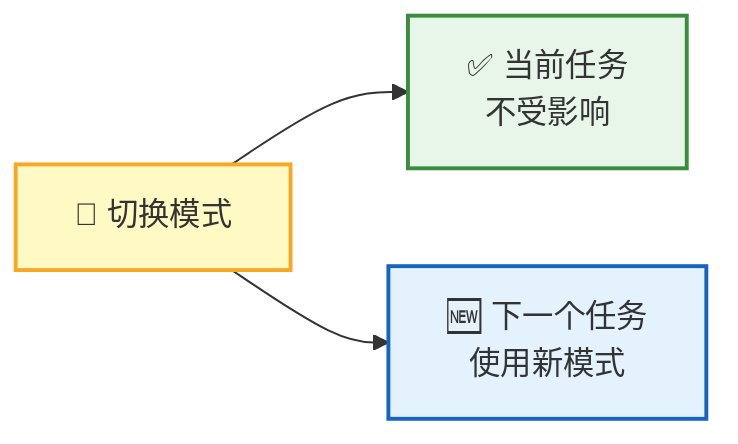

**工作模式** 决定了 AI 执行工具时是否需要你的确认。不同模式提供不同级别的自动化程度——从"每一步都要确认"到"完全自动执行"。你可以在安全和效率之间选择最适合当前任务的平衡点。

## 5 种工作模式

| 模式 | 标签 | 说明 | 状态 |
|:----:|------|------|:----:|
| 🔒 manual | Manual | 每次编辑前询问用户 | ✅ 启用 |
| 📝 edit | Edit automatically | 自动编辑文件（⭐ 默认） | ✅ 启用 |
| 📋 plan | Plan | 先探索代码再编辑 | 🔜 未启用 |
| 🤖 auto | Auto | 安全检查后自动执行 | 🔜 未启用 |
| ⚡ bypass | Bypass permissions | 不询问直接执行 | ✅ 启用 |

> 📌 当前默认模式为 **edit**——自动处理文件读写，但脚本执行前仍需确认。这是大多数场景下的最佳平衡。

## 权限矩阵

不同模式下，工具的确认策略如下：

| 工具 | 🔒 manual | 📝 edit | ⚡ bypass |
|------|:---------:|:-------:|:---------:|
| ls / read / find / grep | ✅ 自动 | ✅ 自动 | ✅ 自动 |
| write | ⚠️ 确认 | ✅ 自动 | ✅ 自动 |
| script | ⚠️ 确认 | ⚠️ 确认 | ✅ 自动 |

> 💡 **设计原则**：只读操作始终安全放行；`write` 仅在最高警戒模式（manual）下需要确认；`script` 因为可以执行任意代码，除 bypass 外都需要用户确认。

### 选择建议

| 场景 | 推荐模式 | 原因 |
|------|---------|------|
| 🔍 初次使用，了解 AI 行为 | 🔒 manual | 每一步都可见可控 |
| 💼 日常开发，信任 AI 编辑 | 📝 edit | 效率与安全的最佳平衡 |
| ⚡ 批量操作，完全信任 AI | ⚡ bypass | 最高效率，无中断 |

## 模式切换

| 操作 | 说明 |
|------|------|
| 入口 | 输入区域底部工具栏的 mode 按钮 |
| 面板 | 浮动在按钮上方 |
| 关闭 | 点击外部区域或按 Escape |

## 切换影响

模式切换遵循 **"不影响当前，立即影响下一个"** 的原则：

| 维度 | 行为 |
|------|------|
| 正在执行的任务 | 不会被中断，沿用旧模式的权限 |
| 下一个待处理的任务 | 立即使用新模式 |
| 切换时机 | 任意时刻都可以切换 |

> 📌 如果你正在执行一个敏感操作，可以先用 manual 模式完成，再切回 edit 模式继续日常工作。

## 状态持久化

| 特性 | 说明 |
|------|------|
| 存储位置 | `localStorage['rtc_mode']` |
| 恢复行为 | 页面刷新后恢复上次的模式 |
| 降级策略 | 存储失败时静默降级为默认值 `edit` |

模式偏好跟随你的浏览器，不需要每次重新设置。

## 下一步

- [脚本执行引擎](/docs/concepts/script-engine/) — 了解 script 工具为什么需要最高权限
- [Remote Tool Calling](/docs/concepts/rtc/) — 了解工具权限矩阵在 RTC 协议中的完整应用
- [会话管理](/docs/features/session/) — 了解工作模式在会话上下文中的作用
