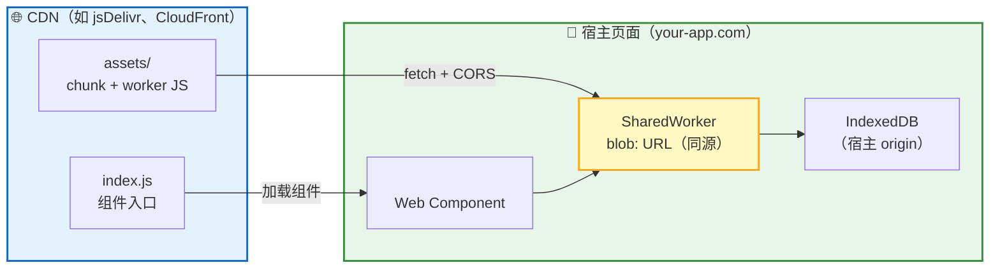
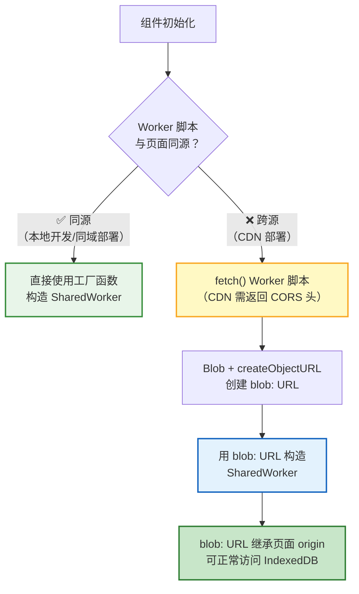

RTC Agent 的 Web Component 可以通过 CDN 分发，嵌入到任意网页中。由于组件运行在宿主页面内，跨域部署需要注意 **SharedWorker 同源策略**和 **CORS 配置**。

## 部署架构



| 组件 | 位置 | 说明 |
|:----:|:----:|------|
| 组件脚本 | CDN | 通过 `<script type="module">` 加载 |
| Worker chunk | CDN | 通过 `fetch()` 获取，转换为 blob: URL |
| SharedWorker | 宿主页面 | 使用 blob: URL 构造，继承页面 origin |
| IndexedDB | 宿主页面 | 数据存储在宿主 origin 下 |

## 嵌入方式

在你的网页中添加以下代码：

```html
<script type="module" src="https://cdn.jsdelivr.net/npm/@rtc-agent/component@0.2.3/dist/index.js"></script>
<rtc-agent server-url="https://your-rtc-server.com"></rtc-agent>
```

> 💡 将 `your-rtc-server.com` 替换为实际的 RTC Agent Server 地址。如需使用最新版本，可将 `@0.2.3` 替换为最新版本号或移除版本号以使用最新版。

## 跨域 SharedWorker 处理

### 问题背景

浏览器要求 SharedWorker 脚本必须与页面**同源**。当组件从 CDN 加载时，Worker 脚本的 URL 指向 CDN（跨源），直接构造 SharedWorker 会触发 `SecurityError`。

### 解决方案

组件内置了**双路径加载策略**，自动检测并处理跨域场景：



| 路径 | 适用场景 | 说明 |
|:----:|:-------:|------|
| 同源路径 | 本地开发、同域部署 | 直接使用 Vite 工厂函数，最简单可靠 |
| 跨源路径 | CDN 部署 | fetch 脚本 → blob: URL → 同源 SharedWorker |

> 💡 跨源路径包含重试机制（最多 3 次）和健康检查（ping 测试），确保 Worker 可靠启动。

## CDN CORS 配置

CDN **必须**为 Worker 脚本文件返回 CORS 头，否则 `fetch()` 会失败：

```http
Access-Control-Allow-Origin: *
```

### 常见 CDN 配置

| CDN | 配置方式 |
|-----|---------|
| **jsDelivr** | 默认已启用 CORS，无需额外配置 |
| **CloudFront** | 在 Behavior 中设置 "Response headers policy" → "CORS-with-preflight" |
| **Nginx** | 添加 `add_header Access-Control-Allow-Origin *;` 到 assets 目录 |
| **Vercel** | 添加 `Access-Control-Allow-Origin` 头到静态资源路由 |

### 验证 CORS 配置

使用 `curl` 检查 CDN 是否正确返回 CORS 头：

```bash
curl -I https://cdn.jsdelivr.net/npm/@rtc-agent/component@0.2.3/dist/assets/shared-worker-xxx.js
# 应包含: Access-Control-Allow-Origin: *
```

## Server CORS 配置

除了 CDN 的 CORS，RTC Agent Server 也需要配置 CORS 以允许跨域 API 请求：

```yaml
cors:
  allow_origins:
    - "https://your-app.com"
    - "https://another-app.com"
```

| 环境 | 行为 |
|:----:|------|
| 开发模式 | 未配置 `allow_origins` 时默认 `Access-Control-Allow-Origin: *` |
| 生产模式 | 必须显式配置 `allow_origins`，否则拒绝跨域请求 |

## 注意事项

| 注意事项 | 说明 |
|---------|------|
| 🔒 不使用 COOP/COEP | 解决方案通过 blob URL 避免跨域隔离，无需设置 `Cross-Origin-Opener-Policy` 等头 |
| 📦 Worker 缓存 | fetch 使用 `cache: 'no-store'` 避免使用过期的 Worker 脚本 |
| 🔊 音频资源 | 通知音效通过 Vite 的 `?url` 导入，自动处理 CDN 路径，无需额外配置 |
| 🔄 重试机制 | Worker 初始化失败时自动重试（最多 3 次，指数退避） |
| 🏥 健康检查 | Worker 启动后通过 ping 测试验证可用性（5 秒超时） |

## 常见问题

### SharedWorker 创建失败

**现象**：控制台报错 `SecurityError` 或 `Failed to construct 'SharedWorker'`。

**排查**：
1. 检查 CDN 是否返回 `Access-Control-Allow-Origin` 头
2. 检查 Worker 脚本 URL 是否可正常访问（直接在浏览器打开）
3. 检查浏览器控制台 `WorkerBridge` 相关日志

### IndexedDB 数据丢失

**现象**：切换页面后数据消失。

**原因**：IndexedDB 数据按 origin 隔离。如果页面 origin 变化（如从 `localhost` 切换到 IP 地址），数据不共享。

**解决**：确保页面始终使用相同的 origin 访问。

### 音频无法播放

**现象**：通知音效不播放。

**排查**：检查浏览器控制台是否有 404 错误。音频文件路径通过 Vite 自动解析，通常不需要手动配置。如果使用了非标准的 CDN 路径，可能需要自定义构建配置。

## 下一步

- [源码构建](/docs/deployment/source-build/) — 从源码构建和部署
- [分布式集群部署](/docs/deployment/distributed-deploy/) — 多 Worker 集群部署
- [Web Component API](/docs/integration/component-api/) — 组件属性与事件参考
