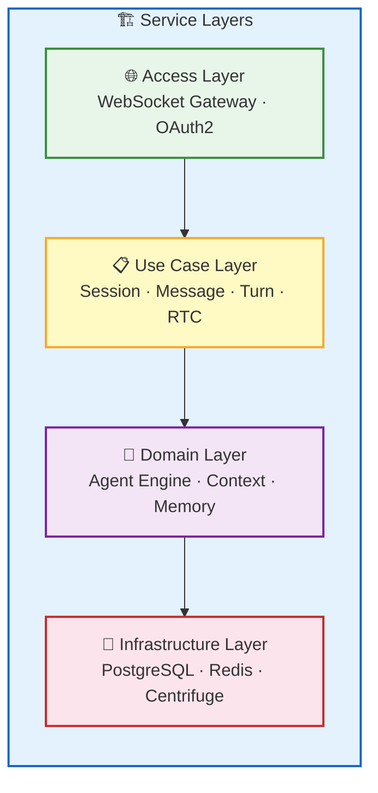
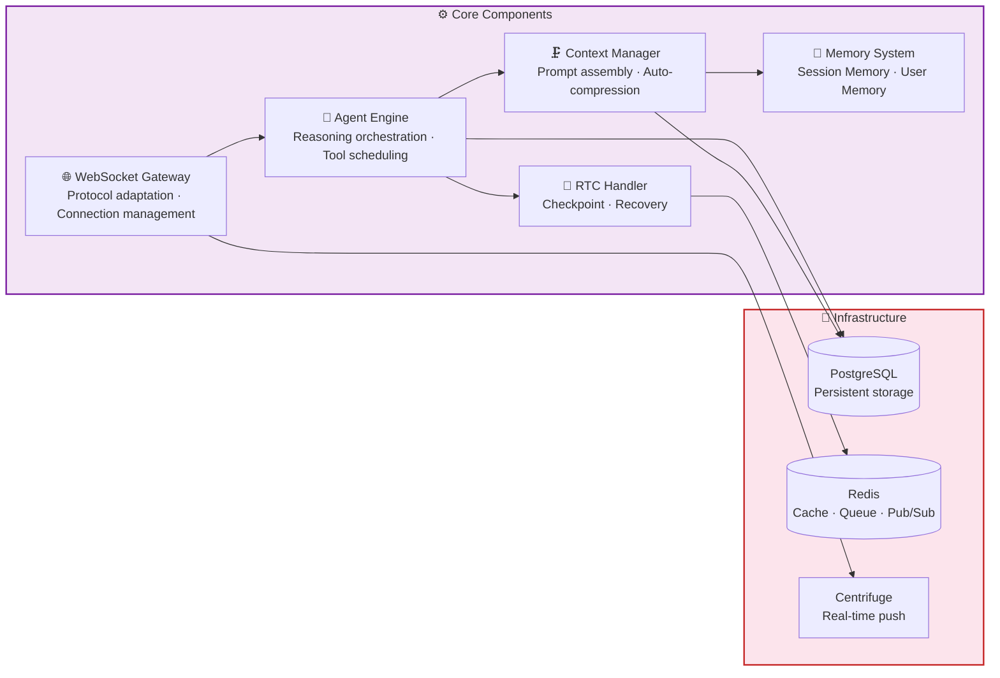
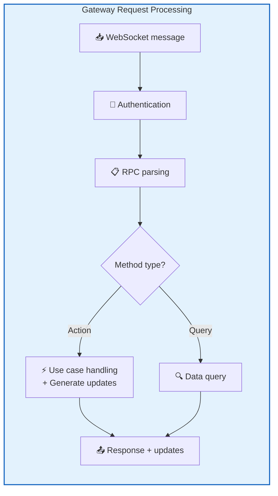
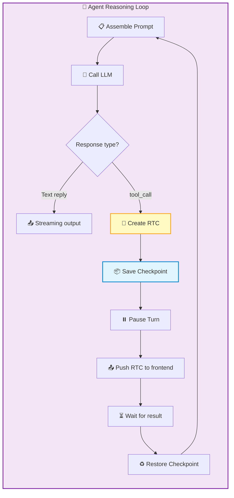
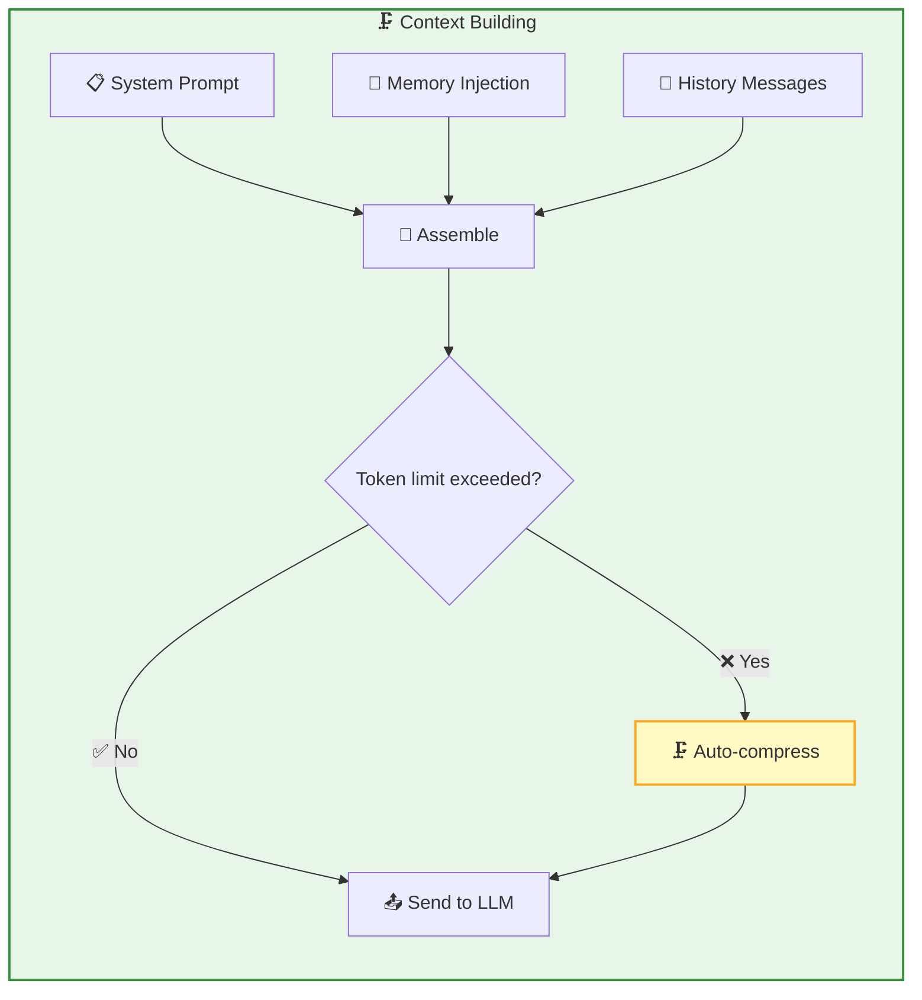
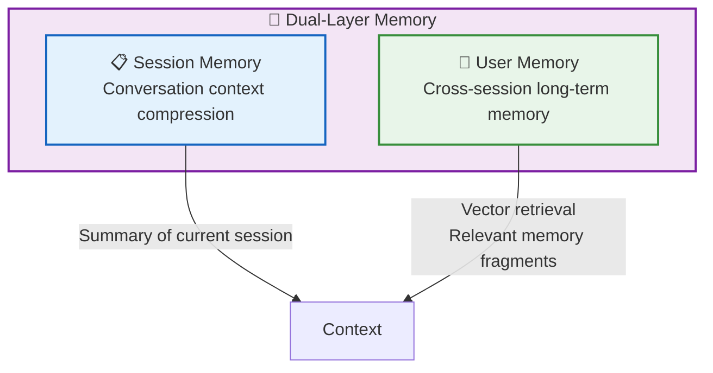
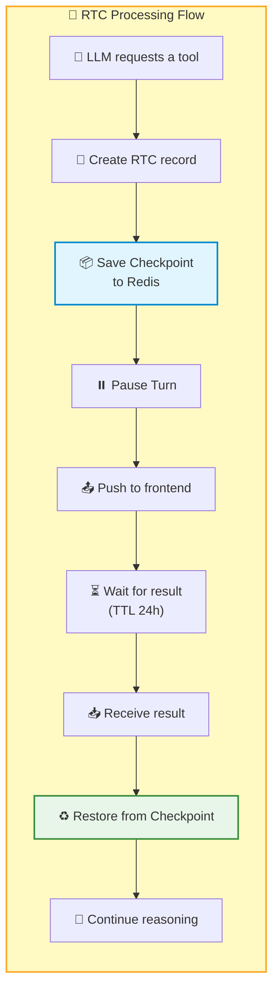
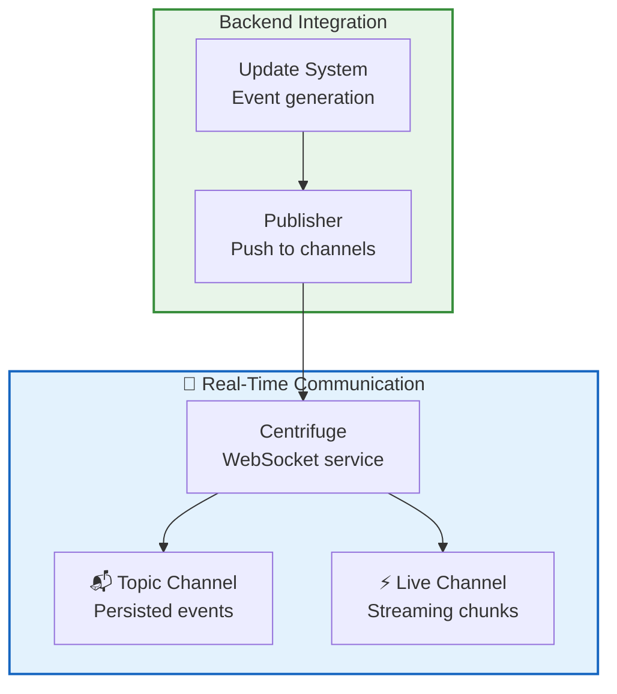

RTC Agent Server is a **Go service** responsible for AI reasoning orchestration, context management, real-time communication, and tool call scheduling. Core components include the WebSocket Gateway, Agent engine, context management, memory system, and RTC handler.

## Service Layers

| Layer | Responsibility | Key Modules |
|:--:|------|----------|
| 🌐 **Access Layer** | Protocol adaptation, authentication & authorization | WebSocket Gateway, OAuth2 Handler |
| 📋 **Use Case Layer** | Business orchestration, RPC processing | Session / Message / Turn / RTC use cases |
| 🤖 **Domain Layer** | AI reasoning, state management | Agent Engine, Context Management, Memory System |
| 💾 **Infrastructure Layer** | Data persistence, message passing | PostgreSQL, Redis, Centrifuge |

---

## Core Components

### WebSocket Gateway

The Gateway is the entry point for frontend-backend communication, managing all WebSocket connections and RPC routing.

| Responsibility | Description |
|------|------|
| **Connection Management** | Handles WebSocket connection establishment, authentication, heartbeats, and disconnection |
| **RPC Routing** | Dispatches the 18 RPC methods to their corresponding use case handlers |
| **Event Push** | Pushes events generated by the Agent to the frontend via Centrifuge |
| **RTC Relay** | Forwards AI tool call requests to the frontend and receives execution results |

### Agent Engine

The Agent engine is the core of AI reasoning — assembling prompts, calling the LLM, handling tool calls, and managing the reasoning loop.

| Capability | Description |
|------|------|
| **Reasoning Loop** | Call LLM → Process response → Tool call → Continue reasoning, until the final reply is generated |
| **Tool Scheduling** | Manages 6 built-in tools (ls / read / write / grep / find / script) |
| **Streaming Output** | Pushes LLM output to the frontend in real-time |
| **Sub-Agents** | Complex tasks are automatically decomposed, with multiple specialized sub-agents working in parallel |

### Context Management

Context management is responsible for building the complete prompt sent to the LLM, and automatically compressing it when conversations become too long.

| Feature | Description |
|------|------|
| **Prompt Assembly** | System prompt + Memory + AGENT.md + History messages |
| **Auto-compression** | When context approaches the token limit, earlier conversations are automatically summarized |
| **Manual compression** | Triggered via the `v1.session.compact` RPC |
| **Memory Injection** | Retrieves relevant fragments from the memory system and injects them into the context |

### Memory System

A dual-layer memory architecture that gives AI both short-term and long-term memory.

| Type | Scope | Storage | Purpose |
|------|:----:|:----:|------|
| **Session Memory** | Single session | Database | Context compression summary for long conversations |
| **User Memory** | Cross-session | Vector database | Long-term memory for user preferences and historical facts |

### RTC Handler

The RTC handler manages the full lifecycle of tool calls — from creating RTC records to saving checkpoints, pausing Turns, waiting for results, and resuming reasoning.

| Feature | Description |
|------|------|
| **Checkpoint** | Saves the current reasoning state to Redis, with a 24-hour TTL |
| **Crash Recovery** | Can recover from a checkpoint after server restart |
| **Serial Execution** | RTC calls within the same session are strictly serialized to avoid file conflicts |
| **100% Delivery** | Frontend result submission retries indefinitely; idempotency is guaranteed |

---

## Real-Time Communication Layer

| Component | Responsibility |
|------|------|
| **Centrifuge** | WebSocket service, managing channel subscriptions and message distribution |
| **Update System** | Generates Update events for every data change |
| **Redis PUB/SUB** | Underlying transport for the Live channel; low-latency fire-and-forget |

---

## Tech Stack

| Component | Technology | Purpose |
|------|:----:|------|
| **Language** | Go 1.27 | Main service language |
| **CLI** | Cobra | Command-line framework |
| **ORM** | GORM | Database operations |
| **Database** | PostgreSQL | Persistent storage |
| **Cache** | Redis | Checkpoint, buffering, Pub/Sub |
| **Real-Time Communication** | Centrifuge | WebSocket service |
| **AI SDK** | Anthropic SDK + Eino | Agent reasoning |
| **Observability** | OpenTelemetry + Jaeger | Distributed tracing |
| **Metrics** | Prometheus | Monitoring metrics |

## Next Steps

- [Frontend Architecture](/docs/en/architecture/frontend/) — Learn about the Web Components system
- [Architecture Overview](/docs/en/architecture/) — Return to the architecture panorama
- [Remote Tool Calling](/docs/concepts/rtc/) — Learn about the full RTC tool call mechanism
- [WebSocket RPC](/docs/en/protocol/rpc/) — Learn the detailed RPC method definitions
