RTC Agent Server is a **Go service** responsible for AI reasoning orchestration, context management, real-time communication, and tool call scheduling. Core components include the WebSocket Gateway, Agent engine, context management, memory system, and RTC handler.

## Service Layers

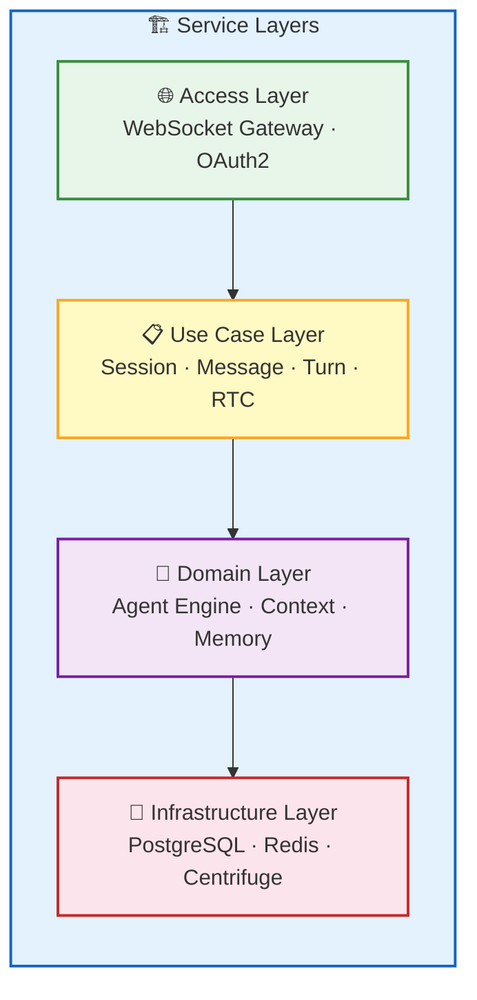

| Layer | Responsibility | Key Modules |
| --- | --- | --- |
| 🌐 **Access Layer** | Protocol adaptation, authentication & authorization | WebSocket Gateway, OAuth2 Handler |
| 📋 **Use Case Layer** | Business orchestration, RPC processing | Session / Message / Turn / RTC use cases |
| 🤖 **Domain Layer** | AI reasoning, state management | Agent Engine, Context Management, Memory System |
| 💾 **Infrastructure Layer** | Data persistence, message passing | PostgreSQL, Redis, Centrifuge |

> **OAuth2 Authentication**: The system uses the OAuth2 authorization code flow. The frontend completes authorization via iframe redirect, obtaining an Access Token (1-hour validity) and Refresh Token (30-day validity). WebSocket connections use the Access Token for authentication. See [Authentication Flow](/docs/en/integration/auth).

## Core Components

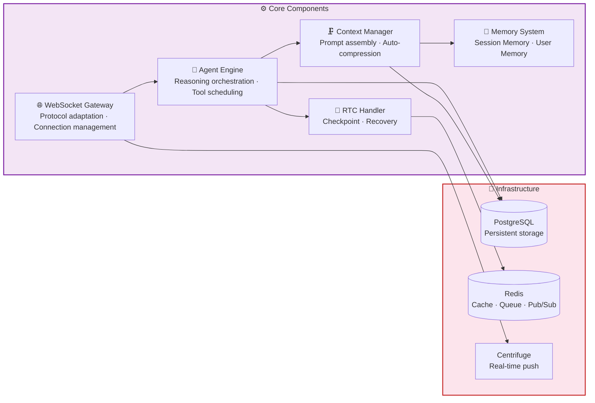

### WebSocket Gateway

The Gateway is the entry point for frontend-backend communication, managing all WebSocket connections and RPC routing.

| Responsibility | Description |
| --- | --- |
| **Connection Management** | Handles WebSocket connection establishment, authentication, heartbeats, and disconnection |
| **RPC Routing** | Dispatches the 18 RPC methods to their corresponding use case handlers |
| **Event Push** | Pushes events generated by the Agent to the frontend via Centrifuge |
| **RTC Relay** | Forwards AI tool call requests to the frontend and receives execution results |

**18 RPC Methods by Category**:

| Category | Methods |
| --- | --- |
| **Session** | `session.list`, `session.get`, `session.close`, `session.update`, `session.fork`, `session.compact` |
| **Message** | `message.send`, `message.list`, `message.get` |
| **Turn** | `turn.list`, `turn.get`, `turn.stop` |
| **RTC** | `rtc.list`, `rtc.get`, `rtc.update_status`, `rtc.submit_result` |

See [WebSocket RPC](/docs/en/protocol/rpc).

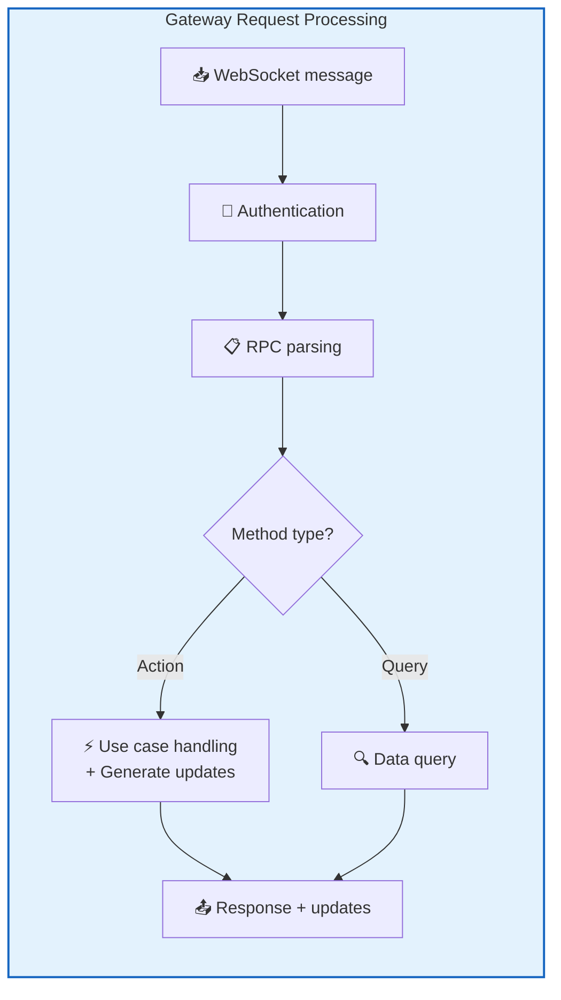

### Agent Engine

The Agent engine is the core of AI reasoning — assembling prompts, calling the LLM, handling tool calls, and managing the reasoning loop.

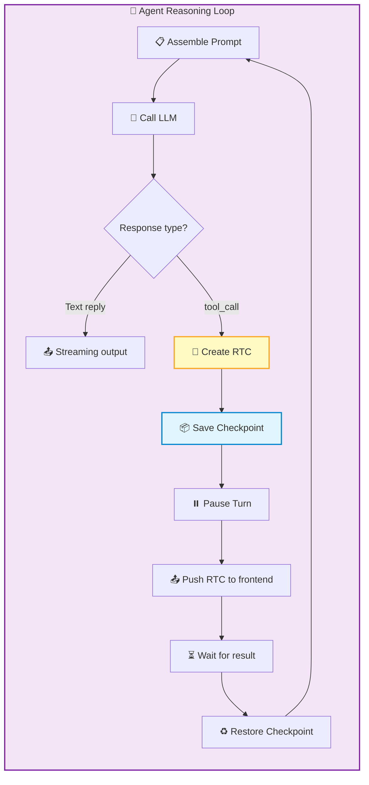

| Capability | Description |
| --- | --- |
| **Reasoning Loop** | Call LLM → Process response → Tool call → Continue reasoning, until the final reply is generated |
| **Tool Scheduling** | Manages 6 built-in tools (ls / read / write / grep / find / script) |
| **Streaming Output** | Pushes LLM output to the frontend in real-time |
| **Sub-Agents** | Complex tasks are automatically decomposed, with multiple specialized sub-agents working in parallel (see below) |

#### Sub-Agent Mechanism

When task complexity exceeds the capacity of a single reasoning pass, the Agent engine automatically decomposes the task and creates sub-agents for parallel processing:

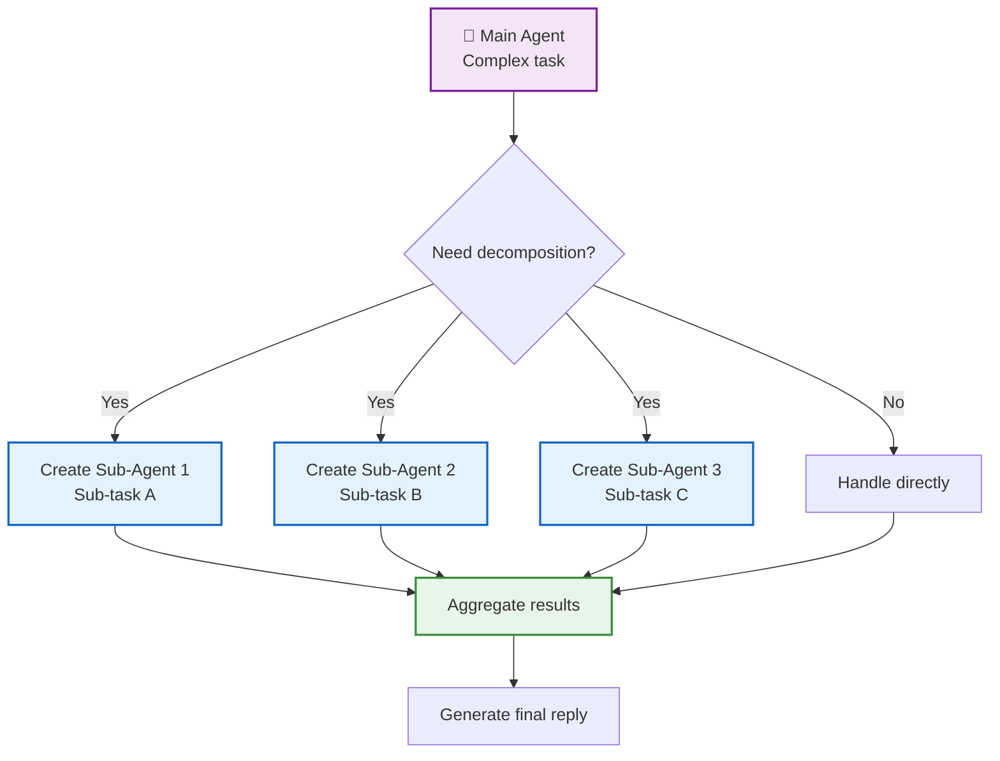

- **Independent context**: Each sub-agent has its own session and context, no interference
- **Parallel execution**: Multiple sub-agents can call the LLM and tools simultaneously
- **Result aggregation**: The main Agent collects results from all sub-agents and generates the final reply

### Context Management

Context management is responsible for building the complete prompt sent to the LLM, and automatically compressing it when conversations become too long.

#### Prompt Assembly

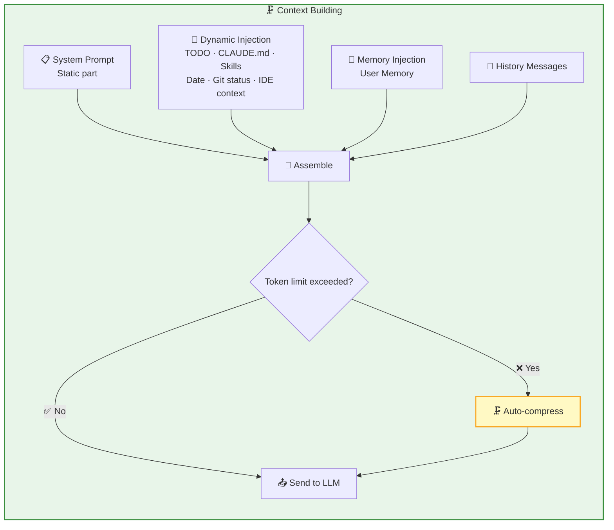

#### Three-Layer Compression Strategy

When conversation length approaches the token limit, the system uses a three-layer progressive compression approach:

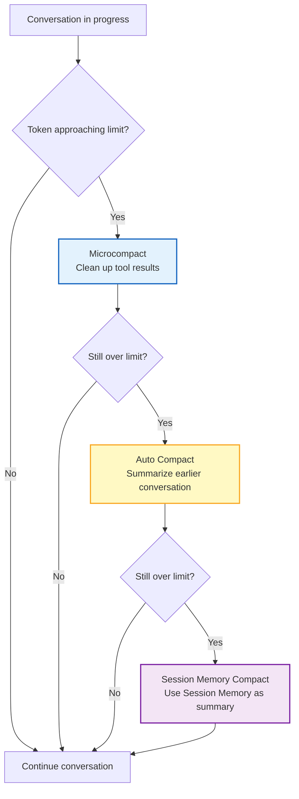

| Strategy | Trigger | Compression Method | Retained Content |
| --- | --- | --- | --- |
| **Microcompact** | After tool calls | Cleans up earlier tool results, keeping only the most recent 5 | Messages with time gaps > 60 minutes |
| **Auto Compact** | Token reaches threshold | LLM summarizes earlier conversations (9-part structured summary) | Most recent 10K tokens + 5 messages |
| **Session Memory Compact** | Auto Compact fails 3 times | Directly uses Session Memory as summary | Session Memory's 5 categories |

> **Circuit breaker**: If Auto Compact fails 3 consecutive times, the system stops auto-compression to avoid infinite loops consuming tokens.

See [Context Management](/docs/en/features/context-management).

### Memory System

A dual-layer memory architecture that gives AI both short-term and long-term memory.

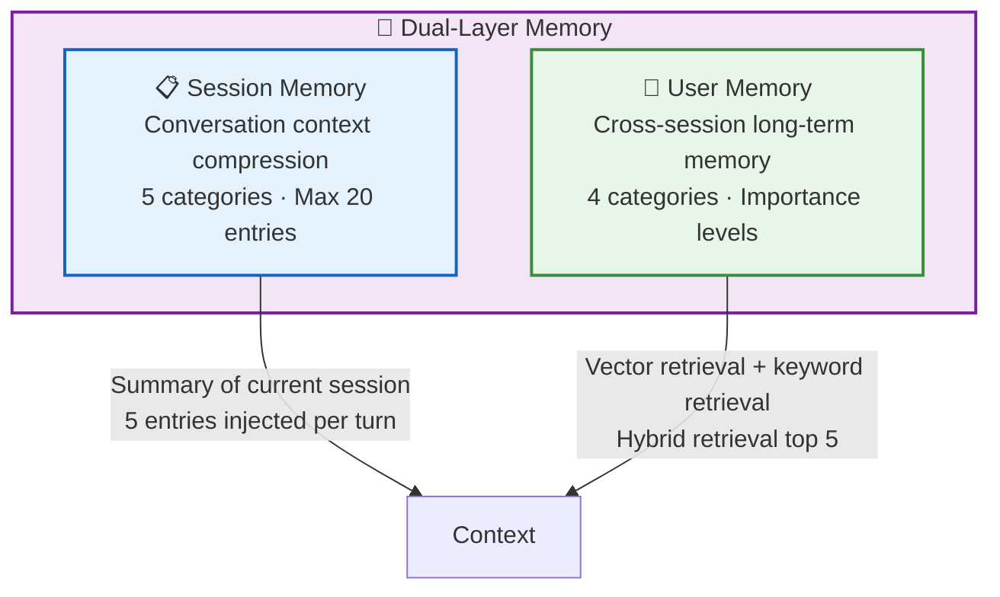

#### Session Memory

Independently maintained per session, used for long-conversation context compression:

| Category | Description |
| --- | --- |
| **decision** | Decisions and choices made by the user |
| **context** | Background information for the current task |
| **progress** | Completed work and progress |
| **issue** | Encountered problems and blockers |
| **learnings** | Lessons learned from the task |

- **Capacity**: Max 20 entries, approximately 12K tokens
- **Extraction**: Dual-track — background Agent automatic extraction + Agent proactive saving
- **Usage**: Source for Session Memory Compact summaries; 5 entries injected into context per conversation turn

#### User Memory

Cross-session long-term memory, storing user preferences and historical facts:

| Category | Description |
| --- | --- |
| **user** | User identity (role, expertise, preferences) |
| **feedback** | User feedback on working style |
| **project** | Ongoing projects, goals, constraints |
| **reference** | External resource pointers (URLs, docs, tickets) |

- **Importance levels**: low / medium / high / critical
- **Capacity**: Max 1000 entries
- **Extraction**: Agent proactive saving only
- **Retrieval**: Hybrid retrieval (vector cosine similarity top-20 + keyword full-text search top-20 → RRF fusion → importance weighting → top 5)

See [Memory System](/docs/en/features/memory).

### RTC Handler

The RTC handler manages the full lifecycle of tool calls — from creating RTC records to saving checkpoints, pausing Turns, waiting for results, and resuming reasoning.

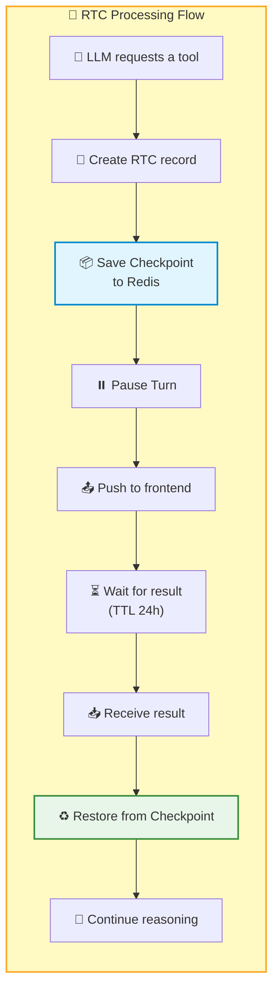

| Feature | Description |
| --- | --- |
| **Checkpoint** | Saves the current reasoning state to Redis, with a 24-hour TTL |
| **Crash Recovery** | Can recover from a checkpoint after server restart |
| **Serial Execution** | RTC calls within the same session are strictly serialized to avoid file conflicts |
| **100% Delivery** | Frontend result submission retries indefinitely; idempotency is guaranteed |

#### Work Mode Permission Matrix

Different work modes have different confirmation strategies for tool calls:

| Tool Type | manual | edit | plan | auto | bypass |
| --- | --- | --- | --- | --- | --- |
| **Read-only tools** (ls/read/grep/find) | ✅ Auto | ✅ Auto | ✅ Auto | ✅ Auto | ✅ Auto |
| **Write tools** (write) | ⚠️ Confirm | ✅ Auto | ⚠️ Confirm | ✅ Auto | ✅ Auto |
| **script tool** | ⚠️ Confirm | ⚠️ Confirm | ⚠️ Confirm | ⚠️ Confirm | ✅ Auto |

See [Work Modes](/docs/en/concepts/work-modes).

## Real-Time Communication Layer

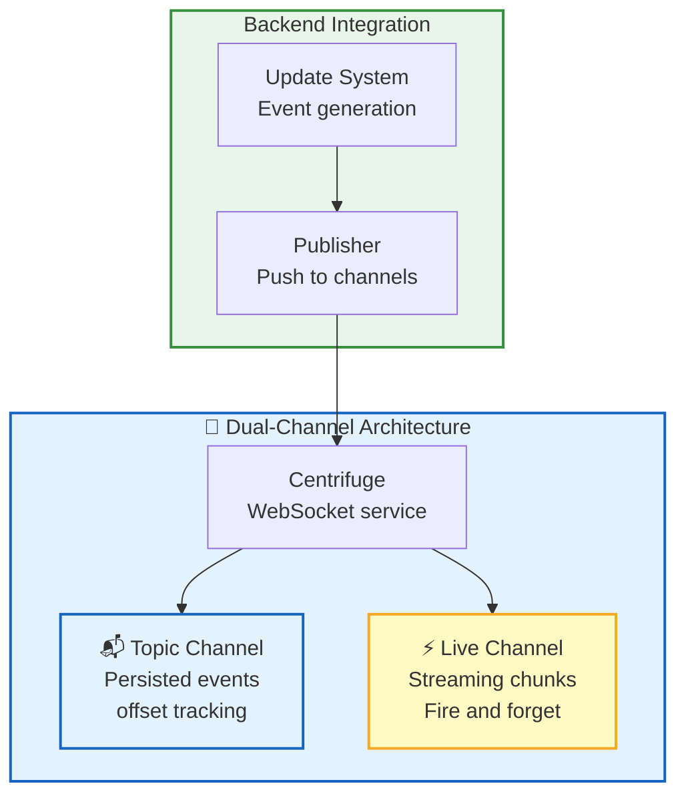

| Channel | Purpose | Characteristics |
| --- | --- | --- |
| **Topic** | State change events (Session, Message, Turn, RTC) | Persisted, offset tracking, offline recovery |
| **Live** | Streaming output intermediate chunks | Non-persistent, Redis PUB/SUB, low latency, lossy |

### Offset Mechanism & Offline Recovery

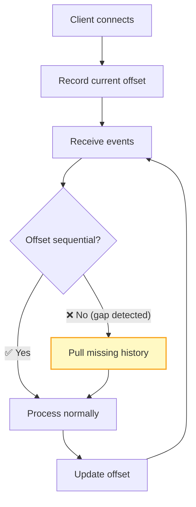

- **Brief disconnection** (< 5 seconds): Missing events are automatically pushed after reconnection
- **Long disconnection**: Client detects offset gap and proactively pulls history
- **Epoch change**: After server restart, epoch changes; client resets offset and pulls full state

See [Real-Time Communication](/docs/en/features/realtime).

## Next Steps

- [Frontend Architecture](/docs/en/architecture/frontend) — Learn about the Web Components system
- [Architecture Overview](/docs/en/architecture) — Return to the architecture panorama
- [Remote Tool Calling](/docs/en/concepts/rtc) — Learn about the full RTC tool call mechanism
- [WebSocket RPC](/docs/en/protocol/rpc) — Learn the detailed RPC method definitions
