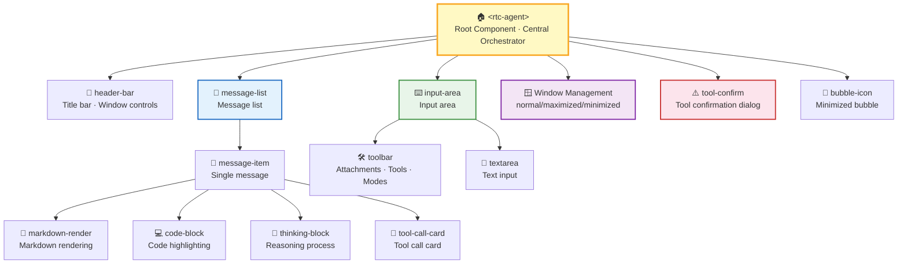
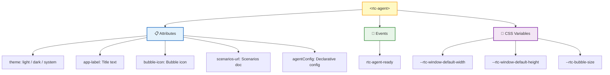
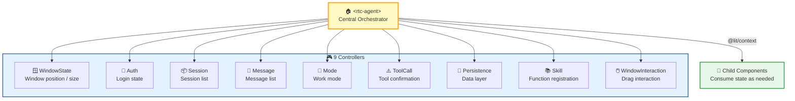
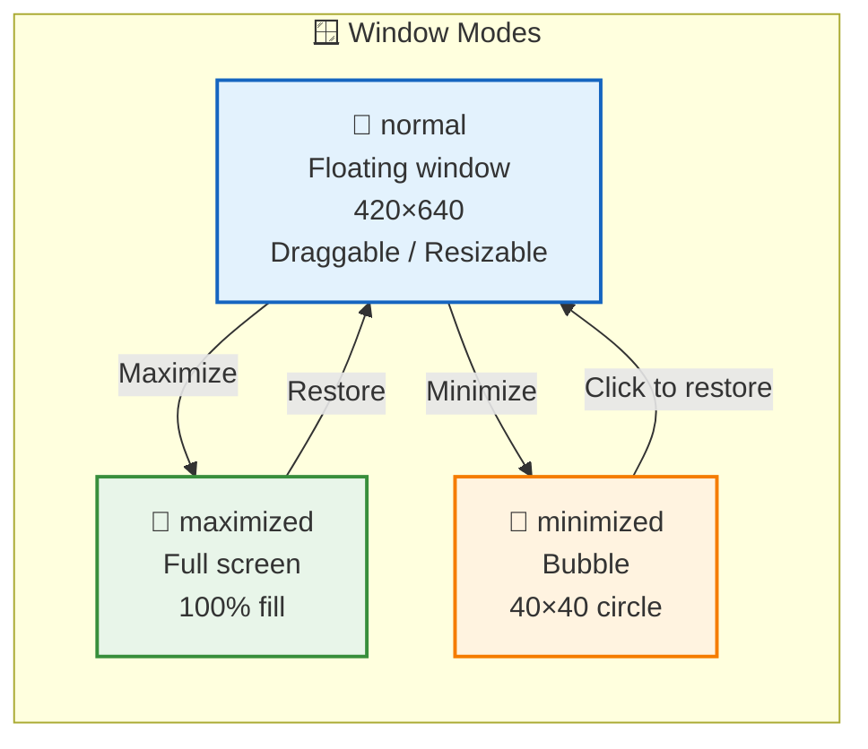
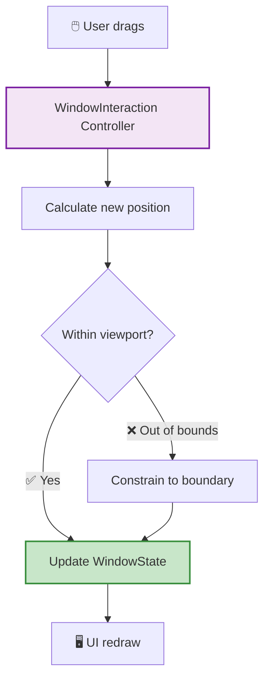
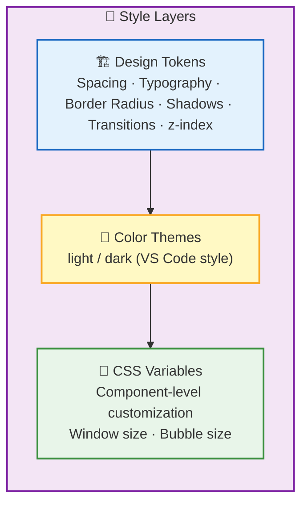
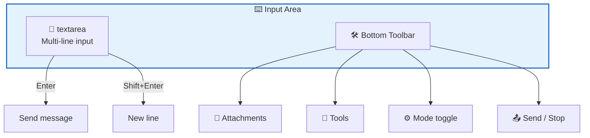
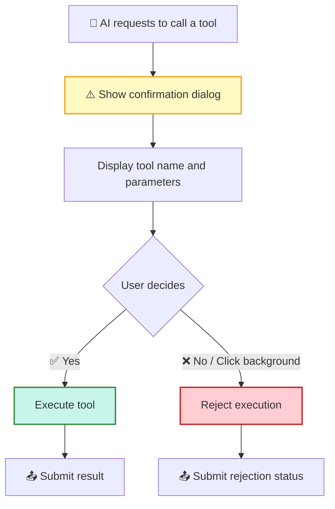
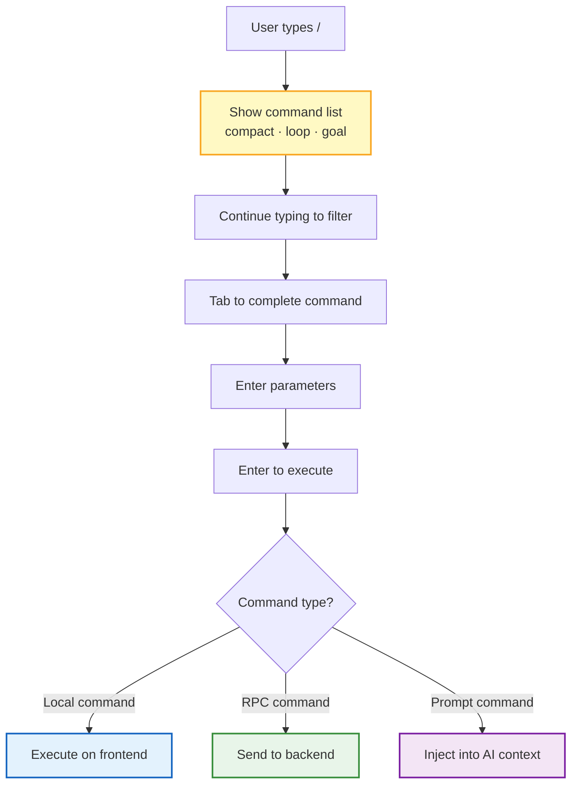

The RTC Agent frontend is a component library built on **Lit Web Components**. It exposes only a single `<rtc-agent>` component to the outside world, containing **16 sub-components** internally, managed by **9 Controllers**, with data distributed to child components via `@lit/context`.

## Component Architecture

> **File Explorer**: Left panel shows the virtual file system directory tree (functions/, scenarios/, scripts/), right panel is an editor with live preview. All file data is stored in the browser's IndexedDB.

> **Settings UI**: Supports theme switching, language selection, font size adjustment, and other personalization options.
>
> **Window management is not a standalone component**: `Window Management` is a functional module of the root component (implemented by the collaboration of WindowState Controller and WindowInteraction Controller), not an independent UI component. It controls three window states: normal (floating), maximized (full-screen), minimized (bubble).

## Public Component

Host applications only need to import a single component to access all functionality:

| Attribute | Description | Example |
| --- | --- | --- |
| `theme` | Theme switching | `light` / `dark` / `system` |
| `app-label` | Title bar text + bubble tooltip | `"RTC Assistant"` |
| `bubble-icon` | SVG/HTML inside the minimized bubble | Custom icon |
| `scenarios-url` | Scenarios document URL | `"https://..."` |
| `agentConfig` | Declarative function registration (recommended) | JSON config object |

For detailed API documentation, see [Component API](/docs/en/integration/component-api).

## State Management

### Design Principles

| Principle | Description |
| --- | --- |
| **Controllers do not reference each other** | Each Controller independently manages its own state slice |
| **Root component orchestrates** | `<rtc-agent>` acts as the hub, coordinating cross-Controller communication |
| **Context distribution** | State is distributed to child components via `@lit/context`, avoiding prop drilling |
| **Data layer isolation** | The Persistence Controller manages all IndexedDB reads and writes |

> 💡 **Why not global state?** Web Components run inside the host application's page and may have multiple instances. For example, a page might embed both a "Customer Support Assistant" and a "Data Analysis Assistant" as two `<rtc-agent>` elements — they need independent sessions, messages, and auth state. Controller + Context ensures each instance's state is fully isolated with no interference.

## Window System

| Interaction | Implementation |
| --- | --- |
| **Drag** | Title bar serves as the drag handle |
| **Resize** | 8 resize handles — 4 corners + 4 edges |
| **Keyboard** | Arrow keys to move, Shift to accelerate |
| **Viewport constraint** | Always stays within the visible area |

## Style System

| Layer | Content | Customization Method |
| --- | --- | --- |
| **Design Tokens** | Spacing, typography, border radius, shadows, transitions, z-index | Override CSS variables |
| **Color Themes** | light / dark color schemes | Switch via `theme` attribute |
| **CSS Variables** | Window size, bubble size | `--rtc-*` prefixed variables |

## Key Interactions

### Input Area

### Message List

| Feature | Behavior |
| --- | --- |
| **Auto-scroll** | Automatically scrolls to the bottom when new messages arrive |
| **Smart pause** | Pauses auto-scroll when the user manually scrolls up |
| **New message indicator** | Shows a "New messages" button when the user is not at the bottom |
| **Rendering** | Markdown rendering + code highlighting |

### Tool Confirmation Dialog

### Command System

When the user types text starting with `/`, command input mode is triggered:

| Command | Type | Function |
| --- | --- | --- |
| `/compact` | RPC | Manually trigger context compression |
| `/loop` | Local + RPC | Loop execution (scheduled / dynamic) |
| `/goal` | Prompt | Goal-driven; AI sets completion criteria, Judge model checks |

See [Commands](/docs/en/features/commands).

## Performance & Accessibility

### Performance Considerations

| Scenario | Strategy |
| --- | --- |
| **Large message lists** | Paginated loading (cursor pagination); first load shows the latest 50 |
| **Long conversation scrolling** | Virtual scroll optimization (future release) |
| **Markdown rendering** | On-demand rendering; code highlighting loaded lazily |
| **IndexedDB reads/writes** | Unified by Persistence Controller; batch operations reduce IO |

### Accessibility

| Feature | Implementation |
| --- | --- |
| **Keyboard navigation** | Tab to switch focus, Enter to activate, Esc to close dialogs |
| **ARIA labels** | All interactive elements have `aria-label` |
| **Screen reader** | Message list uses `role="log"`; new messages announced automatically |
| **High contrast** | Supports system high-contrast mode |

## Next Steps

- [Backend Architecture](/docs/en/architecture/backend) — Learn about the Go server's layered design
- [Architecture Overview](/docs/en/architecture) — Return to the architecture panorama
- [Remote Tool Calling](/docs/en/concepts/rtc) — Learn about the core protocol for frontend tool calling
- [Virtual File System](/docs/en/concepts/virtual-fs) — Learn about the frontend IndexedDB file system
- [Commands](/docs/en/features/commands) — Learn about the complete command system
