The RTC Agent frontend is a component library built on **Lit Web Components**. It exposes only a single `<rtc-agent>` component to the outside world, containing **54 sub-components** internally, managed by **23 Controllers**, with data distributed to child components via `@lit/context`.

## Component Architecture

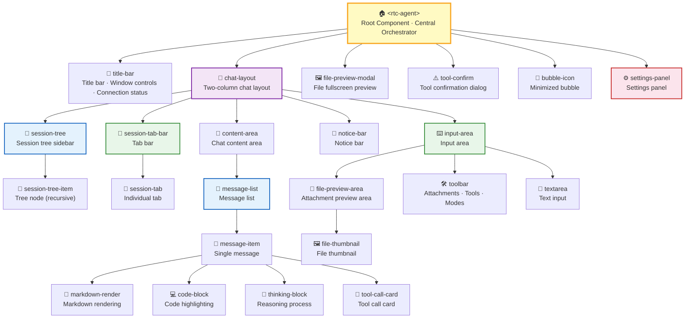
```mermaid
flowchart TD
    ROOT["🏠 &lt;rtc-agent&gt;<br/>Root Component · Central Orchestrator"]

    ROOT --> HEADER["📌 title-bar<br/>Title bar · Window controls · Connection status"]
    ROOT --> LAYOUT["📐 chat-layout<br/>Two-column chat layout"]

    LAYOUT --> TREE["📂 session-tree<br/>Session tree sidebar"]
    TREE --> TREEITEM["📄 session-tree-item<br/>Tree node (recursive)"]

    LAYOUT --> TABBAR["📑 session-tab-bar<br/>Tab bar"]
    TABBAR --> TAB["📑 session-tab<br/>Individual tab"]

    LAYOUT --> CONTENT["💬 content-area<br/>Chat content area"]
    LAYOUT --> NOTICE["📢 notice-bar<br/>Notice bar"]
    LAYOUT --> INPUT["⌨️ input-area<br/>Input area"]

    CONTENT --> MSG["💬 message-list<br/>Message list"]
    MSG --> MSGITEM["📝 message-item<br/>Single message"]
    MSGITEM --> MD["📄 markdown-render<br/>Markdown rendering"]
    MSGITEM --> CODE["💻 code-block<br/>Code highlighting"]
    MSGITEM --> THINK["💭 thinking-block<br/>Reasoning process"]
    MSGITEM --> TOOL["🔧 tool-call-card<br/>Tool call card"]

    INPUT --> FPA["📎 file-preview-area<br/>Attachment preview area"]
    FPA --> THUMB["🖼️ file-thumbnail<br/>File thumbnail"]
    INPUT --> TOOLBAR["🛠️ toolbar<br/>Attachments · Tools · Modes"]
    INPUT --> TA["📝 textarea<br/>Text input"]

    ROOT --> FPM["🖼️ file-preview-modal<br/>File fullscreen preview"]
    ROOT --> CONFIRM["⚠️ tool-confirm<br/>Tool confirmation dialog"]
    ROOT --> BUBBLE["🫧 bubble-icon<br/>Minimized bubble"]
    ROOT --> SETTINGS_PANEL["⚙️ settings-panel<br/>Settings panel"]

    style ROOT fill:#fff9c4,stroke:#f9a825,stroke-width:3px
    style LAYOUT fill:#f3e5f5,stroke:#7b1fa2,stroke-width:2px
    style TREE fill:#e3f2fd,stroke:#1565c0,stroke-width:2px
    style TABBAR fill:#e8f5e9,stroke:#388e3c,stroke-width:2px
    style MSG fill:#e3f2fd,stroke:#1565c0,stroke-width:2px
    style INPUT fill:#e8f5e9,stroke:#388e3c,stroke-width:2px
    style SETTINGS_PANEL fill:#fce4ec,stroke:#c62828,stroke-width:2px
```


> **File Explorer**: Left panel shows the virtual file system directory tree (functions/, scenarios/, scripts/), right panel is an editor with live preview. All file data is stored in the browser's IndexedDB.


> **Settings UI**: Supports theme switching, language selection, font size adjustment, and other personalization options.

### New Components Overview

| Component | Purpose | Replacement |
|:---------:|:-------:|:-----------:|
| `rtc-chat-layout` | Two-column chat layout (session tree + content) | Replaces legacy `rtc-content-wrapper` |
| `rtc-session-tree` | VS Code-style session tree sidebar | New |
| `rtc-session-tree-item` | Tree node (recursive rendering) | New |
| `rtc-session-tab-bar` | Browser-style tab bar | New |
| `rtc-session-tab` | Individual tab | New |
| `rtc-settings-panel` | Settings side drawer panel | New |
| `rtc-settings-layout` | Settings two-column layout | New |
| `rtc-settings-nav` | Settings category navigation | New |
| `rtc-file-preview-area` | Attachment preview area (horizontal scrolling thumbnail list) | New |
| `rtc-file-thumbnail` | File thumbnail (upload progress, delete, preview) | New |
| `rtc-file-preview-modal` | Fullscreen file preview modal (image/text) | New |

## Public Component

Host applications only need to import a single component to access all functionality:

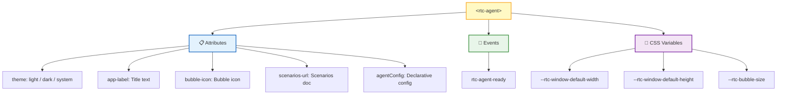
```mermaid
flowchart TD
    A["&lt;rtc-agent&gt;"] --> B["📋 Attributes"]
    A --> C["📢 Events"]
    A --> D["🎨 CSS Variables"]

    B --> B1["theme: light / dark / system"]
    B --> B2["app-label: Title text"]
    B --> B3["bubble-icon: Bubble icon"]
    B --> B4["scenarios-url: Scenarios doc"]
    B --> B5["agentConfig: Declarative config"]

    C --> C1["rtc-agent-ready"]

    D --> D1["--rtc-window-default-width"]
    D --> D2["--rtc-window-default-height"]
    D --> D3["--rtc-bubble-size"]

    style A fill:#fff9c4,stroke:#f9a825,stroke-width:2px
    style B fill:#e3f2fd,stroke:#1565c0,stroke-width:2px
    style C fill:#e8f5e9,stroke:#388e3c,stroke-width:2px
    style D fill:#f3e5f5,stroke:#7b1fa2,stroke-width:2px
```

| Attribute | Description | Example |
| --- | --- | --- |
| `theme` | Theme switching | `light` / `dark` / `system` |
| `lang` | Interface language | `zh-CN` / `en-US` |
| `app-label` | Title bar text + bubble tooltip | `"RTC Assistant"` |
| `database-name` | IndexedDB name prefix | `"my-app-rtc"` |
| `server-url` | Server address | `"https://rtc.example.com"` |
| `redirect-uri` | OAuth callback address | `"/auth/callback.html"` |
| `bubble-icon` | SVG/HTML inside the minimized bubble | Custom icon |
| `logo` | Custom brand Logo (separate light/dark variants) | `{ light: '<svg>...', dark: '<svg>...' }` |
| `worker-url` | SharedWorker file URL | `"/rtc-agent/shared-worker.js"` |
| `scenarios-url` | Scenarios document URL | `"https://..."` |
| `agentConfig` | Declarative function registration (recommended) | JSON config object |

For detailed API documentation, see [Component API](/docs/en/integration/component-api).

## State Management

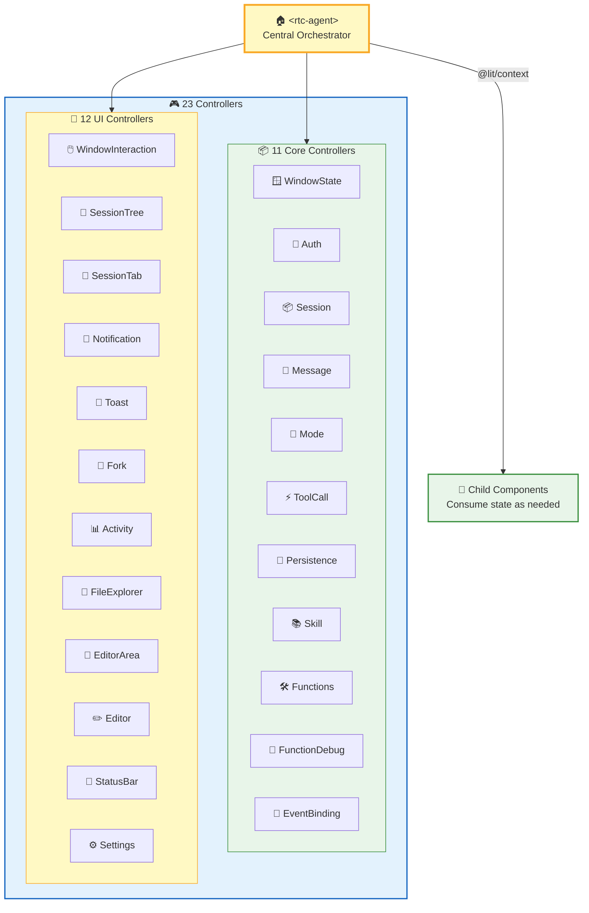
```mermaid
flowchart TD
    subgraph CONTROLLERS["🎮 23 Controllers"]
        direction TB
        subgraph CORE["📦 11 Core Controllers"]
            C1["🪟 WindowState"]
            C2["🔐 Auth"]
            C3["📦 Session"]
            C4["💬 Message"]
            C5["🔧 Mode"]
            C6["⚡ ToolCall"]
            C7["💾 Persistence"]
            C8["📚 Skill"]
            C9["🛠️ Functions"]
            C10["🐛 FunctionDebug"]
            C11["🔗 EventBinding"]
        end
        subgraph UI["🎨 12 UI Controllers"]
            C12["🖱️ WindowInteraction"]
            C13["📂 SessionTree"]
            C14["📑 SessionTab"]
            C15["🔔 Notification"]
            C16["🍞 Toast"]
            C17["🌿 Fork"]
            C18["📊 Activity"]
            C19["📁 FileExplorer"]
            C20["📝 EditorArea"]
            C21["✏️ Editor"]
            C22["📏 StatusBar"]
            C23["⚙️ Settings"]
        end
    end

    ROOT["🏠 &lt;rtc-agent&gt;<br/>Central Orchestrator"] --> CORE
    ROOT --> UI

    ROOT -->|"@lit/context"| CHILDREN["🧩 Child Components<br/>Consume state as needed"]

    style ROOT fill:#fff9c4,stroke:#f9a825,stroke-width:3px
    style CONTROLLERS fill:#e3f2fd,stroke:#1565c0,stroke-width:2px
    style CORE fill:#e8f5e9,stroke:#388e3c,stroke-width:1px
    style UI fill:#fff9c4,stroke:#f9a825,stroke-width:1px
    style CHILDREN fill:#e8f5e9,stroke:#388e3c,stroke-width:2px
```

### New Controllers

| Controller | Context | Description |
|:----------:|:-------:|:-----------:|
| `SessionTreeController` | `SessionTreeContext` | Manages session tree structure, expand/collapse state |
| `NotificationController` | `NotificationContext` | Manages notification state, sounds, focus detection |
| `SettingsController` | `SettingsContext` | Manages global settings, localStorage persistence |

Additionally, the following auxiliary modules exist:

| Module | Description |
|:------:|:-----------:|
| `LocaleController` / `i18n` | Internationalization support, runtime language switching |
| `SessionTabController` | Manages tab state (`SessionTabContext`) |
| `ToastController` | Manages Toast notification display |

### Design Principles

| Principle | Description |
| --- | --- |
| **Controllers do not reference each other** | Each Controller independently manages its own state slice |
| **Root component orchestrates** | `<rtc-agent>` acts as the hub, coordinating cross-Controller communication |
| **Context distribution** | State is distributed to child components via `@lit/context`, avoiding prop drilling |
| **Data layer isolation** | The Persistence Controller manages all IndexedDB reads and writes |

> 💡 **Why not global state?** Web Components run inside the host application's page and may have multiple instances. For example, a page might embed both a "Customer Support Assistant" and a "Data Analysis Assistant" as two `<rtc-agent>` elements — they need independent sessions, messages, and auth state. Controller + Context ensures each instance's state is fully isolated with no interference.

## File Storage (FileStorage)

RTC Agent includes an offline-first file storage system that distributes `FileStorage` instances to child components via `FileStorageContext`. All file operations are first written to local IndexedDB cache, then synced to S3 in the background, ensuring availability in offline scenarios.

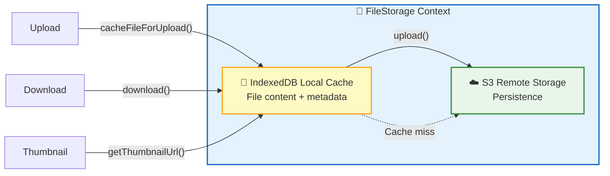
```mermaid
flowchart LR
    subgraph FS["📁 FileStorage Context"]
        direction TB
        CACHE["💾 IndexedDB Local Cache<br/>File content + metadata"]
        S3["☁️ S3 Remote Storage<br/>Persistence"]
    end

    UPLOAD["Upload"] -->|"cacheFileForUpload()"| CACHE
    CACHE -->|"upload()"| S3

    DOWNLOAD["Download"] -->|"download()"| CACHE
    CACHE -.->|"Cache miss"| S3

    THUMB["Thumbnail"] -->|"getThumbnailUrl()"| CACHE

    style FS fill:#e3f2fd,stroke:#1565c0,stroke-width:2px
    style CACHE fill:#fff9c4,stroke:#f9a825,stroke-width:2px
    style S3 fill:#e8f5e9,stroke:#388e3c,stroke-width:2px
```

**FileStorage Core API**:

| Method | Description |
| --- | --- |
| `cacheFileForUpload(file)` | Cache file to local IndexedDB, calculate MD5, return `FileInfo` (including `md5`, `ext`, `size`) |
| `upload(options)` | Upload file to S3, supports `onProgress` callback, returns `FileInfo` (including `syncStatus`) |
| `download(md5, ext, options?)` | Download file, prefers local cache; falls back to S3 on cache miss |
| `getThumbnailUrl(identifier)` | Get image thumbnail URL (returns blob URL, must call `releaseThumbnailUrl()` to release) |
| `getPresignedUrl(identifier, expires)` | Get S3 presigned URL (for fallback scenarios) |
| `list(filter?)` | List files with pagination and filtering support |
| `delete(identifier)` | Delete file (both local cache and S3) |
| `getCacheStats()` | Get cache statistics (file count, space usage) |

**Offline-First Features**:

- File uploads are first written to local cache (`syncStatus: 'pending'`), thumbnails are immediately visible
- When network recovers, files are automatically synced to S3 in the background (`syncStatus: 'synced'`)
- Downloads prefer local cache; only requests S3 on cache miss
- Supports interruption recovery: `resumeInterruptedUploads()` resumes incomplete upload tasks

## Window System

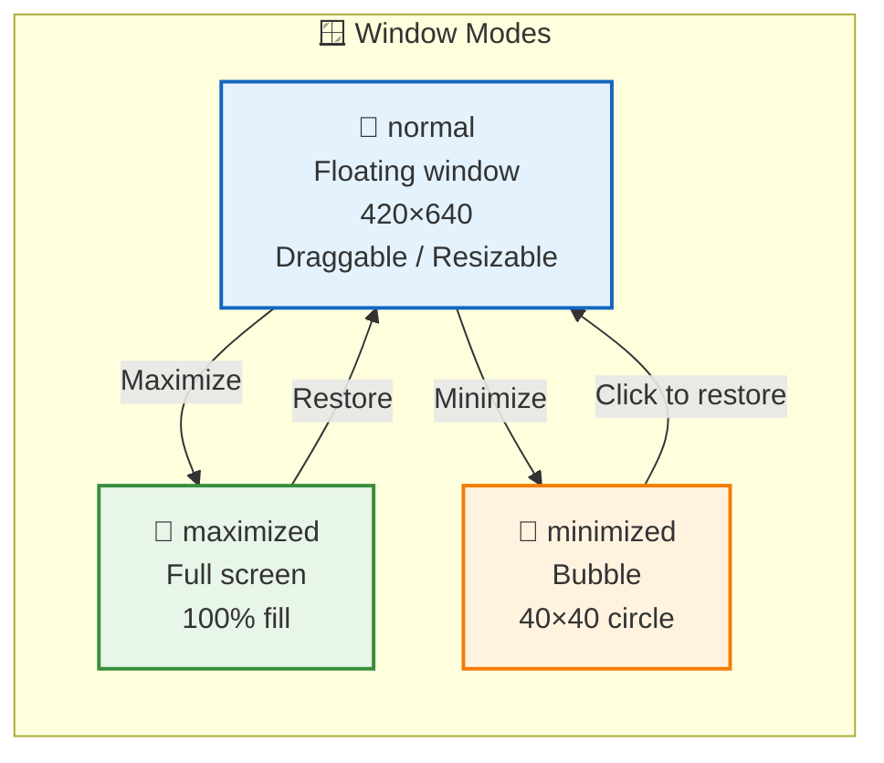
```mermaid
flowchart LR
    subgraph MODES["🪟 Window Modes"]
        direction TB
        N["📐 normal<br/>Floating window<br/>420×640<br/>Draggable / Resizable"]
        M["🔲 maximized<br/>Full screen<br/>100% fill"]
        B["🫧 minimized<br/>Bubble<br/>40×40 circle"]
    end

    N -->|"Maximize"| M
    M -->|"Restore"| N
    N -->|"Minimize"| B
    B -->|"Click to restore"| N

    style N fill:#e3f2fd,stroke:#1565c0,stroke-width:2px
    style M fill:#e8f5e9,stroke:#388e3c,stroke-width:2px
    style B fill:#fff3e0,stroke:#f57c00,stroke-width:2px
```

| Interaction | Implementation |
| --- | --- |
| **Drag** | Title bar serves as the drag handle |
| **Resize** | 8 resize handles — 4 corners + 4 edges |
| **Keyboard** | Arrow keys to move, Shift to accelerate |
| **Viewport constraint** | Always stays within the visible area |

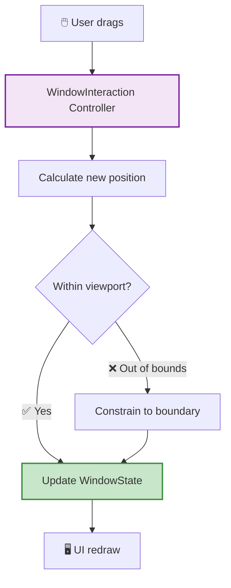
```mermaid
flowchart TD
    A["🖱️ User drags"] --> B["WindowInteraction Controller"]
    B --> C["Calculate new position"]
    C --> D{"Within viewport?"}
    D -->|"✅ Yes"| E["Update WindowState"]
    D -->|"❌ Out of bounds"| F["Constrain to boundary"]
    F --> E
    E --> G["🖥️ UI redraw"]

    style B fill:#f3e5f5,stroke:#7b1fa2,stroke-width:2px
    style E fill:#c8e6c9,stroke:#388e3c,stroke-width:2px
```

## Style System

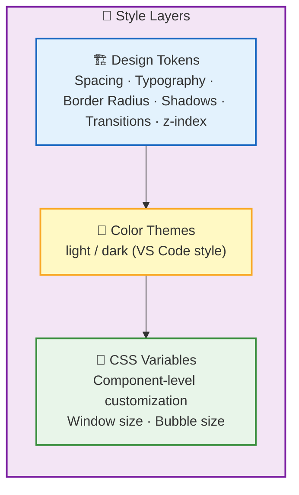
```mermaid
flowchart TD
    subgraph LAYERS["🎨 Style Layers"]
        direction TB
        L1["🏗️ Design Tokens<br/>Spacing · Typography · Border Radius · Shadows · Transitions · z-index"]
        L2["🌈 Color Themes<br/>light / dark (VS Code style)"]
        L3["📏 CSS Variables<br/>Component-level customization<br/>Window size · Bubble size"]
    end

    L1 --> L2 --> L3

    style LAYERS fill:#f3e5f5,stroke:#7b1fa2,stroke-width:2px
    style L1 fill:#e3f2fd,stroke:#1565c0,stroke-width:2px
    style L2 fill:#fff9c4,stroke:#f9a825,stroke-width:2px
    style L3 fill:#e8f5e9,stroke:#388e3c,stroke-width:2px
```

| Layer | Content | Customization Method |
| --- | --- | --- |
| **Design Tokens** | Spacing, typography, border radius, shadows, transitions, z-index | Override CSS variables |
| **Color Themes** | light / dark color schemes | Switch via `theme` attribute |
| **CSS Variables** | Window size, bubble size | `--rtc-*` prefixed variables |

## Key Interactions

### Input Area

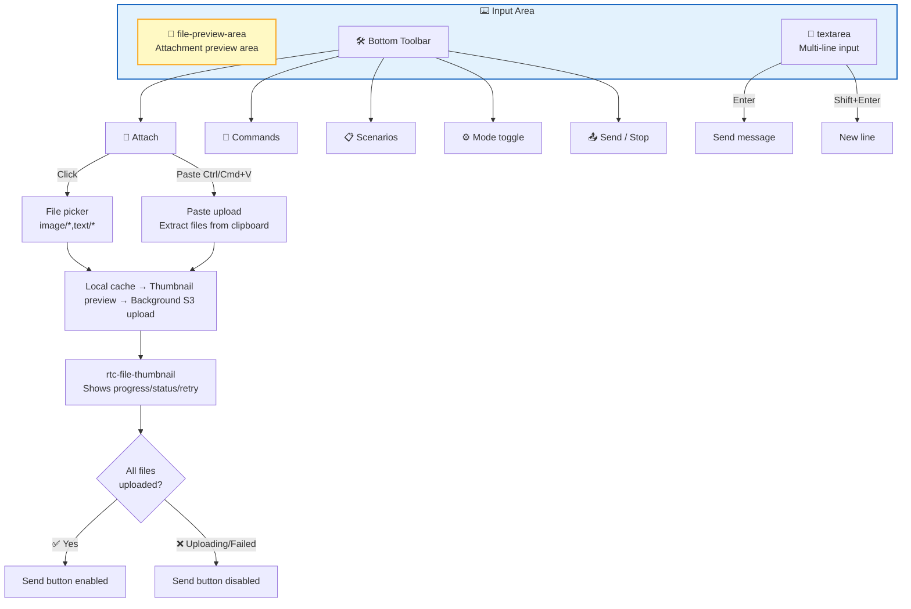
```mermaid
flowchart TD
    subgraph INPUT["⌨️ Input Area"]
        direction TB
        FPA["📎 file-preview-area<br/>Attachment preview area"]
        TA["📝 textarea<br/>Multi-line input"]
        TB_BAR["🛠️ Bottom Toolbar"]
    end

    TB_BAR --> ATT["📎 Attach"]
    TB_BAR --> TOOL_BTN["🔧 Commands"]
    TB_BAR --> SCENARIO_BTN["📋 Scenarios"]
    TB_BAR --> MODE_BTN["⚙️ Mode toggle"]
    TB_BAR --> SEND["📤 Send / Stop"]

    ATT -->|"Click"| FILE_PICK["File picker<br/>image/*,text/*"]
    ATT -->|"Paste Ctrl/Cmd+V"| PASTE["Paste upload<br/>Extract files from clipboard"]

    FILE_PICK --> UPLOAD["Local cache → Thumbnail preview → Background S3 upload"]
    PASTE --> UPLOAD

    UPLOAD --> THUMB_DISP["rtc-file-thumbnail<br/>Shows progress/status/retry"]
    THUMB_DISP --> SEND_COND{"All files<br/>uploaded?"}
    SEND_COND -->|"✅ Yes"| ENABLE_SEND["Send button enabled"]
    SEND_COND -->|"❌ Uploading/Failed"| DISABLE_SEND["Send button disabled"]

    TA -->|"Enter"| SEND_MSG["Send message"]
    TA -->|"Shift+Enter"| NEWLINE["New line"]

    style INPUT fill:#e3f2fd,stroke:#1565c0,stroke-width:2px
    style FPA fill:#fff9c4,stroke:#f9a825,stroke-width:2px
```

**File Upload Flow**:

1. **Trigger**: Click the attach button to open the file picker, or use `Ctrl+V` / `Cmd+V` to paste files from the clipboard
2. **Local Cache**: Files are first written to local IndexedDB cache (`FileStorage.cacheFileForUpload()`), generating a real `fileid` (in `md5.ext` format)
3. **Instant Preview**: Thumbnails display immediately (`rtc-file-thumbnail` loads from FileStorage cache), no need to wait for S3 upload
4. **Background Upload**: Background call to `FileStorage.upload()` uploads to S3, showing real-time upload progress (0-100%)
5. **State Management**: Each file has three states — `loading` (uploading), `loaded` (success), `error` (failed)
6. **Retry Mechanism**: Failed uploads show a retry button; clicking it re-uploads the file
7. **Send Condition**: The send button is enabled only after all files are uploaded; when sent, the file list is submitted with the message

### Message List

| Feature | Behavior |
| --- | --- |
| **Auto-scroll** | Automatically scrolls to the bottom when new messages arrive |
| **Smart pause** | Pauses auto-scroll when the user manually scrolls up |
| **New message indicator** | Shows a "New messages" button when the user is not at the bottom |
| **Rendering** | Markdown rendering + code highlighting |

### Tool Confirmation Dialog

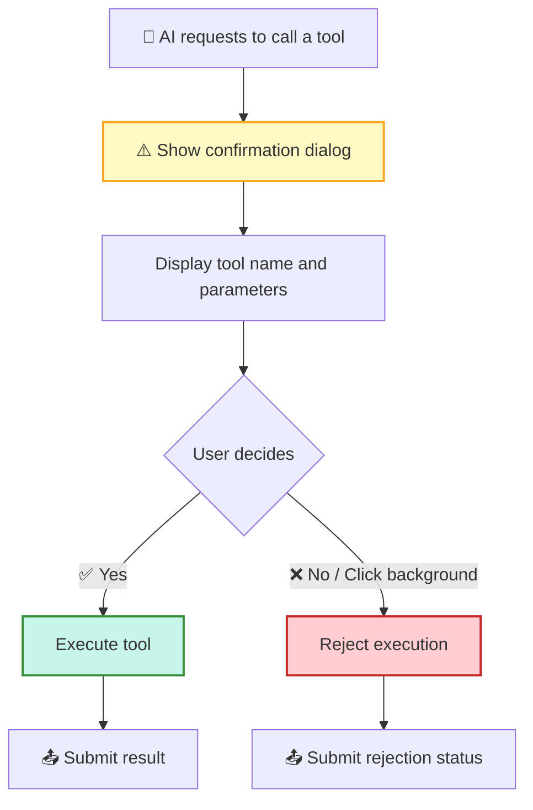
```mermaid
flowchart TD
    A["🔧 AI requests to call a tool"] --> B["⚠️ Show confirmation dialog"]
    B --> C["Display tool name and parameters"]
    C --> D{"User decides"}
    D -->|"✅ Yes"| E["Execute tool"]
    D -->|"❌ No / Click background"| F["Reject execution"]
    E --> G["📤 Submit result"]
    F --> H["📤 Submit rejection status"]

    style B fill:#fff9c4,stroke:#f9a825,stroke-width:2px
    style E fill:#c8f5e9,stroke:#388e3c,stroke-width:2px
    style F fill:#ffcdd2,stroke:#c62828,stroke-width:2px
```

### Command System

When the user types text starting with `/`, command input mode is triggered:

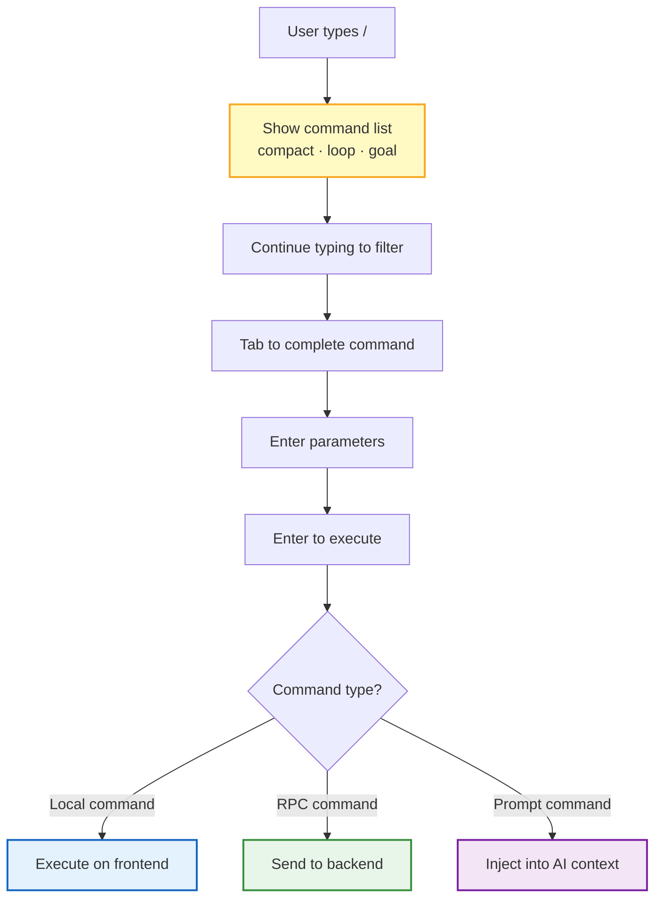
```mermaid
flowchart TD
    A["User types /"] --> B["Show command list<br/>compact · loop · goal"]
    B --> C["Continue typing to filter"]
    C --> D["Tab to complete command"]
    D --> E["Enter parameters"]
    E --> F["Enter to execute"]
    F --> G{"Command type?"}
    G -->|Local command| H["Execute on frontend"]
    G -->|RPC command| I["Send to backend"]
    G -->|Prompt command| J["Inject into AI context"]

    style B fill:#fff9c4,stroke:#f9a825,stroke-width:2px
    style H fill:#e3f2fd,stroke:#1565c0,stroke-width:2px
    style I fill:#e8f5e9,stroke:#388e3c,stroke-width:2px
    style J fill:#f3e5f5,stroke:#7b1fa2,stroke-width:2px
```

| Command | Type | Function |
| --- | --- | --- |
| `/compact` | RPC | Manually trigger context compression |
| `/loop` | Local + RPC | Loop execution (scheduled / dynamic) |
| `/goal` | Prompt | Goal-driven; AI sets completion criteria, Judge model checks |

See [Commands](/docs/en/features/commands).

## Testing & Quality

The frontend project adopts a multi-layer testing strategy covering unit tests, integration tests, and end-to-end tests to ensure correct component behavior and stable cross-module collaboration.

### Test Infrastructure

| Tool | Purpose | Config Location |
| --- | --- | --- |
| **Vitest** | Unit tests & integration tests | `packages/*/vitest.config.ts` |
| **Playwright** | End-to-end tests (E2E) | `packages/component/playwright.config.ts` |
| **jsdom** | Browser API simulation (Vitest environment) | `test-setup.ts` polyfills IndexedDB, matchMedia, ResizeObserver, etc. |
| **fake-indexeddb** | Pure-JS IndexedDB implementation for Dexie in tests | Auto-imported in `test-setup.ts` |

### Test Scale

| Package | Unit Test Files | Description |
| --- | ---: | --- |
| `@rtc-agent/component` | 62 | Covers all Controllers, components, factory functions, event system, authentication flows |
| `@rtc-agent/persistence` | 12 | Covers IndexedDB operations, entity repository, transactions, offset manager, script engine |
| `@rtc-agent/client` | 1 | Covers WebSocket client, offset sync, gap-fill logic |
| `@rtc-agent/worker` | 1 | Covers SharedWorker core message routing |
| **E2E (Playwright)** | 6 | Covers debug API, business flows, advanced interactions, doc reconciliation, script execution |

Currently **835+ unit test cases**, all passing.

### Running Tests

```bash
# Run all unit tests (from web-components root)
pnpm test

# Run unit tests for the component package only
pnpm --filter @rtc-agent/component test

# Run E2E tests (requires Vite dev server)
pnpm --filter @rtc-agent/component test:e2e

# Run a specific test file
npx vitest run packages/component/src/controllers/auth.controller.test.ts

# Watch mode (recommended during development)
npx vitest
```

### Test Layers

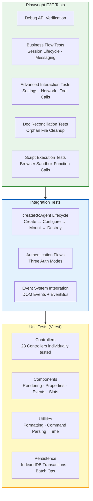
```mermaid
flowchart TD
    subgraph E2E["Playwright E2E Tests"]
        direction LR
        E1["Debug API Verification"]
        E2["Business Flow Tests<br/>Session Lifecycle · Messaging"]
        E3["Advanced Interaction Tests<br/>Settings · Network · Tool Calls"]
        E4["Doc Reconciliation Tests<br/>Orphan File Cleanup"]
        E5["Script Execution Tests<br/>Browser Sandbox Function Calls"]
    end

    subgraph INTEGRATION["Integration Tests"]
        direction LR
        I1["createRtcAgent Lifecycle<br/>Create → Configure → Mount → Destroy"]
        I2["Authentication Flows<br/>Three Auth Modes"]
        I3["Event System Integration<br/>DOM Events + EventBus"]
    end

    subgraph UNIT["Unit Tests (Vitest)"]
        direction LR
        U1["Controllers<br/>23 Controllers individually tested"]
        U2["Components<br/>Rendering · Properties · Events · Slots"]
        U3["Utilities<br/>Formatting · Command Parsing · Time"]
        U4["Persistence<br/>IndexedDB Transactions · Batch Ops"]
    end

    E2E --> INTEGRATION
    INTEGRATION --> UNIT

    style E2E fill:#e8f5e9,stroke:#388e3c,stroke-width:2px
    style INTEGRATION fill:#e3f2fd,stroke:#1565c0,stroke-width:2px
    style UNIT fill:#fff9c4,stroke:#f9a825,stroke-width:2px
```

### Test Utilities

`packages/component/src/test-helpers.ts` provides test infrastructure:

| Utility | Description |
| --- | --- |
| `fixture(template, options?)` | Creates a Lit component test fixture, automatically waits for the update cycle to complete |
| `nextFrame()` | Waits one frame to ensure Lit has finished rendering |
| `cleanupFixtures()` | Cleans up all created test fixtures to prevent cross-test pollution |
| `provideContext()` | Injects `@lit/context` during the `setup` phase, ensuring context is ready before the component's first update |

### E2E Test Debug API

E2E tests rely on the `window.rtcAgentDebug` API exposed by the debug page (`/debug/index.html`). This API is automatically installed in dev mode and provides the following capabilities:

| Method | Description |
| --- | --- |
| `waitForReady(timeout?)` | Wait for the `<rtc-agent>` component to be ready |
| `sendMessage(text)` | Send a message |
| `getSessionController()` | Get the session controller |
| `getActions(controller)` | Get a specific controller's actions |

### CI Pipeline

GitHub Actions CI runs automatically on every push/PR:

```bash
pnpm install → pnpm build → pnpm typecheck → pnpm test
```

Node.js version: 24. Tests run on the `ubuntu-latest` environment.

## Performance & Accessibility

### Performance Considerations

| Scenario | Strategy |
| --- | --- |
| **Large message lists** | Paginated loading (cursor pagination); first load shows the latest 50 |
| **Long conversation scrolling** | Virtual scroll optimization (future release) |
| **Markdown rendering** | On-demand rendering; code highlighting loaded lazily |
| **IndexedDB reads/writes** | Unified by Persistence Controller; batch operations reduce IO |

### Accessibility

| Feature | Implementation |
| --- | --- |
| **Keyboard navigation** | Tab to switch focus, Enter to activate, Esc to close dialogs |
| **ARIA labels** | All interactive elements have `aria-label` |
| **Screen reader** | Message list uses `role="log"`; new messages announced automatically |
| **High contrast** | Supports system high-contrast mode |

## Next Steps

- [Backend Architecture](/docs/en/architecture/backend) — Learn about the Go server's layered design
- [Architecture Overview](/docs/en/architecture) — Return to the architecture panorama
- [Remote Tool Calling](/docs/en/concepts/rtc) — Learn about the core protocol for frontend tool calling
- [Virtual File System](/docs/en/concepts/virtual-fs) — Learn about the frontend IndexedDB file system
- [Commands](/docs/en/features/commands) — Learn about the complete command system
