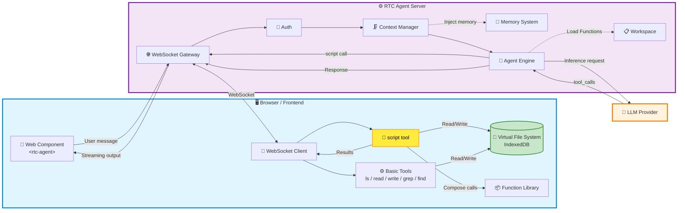
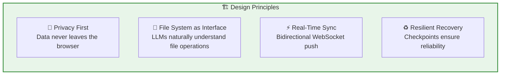
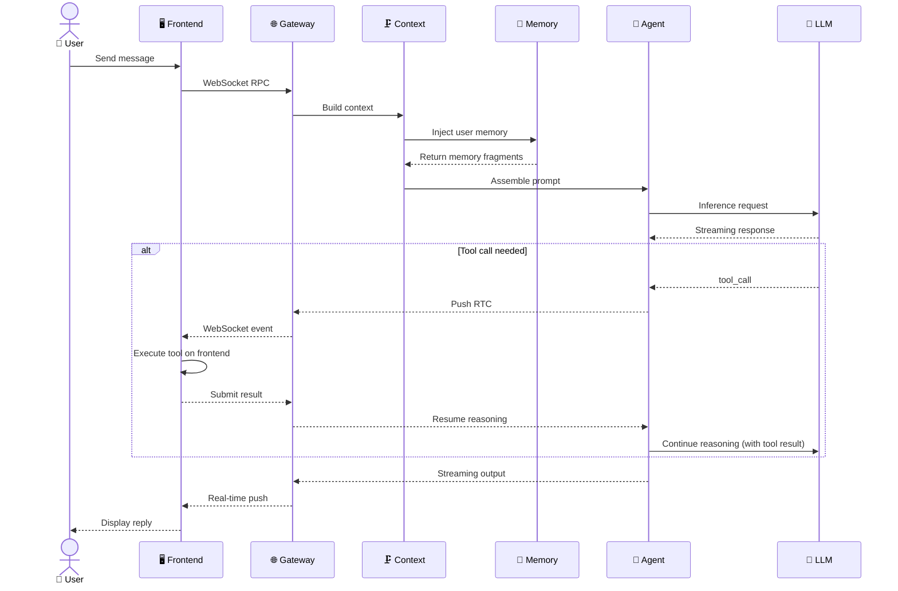
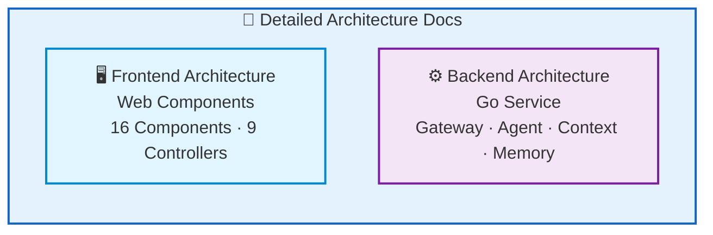

RTC Agent's architecture consists of three parts: **Browser / Frontend** (virtual file system + Web Component), **RTC Agent Server** (Agent engine + context management + real-time communication), and **LLM Provider** (AI reasoning).

## Full Architecture

## Core Design Principles

| Principle | Implementation | User Value |
|------|----------|----------|
| 🔐 **Privacy First** | File operations execute on the frontend; data stored in IndexedDB | Sensitive data is never uploaded to the server |
| 🧩 **File System as Interface** | AI operates business logic via `ls`/`read`/`write`/`grep` | Developers only need to maintain Function documentation |
| ⚡ **Real-Time Sync** | Centrifuge dual-channel push | Users can see every step the AI takes |
| ♻️ **Resilient Recovery** | Redis Checkpoint + 100% delivery guarantee | Network disconnections and restarts are seamless |

## Request Processing Flow

## Tech Stack

| Layer | Technology | Purpose |
|:--:|:----:|------|
| **Backend** | Go 1.27 | Main service language |
| **Database** | PostgreSQL + GORM | Persistent storage |
| **Cache** | Redis | Checkpoint, streaming buffer, Pub/Sub |
| **Real-Time Communication** | Centrifuge WebSocket | Bidirectional push |
| **AI Framework** | Anthropic SDK + Eino | Agent engine |
| **Frontend** | Lit Web Components | Componentized UI |
| **Observability** | OpenTelemetry + Jaeger + Prometheus | Tracing + Metrics |

## Architecture Sub-Pages

## Next Steps

- [Frontend Architecture](/docs/en/architecture/frontend/) — Web Components system, state management, window system
- [Backend Architecture](/docs/en/architecture/backend/) — Go service layers, Agent engine, context management
- [Remote Tool Calling](/docs/concepts/rtc/) — Learn how the core protocol works
- [Protocol Overview](/docs/en/protocol/) — Full definition of the communication protocol
