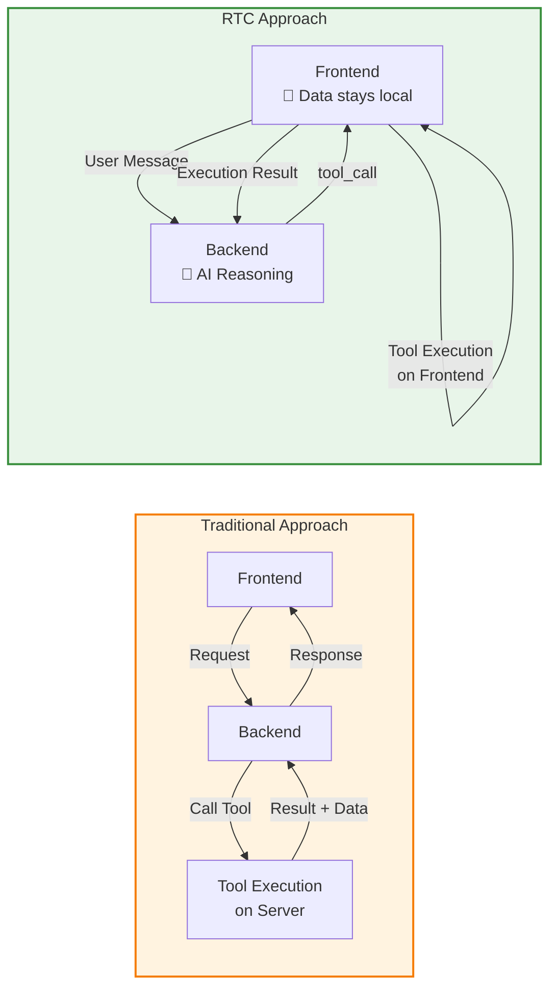
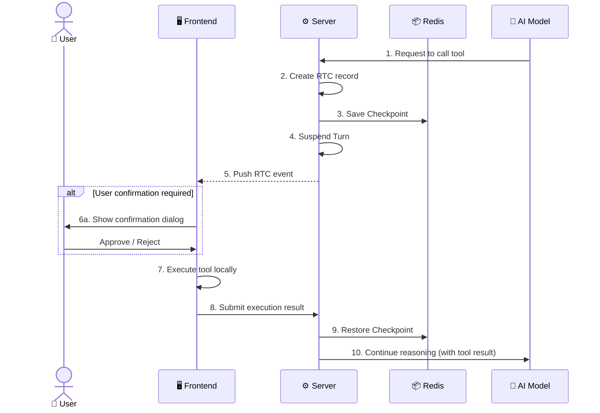
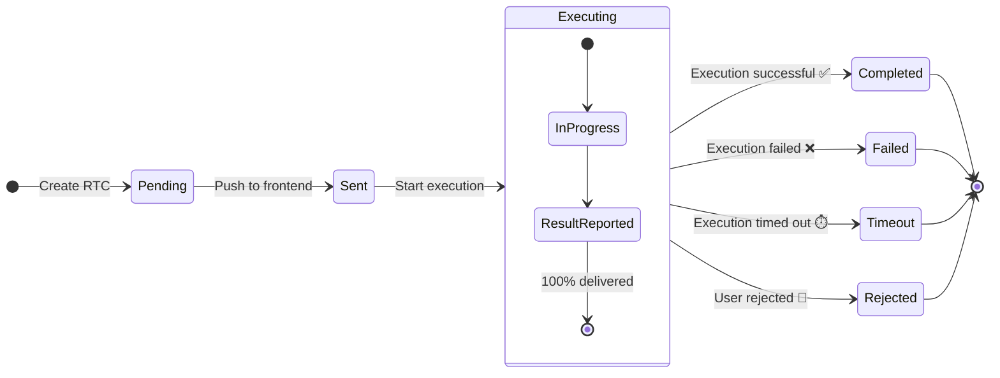
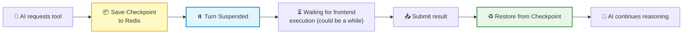
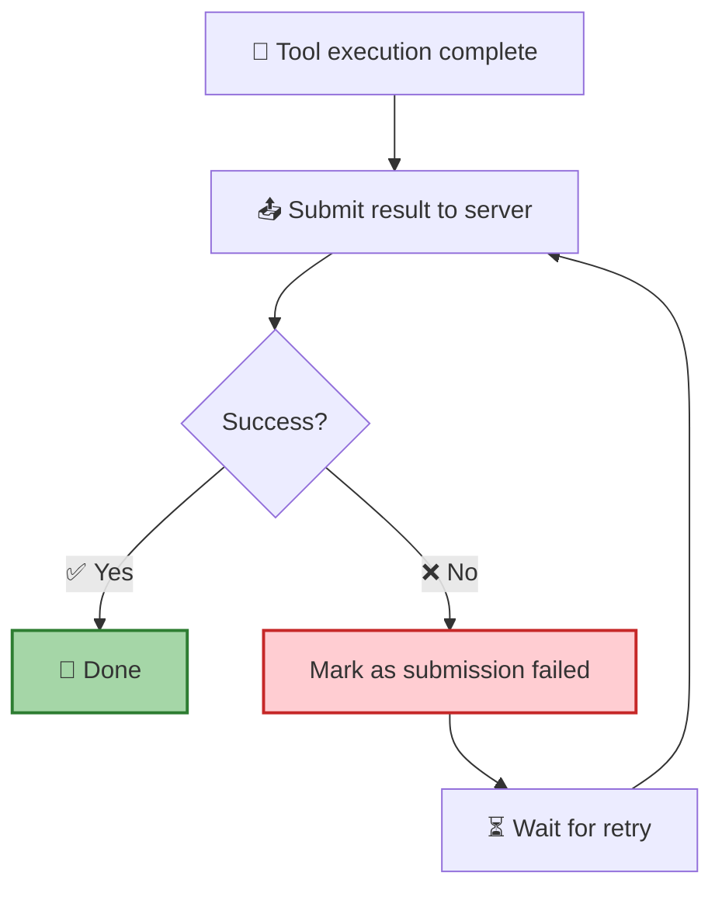
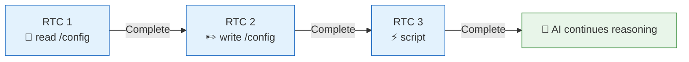

**Remote Tool Calling (RTC)** is the core protocol of RTC Agent. It reverses the traditional invocation direction: instead of the frontend calling backend APIs, **AI calls frontend tools** — file read/write, script execution, and business API calls all happen within the user's browser.

## Why RTC

| | Traditional | RTC |
|---|---------|-----|
| **Tool Execution** | Server | Frontend |
| **Data Flow** | To the cloud 🔒 | Stays on user's device 🔐 |
| **Privacy** | Data passes through server | End-to-end, data never leaves the browser |
| **Observability** | Black box | Fully visible to the user |

## Full Lifecycle

A single RTC call goes through the following steps:

> 💡 **Key Design**: After pushing the RTC, the server **suspends** the Turn and saves a Checkpoint to Redis. Even if the server restarts, it can recover from the Checkpoint — the user is completely unaware.

## Built-in Tools

The RTC protocol defines **6 built-in tools** covering file system operations and script execution:

| Tool | Function | Key Parameters |
|:----:|------|----------|
| 🔍 `ls` | List directory contents | `path` (default `/`) |
| 📖 `read` | Read file contents | `path`, `offset` / `limit` (pagination) |
| ✏️ `write` | Write to file | `path`, `content`, `mode` (overwrite / append) |
| 🔎 `grep` | Search by content | `pattern` (regex), `path` |
| 📁 `find` | Search by name | `pattern` (glob), `path` |
| ⚡ `script` | Execute JavaScript | `action` (save / run / eval), `code` |

These 6 tools give the AI a **complete file operation interface** — operating on the frontend virtual file system just like working with a local terminal.

## State Machine

Each RTC call has a well-defined lifecycle state:

| State | Prompt Seen by AI | Description |
|:----:|:------------:|------|
| `Pending` | `[Tool Pending]` | Waiting for frontend to receive |
| `Sent` | `[Tool Pending]` | Delivered to frontend |
| `Executing` | `[Tool Pending]` | Currently executing |
| `Completed` | Tool output | Execution successful, result returned |
| `Failed` | `[Tool Error]` | Execution failed |
| `Timeout` | `[Tool Timeout]` | Execution timed out |
| `Rejected` | `[Tool Rejected]` | User rejected execution |

## Permission Matrix

Different **work modes** determine whether tool execution requires user confirmation. See [Work Modes](/docs/en/concepts/work-modes/#permission-matrix) for the full permission matrix.

> 📌 **Core Principle**: Read-only operations are always safely allowed; `write` only requires confirmation in the highest-alertness mode; `script` can execute arbitrary code, so it requires user confirmation in all modes except bypass.

## Checkpoint Mechanism

The core reliability guarantee of RTC is the **Checkpoint**:

| Feature | Description |
|------|------|
| **Storage Location** | Redis, TTL 24 hours |
| **Crash Recovery** | Can recover from Checkpoint after server restart |
| **User Experience** | Perceived as "AI waiting for tool result before continuing" |

## Reliability Guarantee

RTC result reporting follows the **100% delivery** principle:

**Why must it be 100% delivered?** Because the AI is waiting for the tool result to continue reasoning. If the result is lost, the AI will wait indefinitely.

| Mechanism | Description |
|------|------|
| **Infinite Retry** | Failed submissions are automatically retried, with no give-up mechanism |
| **Idempotency Guarantee** | Repeated submissions with the same `client_id` return success |
| **Exponential Backoff** | Retry intervals: 1s → 2s → 4s → ... → capped at 30s |

## Sequential Execution

RTC calls within the same session are **strictly serialized** to avoid file conflicts caused by concurrency:

> The next RTC is processed only after the current one completes. This is transparent to the user — the AI naturally completes each operation in sequence.

## Next Steps

- [Virtual File System](/docs/en/concepts/virtual-fs/) — Learn about the file system that RTC tools operate on
- [Work Modes](/docs/en/concepts/work-modes/) — Learn about the mode switching behind the permission matrix
- [Session Management](/docs/en/features/session/) — Learn about RTC context within sessions
