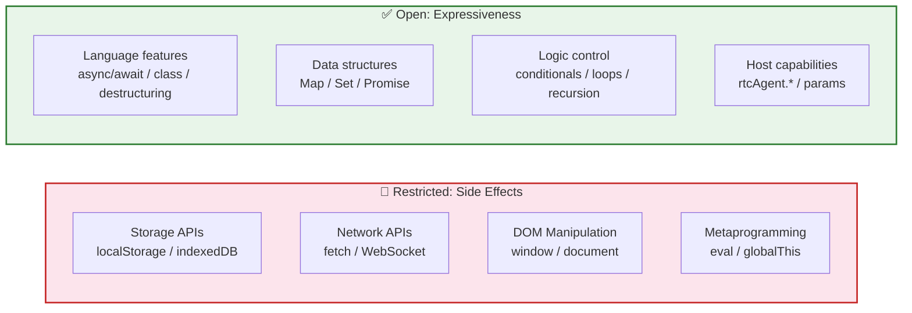
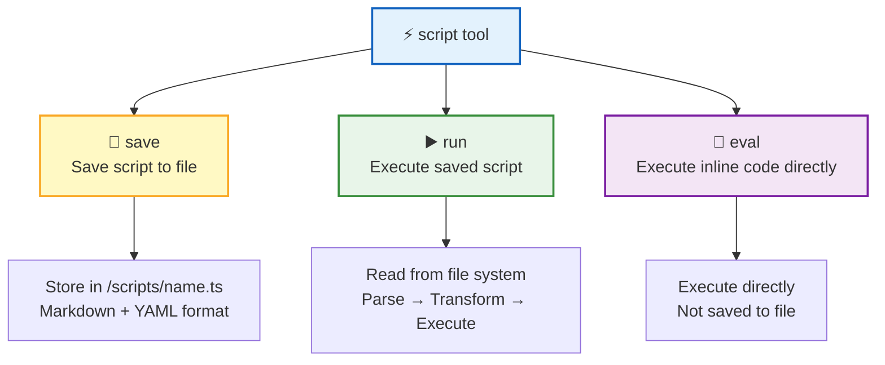
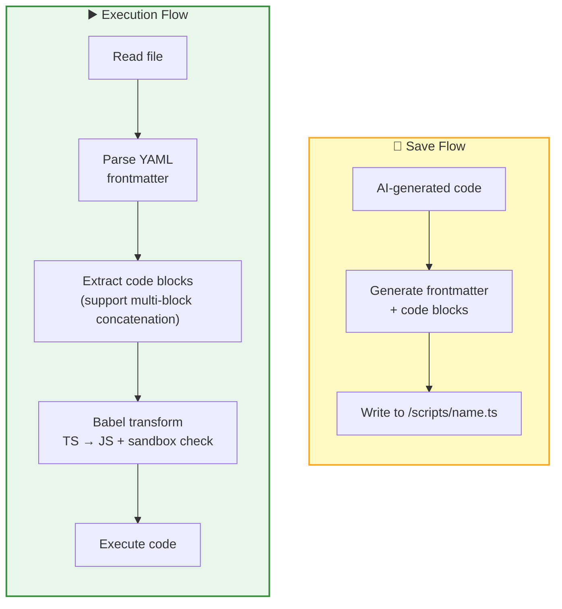
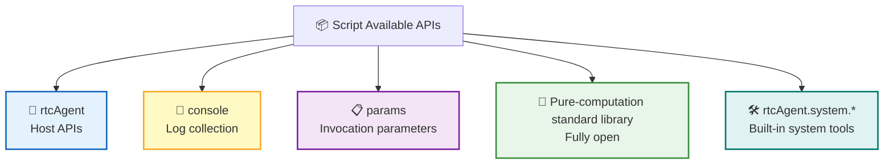
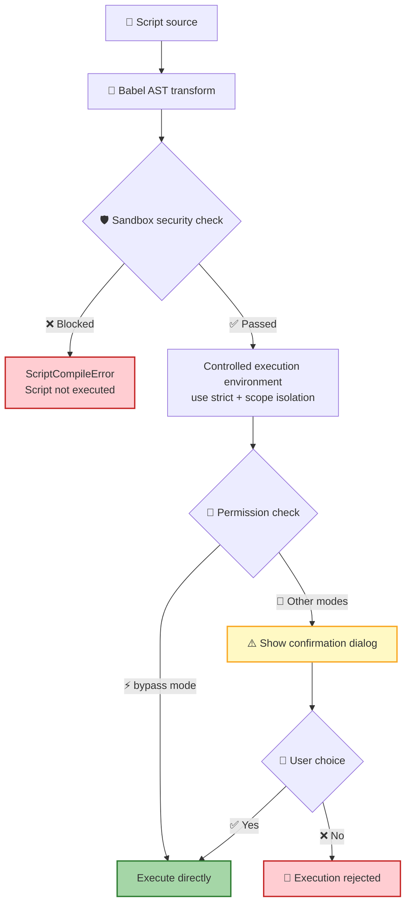
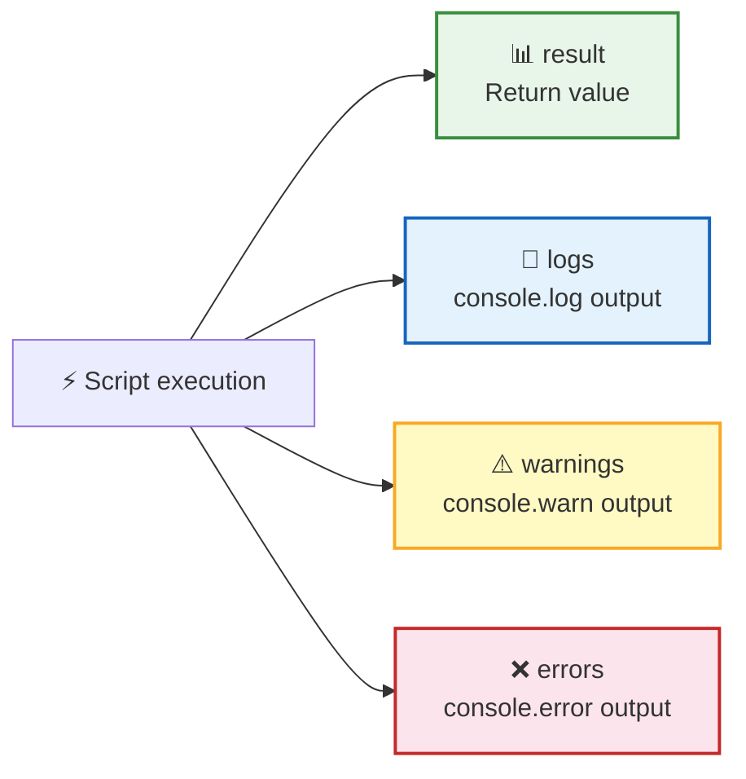

The **Script Engine** enables AI to execute JavaScript / TypeScript code in the browser, extending AI capabilities from "file read/write" to "arbitrary computation". Scripts interact with the UI, read/write the virtual file system, and call host-registered functions through `rtcAgent.*` — all within a carefully designed sandbox.

## Core Principles

> 💡 **Design Philosophy**: LLM creativity lives in the logic layer — data processing, control flow, and `rtcAgent` call composition. The sandbox restricts "side effects" (storage/network/DOM), not "expressiveness" (language/data structures/logic). This layer is fully open.

| | Restricted | Open |
|---|------|------|
| **Goal** | Prevent LLM hallucinations from misusing platform APIs | Unleash LLM's logical creativity |
| **Means** | AST static blocking + permission confirmation | Full language features + pure-computation standard library |
| **Threat Model** | LLM hallucinations causing misuse (e.g., accidentally calling platform APIs) | Not a malicious code injection scenario |

## Three Execution Modes

AI interacts with the engine via the `script` tool, which has three execution modes:

| Action | Function | Required Parameters | Use Case |
|:------:|------|----------|----------|
| 📁 `save` | Save script to file system | `name`, `code` | Create reusable scripts |
| ▶️ `run` | Execute a saved script | `name` | Run previously written scripts |
| 💬 `eval` | Execute inline code directly | `code` | One-off computations, quick validation |

## Script Storage Format

Scripts are stored in **Markdown + YAML frontmatter** format, balancing readability and metadata management:

The saved file format looks like this:

| Section | Content | Purpose |
|------|------|------|
| YAML frontmatter | `name`, `description`, `createdAt` | Metadata storage for management |
| Code blocks | TypeScript / JavaScript source code | The actual code to execute |

> 📌 During execution, pure code is extracted from code blocks; frontmatter is only used for management. If there are no code blocks, the entire file content is executed as code.

## Sandbox APIs

Scripts have access to the following APIs during execution:

### rtcAgent API (Host-injected)

Through `rtcAgent.*`, all registered Function Groups are accessible, enabling full UI operation capabilities:

| Method | Function | Description |
|------|------|------|
| `rtcAgent.callFunction()` | Call a registered function | Triggers any Function Group registered by the host |
| `rtcAgent.readFile()` | Read file | Operates on the virtual file system |
| `rtcAgent.writeFile()` | Write file | Operates on the virtual file system |
| `rtcAgent.listDir()` | List directory | Operates on the virtual file system |

> 💡 Through chained calls like `rtcAgent.task.create()`, scripts can operate on any registered functional module.

### Pure-Computation Standard Library

The sandbox explicitly injects the following standard libraries, making the API surface auditable:

| Category | Available Global Objects/Functions |
|------|-------------------|
| Language constructors | Promise, Date, Math, JSON, Array, Object, String, Number, Boolean, Error |
| Data structures | Map, Set, WeakMap, WeakSet, RegExp, Symbol, BigInt |
| Error subclasses | TypeError, RangeError, ReferenceError, SyntaxError, URIError, AggregateError |
| Parsing & encoding | parseInt, parseFloat, isNaN, isFinite, encodeURIComponent, decodeURIComponent, encodeURI, decodeURI, atob, btoa |
| Utility functions | structuredClone |
| Special values | NaN, Infinity, undefined |
| URL parsing | URL, URLSearchParams |
| console | log, warn, error (hijacked version — output is simultaneously collected for the AI) |

### Built-in System Tool Group

The sandbox blocks "gray-area APIs" like `setTimeout` and `crypto.randomUUID`. To let scripts still use these common features, the system registers an `rtcAgent.system.*` tool group by default:

| Function | Feature | Wrapped Platform API |
|------|------|---------------|
| `rtcAgent.system.delay(ms)` | Pause execution for specified milliseconds | setTimeout |
| `rtcAgent.system.uuid(count?)` | Generate UUID v4 (supports batch) | crypto.randomUUID |
| `rtcAgent.system.now()` | Get current timestamp (milliseconds) | Date.now |
| `rtcAgent.system.random(opts?)` | Generate random numbers (supports range/integer) | Math.random |
| `rtcAgent.system.time(format?)` | Get formatted time (iso/locale/ts) | Date |

> 📌 These tools follow the standard FunctionDef specification. AI discovers them through virtual documentation, using the same approach as user-defined Function Groups.

## Security Mechanisms

Script security uses a **two-layer defense**: AST compile-time blocking + runtime permission confirmation.

### Layer 1: AST-Stage Blocking

The sandbox **statically blocks** the following categories of APIs during Babel transformation:

| Category | Blocked Targets | Alternative |
|------|---------|---------|
| 🗄️ Storage APIs | localStorage, sessionStorage, indexedDB, caches, cookieStore | `rtcAgent.readFile` / `writeFile` |
| 🌐 Network APIs | fetch, XMLHttpRequest, WebSocket, EventSource, BroadcastChannel | `rtcAgent.callFunction` |
| 🖥️ DOM / Browser | window, self, document, navigator, location, history, alert, confirm, prompt | `rtcAgent` (UI goes through Function registration) |
| 🔄 Metaprogramming / Escape | eval, Function, globalThis, global | No alternative needed |
| 👷 Workers | Worker, SharedWorker, ServiceWorker, importScripts | No alternative needed |
| ⏱️ Timers | setTimeout, setInterval | `rtcAgent.system.delay` |
| 🧠 Shared memory | SharedArrayBuffer, Atomics | No alternative needed |
| 📦 CJS globals | require, module, exports, __dirname, __filename | No alternative needed |
| 🔗 Prototype chain escape | `.constructor`, `.__proto__` (including string index form) | No alternative needed |
| 📥 Dynamic import | `import(...)` | No alternative needed |
| 🔁 Infinite loops | `while`, `do...while`, `for(;;)` | for...of / bounded for / array iteration methods |

**Smart Detection**: If an identifier has a local binding (e.g., the user declared a same-named variable `const fetch = ...`), it won't be incorrectly blocked. TypeScript type annotations (e.g., `const fn: Function`) also don't trigger blocking.

### Layer 2: Runtime Constraints

| Constraint | Description |
|------|------|
| 🔐 Permissions | Confirmation required in all modes except bypass |
| ⏱️ Timeout | Default 30 seconds, configurable |
| ⏭️ Timeout behavior | Stops waiting, does not terminate the script (script continues running in the background) |
| 🔒 Scope isolation | Compile-time injection of whitelisted bindings; script cannot access unauthorized globals |
| 🔐 this binding | Executes in `"use strict"` mode, preventing this from escaping |

## Output Collection

After script execution, the engine collects the complete execution results and returns them to the AI:

| Field | Source | Purpose |
|------|------|------|
| `result` | Script return value | AI obtains computation results |
| `logs` | console.log | AI reviews debug information |
| `warnings` | console.warn | AI identifies potential issues |
| `errors` | console.error | AI handles error conditions |

> 💡 `console` is a hijacked version — output is displayed normally to the user while also being collected and returned to the AI, allowing the AI to "see" the script's execution process.

## Async Support

Scripts fully support asynchronous programming:

| Feature | Description |
|------|------|
| async / await | Fully supported |
| Execution wrapper | Scripts are wrapped in an async IIFE for execution |
| Promise | The sandbox provides the Promise constructor |
| rtcAgent calls | Host API calls natively support async |

## Next Steps

- [Remote Tool Calling](/docs/en/concepts/rtc/) — Learn where script execution fits in the RTC protocol
- [Virtual File System](/docs/en/concepts/virtual-fs/) — Learn about the file system scripts operate on
- [Work Modes](/docs/en/concepts/work-modes/) — Learn about permission control for script execution
