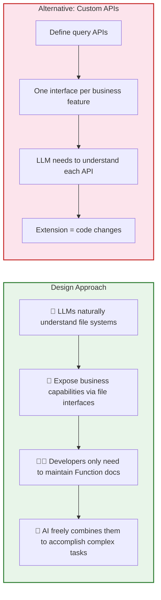
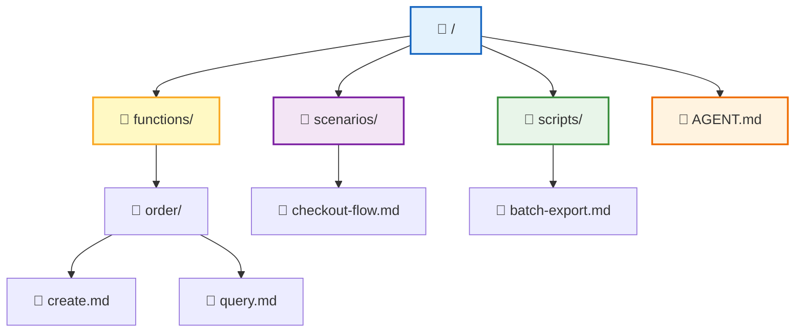
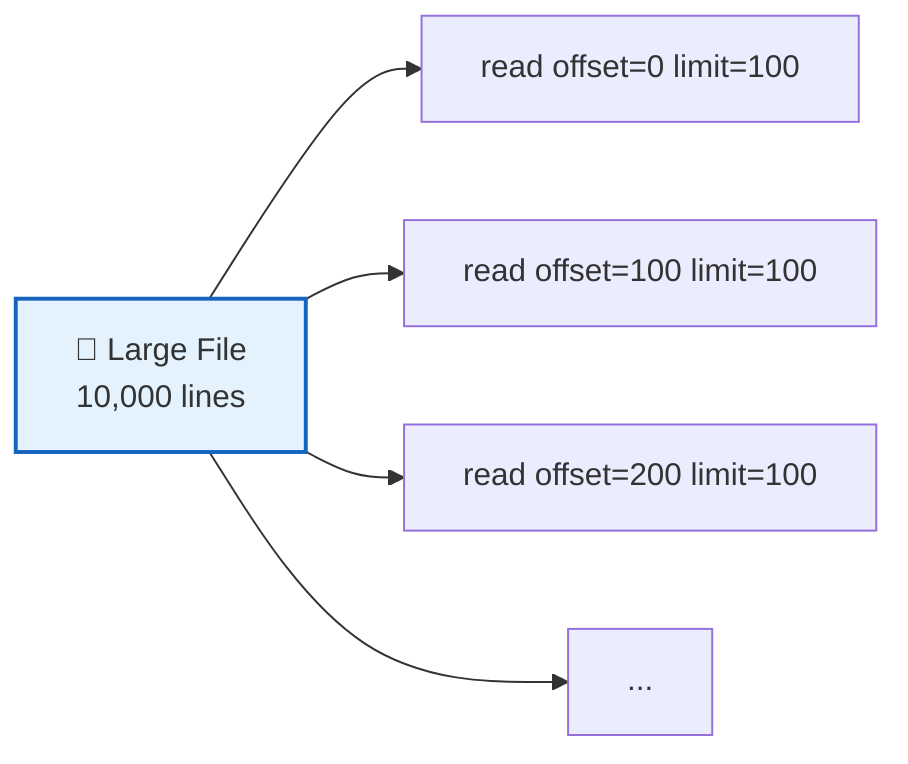
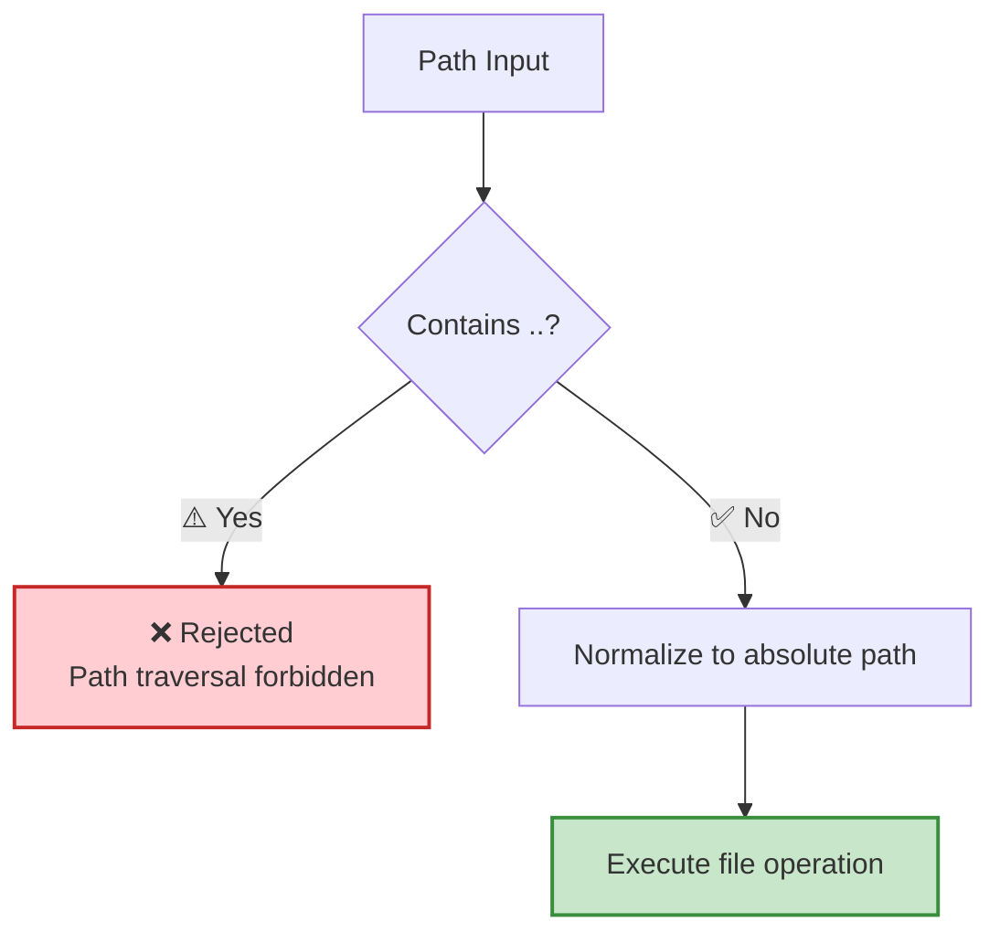
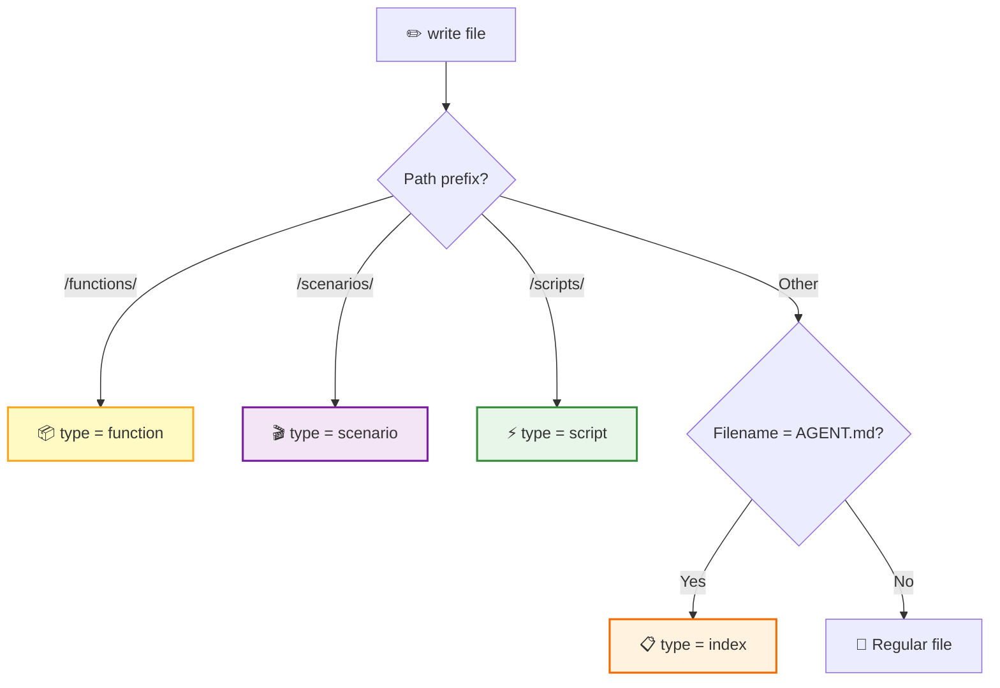
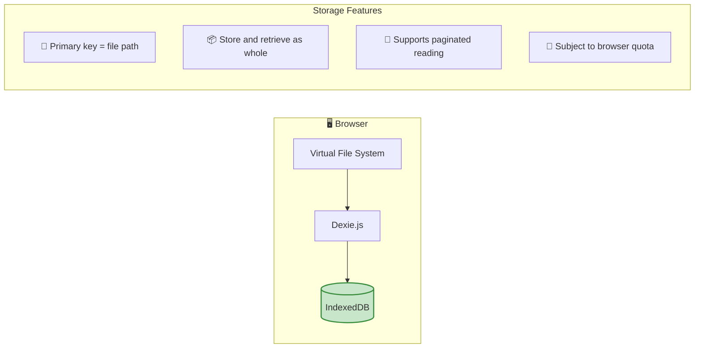
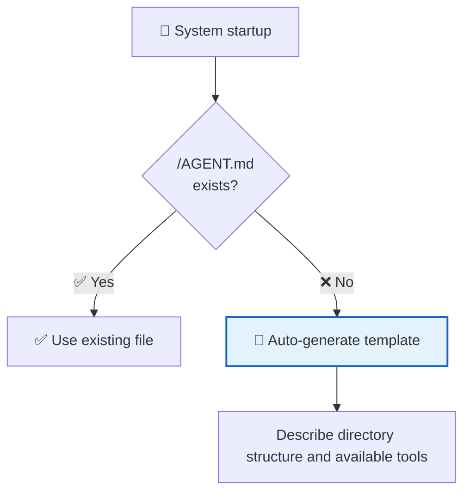

RTC Agent builds a **complete virtual file system** in the browser. AI operates on files using tools like `ls`, `read`, `edit`, `grep`, and `find`, just like working with a local terminal — but all data always stays within the user's browser.

## Why a File System



> 💡 **Core Insight**: LLMs are already very good at operating file systems. Instead of making the AI learn custom APIs, give it a file system — it can immediately `ls`, `read`, `grep`, and `write`.

## Directory Structure



| Directory | Purpose | Content Source |
|------|------|----------|
| `/functions/` | Function documentation | **Auto-generated** after the host app registers Functions |
| `/scenarios/` | Scenario documentation | Markdown workflows provided by the business side |
| `/scripts/` | Executable scripts | Saved by AI via the `script` tool |
| `/AGENT.md` | System entry point | Auto-generated template describing directory structure and tools |

## File Operations

The virtual file system provides **7 operations** covering all file interactions the AI needs:

```mermaid
flowchart LR
    subgraph READ["📖 Read Operations"]
        LS["ls<br/>List directory"]
        READ["read<br/>Read file"]
        FIND["find<br/>Search by name"]
        GREP["grep<br/>Search by content"]
    end

    subgraph WRITE["✏️ Write Operations"]
        WRITE_OP["write<br/>Write file"]
        EDIT["edit<br/>Exact replacement"]
        REMOVE["remove<br/>Delete file"]
    end

    style READ fill:#e3f2fd,stroke:#1565c0,stroke-width:2px
    style WRITE fill:#fff9c4,stroke:#f9a825,stroke-width:2px
```

| Operation | Function | Key Parameters | Status |
|:----:|------|----------|:----:|
| `ls` | List directory contents | `path` (default `/`) | ✅ Available |
| `read` | Read file contents | `path` (required), `offset` / `limit` (pagination) | ✅ Available |
| `write` | Create or write to file | `path`, `content` (required) | ✅ Available |
| `edit` | Exact string replacement | `path`, `old_string`, `new_string` (required), `replace_all` | ✅ Available |
| `find` | Search by file name | `pattern` (glob), `path` | ✅ Available |
| `grep` | Search by file content | `pattern` (regex), see parameter table below | ✅ Available |
| `remove` | Delete file | `path` | 🔒 Internal API |

> ⚠️ `remove` is an internal API of the virtual file system and is not currently exposed to AI as an RTC tool. AI cannot directly delete files.

### read — Paginated Reading

Large files support paginated reading to avoid loading too much content at once:



| Parameter | Type | Required | Description |
|------|------|:----:|------|
| `path` | string | Yes | Absolute path to the file |
| `offset` | integer | No | Starting line number (1-indexed), only provide for large files |
| `limit` | integer | No | Number of lines to read, only provide for large files |

### edit — Exact String Replacement

Perform exact string replacements in a file, similar to Claude Code's Edit tool. You must use the `read` tool on the file before editing it.

| Parameter | Type | Required | Description |
|------|------|:----:|------|
| `path` | string | Yes | Absolute path to the file |
| `old_string` | string | Yes | The original text to replace — must exactly match the file content including indentation and whitespace |
| `new_string` | string | Yes | The replacement text (must differ from `old_string`) |
| `replace_all` | boolean | No | Set to `true` to replace all occurrences (default `false`). Required when `old_string` is not unique |

**Usage Constraints**:

- You must use the `read` tool on the file first, otherwise the edit will fail
- `old_string` must match **uniquely** in the file — provide more surrounding context to make it unique, or use `replace_all`
- Prefer using `edit` to modify existing files rather than using `write` to overwrite the entire file

### grep — Advanced Search

A powerful search tool for the virtual filesystem. Supports regex, file filtering, pagination, and multiple output modes.

| Parameter | Type | Required | Description |
|------|------|:----:|------|
| `pattern` | string | Yes | Regular expression search pattern |
| `path` | string | No | File or directory path to search in (default root `/`) |
| `glob` | string | No | Glob pattern to filter files (e.g. `"*.js"`, `"**/*.tsx"`) |
| `type` | string | No | File type filter (e.g. `"js"`, `"py"`, `"go"`) — more efficient than glob |
| `output_mode` | string | No | Output mode: `"files_with_matches"` (default, file paths only), `"content"` (matching lines with context), `"count"` (match counts) |
| `-i` | boolean | No | Case-insensitive search |
| `-n` | boolean | No | Show line numbers (requires `output_mode: "content"`, default `true`) |
| `-B` | integer | No | Lines to show **before** each match (requires `output_mode: "content"`) |
| `-A` | integer | No | Lines to show **after** each match (requires `output_mode: "content"`) |
| `-C` / `context` | integer | No | Lines to show **before and after** each match |
| `head_limit` | integer | No | Limit output to first N entries (default 250, pass 0 for unlimited) |
| `offset` | integer | No | Skip first N entries before applying `head_limit` (default 0) |
| `multiline` | boolean | No | Enable multiline mode (`.` matches newlines, patterns can span lines) |

> 💡 **Mode Selection Tips**: Use `"files_with_matches"` to find files; use `"content"` with `-n` and `-C` to inspect matching code; use `"count"` to tally occurrences.

## Path Specifications



| Rule | Description |
|------|------|
| Root directory | `/` |
| Separator | `/` (forward slash) |
| Auto-conversion | All paths are automatically converted to absolute paths |
| Path traversal | `..` is rejected directly, without parsing |
| Directories | Logical concept, not stored separately, derived from path prefixes |

## File Type Inference

File types are automatically inferred from the **path prefix**, no explicit specification needed:



## Storage Mechanism



| Feature | Description |
|------|------|
| Storage Engine | IndexedDB (wrapped by Dexie.js) |
| Primary Key | File path |
| Large Files | Stored and retrieved as whole, supports paginated reading |
| Read Behavior | Each read queries the latest data directly, no cache layer |
| Capacity | Subject to browser IndexedDB quota (typically hundreds of MB) |

## Initialization



At system startup, `/AGENT.md` is automatically checked. If it doesn't exist, a template file is auto-generated to describe the directory structure and available tools to the AI — ensuring the AI knows "what's in the file system" as soon as it comes online.

## Security Constraints

| Constraint | Description |
|------|------|
| 🔒 Path traversal protection | `..` is rejected directly |
| 🔐 Permission control | Determined by [work mode](/docs/en/concepts/work-modes/) |
| 💾 Capacity limits | Subject to browser IndexedDB quota |
| 🚫 No cross-origin access | File system is fully isolated within the browser sandbox |
| 🛡️ User edit protection | System files (e.g. `/AGENT.md`, `/functions/*.md`) that the user has manually edited will not be automatically overwritten by the system. The user must click "Restore Default" to regenerate them |

## Next Steps

- [Remote Tool Calling](/docs/en/concepts/rtc/) — Learn how AI calls these file operations
- [Script Engine](/docs/en/concepts/script-engine/) — Learn how scripts in the `/scripts/` directory are executed
- [Skill System](/docs/en/features/skill-system/) — Learn how functions in the `/functions/` directory are registered
