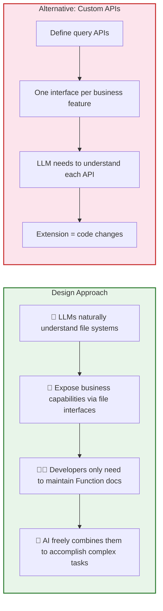
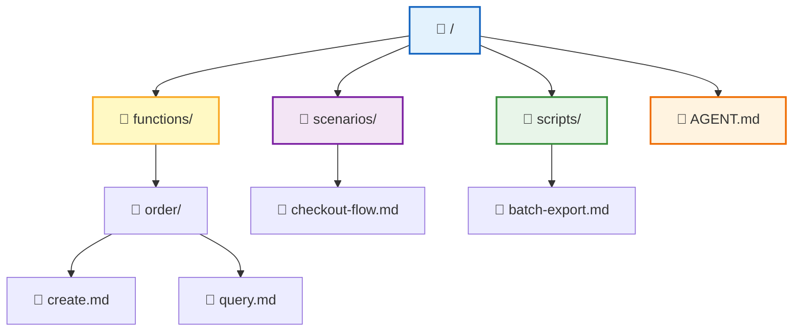
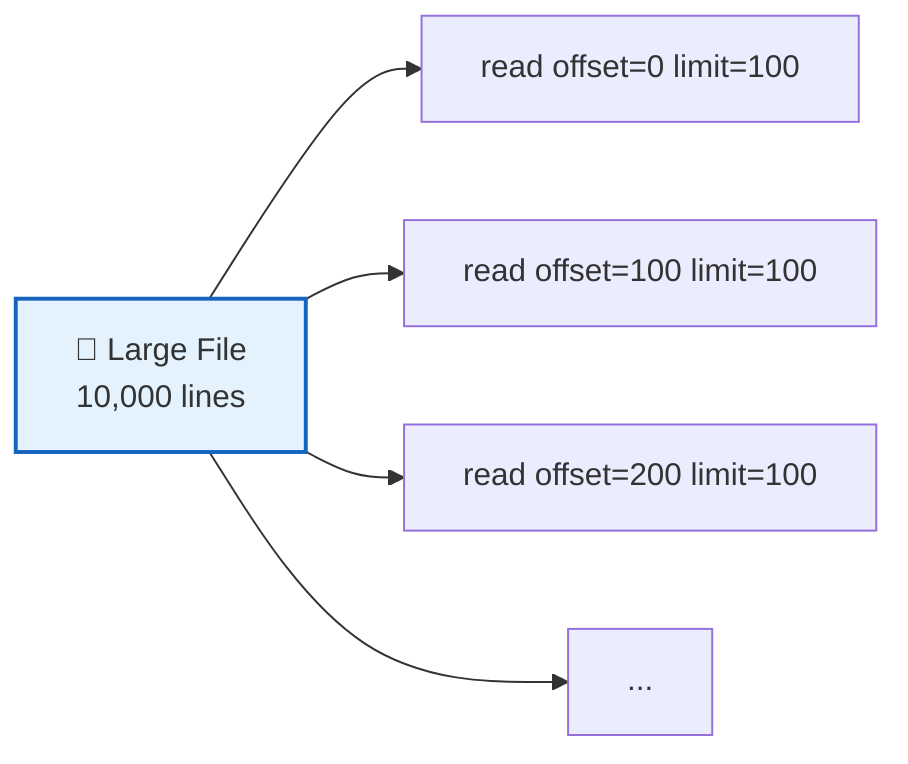
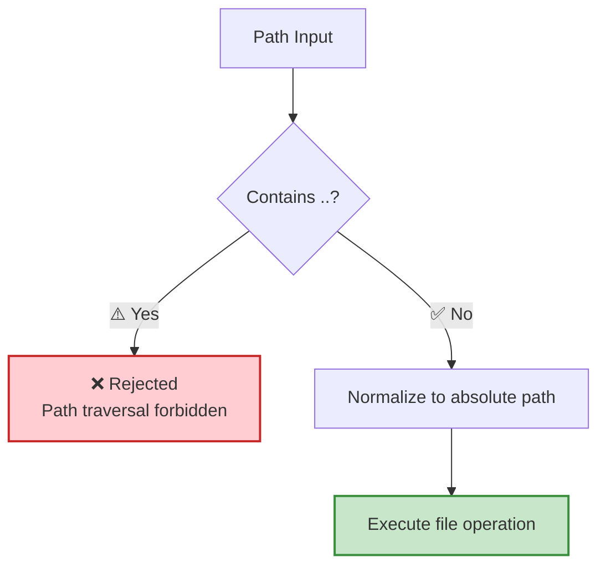
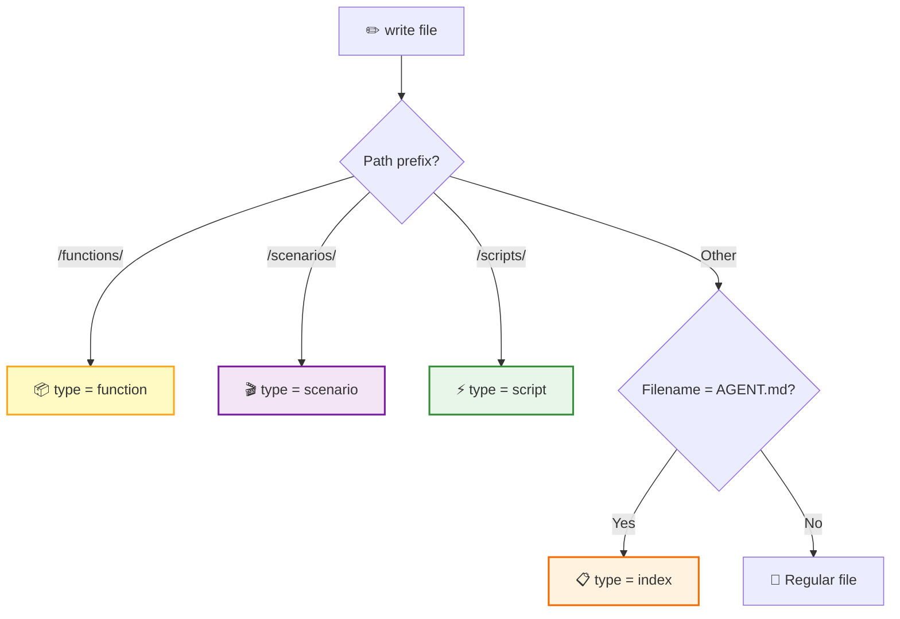
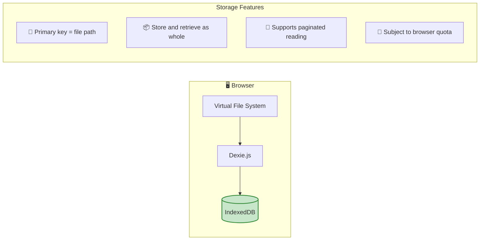
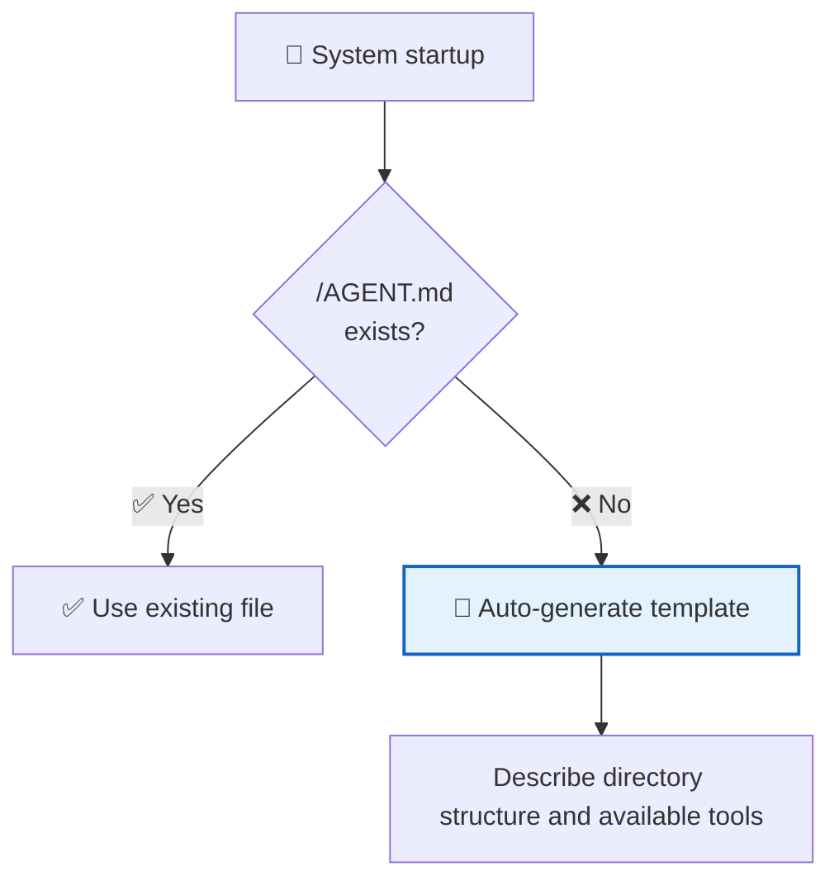

RTC Agent builds a **complete virtual file system** in the browser. AI operates on files using tools like `ls`, `read`, `write`, `grep`, and `find`, just like working with a local terminal — but all data always stays within the user's browser.

## Why a File System



> 💡 **Core Insight**: LLMs are already very good at operating file systems. Instead of making the AI learn custom APIs, give it a file system — it can immediately `ls`, `read`, `grep`, and `write`.

## Directory Structure



| Directory | Purpose | Content Source |
|------|------|----------|
| `/functions/` | Function documentation | **Auto-generated** after the host app registers Functions |
| `/scenarios/` | Scenario documentation | Markdown workflows provided by the business side |
| `/scripts/` | Executable scripts | Saved by AI via the `script` tool |
| `/AGENT.md` | System entry point | Auto-generated template describing directory structure and tools |

## File Operations

The virtual file system provides **6 operations** covering all file interactions the AI needs:

```mermaid
flowchart LR
    subgraph READ["📖 Read Operations"]
        LS["ls<br/>List directory"]
        READ["read<br/>Read file"]
        FIND["find<br/>Search by name"]
        GREP["grep<br/>Search by content"]
    end

    subgraph WRITE["✏️ Write Operations"]
        WRITE_OP["write<br/>Write file"]
        REMOVE["remove<br/>Delete file"]
    end

    style READ fill:#e3f2fd,stroke:#1565c0,stroke-width:2px
    style WRITE fill:#fff9c4,stroke:#f9a825,stroke-width:2px
```

| Operation | Function | Key Parameters |
|:----:|------|----------|
| `ls` | List directory contents | `path` (default `/`) |
| `read` | Read file contents | `path` (required), `offset` / `limit` (pagination) |
| `write` | Create or write to file | `path`, `content` (required), `mode` (overwrite / append) |
| `find` | Search by file name | `pattern` (glob), `path` |
| `grep` | Search by file content | `pattern` (regex), `path`, `caseSensitive` |
| `remove` | Delete file | `path` |

### Paginated Reading

Large files support paginated reading to avoid loading too much content at once:



## Path Specifications



| Rule | Description |
|------|------|
| Root directory | `/` |
| Separator | `/` (forward slash) |
| Auto-conversion | All paths are automatically converted to absolute paths |
| Path traversal | `..` is rejected directly, without parsing |
| Directories | Logical concept, not stored separately, derived from path prefixes |

## File Type Inference

File types are automatically inferred from the **path prefix**, no explicit specification needed:



## Storage Mechanism



| Feature | Description |
|------|------|
| Storage Engine | IndexedDB (wrapped by Dexie.js) |
| Primary Key | File path |
| Large Files | Stored and retrieved as whole, supports paginated reading |
| Caching | No cache layer, queries IndexedDB directly each time |
| Capacity | Subject to browser IndexedDB quota (typically hundreds of MB) |

## Initialization



At system startup, `/AGENT.md` is automatically checked. If it doesn't exist, a template file is auto-generated to describe the directory structure and available tools to the AI — ensuring the AI knows "what's in the file system" as soon as it comes online.

## Security Constraints

| Constraint | Description |
|------|------|
| 🔒 Path traversal protection | `..` is rejected directly |
| 🔐 Permission control | Determined by [work mode](/docs/en/concepts/work-modes/) |
| 💾 Capacity limits | Subject to browser IndexedDB quota |
| 🚫 No cross-origin access | File system is fully isolated within the browser sandbox |

## Next Steps

- [Remote Tool Calling](/docs/en/concepts/rtc/) — Learn how AI calls these file operations
- [Script Engine](/docs/en/concepts/script-engine/) — Learn how scripts in the `/scripts/` directory are executed
- [Skill System](/docs/en/features/skill-system/) — Learn how functions in the `/functions/` directory are registered
