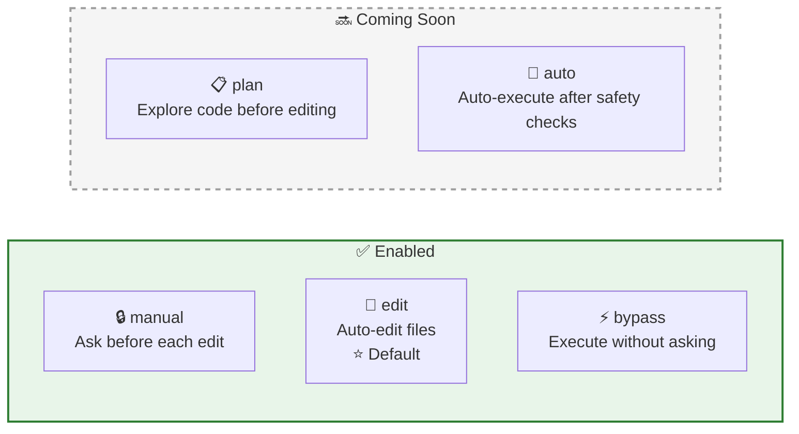
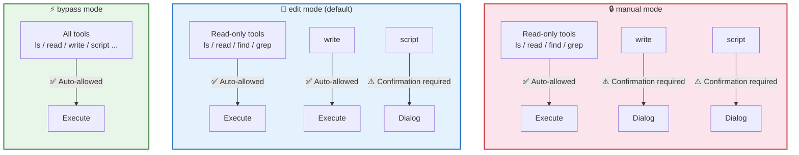
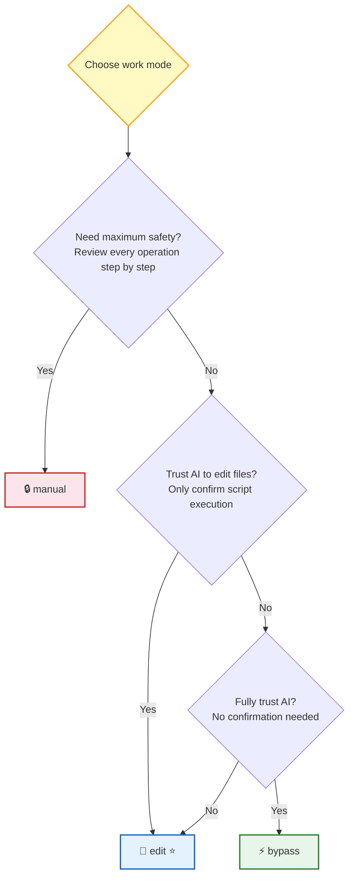
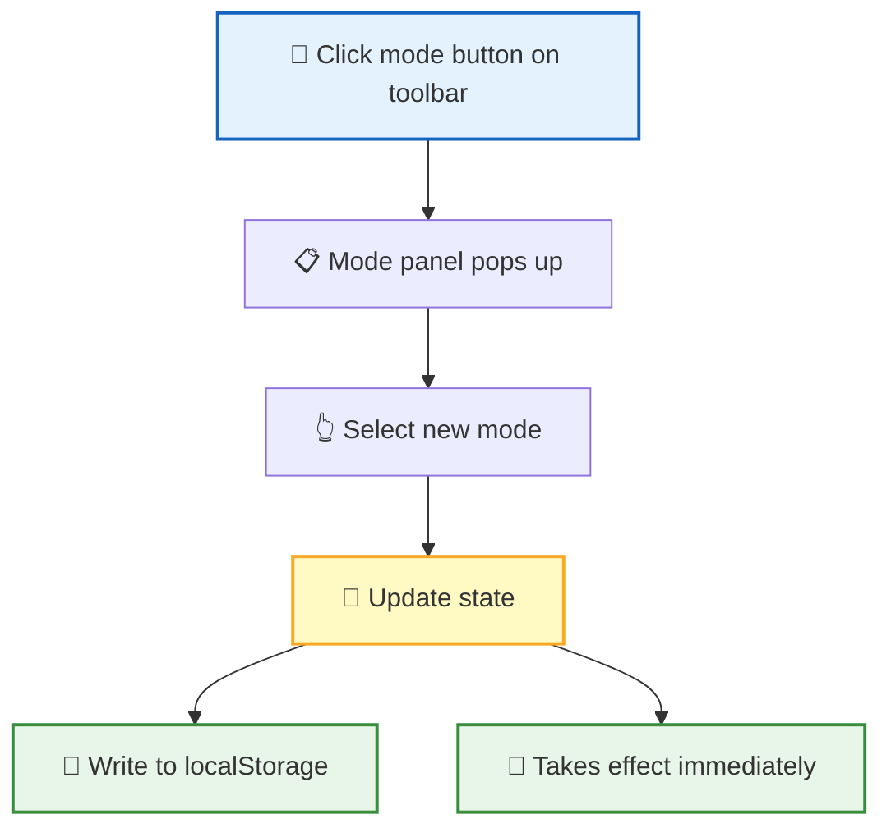
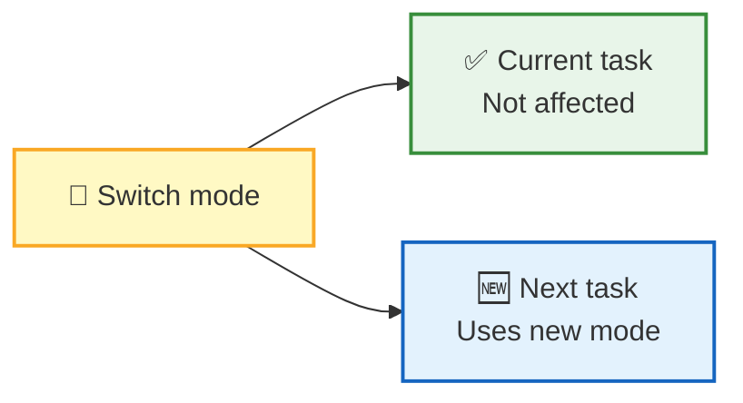

**Work modes** determine whether AI needs your confirmation when executing tools. Different modes provide different levels of automation — from "confirm every step" to "fully automatic execution". You can choose the balance between safety and efficiency that best fits your current task.

## 5 Work Modes

| Mode | Label | Description | Status |
|:----:|------|------|:----:|
| 🔒 manual | Manual | Ask user before each edit | ✅ Enabled |
| 📝 edit | Edit automatically | Auto-edit files (⭐ Default) | ✅ Enabled |
| 📋 plan | Plan | Explore code before editing (expected behavior) | 🔜 Not enabled |
| 🤖 auto | Auto | Auto-execute after safety checks; pauses for risky operations (expected behavior) | 🔜 Not enabled |
| ⚡ bypass | Bypass permissions | Execute without asking | ✅ Enabled |

> 📌 The current default mode is **edit** — auto-handles file read/write, but still requires confirmation before script execution. This is the optimal balance for most scenarios.

## Permission Matrix

The confirmation policies for tools in different modes are as follows:

| Tool | 🔒 manual | 📝 edit | 📋 plan | 🤖 auto | ⚡ bypass |
|------|:---------:|:-------:|:-------:|:-------:|:---------:|
| ls / read / find / grep | ✅ Auto | ✅ Auto | ✅ Auto | ✅ Auto | ✅ Auto |
| write | ⚠️ Confirm | ✅ Auto | ✅ Auto | ✅ Auto | ✅ Auto |
| script | ⚠️ Confirm | ⚠️ Confirm | ⚠️ Confirm | ⚠️ Confirm | ✅ Auto |

> 📌 **plan** and **auto** modes are not yet enabled and currently use the same permission rules as **edit**.

> 💡 **Design Principle**: Read-only operations are always safely allowed; `write` only requires confirmation in the highest-alertness mode (manual); `script` can execute arbitrary code, so it requires user confirmation in all modes except bypass.

### Selection Guide

| Scenario | Recommended Mode | Reason |
|------|---------|------|
| 🔍 First time use, understanding AI behavior | 🔒 manual | Every step is visible and controllable |
| 💼 Daily development, trust AI to edit | 📝 edit | Best balance of efficiency and safety |
| ⚡ Batch operations, fully trust AI | ⚡ bypass | Maximum efficiency, no interruptions |

## Mode Switching

| Action | Description |
|------|------|
| Entry point | Mode button on the bottom toolbar of the input area |
| Panel | Floats above the button |
| Close | Click outside the panel or press Escape |

## Switching Impact

Mode switching follows the principle of **"don't affect the current, immediately affect the next"**:

| Dimension | Behavior |
|------|------|
| Currently executing task | Not interrupted, continues with old mode's permissions |
| Next pending task | Immediately uses the new mode |
| Timing | Can be switched at any time |

> 📌 If you're performing a sensitive operation, you can complete it in manual mode first, then switch back to edit mode for daily work.

## State Persistence

| Feature | Description |
|------|------|
| Storage location | `localStorage['rtc_mode']` |
| Restoration | Previous mode is restored after page refresh |
| Fallback strategy | Silently falls back to default value `edit` if storage fails |

Mode preference follows your browser — no need to reconfigure each time.

## Next Steps

- [Script Engine](/docs/en/concepts/script-engine/) — Learn why the script tool requires the highest permission level
- [Remote Tool Calling](/docs/en/concepts/rtc/) — Learn how the tool permission matrix is applied in the RTC protocol
- [Session Management](/docs/en/features/session/) — Learn about the role of work modes in session context
