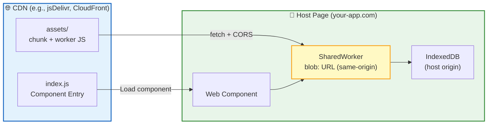
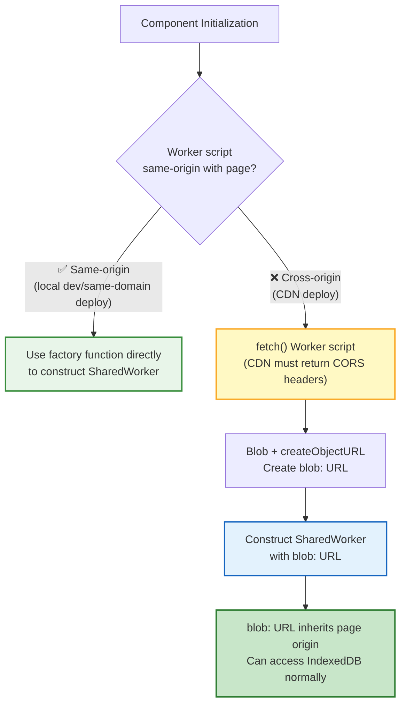

RTC Agent's Web Component can be distributed via CDN and embedded in any web page. Since the component runs inside the host page, cross-origin deployment requires attention to **SharedWorker same-origin policy** and **CORS configuration**.

## Deployment Architecture



| Component | Location | Description |
|:---------:|:--------:|-------------|
| Component Script | CDN | Loaded via `<script type="module">` |
| Worker Chunk | CDN | Fetched via `fetch()`, converted to blob: URL |
| SharedWorker | Host Page | Constructed with blob: URL, inherits page origin |
| IndexedDB | Host Page | Data stored under host origin |

## Embedding

Add the following code to your web page:

```html
<script type="module" src="https://cdn.example.com/rtc-agent/index.js"></script>
<rtc-agent server-url="https://your-rtc-server.com"></rtc-agent>
```

> 💡 Replace `cdn.example.com` with your actual CDN address and `your-rtc-server.com` with your RTC Agent Server address.

## Cross-Origin SharedWorker Handling

### Problem Background

Browsers require SharedWorker scripts to be **same-origin** with the page. When the component is loaded from a CDN, the worker script URL points to the CDN (cross-origin), and directly constructing a SharedWorker triggers a `SecurityError`.

### Solution

The component includes a built-in **dual-path loading strategy** that automatically detects and handles cross-origin scenarios:



| Path | Applicable Scenario | Description |
|:----:|:-------------------:|-------------|
| Same-origin | Local dev, same-domain deploy | Uses Vite factory function directly — simplest and most reliable |
| Cross-origin | CDN deployment | fetch script → blob: URL → same-origin SharedWorker |

> 💡 The cross-origin path includes a retry mechanism (up to 3 attempts) and a health check (ping test) to ensure reliable Worker startup.

## CDN CORS Configuration

The CDN **must** return CORS headers for worker script files, otherwise the `fetch()` call will fail:

```http
Access-Control-Allow-Origin: *
```

### Common CDN Configuration

| CDN | Configuration Method |
|-----|---------------------|
| **jsDelivr** | CORS enabled by default — no additional configuration needed |
| **CloudFront** | In Behavior, set "Response headers policy" → "CORS-with-preflight" |
| **Nginx** | Add `add_header Access-Control-Allow-Origin *;` to the assets directory |
| **Vercel** | Add `Access-Control-Allow-Origin` header to static asset routes |

### Verify CORS Configuration

Use `curl` to check if the CDN correctly returns CORS headers:

```bash
curl -I https://cdn.example.com/rtc-agent/assets/shared-worker-xxx.js
# Should include: Access-Control-Allow-Origin: *
```

## Server CORS Configuration

In addition to CDN CORS, the RTC Agent Server also needs CORS configuration to allow cross-origin API requests:

```yaml
cors:
  allow_origins:
    - "https://your-app.com"
    - "https://another-app.com"
```

| Environment | Behavior |
|:-----------:|----------|
| Development | Defaults to `Access-Control-Allow-Origin: *` when `allow_origins` is not configured |
| Production | Must explicitly configure `allow_origins`; otherwise cross-origin requests are rejected |

## Important Notes

| Note | Description |
|------|-------------|
| 🔒 No COOP/COEP Required | The solution avoids cross-origin isolation via blob URLs — no need to set `Cross-Origin-Opener-Policy` or similar headers |
| 📦 Worker Caching | fetch uses `cache: 'no-store'` to avoid using stale worker scripts |
| 🔊 Audio Resources | Notification sounds are imported via Vite's `?url` suffix, which automatically handles CDN paths — no extra configuration needed |
| 🔄 Retry Mechanism | Worker initialization automatically retries on failure (up to 3 attempts with exponential backoff) |
| 🏥 Health Check | After startup, Worker availability is verified via ping test (5-second timeout) |

## Troubleshooting

### SharedWorker Creation Failed

**Symptom**: Console error `SecurityError` or `Failed to construct 'SharedWorker'`.

**Troubleshooting**:
1. Check if the CDN returns `Access-Control-Allow-Origin` headers
2. Check if the worker script URL is accessible (open it directly in a browser)
3. Check browser console for `WorkerBridge` related logs

### IndexedDB Data Lost

**Symptom**: Data disappears after switching pages.

**Cause**: IndexedDB data is isolated by origin. If the page origin changes (e.g., from `localhost` to an IP address), data is not shared.

**Solution**: Ensure the page always accesses using the same origin.

### Audio Not Playing

**Symptom**: Notification sounds don't play.

**Troubleshooting**: Check browser console for 404 errors. Audio file paths are automatically resolved by Vite and typically don't require manual configuration. If you're using a non-standard CDN path, you may need to customize the build configuration.

## Next Steps

- [Build from Source](/docs/en/deployment/source-build/) — Build and deploy from source
- [Distributed Cluster Deployment](/docs/en/deployment/distributed-deploy/) — Multi-worker cluster deployment
- [Web Component API](/docs/en/integration/component-api/) — Component properties and events reference
