The **Command System** lets users quickly trigger specific features using `/command` syntax. Type text starting with `/`, and the frontend automatically identifies the command name and arguments, dispatching them to the corresponding handler — as efficient as a terminal command line.

## Command Types

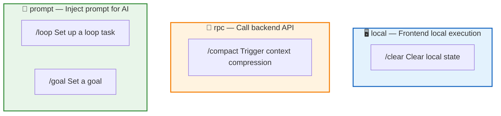

| Type | Execution Method | Description | Example |
|:----:|:---------------:|-------------|---------|
| **local** | Handled directly by frontend | Does not go through the backend, e.g., clearing local state | `/clear` |
| **rpc** | Calls backend RPC | Requires backend support, e.g., triggering compression | `/compact` |
| **prompt** | Generates a prompt injected into the conversation | Handed to AI for processing, e.g., setting up a loop task | `/loop`, `/goal` |

## Command Parsing Flow

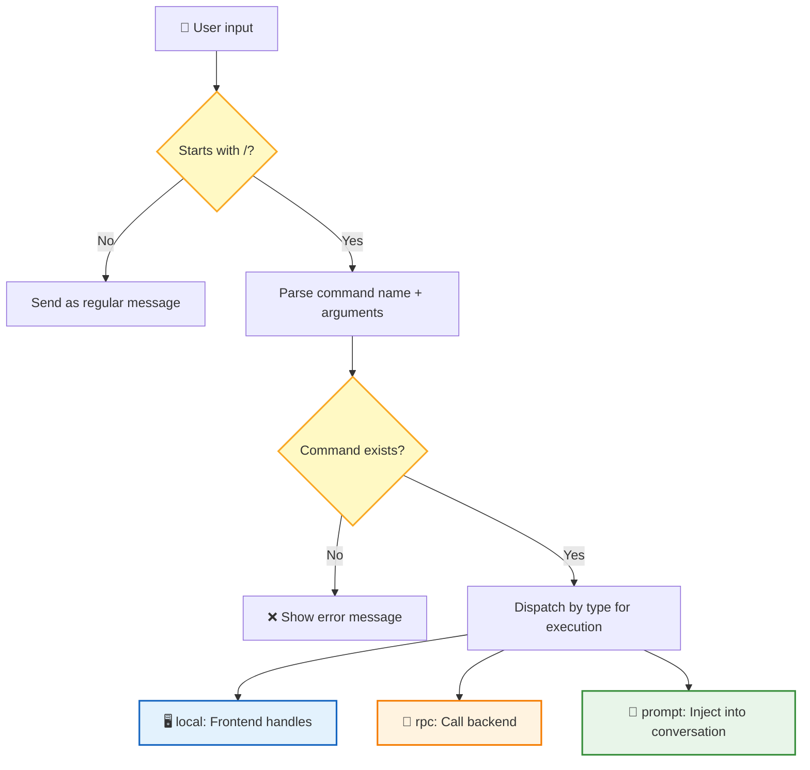

Parsing rules:
- The first word after `/` is the **command name**
- The rest is the **arguments** (passed as raw string)
- Command name matching priority: **exact match** > **alias match**

Commands come from two sources: system **built-in commands** (`/compact`, `/loop`, `/goal`) and **custom commands** registered by the host application via API.

---

## /compact — Manual Compression

Exposes the existing auto-compression capability, allowing users to proactively trigger context compression to free up token space.

```mermaid
flowchart LR
    A["👤 /compact [instruction]"] --> B["📤 Frontend sends RPC"]
    B --> C["⚙️ Backend receives request"]
    C --> D["📋 Add to compression queue"]
    D --> E["🗜️ Execute compression"]
    E --> F["📊 Return compression result"]
    F --> G["🖥️ Frontend updates state"]

    style A fill:#e3f2fd,stroke:#1565c0,stroke-width:2px
    style D fill:#fff9c4,stroke:#f9a825,stroke-width:2px
    style E fill:#fff3e0,stroke:#f57c00,stroke-width:2px
    style F fill:#e8f5e9,stroke:#388e3c,stroke-width:2px
```

| Parameter | Required | Description |
|:---------:|:--------:|-------------|
| Custom instruction | No | Custom summarization instruction that overrides the default compression prompt |

| Key Rule | Description |
|----------|-------------|
| **Asynchronous Execution** | Compression goes through a queue, does not block the current conversation |
| **Completion Notification** | Pushes a notification via the Live channel when compression completes |
| **Duplicate Prevention** | Repeated triggers are blocked while compression is in progress |
| **Result Feedback** | Returns pre-compression token count, post-compression token count, and compression ratio |

---

## /loop — Loop Execution

Users describe tasks that need to be executed in a loop using natural language. The Agent understands the intent and selects the appropriate loop mode for execution.

### Two Loop Modes

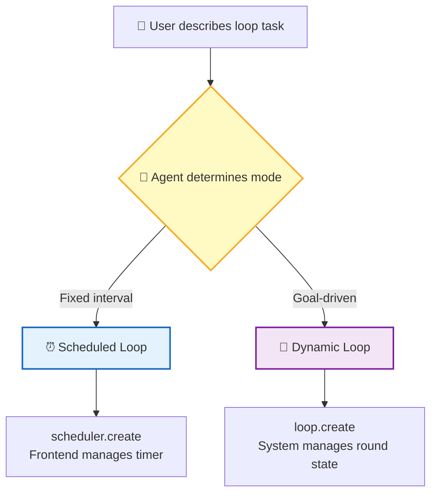

| | Scheduled Loop | Dynamic Loop |
|---|:------------:|:------------:|
| **Trigger Method** | Fixed time interval | Goal-driven, round-based |
| **Use Case** | Monitoring deployments, polling status | Test iteration, code optimization, batch processing |
| **State Storage** | IndexedDB (frontend) | Backend database |
| **Implementation** | RTC tool `scheduler.*` | RTC tool `loop.*` |
| **Page Closed** | Paused, resumes when reopened | Persistent, does not depend on frontend |

### Mode Determination

The Agent automatically determines which mode to use based on keywords in the user's description:

| User Description | Basis | Selected Mode |
|------------------|:-----:|:-------------:|
| "Check every 5 minutes" | Fixed time interval | ⏰ Scheduled Loop |
| "Poll every hour" | Fixed time interval | ⏰ Scheduled Loop |
| "Loop 5 rounds" | Fixed rounds, round-based | 🔄 Dynamic Loop |
| "Until tests pass" | Goal-driven | 🔄 Dynamic Loop |
| "Process these 100 files" | Batch processing, per-batch | 🔄 Dynamic Loop |
| "Iterate until satisfied" | Iterative optimization | 🔄 Dynamic Loop |

### Mode 1: Scheduled Loop

Used for fixed-interval independent tasks. The Agent calls `scheduler.create` to create a timer on the frontend.

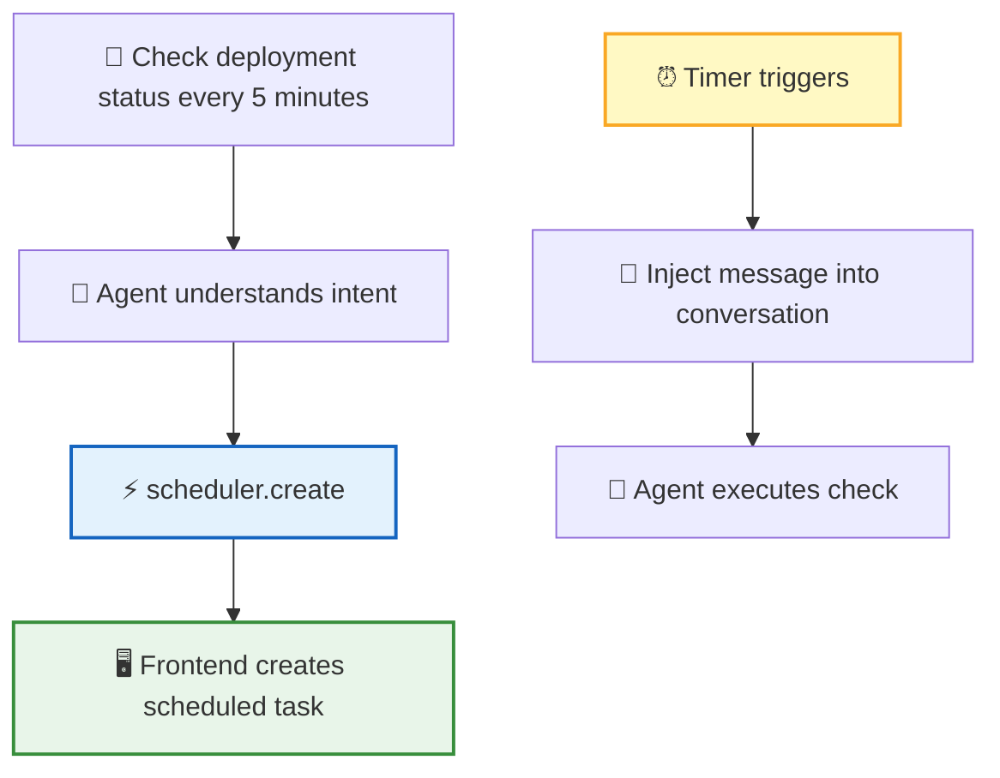

**RTC Tools**:

| Tool | Function |
|:----:|----------|
| `scheduler.create` | Create a scheduled task (parameters: `interval`, `prompt`, `max_age`) |
| `scheduler.list` | List all scheduled tasks |
| `scheduler.cancel` | Cancel a scheduled task |
| `scheduler.pause` | Pause a scheduled task |
| `scheduler.resume` | Resume a scheduled task |

**Interval Formats**:

| Input | Meaning |
|:-----:|---------|
| `30s` | 30 seconds (minimum granularity is 1 minute, rounds up) |
| `5m` | 5 minutes |
| `2h` | 2 hours |
| `1d` | 1 day |

**Task Lifecycle**:

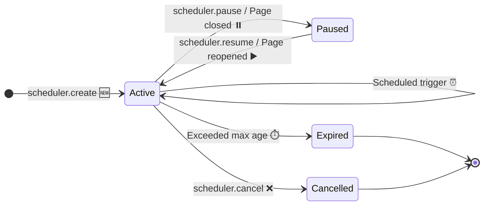

| Phase | Behavior |
|:-----:|----------|
| **Create** | Execute immediately once + register timer |
| **Trigger** | Inject message into conversation for Agent execution (message marked as `isMeta: true`) |
| **Pause** | Pauses when page is closed, does not execute |
| **Resume** | When page reopens, recalculates next trigger from current time |
| **Expire** | Auto-expires after 7 days by default (configurable) |
| **Cancel** | Manually cancel via `scheduler.cancel` |

> 📌 Scheduled tasks are stored in the frontend IndexedDB, valid only for the current session, and paused when the page is closed.

### Mode 2: Dynamic Loop

Used for goal-driven, round-based critical tasks. **The system explicitly manages task state** to guarantee completion, without relying on LLM context memory.

> 💡 **Why not ReAct?** ReAct relies on LLM context memory for task progress. When context gets too long, the LLM may "forget" the task — unreliable, and users can't trust it.

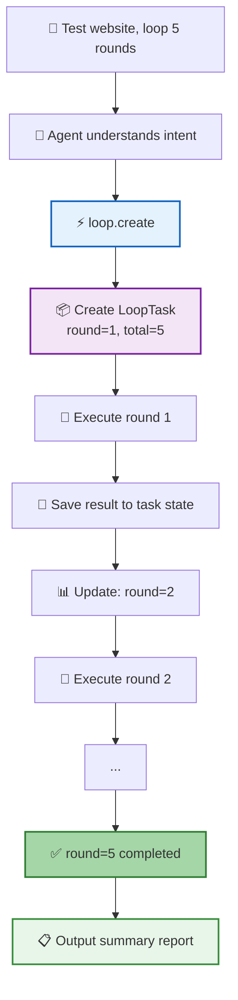

**Design Principles**:

| Principle | Description |
|-----------|-------------|
| **Explicit State Management** | Current round, total rounds, per-round parameters, and per-round results are all stored in task state |
| **System Controls the Loop** | It's not the LLM deciding when to stop — the system checks task state |
| **Persistence** | Stored in the database; even if context is compressed, task state is not lost |
| **Relentless Until Done** | Guarantees execution completion unless the user cancels or max rounds are reached |

**RTC Tools**:

| Tool | Function | Key Parameters |
|:----:|----------|----------------|
| `loop.create` | Create a dynamic loop task | `task`, `total_rounds`, `termination_condition` |
| `loop.get_status` | Get task status | — |
| `loop.submit_round_result` | Submit current round result, trigger next round | `task_id`, `result`, `next_params` |
| `loop.cancel` | Cancel task | `task_id` |

| Key Rule | Description |
|----------|-------------|
| **State Injection** | Before each round, the system injects task state into the Agent context |
| **Result Submission** | After each round, the Agent must call `loop.submit_round_result` |
| **Termination Check** | The system checks termination conditions (rounds completed / conditions met) to decide whether to continue |
| **Pause & Resume** | Pauses when page is closed, resumes when reopened |

---

## /goal — Goal-Driven

The user sets a **completion condition**, and the AI works continuously until the condition is met. Each time the AI is about to stop, the system uses an independent judge model to check whether the condition has been achieved; if not, it forces the AI to continue.

### Core Flow

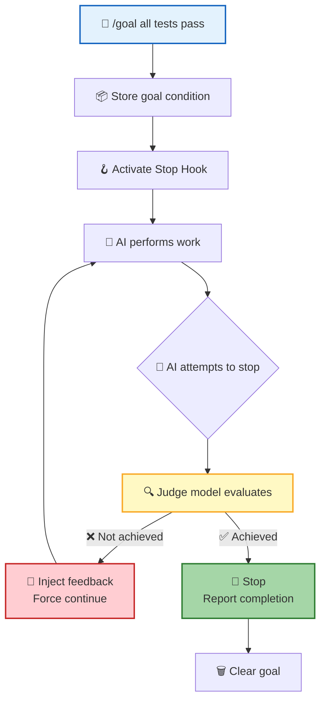

### Core Mechanism

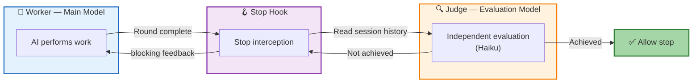

| Component | Responsibility |
|:---------:|----------------|
| **Worker** | The main model that performs work |
| **Judge** | Independent evaluation model (uses a lightweight model like Haiku to reduce costs); reads session history to determine if the goal is achieved |
| **Stop Hook** | Triggered when AI stops; calls the Judge to check conditions |

### Goal as an Independent Entity

A Goal is an entity independent of the Session, with its own lifecycle:

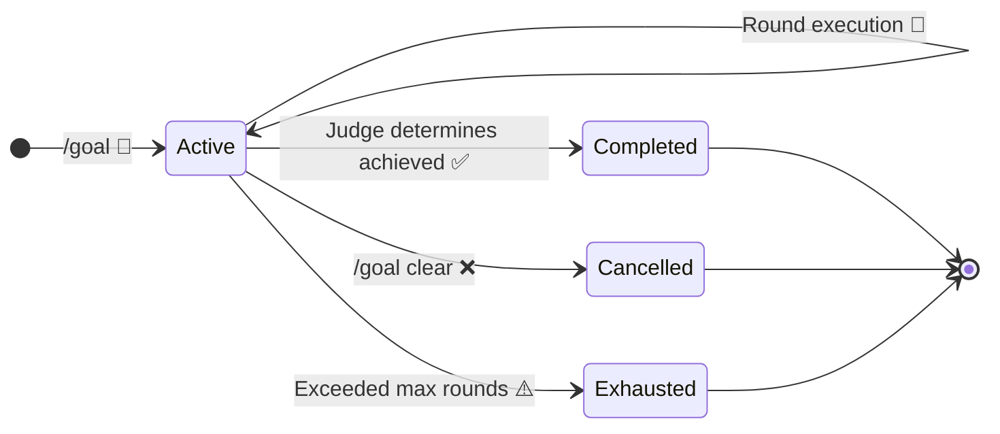

| State | Description |
|:-----:|-------------|
| `Active` | Goal is active, AI continues working |
| `Completed` | Judge determined the condition is achieved |
| `Cancelled` | User manually cancelled |
| `Exhausted` | Exceeded maximum round limit (default: 50 rounds) |

### Judge Evaluation

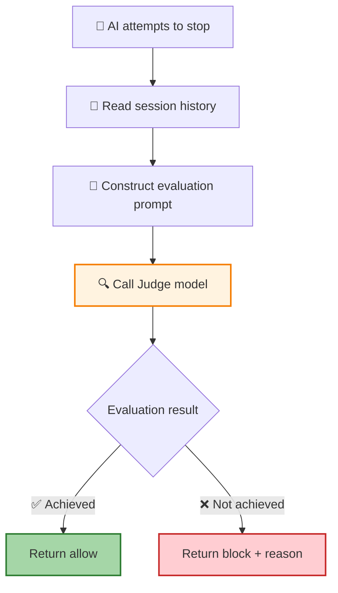

The Judge uses a **lightweight model** (e.g., Haiku), taking the goal condition + the last N rounds of session history as input, and outputs `{ achieved: boolean, reason: string }`. When evaluation fails (API errors, etc.), it defaults to allowing the stop to avoid infinite loops.

### Status Display

| Element | Description |
|---------|-------------|
| **Status Bar** | Displays a summary of the current goal condition |
| **Overlay Panel** | Shows rounds executed, cumulative tokens, and runtime |
| **Completion Notification** | Pops up a notification when the goal is achieved |

### Related Commands

| Command | Description |
|---------|-------------|
| `/goal` | Display current goal |
| `/goal <condition>` | Set a goal |
| `/goal clear` | Clear the goal |

| Key Rule | Description |
|----------|-------------|
| **Single Goal** | Only one active goal per session |
| **Session-scoped** | Goals are only valid within the current session |
| **Safety Limit** | Maximum round limit (default: 50 rounds) to prevent runaway execution |
| **Fail-safe** | Defaults to allowing stop when Judge evaluation fails |

---

## Frontend Interaction

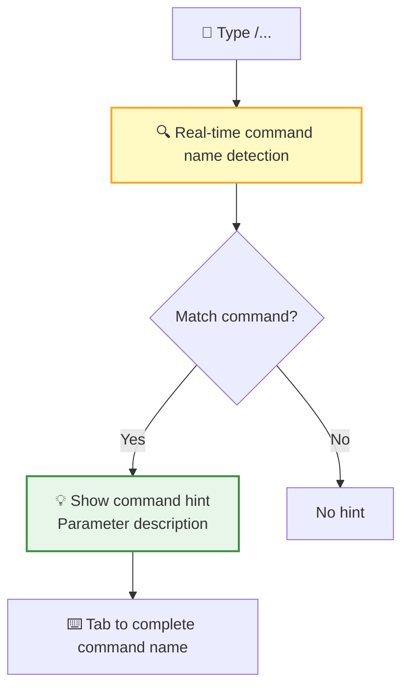

| Interaction Feature | Description |
|---------------------|-------------|
| **Typeahead** | Shows command list after typing `/` |
| **Tab Completion** | Tab key auto-completes the command name |
| **Parameter Hints** | Shows parameter description after matching a command (gray text) |
| **Toast Feedback** | Pops up a Toast notification on command success/failure |

**Command Feedback**:

| Scenario | Feedback Method |
|----------|:--------------:|
| Command executed successfully | Toast notification ✅ |
| Command execution failed | Toast error message ❌ |
| Command returns a result | System message displayed in conversation |
| Command requires interaction | Dialog box pops up |

The **status bar** displays active commands in real time: Loop tasks show task count and next trigger time; Goals show a condition summary and runtime.

## Next Steps

- [Skill System](/docs/en/features/skill-system/) — Learn how the host registers custom functions to extend AI capabilities
- [RTC Protocol](/docs/en/concepts/rtc/) — Learn about the remote tool calling mechanism behind commands
- [Session Management](/docs/en/features/session/) — Learn about the session context in which commands operate
