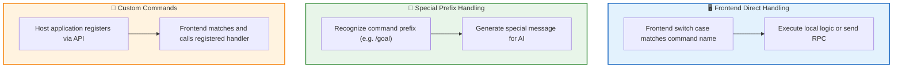
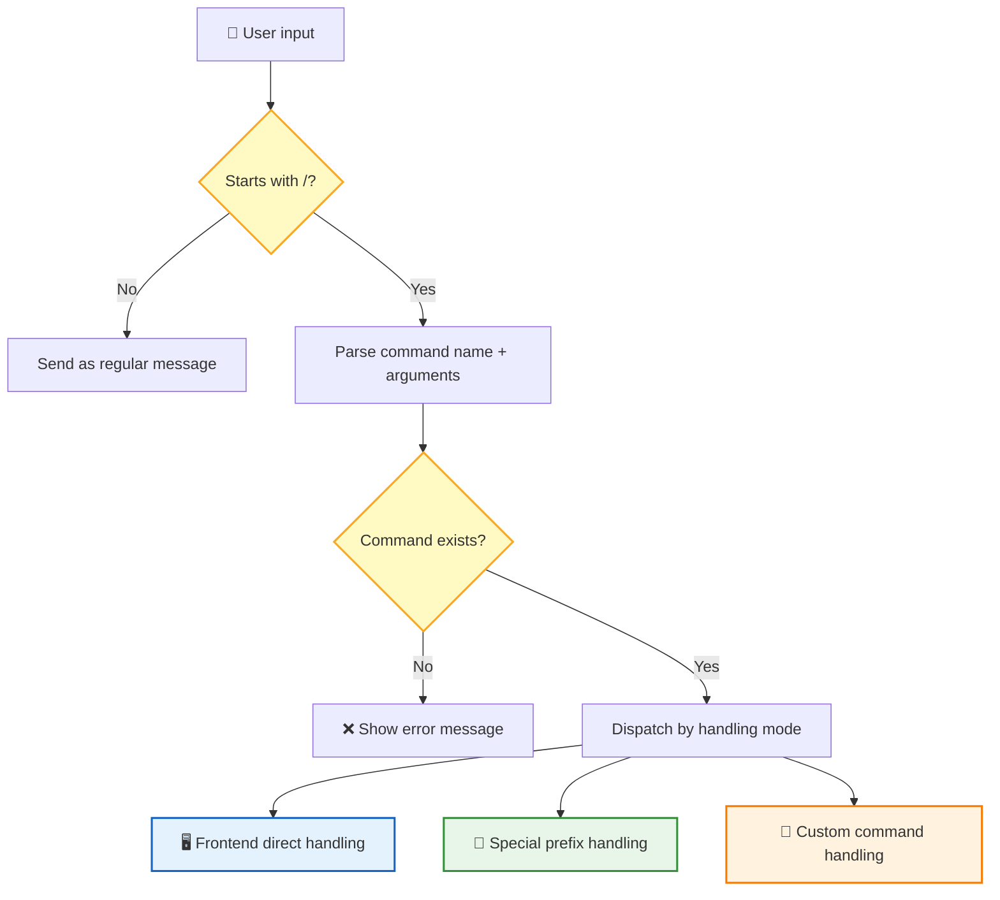
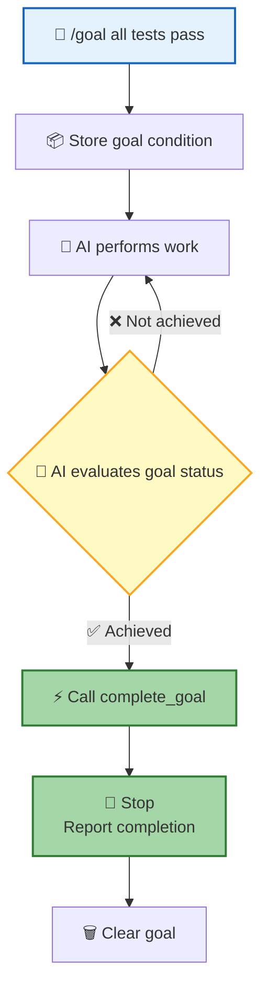
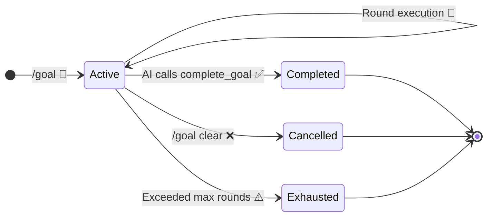

The **Command System** lets users quickly trigger specific features using `/command` syntax. Type text starting with `/`, and the frontend automatically identifies the command name and arguments, dispatching them to the corresponding handler — as efficient as a terminal command line.

## Command Handling

Commands are dispatched through different handling modes based on their implementation:

| Handling Mode | Description | Example |
|--------------|-------------|---------|
| **Frontend Direct Handling** | Frontend switch case matches the command name, executes local logic or sends RPC to the backend | `/compact`: Frontend sends RPC to call the backend compression API |
| **Special Prefix Handling** | Frontend recognizes command prefix, generates a special message (`isMeta: true`) for the AI | `/goal`: Generates a goal-setting message for AI to understand the task objective |
| **Custom Commands** | Host application registers custom commands via API; frontend matches and calls the registered handler function | Any custom command registered by the host |

## Command Parsing Flow

Parsing rules:
- The first word after `/` is the **command name**
- The rest is the **arguments** (passed as raw string)
- Command name matching priority: **exact match** > **alias match**

Commands come from two sources: system **built-in commands** (`/compact`, `/goal`) and **custom commands** registered by the host application via API.

---

## /compact — Manual Compression

Exposes the existing auto-compression capability, allowing users to proactively trigger context compression to free up token space.

```mermaid
flowchart LR
    A["👤 /compact [instruction]"] --> B["📤 Frontend sends RPC"]
    B --> C["⚙️ Backend receives request"]
    C --> D["📋 Add to compression queue"]
    D --> E["🗜️ Execute compression"]
    E --> F["📊 Return compression result"]
    F --> G["🖥️ Frontend updates state"]

    style A fill:#e3f2fd,stroke:#1565c0,stroke-width:2px
    style D fill:#fff9c4,stroke:#f9a825,stroke-width:2px
    style E fill:#fff3e0,stroke:#f57c00,stroke-width:2px
    style F fill:#e8f5e9,stroke:#388e3c,stroke-width:2px
```

| Parameter | Required | Description |
|:---------:|:--------:|-------------|
| Custom instruction | No | Custom summarization instruction that overrides the default compression prompt |

| Key Rule | Description |
|----------|-------------|
| **Asynchronous Execution** | Compression goes through a queue, does not block the current conversation |
| **Completion Notification** | Pushes a notification via the Live channel when compression completes |
| **Duplicate Prevention** | Repeated triggers are blocked while compression is in progress |
| **Result Feedback** | Returns `{Success: true}` upon completion, with notification pushed via the Live channel |

---

## /loop — Loop Execution (Planned)

> ⚠️ **This feature is still in the planning stage and has not been implemented.** The following describes the design proposal.

Users describe tasks that need to be executed in a loop using natural language. The Agent understands the intent and selects the appropriate loop mode for execution.

### Design Goals

| | Scheduled Loop | Dynamic Loop |
|---|:--------------:|:------------:|
| **Trigger Method** | Fixed time interval | Goal-driven, round-based |
| **Use Case** | Monitoring deployments, polling status | Test iteration, code optimization, batch processing |
| **Design Approach** | Frontend manages timer | System manages round state |

---

## /goal — Goal-Driven

The user sets a **completion condition**, and the AI works continuously until the condition is met. During execution, the AI self-assesses whether the goal has been achieved, declaring completion via the `complete_goal` tool, or cancelling via the `cancel_goal` tool.

### Core Flow

### Core Mechanism

During execution, the AI continuously evaluates the goal's completion status. When the AI determines the goal has been achieved, it calls the `complete_goal` tool to declare completion; when the AI determines the goal cannot be achieved or needs to be cancelled, it calls the `cancel_goal` tool.

| Component | Responsibility |
|------|------|
| **AI** | Performs work and self-assesses whether the goal is achieved, declaring state changes via `complete_goal`/`cancel_goal` tools |

### Goal as an Independent Entity

A Goal is an entity independent of the Session, with its own lifecycle:

| State | Description |
|:-----:|-------------|
| `Active` | Goal is active, AI continues working |
| `Completed` | AI declared condition achieved via `complete_goal` |
| `Cancelled` | User manually cancelled |
| `Exhausted` | Exceeded maximum round limit (default: 50 rounds) |

### Status Display

| Element | Description |
|---------|-------------|
| **Status Bar** | Displays a summary of the current goal condition |
| **Overlay Panel** | Shows rounds executed, cumulative tokens, and runtime |
| **Completion Notification** | Pops up a notification when the goal is achieved |

### Related Commands

| Command | Description |
|---------|-------------|
| `/goal` | Display current goal |
| `/goal <condition>` | Set a goal |
| `/goal clear` | Clear the goal |

| Key Rule | Description |
|----------|-------------|
| **Single Goal** | Only one active goal per session |
| **Session-scoped** | Goals are only valid within the current session |
| **Safety Limit** | Maximum round limit (default: 50 rounds) to prevent runaway execution |

---

## Frontend Interaction

After command execution, the frontend provides feedback to the user via Toast notifications.

**Command Feedback**:

| Scenario | Feedback Method |
|----------|------|
| Command executed successfully | Toast notification ✅ |
| Command execution failed | Toast error message ❌ |

## Next Steps

- [Skill System](/docs/en/features/skill-system/) — Learn how the host registers custom functions to extend AI capabilities
- [RTC Protocol](/docs/en/concepts/rtc/) — Learn about the remote tool calling mechanism behind commands
- [Session Management](/docs/en/features/session/) — Learn about the session context in which commands operate
