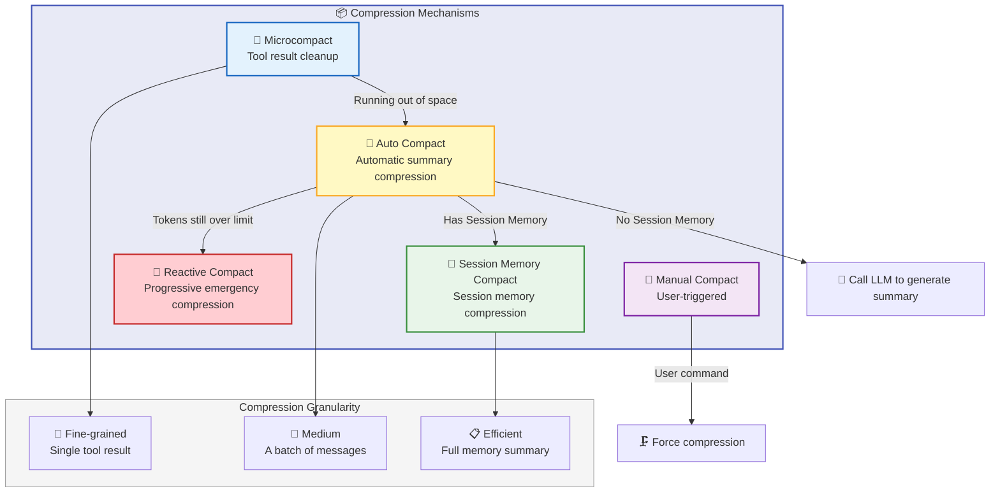
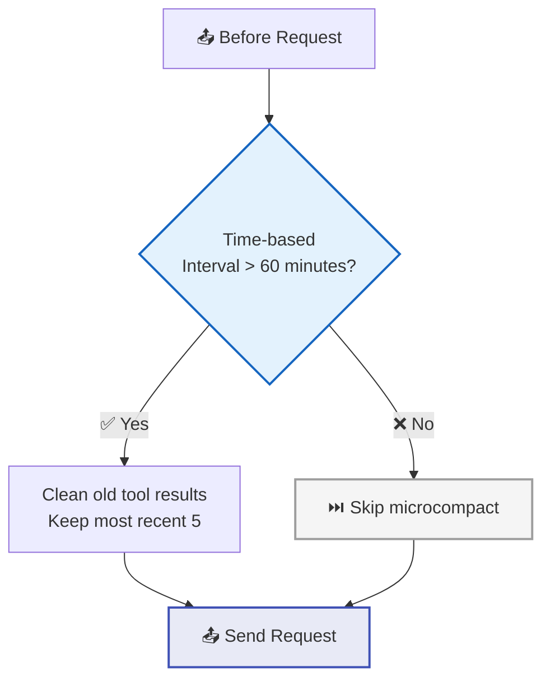
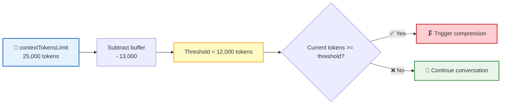
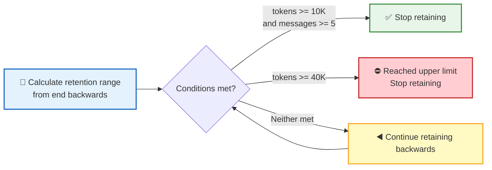
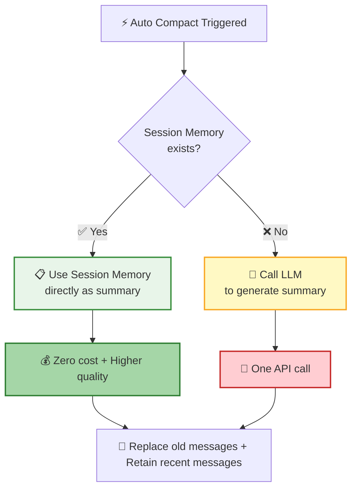
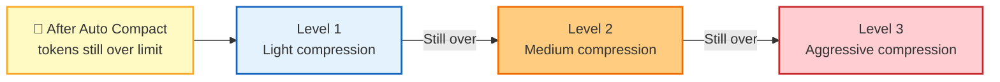
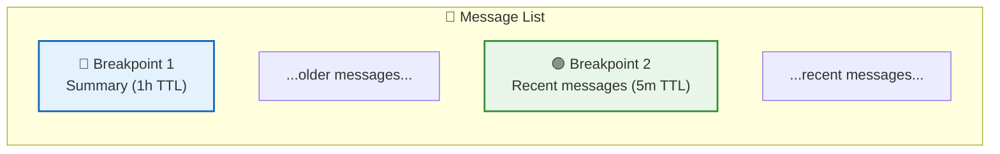
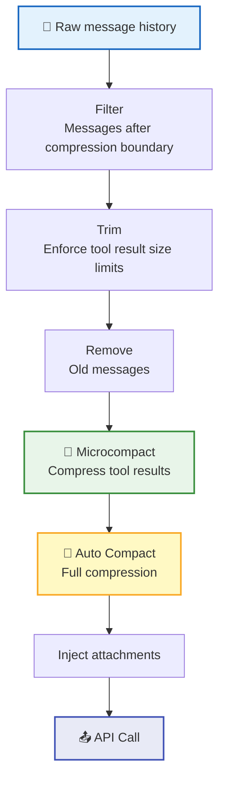
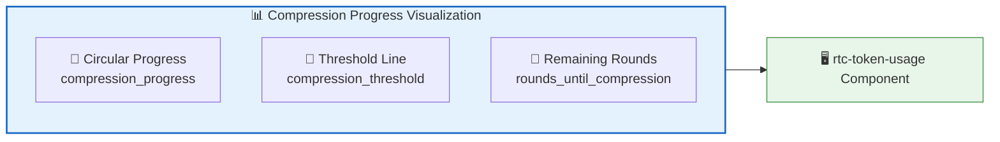

**Context Management** is the key to sustaining long conversations. As conversations grow longer and tool outputs accumulate, the system intelligently manages the context window through a **five-layer compression mechanism** — retaining critical information, freeing up precious space, and keeping the conversation unbroken.

## Five-Layer Compression Architecture



| Layer | Name | Trigger | Compression Granularity | Cost |
|:----:|------|----------|----------|:----:|
| 0 | Manual Compact | User sends `/compact` command | Full → summary | One LLM call |
| 1 | Microcompact | Time interval | Single tool result | Zero |
| 2 | Auto Compact | Token count reaches threshold | A batch of messages → summary | One LLM call |
| 3 | Reactive Compact | Still over limit after Auto Compact | Progressive multi-level compression | Zero ~ one LLM |
| 4 | Session Memory Compact | When Auto Compact is triggered | Session memory → summary | Zero |

## Manual Compact

Users can trigger context compression manually via the `/compact` command, useful for proactively cleaning context or adjusting summary direction.

**RPC**: `v1.session.compact`

```json
{
  "session_id": "uuid",
  "custom_instruction": "Focus on retaining API design decisions and code snippets"
}
```

| Parameter | Description |
|------|------|
| `session_id` | Target session ID |
| `custom_instruction` | Optional, custom summary instruction overriding the default compression prompt |

> 💡 Manual compression uses `force` mode, bypassing the token threshold check — compression is performed even if the context is not over the limit. The compression LLM call disables thinking/reasoning to save tokens.

## Microcompact — Tool Result Cleanup

Microcompact is the lightest form of compression — it doesn't generate summaries, it simply cleans up old tool results that take up a lot of space.

### Cleanable Tools

Only tools that produce large outputs are cleaned:

| Tool | Typical Output |
|:----:|----------|
| 📖 `read` | File contents |
| ✏️ `write` | Write results |
| 🔍 `grep` | Search results |
| 🔎 `find` | File listings |
| ⚡ `script` | Script execution results |

### Cleanup Strategy



| Strategy | Trigger | Mechanism |
|------|----------|------|
| 🕐 Time-based | Last assistant message > 60 minutes ago | Directly replace old tool results with placeholders, keep most recent 5 |

> 💡 The time-based strategy retains at least 5 recent tool results to prevent the model from completely losing its working context.

## Auto Compact — Automatic Summary Compression

When microcompact isn't enough, Auto Compact kicks in — compressing a batch of old messages into a concise summary.

### Trigger Conditions



| Configuration | Default | Description |
|--------|:------:|------|
| `contextTokensLimit` | 25,000 | Context token limit |
| `autoCompactBufferTokens` | 13,000 | Safety buffer |
| **Trigger threshold** | **12,000** | `contextTokensLimit - autoCompactBufferTokens` |

### Compression Prompt

Auto Compact uses a **9-part structured** prompt to ensure the summary covers all critical dimensions:

| # | Section | Content |
|:----:|------|------|
| 1 | Primary Request and Intent | The user's core request and intent |
| 2 | Key Technical Concepts | Key technical concepts involved |
| 3 | Files and Code Sections | Relevant files and code snippets (including full code) |
| 4 | Errors and Fixes | Errors encountered and their fixes |
| 5 | Problem Solving | Problem-solving process |
| 6 | All User Messages | All user messages (excluding tool results) |
| 7 | Pending Tasks | Tasks awaiting completion |
| 8 | Current Work | What is currently being worked on |
| 9 | Optional Next Step | Optional next action |

### Message Retention Policy

Compression doesn't discard all old messages — it **retains recent messages**:

| Configuration | Value | Description |
|--------|:--:|------|
| `minTokens` | 10,000 | Minimum tokens to retain |
| `minTextBlockMessages` | 5 | Minimum messages with text blocks to retain |
| `maxTokens` | 40,000 | Maximum tokens to retain |



> 📌 **API invariant protection**: `tool_result` entries in retained messages must have corresponding `tool_use` entries. During compression, the retention range is extended backwards to ensure pairs remain complete.

## Session Memory Compact

When [Memory System](/docs/en/features/memory/) has Session Memory entries, compression can be completed at **zero cost**:



This is exactly the **convergence point** of the memory system and context management — Session Memory, continuously accumulated during the conversation, becomes a high-quality summary at compression time without requiring an additional LLM call.

## Reactive Compact — Progressive Emergency Compression

When tokens are still over the limit after Auto Compact, the system activates **Reactive Compact** — a progressive multi-level compression strategy that frees up as much space as possible without increasing LLM cost.



| Level | Strategy | Description |
|:----:|------|------|
| Level 1 | Light compression | More aggressive tool result cleanup + reduced message retention |
| Level 2 | Medium compression | Further message trimming + shorter attachment injection |
| Level 3 | Aggressive compression | Aggressive microcompact + minimal retention configuration |

> 💡 Reactive Compact persists across process restarts — even after a Server restart, the system detects the current token state and continues executing the required compression level.

## Tool Result Budget

Individual tool outputs are limited to **10K tokens** to prevent any single tool result from monopolizing the context window:

| Strategy | Ratio | Description |
|------|:----:|------|
| Head retention | 60% | Keep the first 6,000 tokens of the output |
| Tail retention | 20% | Keep the last 2,000 tokens of the output |
| Middle truncation | 20% | Middle section replaced with `[...truncated...]` |

Truncation uses a **UTF-8 safe** algorithm to ensure no character is split in the middle.

## Strategic Cache Breakpoints

**Cache breakpoints** are set at key positions in the message list so that the LLM's prompt cache maintains a high hit rate even after compression:



| Breakpoint | Position | TTL | Description |
|:----:|------|:---:|------|
| BP1 | After summary message | 1h | Compressed summaries rarely change, long TTL |
| BP2 | After recent messages | 5m | Active area, short TTL for freshness |

| Effect | Data |
|------|------|
| Cache hit rate | 0% → **75%** (after microcompact) |
| Input cost reduction | ~**69%** |

> 💡 Configurable via `worker.enable_strategic_cache_breakpoints` (default `true`). This feature works with Anthropic's prompt caching mechanism to reuse previous caches even after context compression.

## Post-Compression Context Recovery

After compression, the system automatically re-injects recently read files to help the model quickly return to its working state:

| Configuration | Value | Description |
|--------|:--:|------|
| Max files to recover | 5 | The 5 most recently read files |
| Total token budget | 10,000 | Total limit for all recovered files |
| Per-file token limit | 2,000 | Maximum tokens per file |

## System Prompt Assembly

The system prompt is provided via the `SystemPrompt` configuration item and passed as the Agent's Instruction. When an agent definition exists, the agent's system prompt is used; otherwise, the default system prompt is used.

## Message Assembly Pipeline

Before each API call, messages go through a complete assembly pipeline:



## Attachment System

The attachment system dynamically injects contextual information during conversations:

| Attachment Type | Injection Timing | Description |
|----------|----------|------|
| 📋 AgentPrompt | Every turn | AGENT.md snapshot, containing agent capability description |
| 📝 TodoList | Every turn | Pending task list |
| 🧠 SessionMemory | Every turn | Latest 5 session memories (up to 5,000 tokens) |
| 🗂️ UserMemory | Every turn | User memories filtered by importance |

## Compression Status Visualization

The following Session model fields reflect compression status in real-time, displayed by the frontend via the `rtc-token-usage` component:

| Field | Description | Calculation |
|-------|-------------|-------------|
| `compression_progress` | Compression progress (0-100) | `current tokens / compression_threshold * 100` |
| `compression_threshold` | Compression trigger threshold | `contextTokensLimit - autoCompactBufferTokens` |
| `rounds_until_compression` | Rounds until compression | EWMA-based prediction, -1 means threshold exceeded |
| `estimated_next_round_tokens` | Next round token estimate | Based on EWMA (Exponentially Weighted Moving Average) |



### Compression Progress Interpretation

| Progress Range | Meaning | User Guidance |
|:--------------:|---------|---------------|
| 0-50% | Context is ample | Normal usage |
| 50-80% | Context gradually filling | Continue conversation, monitor progress |
| 80-100% | Compression approaching | Prepare for compression |
| > 100% | Threshold exceeded, compression triggered | `rounds_until_compression` becomes -1 |

> 💡 `rounds_until_compression` is estimated using the EWMA (Exponentially Weighted Moving Average) algorithm, which considers historical token consumption trends across rounds. The prediction becomes more accurate as conversation rounds increase.

## Next Steps

- [Memory System](/docs/en/features/memory/) — Dive deeper into how Session Memory and User Memory work
- [Remote Tool Calling](/docs/concepts/rtc/) — Learn the full lifecycle of tool calls
- [Session Management](/docs/en/features/session/) — Understand where context management fits within sessions
