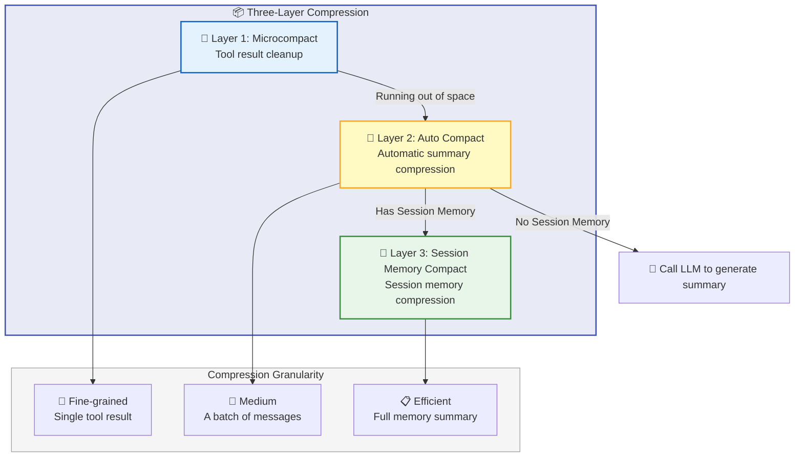
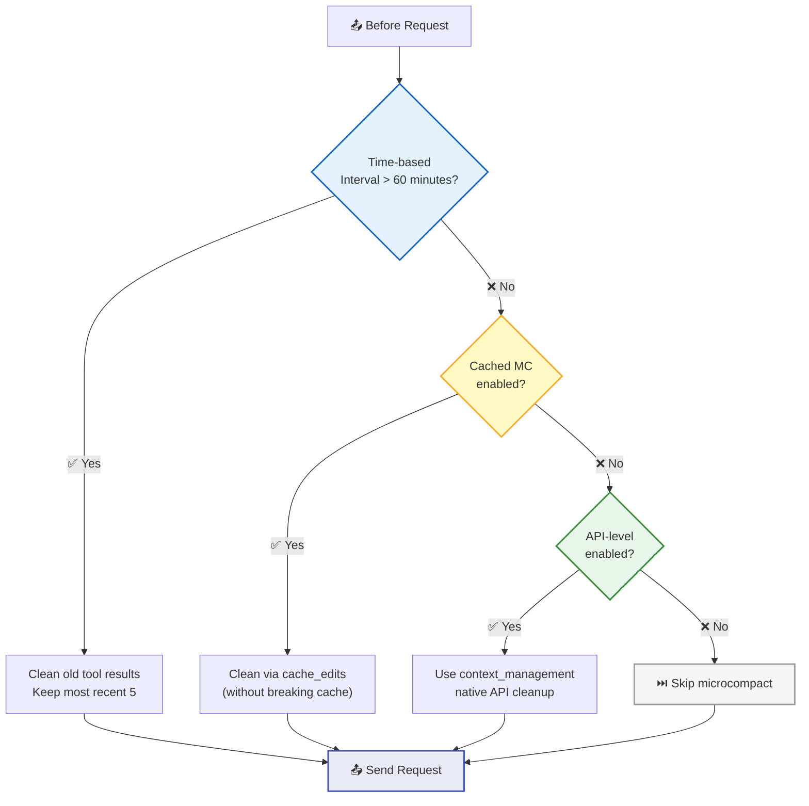
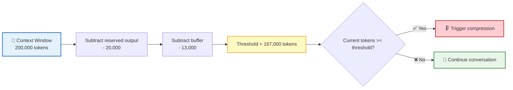
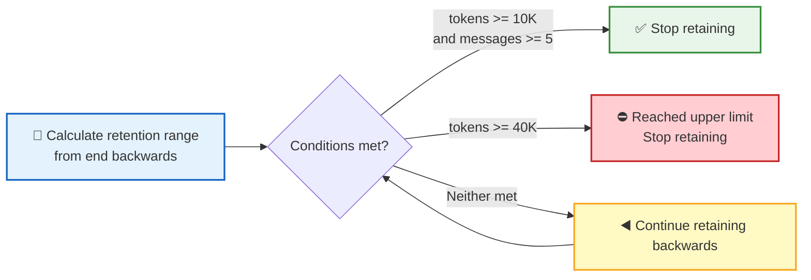
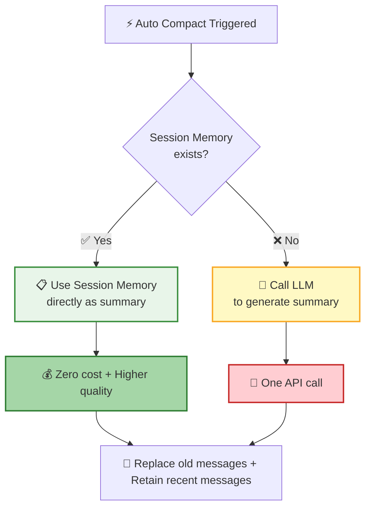
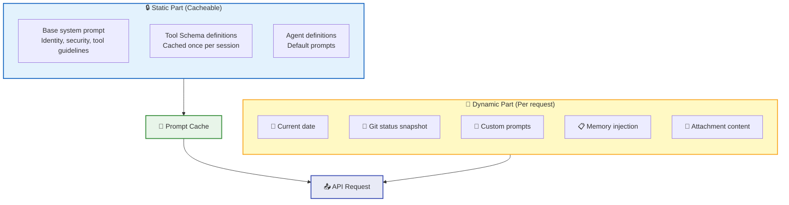
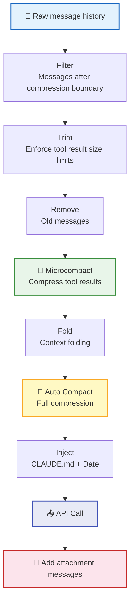

**Context Management** is the key to sustaining long conversations. As conversations grow longer and tool outputs accumulate, the system intelligently manages the context window through a **three-layer compression mechanism** — retaining critical information, freeing up precious space, and keeping the conversation unbroken.

## Three-Layer Compression Architecture

| Layer | Name | Trigger | Compression Granularity | Cost |
|:----:|------|----------|----------|:----:|
| 1 | Microcompact | Time interval / Cached edits / API native | Single tool result | Zero |
| 2 | Auto Compact | Token count reaches threshold | A batch of messages → summary | One LLM call |
| 3 | Session Memory Compact | When Auto Compact is triggered | Session memory → summary | Zero |

## Microcompact — Tool Result Cleanup

Microcompact is the lightest form of compression — it doesn't generate summaries, it simply cleans up old tool results that take up a lot of space.

### Cleanable Tools

Only tools that produce large outputs are cleaned:

| Tool | Typical Output |
|:----:|----------|
| 📖 `Read` | File contents |
| ⚡ `Bash` / `PowerShell` | Command output |
| 🔍 `Grep` | Search results |
| 📁 `Glob` | File listings |
| 🌐 `WebSearch` / `WebFetch` | Web page content |
| ✏️ `Edit` / 📝 `Write` | Operation results |

### Three Cleanup Strategies

| Strategy | Trigger | Mechanism | Use Case |
|------|----------|------|----------|
| 🕐 Time-based | Last assistant message > 60 minutes ago | Directly replace old tool results with placeholders | User returns after stepping away |
| 💾 Cached | Cache is still valid | Use `cache_edits` to tell the API to remove specific results | When cache hasn't expired |
| 🔌 API-level | Tokens >= 180,000 | Use Anthropic's native `context_management` | Approaching context limit |

> 💡 The time-based strategy retains at least 1 recent tool result to prevent the model from completely losing its working context.

## Auto Compact — Automatic Summary Compression

When microcompact isn't enough, Auto Compact kicks in — compressing a batch of old messages into a concise summary.

### Trigger Conditions

Using a 200K context window model as an example:

| Configuration | Value | Description |
|--------|:--:|------|
| `MAX_OUTPUT_TOKENS_FOR_SUMMARY` | 20,000 | Reserved space for model output |
| `AUTOCOMPACT_BUFFER_TOKENS` | 13,000 | Safety buffer |
| **Trigger threshold** (200K model) | **167,000** | Compression is triggered when this value is reached |

### Circuit Breaker

After 3 consecutive failures, automatic compression attempts are stopped to avoid wasting resources in unrecoverable scenarios:

### Compression Prompt

Auto Compact uses a **9-part structured** prompt to ensure the summary covers all critical dimensions:

| # | Section | Content |
|:----:|------|------|
| 1 | Primary Request and Intent | The user's core request and intent |
| 2 | Key Technical Concepts | Key technical concepts involved |
| 3 | Files and Code Sections | Relevant files and code snippets (including full code) |
| 4 | Errors and Fixes | Errors encountered and their fixes |
| 5 | Problem Solving | Problem-solving process |
| 6 | All User Messages | All user messages (excluding tool results) |
| 7 | Pending Tasks | Tasks awaiting completion |
| 8 | Current Work | What is currently being worked on |
| 9 | Optional Next Step | Optional next action |

### Message Retention Policy

Compression doesn't discard all old messages — it **retains recent messages**:

| Configuration | Value | Description |
|--------|:--:|------|
| `minTokens` | 10,000 | Minimum tokens to retain |
| `minTextBlockMessages` | 5 | Minimum messages with text blocks to retain |
| `maxTokens` | 40,000 | Maximum tokens to retain |

> 📌 **API invariant protection**: `tool_result` entries in retained messages must have corresponding `tool_use` entries. During compression, the retention range is extended backwards to ensure pairs remain complete.

## Session Memory Compact

When [Memory System](/docs/en/features/memory/) has Session Memory entries, compression can be completed at **zero cost**:

This is exactly the **convergence point** of the memory system and context management — Session Memory, continuously accumulated during the conversation, becomes a high-quality summary at compression time without requiring an additional LLM call.

## Post-Compression Context Recovery

After compression, the system automatically re-injects recently read files to help the model quickly return to its working state:

| Configuration | Value | Description |
|--------|:--:|------|
| Max files to recover | 5 | The 5 most recently read files |
| Total token budget | 50,000 | Total limit for all recovered files |
| Per-file token limit | 5,000 | Maximum tokens per file |

## System Prompt Assembly

The system prompt is divided into **static** and **dynamic** parts. The static part can be globally cached to reduce costs:

**Prompt priority** (highest to lowest):

| Priority | Source | Description |
|:------:|------|------|
| 1 | `overrideSystemPrompt` | Replaces all other prompts |
| 2 | Coordinator system prompt | Coordinator mode |
| 3 | Agent system prompt | Replaces default when agent definition exists |
| 4 | Custom system prompt | `--system-prompt` parameter |
| 5 | Default system prompt | Standard system prompt |
| 6 | `appendSystemPrompt` | Always appended to the end |

## Message Assembly Pipeline

Before each API call, messages go through a complete assembly pipeline:

## Attachment System

The attachment system dynamically injects contextual information during conversations:

| Attachment Type | Injection Timing | Description |
|----------|----------|------|
| 📅 Current date | Initial + on date change | Updated via `date_change` attachment |
| 🔀 Git Status | At conversation start | Current branch, status (truncated to 2000 chars), recent commits |
| 📋 Todo List | Every 10 turns | Reminder of pending task progress |
| 🧠 CLAUDE.md | Initial injection | Project instructions and configuration |
| 📂 Nested memories | During subdirectory operations | Search for CLAUDE.md in directory hierarchy |
| 🔍 Relevant memories | Async pre-fetch | Retrieve relevant memories from auto-memory |
| 🛠️ Skills | On discovery / invocation | Available skill list and invocation content |
| 💻 IDE Context | Real-time | Selected lines, open files |
| 📊 Token Usage | Real-time | Current token usage and budget |

## Next Steps

- [Memory System](/docs/en/features/memory/) — Dive deeper into how Session Memory and User Memory work
- [Remote Tool Calling](/docs/concepts/rtc/) — Learn the full lifecycle of tool calls
- [Session Management](/docs/en/features/session/) — Understand where context management fits within sessions
