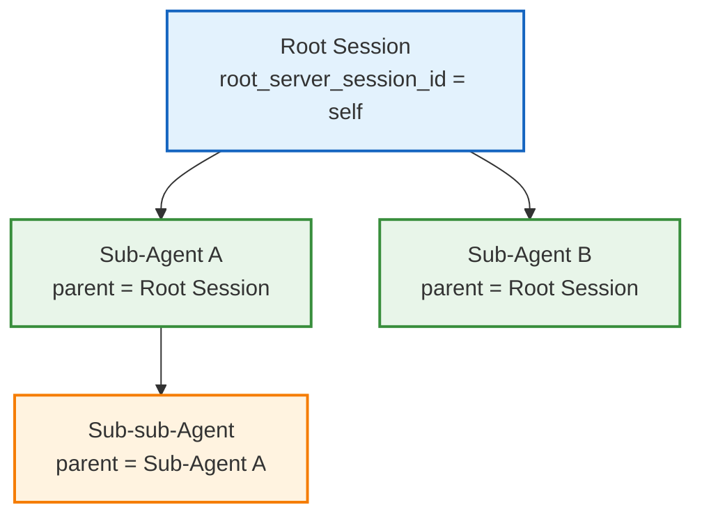
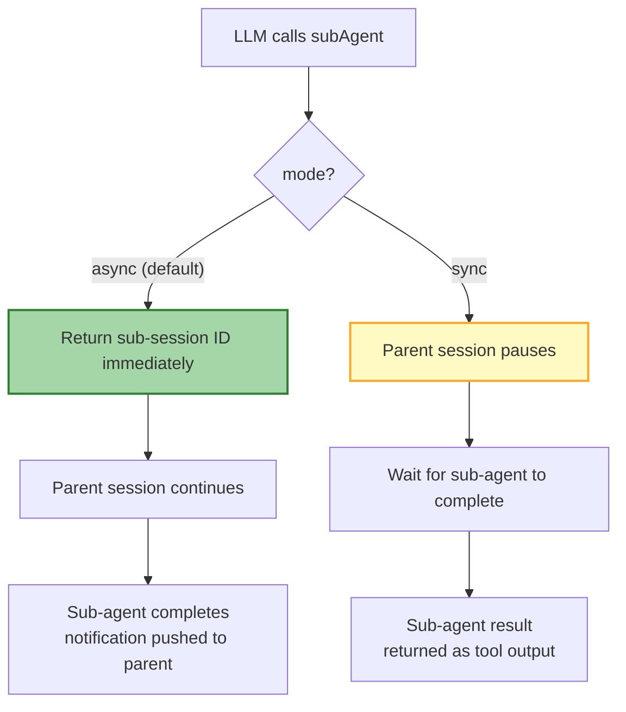
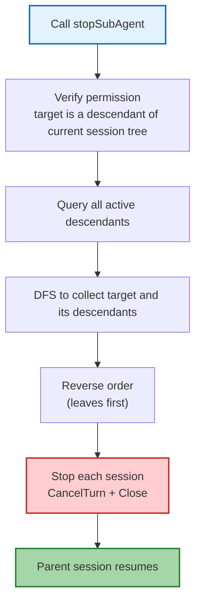
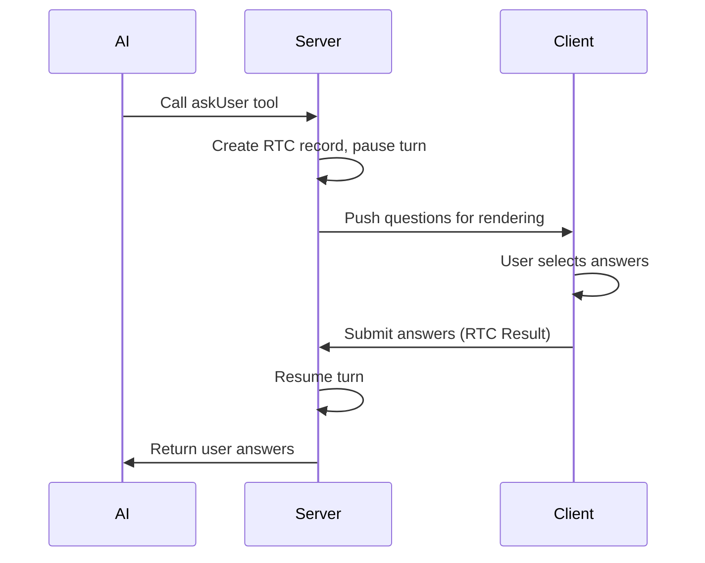
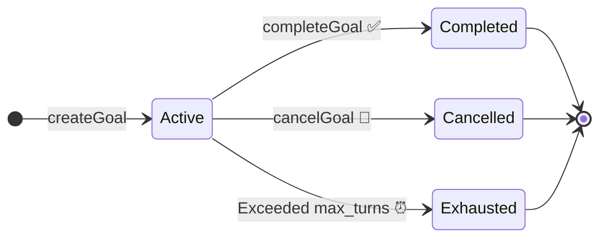
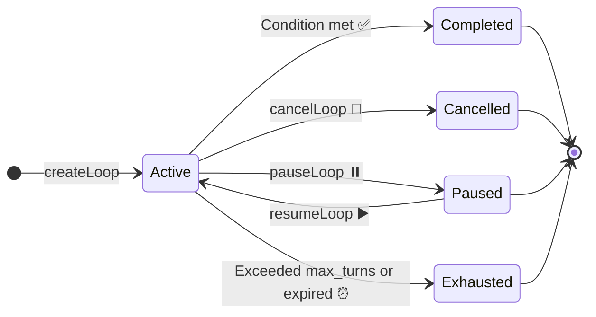

During reasoning, the AI can call a set of **built-in tools** to extend its capabilities. These tools are registered by the backend and require no additional configuration from the host application. The tools fall into two categories: **sub-agent management** (create, query, stop sub-agents) and **user interaction** (ask the user questions to gather decisions).

## Tool Overview

| Tool | Purpose | Interrupts Turn |
|------|---------|:--------------:|
| `subAgent` | Create a sub-agent session for complex, multi-step tasks | Depends on mode |
| `listSubAgent` | List all active sub-agents in the current session tree | No |
| `getSubAgentMessage` | Get the latest message from a specific sub-agent | No |
| `stopSubAgent` | Stop a specific sub-agent and all its descendant sessions | No |
| `askUser` | Ask the user 1-4 multiple-choice questions and wait for answers | Yes |
| `createGoal` | Create an autonomous goal, automatically driving subsequent turns until completion | No |
| `completeGoal` | Mark the goal as completed | No |
| `cancelGoal` | Cancel the goal | No |
| `createLoop` | Create a scheduled loop task that runs automatically at fixed intervals | No |
| `cancelLoop` | Cancel a loop task | No |
| `listLoops` | List all loop tasks in the current session | No |
| `pauseLoop` | Pause a loop task | No |
| `resumeLoop` | Resume a paused loop task | No |

---

## Sub-Agent Tools

Sub-agents are RTC Agent's **task decomposition** mechanism. The main agent can break complex tasks into sub-tasks, each running in its own session with an independent context.

### Session Hierarchy

Sub-agents form a tree hierarchy through parent/root session IDs:



| Field | Description |
|-------|-------------|
| `parent_server_session_id` | The server-side UUID of the direct parent session |
| `root_server_session_id` | The server-side UUID of the root session (inherited from the parent if the current session is already a sub-session) |

---

### subAgent — Create a Sub-Agent

Create a new sub-agent session to handle a complex, multi-step task. The sub-agent starts with a blank context, so you need to provide complete background information -- like briefing a smart colleague who just walked into the room.

#### Parameters

| Parameter | Type | Required | Description |
|-----------|------|:--------:|-------------|
| `title` | string | Yes | Short task description (3-5 words), e.g. `"OAuth authentication setup"`, `"Login button fix"` |
| `instruction` | string | Yes | Task instruction for the sub-agent. Must include all necessary context since the sub-agent starts with a blank context |
| `mode` | string | No | Execution mode: `"async"` (default) or `"sync"` |

#### Execution Modes



| Mode | Behavior | Use Case |
|------|----------|----------|
| **async** (default) | Returns the sub-session ID immediately. The parent session continues running. When the sub-agent completes, a notification message is pushed to the parent session | The parent can continue working without waiting for the result |
| **sync** | The parent session pauses (via `StatefulInterrupt`) and waits for the sub-agent to complete, then returns the result | The parent needs the sub-agent's result before continuing |

#### Usage Tips

- Be specific -- include file paths, relevant context, and approaches already ruled out
- Don't write vague instructions like "handle this task" -- the sub-agent doesn't have the current conversation context
- Keep titles short but descriptive for easy identification in lists

---

### listSubAgent — List Sub-Agents

List all active sub-agent sessions in the current session tree. Use this to check the status of spawned sub-agents.

#### Parameters

None.

#### Return Value

Returns a JSON array, each element containing:

| Field | Type | Description |
|-------|------|-------------|
| `sub_session_id` | string | Server-side UUID of the sub-session |
| `title` | string | Sub-agent title |
| `status` | string | Session status (only `active` sessions are returned) |
| `created_at` | string | Creation time (RFC 3339 format) |
| `updated_at` | string | Update time (RFC 3339 format) |

---

### getSubAgentMessage — Get Sub-Agent Message

Get the latest message from a specific sub-agent session. Use this to check a sub-agent's latest output or progress.

#### Parameters

| Parameter | Type | Required | Description |
|-----------|------|:--------:|-------------|
| `sub_session_id` | string | Yes | Server-side UUID of the target sub-session. Use `listSubAgent` to get available session IDs |

#### Return Value

Returns a JSON object:

| Field | Type | Description |
|-------|------|-------------|
| `sub_session_id` | string | Sub-session UUID |
| `sub_session_title` | string | Sub-session title |
| `sub_session_status` | string | Sub-session status |
| `message_id` | string / null | Latest message ID (null if no messages) |
| `role` | string / null | Message role (null if no messages) |
| `content` | string | Message text content |
| `created_at` | string / null | Message creation time (null if no messages) |

#### Permission Check

- The target session must be a descendant of the current session tree (`root_server_session_id` must match)
- Cannot query the current session itself

---

### stopSubAgent — Stop a Sub-Agent

Stop a specific sub-agent session and all its descendant sessions. Uses a **bottom-up** stopping order (leaf nodes first, then parents).

#### Parameters

| Parameter | Type | Required | Description |
|-----------|------|:--------:|-------------|
| `sub_session_id` | string | Yes | Server-side UUID of the target sub-session. Use `listSubAgent` to get available session IDs |

#### Return Value

Returns a JSON object:

| Field | Type | Description |
|-------|------|-------------|
| `stopped_sessions` | array | List of stopped sessions, each with `sub_session_id` and `title` |
| `total_stopped` | int | Total number of stopped sessions |

#### Stopping Flow



---

## askUser — Ask the User

The AI asks the user 1-4 multiple-choice questions to gather preferences, clarify ambiguity, understand requirements, or get decisions on implementation choices. Users can always pick "Other" to provide free-form text.

### Parameters

| Parameter | Type | Required | Description |
|-----------|------|:--------:|-------------|
| `questions` | array | Yes | 1-4 question objects |

Each question object contains:

| Field | Type | Required | Description |
|-------|------|:--------:|-------------|
| `question` | string | Yes | The complete question text, ending with a question mark |
| `header` | string | Yes | Short label (max 12 characters) displayed as a chip/tag next to the question |
| `options` | array | Yes | 2-4 options |
| `multiSelect` | boolean | No | Set to `true` to allow selecting multiple options. Default: `false` |

Each option contains:

| Field | Type | Required | Description |
|-------|------|:--------:|-------------|
| `label` | string | Yes | Option display text (1-5 words) |
| `description` | string | Yes | Explanation of what this option means or what will happen if chosen |
| `preview` | string | No | Preview content rendered when this option is focused (supports multi-line text, only for single-select questions) |

### Interaction Flow



### Usage Example

```json
{
  "questions": [
    {
      "question": "Which date formatting library should we use?",
      "header": "Date Library",
      "options": [
        {
          "label": "date-fns",
          "description": "Lightweight, tree-shakable, import only what you need"
        },
        {
          "label": "dayjs",
          "description": "Moment.js compatible API, only 2KB"
        }
      ]
    }
  ]
}
```

### Return Format

After the user answers, the AI receives text in this format:

```text
User has answered your questions: "Which date formatting library should we use?"="date-fns". You can now continue with the user's answers in mind.
```

---

## Goal Tools — Autonomous Goal Driving

The Goal system allows AI to create autonomous goals and automatically advance them across turns until completion. Each Goal has its own state lifecycle and turn-boundary checkpoint.

### Goal State



| State | Description |
|:----:|------|
| `active` | Goal is active; progress checked each turn |
| `completed` | Goal has been completed |
| `cancelled` | Goal was cancelled |
| `exhausted` | Reached max turn limit; automatically terminated |

### createGoal — Create a Goal

| Parameter | Type | Required | Description |
|------|------|:----:|------|
| `condition` | string | Yes | Description of the goal completion condition |
| `max_turns` | int | No | Maximum turn limit (default 50) |

**Execution mechanism**: After each Turn completes, the system automatically checks active Goals and increments the `completed_turns` counter. If the condition is met, the Goal is marked as `completed`; if `max_turns` is reached, it is marked as `exhausted`.

### completeGoal / cancelGoal

| Parameter | Type | Required | Description |
|------|------|:----:|------|
| `goal_id` | string | Yes | Goal ID |

---

## Loop Tools — Scheduled Recurring Tasks

The Loop system allows AI to create scheduled recurring tasks. Built on the asynq background task queue, it supports pause, resume, and automatic expiry.

### Loop State



| State | Description |
|:----:|------|
| `active` | Loop is active; triggers automatically at intervals |
| `paused` | Loop is paused; no new turns triggered |
| `completed` | Loop has completed |
| `cancelled` | Loop was cancelled |
| `exhausted` | Reached max turns or expired |

### createLoop — Create a Loop

| Parameter | Type | Required | Description |
|------|------|:----:|------|
| `prompt` | string | Yes | Prompt to execute on each cycle |
| `interval_seconds` | int | Yes | Execution interval (seconds) |
| `max_turns` | int | No | Maximum executions (default 10) |

### Other Loop Operations

| Tool | Parameter | Description |
|------|------|------|
| `cancelLoop` | `loop_id` | Cancel the loop |
| `listLoops` | None | List all loops in the current session |
| `pauseLoop` | `loop_id` | Pause the loop |
| `resumeLoop` | `loop_id` | Resume a paused loop |

> 💡 **Loop vs Goal**: A Goal is "work until the condition is met, then stop"; a Loop is "execute every N seconds". They can be combined — create a Goal inside a Loop to have AI periodically check whether a condition is satisfied.

---

## Next Steps

- [Command System](/docs/en/features/commands/) -- Learn about the slash commands available to users
- [Skill System](/docs/en/features/skill-system/) -- Learn how the host registers custom functions to extend AI capabilities
- [Session Management](/docs/en/features/session/) -- Learn about session hierarchy and context management
- [Remote Tool Calling](/docs/en/concepts/rtc/) -- Learn about the remote calling mechanism behind tool invocations
