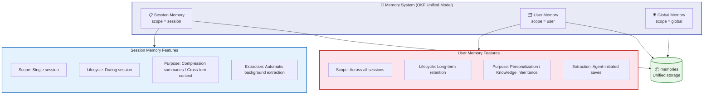
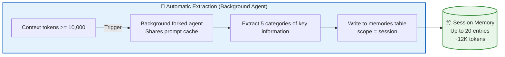
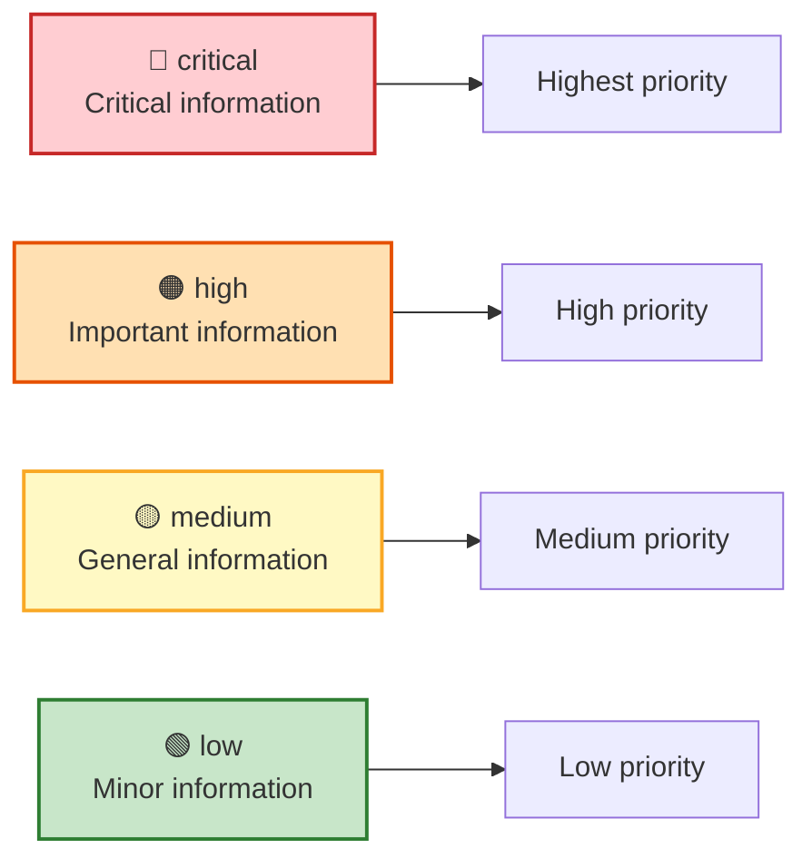
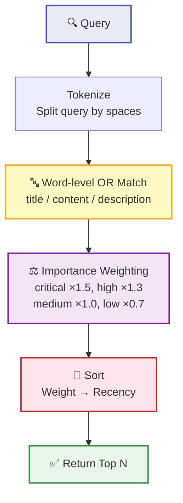
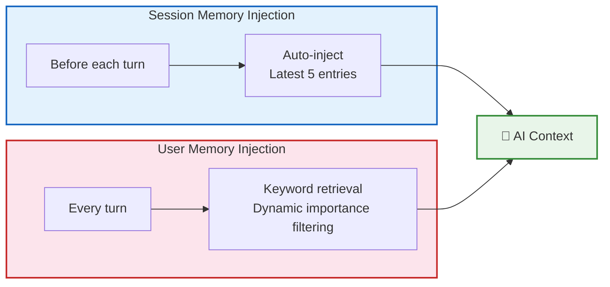
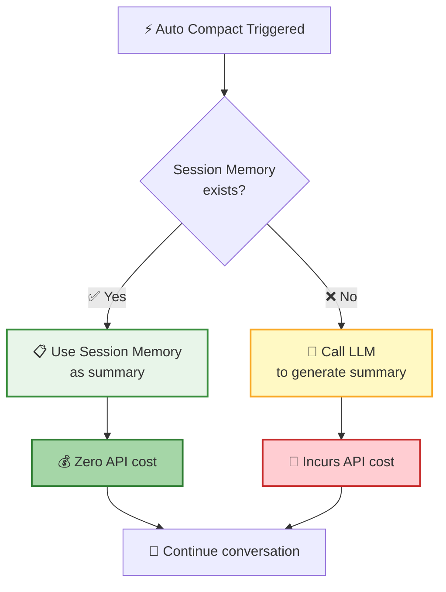
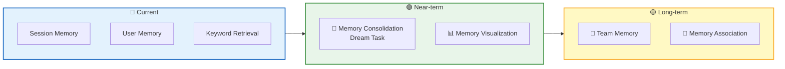

The **Memory System** gives AI a "memory." It not only tracks key decisions and progress throughout a single conversation, but also remembers your preferences, project context, and working habits across sessions — the more you use it, the better it understands you.

## OKF Unified Architecture

The memory system is built on the **OKF (Open Knowledge Format)** unified model. All memories are stored in a single knowledge base, distinguished by the **Scope** field:



| | Session Memory | User Memory |
|---|---------------|-------------|
| **Scope** | `session` | `user` |
| **Scope Boundary** | Single session | Across all sessions |
| **Lifecycle** | During session | Long-term retention |
| **Core Purpose** | Compression summaries, cross-turn context | Personalization, knowledge inheritance |
| **Extraction Method** | Automatic background extraction | Agent-initiated saves |
| **Capacity Limit** | 20 entries, ~12K tokens | 1,000 entries |

## Session Memory

### Five Categories

Session Memory distills key information from ongoing conversations into **5 categories**:

| Category | Description | Example |
|:----:|------|------|
| 🎯 `decision` | Technical decisions and design choices | "Choose PostgreSQL as the database" |
| 📍 `context` | Current task context | "Implementing user login functionality" |
| 📊 `progress` | Task progress and completion status | "Database schema design completed" |
| 🚧 `issue` | Encountered issues and solutions | "CORS error, resolved by configuring middleware" |
| 💡 `learnings` | Lessons learned and takeaways | "Connection pooling can significantly improve performance" |

### Automatic Extraction

Session Memory is **automatically extracted** by a background agent, distilling key information from ongoing conversations into 5 categories:



**Automatic extraction** is performed by a background agent, triggered by the following conditions:

| Condition | Description |
|------|------|
| Initial threshold | Context tokens >= 10,000 |
| Growth threshold | Token growth >= 5,000 |
| Tool calls | Number of tool calls >= 3 |
| Conversation breakpoint | Token threshold met + no tool calls in the last turn |

> 💡 The background agent shares the prompt cache with the main conversation, is hard-limited to at most 5 turns, and has virtually no impact on main conversation performance.

### Capacity Limits

| Limit | Value | Description |
|--------|:--:|------|
| Maximum entries | 20 | Storage limit, per single session |
| Total token limit | ~12,000 | Storage limit, approximately 9 pages of documentation |
| Injection count | 5 entries per turn, up to 5,000 tokens | Injected into context each turn |
| Overflow strategy | Delete oldest | Retain the most recent information |

## User Memory

### Four Categories

User Memory records long-term knowledge across sessions, organized into **4 categories**:

| Category | Description | Example |
|:----:|------|------|
| 👤 `user` | User role, goals, preferences | "10 years of Go experience, new to React" |
| 💬 `feedback` | User guidance on working methods | "Don't mock the database in tests" |
| 📁 `project` | Project progress, goals, decision context | "Merge freeze since 2026-03-05" |
| 🔗 `reference` | Pointers to external systems | "Pipeline bug in Linear INGEST project" |

### Importance Levels

Each User Memory entry has an importance rating that affects retrieval priority:



`feedback` and `project` type memories also contain a special structure:

```
Rule/Fact
Why: The reason provided by the user
How to apply: When/where this guidance applies
```

> 📌 This **Why + How to apply** structure helps AI understand the context and apply the right rules in the right scenarios.

### Capacity Limits

| Limit | Value | Description |
|--------|:--:|------|
| Maximum entries | 1,000 | Per single user |
| Per-entry token limit | ~1,000 | - |
| Overflow strategy | No automatic eviction | Only manual deletion supported (`deleteMemory` tool) |

## Keyword Retrieval

User Memory uses a **word-level OR matching** keyword retrieval strategy that balances recall and ranking quality:



| Stage | Strategy | Description |
|------|------|------|
| Tokenization | Space-delimited split | Query `"saveMemory tool test"` splits into 3 words |
| Matching | Word-level OR | A memory matches if it contains **any** of the words (in title/content/description) |
| Weighting | Importance weights | critical ×1.5, high ×1.3, medium ×1.0, low ×0.7 |
| Sorting | Weight + recency | Higher weight first; ties broken by most recently updated |
| Output | Top N | Default 5 results, configurable |

> 💡 Word-level OR matching provides higher recall than phrase matching — a query like `"saveMemory tool test"` matches memories containing any of `saveMemory`, `tool`, or `test`.

## Injection Strategy

Memories enter the AI's context through a carefully designed injection strategy:



| Memory Type | Injection Timing | Injection Count | Trigger |
|----------|----------|:--------:|----------|
| Session Memory | Before each turn | 5 entries, up to 5,000 tokens | Automatic |
| User Memory | Every turn | Dynamic importance filtering | Based on keyword retrieval |
| Session Memory (during compression) | Auto Compact triggered | All entries | Used as compression summary |

> 💡 User Memory is dynamically filtered by importance: `critical` / `high` are all injected, `medium` injects up to 10 entries per category, `low` is not injected.

## Session Memory Compact

When the context needs to be compressed, Session Memory can serve as a summary at **zero cost**:



| Approach | Cost | Summary Quality | Speed |
|------|------|----------|------|
| Session Memory Compact | Zero API cost | Higher (continuously updated) | Faster |
| Standard Auto Compact | One LLM call | Average (generated in one shot) | Slower |

> 📌 Session Memory is **continuously accumulated** throughout the conversation, producing a more complete and accurate summary than one generated in a single pass during compression.

## Future Roadmap



| Feature | Description |
|------|------|
| 🌙 Memory Consolidation (Dream Task) | Periodically merge duplicate memories, delete outdated ones, and extract shared knowledge |
| 👥 Team Memory | Support team-shared preferences, standards, and best practices |
| 📊 Memory Visualization | View, edit, search memories in the UI, and view usage statistics |

## Next Steps

- [Context Management](/docs/en/features/context-management/) — Learn how the memory system works with the compression system
- [Remote Tool Calling](/docs/en/concepts/rtc/) — Learn how AI executes tools on the frontend
- [Session Management](/docs/en/features/session/) — Understand memory in the context of sessions
