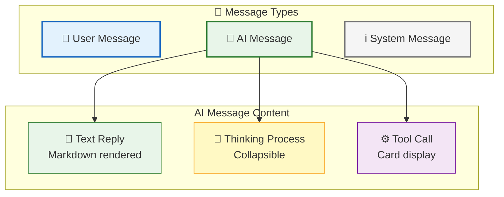
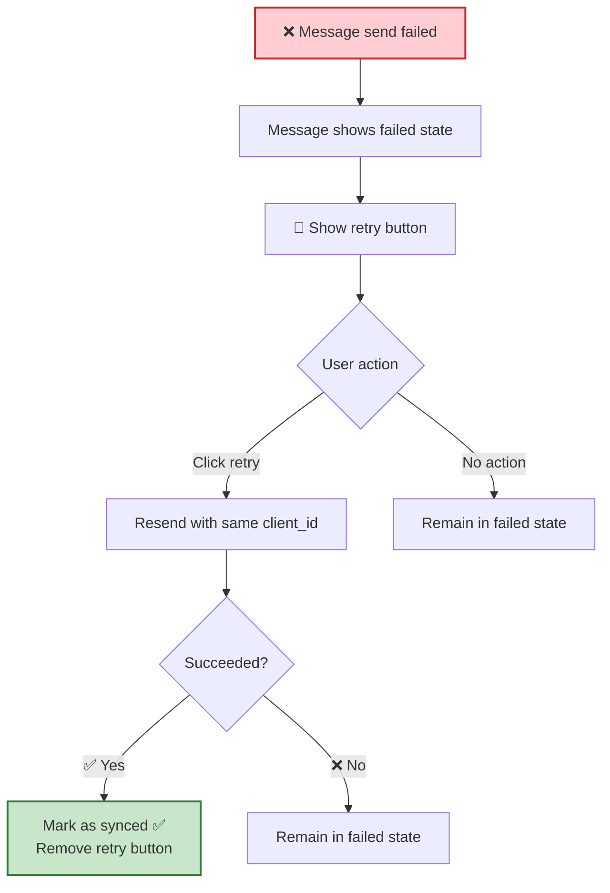
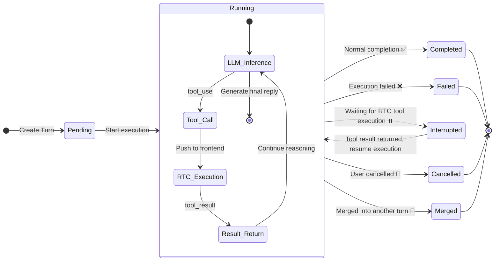
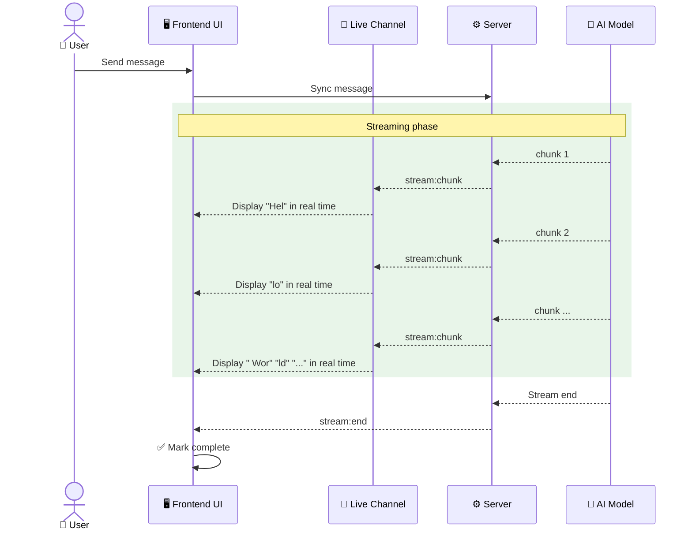
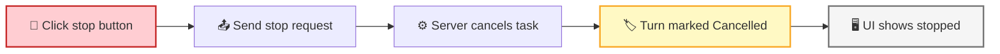
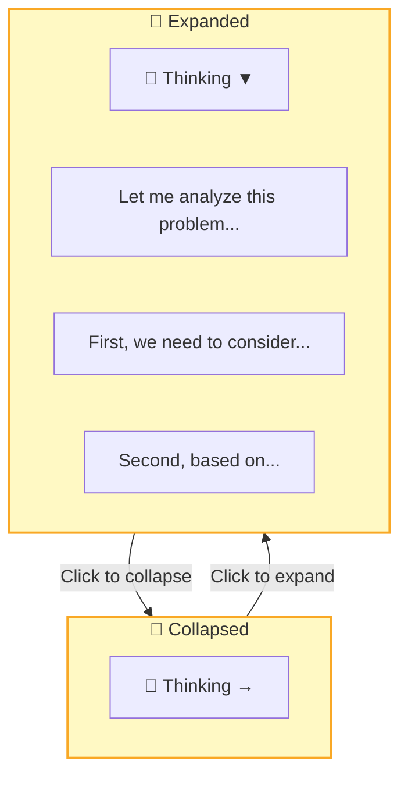
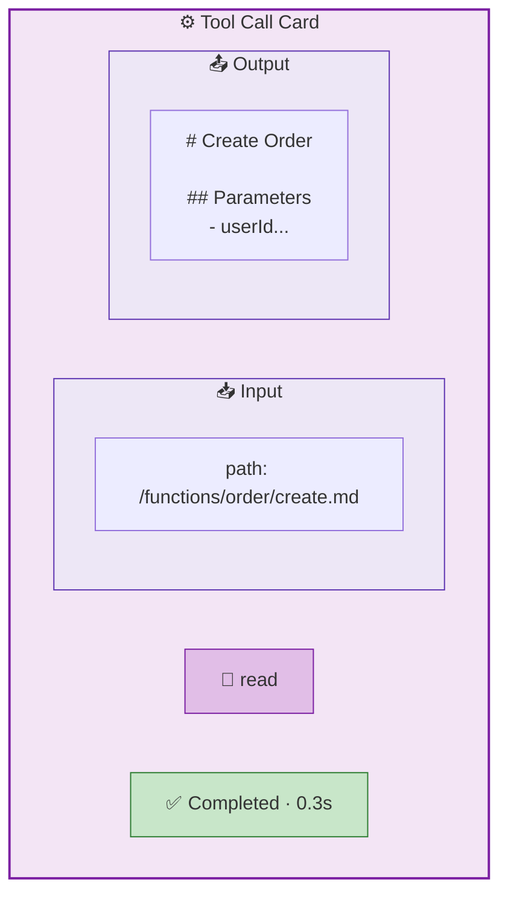
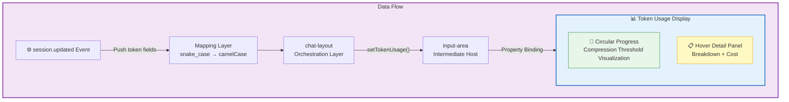

Messages are the medium for user-AI interaction. Users send messages and the AI **streams** responses, with support for Markdown rendering, code highlighting, thinking process display, and tool call cards — the entire process is visible in real time.

## Message Types



| Type | Description | Rendering |
|------|-------------|-----------|
| 💬 User Message | Content entered by the user | Plain text |
| 📝 AI Reply | Text generated by AI | Markdown + code highlighting |
| 🧠 Thinking Process | AI's reasoning process | Collapsible, Markdown rendered |
| ⚙️ Tool Call | Tool requested by AI for execution | Input/output cards |
| 📄 Summary | Compressed summary after context compaction (`summary`) | Markdown rendered |
| 📃 Plain Text | Unformatted text content (`text`) | Plain text |
| 🔧 Tool Message | Independent tool role message (`tool` role) | Input/output cards |
| 📩 User Message | User input with embedded scenarios for injection (`user_message`) | Plain text + scenario tags |
| 📜 System Prompt | Persisted system-level instructions (`prompt`) | Not directly rendered |
| ℹ️ System Message | System notifications | Plain text |

> **MessageRole** has 4 types: `user`, `assistant`, `system`, `tool`
> **ContentType** has 9 types: `text`, `markdown`, `summary`, `thinking`, `toolcall_input`, `toolcall_output`, `user_message`, `error`, `prompt`

## Message Sending Flow

```mermaid
flowchart TD
    A["👤 User enters message"] --> B["💾 Write to IndexedDB locally"]
    B --> C["✅ Display immediately in UI"]
    B --> D["📤 Background sync to server"]
    D --> E{"Sync successful?"}
    E -->|"✅ Yes"| F["Mark as synced"]
    E -->|"❌ No"| G["Mark as failed<br/>Show retry button"]
    F --> H["📋 Server creates message record"]
    H --> I["⚙️ Asynchronously create Turn"]
    I --> J["🧠 AI begins processing"]
    J --> K["📡 Stream results back"]

    style B fill:#c8e6c9,stroke:#2e7d32,stroke-width:2px
    style C fill:#e8f5e9,stroke:#388e3c,stroke-width:2px
    style G fill:#ffcdd2,stroke:#c62828,stroke-width:2px
    style K fill:#e3f2fd,stroke:#1565c0,stroke-width:2px
```



Messages use a **local-first** strategy: stored locally first for immediate display, then synced asynchronously in the background. After sending a message, the user sees it appear in the UI with **zero wait**.

## Send Failure Handling



| Sync State | User-Visible Behavior |
|:----------:|----------------------|
| `pending` | Message shows sending animation |
| `synced` | Message displays normally |
| `failed` | Message shows failure marker + 🔄 retry button |

> 💡 Retries use the same `client_id`, and the server **idempotently deduplicates**, so no duplicate messages are produced.

## Turn State Machine

Each AI processing cycle constitutes a **Turn**, which has a well-defined lifecycle:



| State | Meaning | User-Visible Behavior |
|:-----:|---------|----------------------|
| `Pending` | Waiting to execute | Message shows "Processing" |
| `Running` | Currently executing | AI streams output, tool cards flash |
| `Interrupted` | Waiting for tool execution | Tool card shows "Executing" |
| `Completed` | Normal completion | AI reply fully displayed |
| `Failed` | Execution failed | Error message shown |
| `Cancelled` | User cancelled | Stopped marker shown |
| `Merged` | Merged into another turn | Not displayed separately |

## Streaming Messages

AI replies arrive **token by token in a stream**, so users don't have to wait for the complete response:



Streaming messages are transmitted via **dual channels**:

| Channel | Purpose | Characteristics |
|---------|---------|-----------------|
| **Topic Channel** | First chunk + final complete message | Persistent, supports offline recovery |
| **Live Channel** | Intermediate chunks | Non-persistent, low latency, tolerant to loss |

> 💡 The final complete message is pushed via the Topic channel, so even if intermediate chunks are lost, the complete content is eventually received.

## Stopping a Turn

Users can stop a running turn at any time:



## AI Thinking Display

The AI's reasoning process is collapsed by default; users can expand it to view:



| Feature | Description |
|---------|-------------|
| Collapsed by default | Saves UI space |
| Click to expand | View full reasoning process |
| Streaming animation | Pulse animation effect during generation |
| Markdown rendering | Supports formatted display |

## Tool Call Cards

Each RTC tool call is displayed as a **card** with input and output sections:



| Feature | Description |
|---------|-------------|
| Sectioned Display | Input parameters and output results shown independently |
| JSON Formatting | Parameters and results auto-pretty-printed |
| Status Indicator | Running (🟠 orange pulse) / Completed (🟢 green) |
| Copy Button | One-click copy of input/output content |


## Message List

| Feature | Description |
|---------|-------------|
| 📊 Sorting | Ascending by send time (oldest first) |
| 📑 Pagination | Cursor-based pagination, loads history from server |
| 📜 Auto-scroll | Automatically scrolls to bottom when new messages arrive |
| 🔔 New Message Alert | Shows "↓ New messages" button when user scrolls away from bottom |

## Message Retry

| Scenario | Handling |
|----------|----------|
| Send failure | Marked as `failed`, retry button displayed |
| Idempotency | Uses `client_id` for deduplication; retries produce no duplicates |
| RTC failure | Exponential backoff retry (1s → 2s → 4s → ... → 30s cap) |

## user_message Content Type

`user_message` is the 7th ContentType, supporting **scenario injection** — embedding structured context within user messages that the server parses and injects as system prompts into the LLM.

### Data Structure

```json
{
  "type": "user_message",
  "data": {
    "text": "Please help me create a task",
    "scenarios": [
      {
        "filepath": "/scenarios/create-task.md",
        "title": "Create and Complete a Task",
        "file_content": "# Create Task\n\n..."
      }
    ],
    "files": []
  }
}
```

| Field | Type | Description |
|-------|------|-------------|
| `text` | string | Message text content |
| `scenarios` | `ScenarioRef[]` | Scenario list (optional), containing full file content |
| `files` | `FileAttachment[]` | File attachment list (optional, reserved) |

### ScenarioRef Structure

| Field | Type | Description |
|-------|------|-------------|
| `filepath` | string | Scenario file path |
| `title` | string | Scenario title |
| `file_content` | string | Full scenario file content (Markdown format) |

> 💡 **Injection mechanism**: The server extracts scenarios from `UserMessageContent.Scenarios` and injects them as system messages with `<scenarios>` XML tags. The final message order is: `[system] Attachments` → `[system] Scenarios` → `[system] Command prompts` → `[conversation history]`.

## Token Usage Display

The frontend uses the `rtc-token-usage` Web Component to display real-time token consumption and cost information in the input area toolbar.



### Display Items

| Display Item | Data Source | Description |
|--------------|-------------|-------------|
| Circular Progress | `compression_progress` | Current context as percentage of compression threshold |
| Total Tokens | `total_tokens` | Cumulative total token count |
| Total Cost | `total_cost_usd` | Cumulative cost in USD |
| Input/Output | `total_input_tokens` / `total_output_tokens` | Categorized token statistics |
| Cache Hit Rate | `cached_read` / `input` | Cache reads as percentage of total input (capped at 99%) |
| Estimated Next Round | `estimated_next_round_tokens` | EWMA-based prediction for next round |
| Compression Countdown | `rounds_until_compression` | Rounds remaining until auto-compression |

### Protocol Field Mapping

Snake_case fields from the backend `session.updated` event are mapped to frontend camelCase properties:

| Protocol Field (snake_case) | Frontend Property (camelCase) | Description |
|-----------------------------|-------------------------------|-------------|
| `current_context_tokens` | `currentContextTokens` | Current context token count |
| `estimated_next_round_tokens` | `estimatedNextRoundTokens` | Estimated next round tokens (circle progress numerator) |
| `compression_threshold` | `compressionThreshold` | Compression trigger threshold (circle progress denominator) |
| `compression_progress` | `compressionProgress` | Compression progress (0-100) |
| `rounds_until_compression` | `roundsUntilCompression` | Rounds until compression |
| `total_tokens` | `totalTokens` | Cumulative total tokens |
| `total_cost_usd` | `totalCostUsd` | Cumulative cost |

### Circular Progress & Color Thresholds

Circle progress formula: `estimatedNext / compressionThreshold * 100%`

| Progress Range | Color | Meaning |
|:--------------:|:-----:|---------|
| < 50% | 🔵 Blue | Context is plentiful |
| 50% - 70% | 🟡 Yellow | Approaching compression threshold |
| > 70% | 🔴 Red | Compression imminent |

> 💡 When `roundsUntilCompression` is within 0-3 rounds, the tooltip footer shows "X rounds until compression (Y%)"; at 1 or fewer rounds, it escalates to warning color.

## Next Steps

- [Session Management](/docs/en/features/session/) — Learn about the session container that holds messages
- [Remote Tool Calling](/docs/en/concepts/rtc/) — Learn about the mechanics behind tool call cards
- [Real-time Communication](/docs/en/features/realtime/) — Learn about the dual-channel architecture for streaming messages
