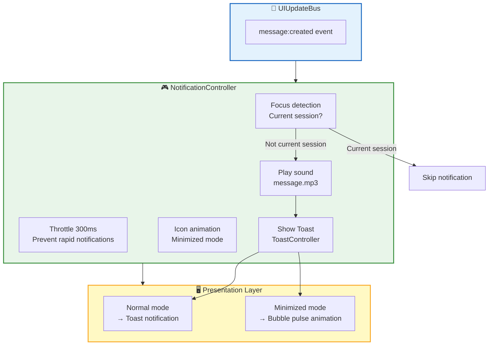
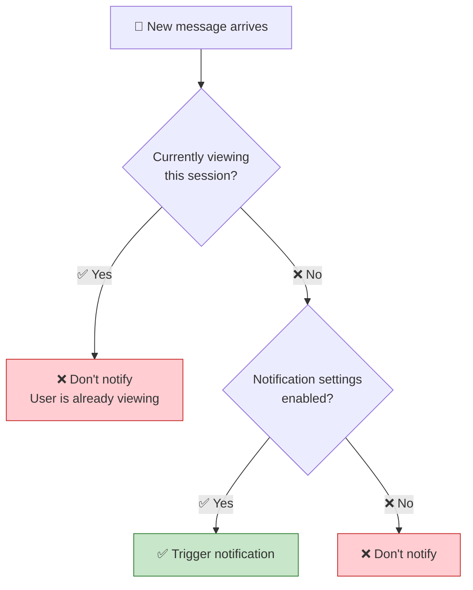
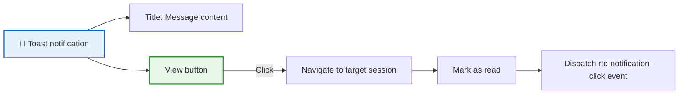
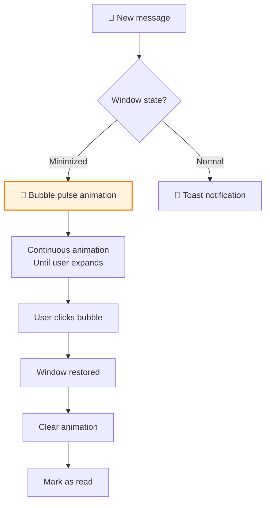

RTC Agent includes a lightweight notification system that intelligently triggers sound alerts, Toast popups, and icon animations based on user focus and window state.

## Architecture Overview



## NotificationController

`NotificationController` is the core of the notification system. It listens for message events and triggers notifications based on focus detection logic.

### Focus Detection



**Rules**:

| Scenario | Notify? |
|:--------:|:-------:|
| User is in session A, session B receives message | ✅ Notify |
| User is in session A, session A receives message | ❌ Don't notify |
| User is not viewing any session | ✅ Notify |
| User disabled notifications | ❌ Don't notify |

### State and Actions

```ts
interface NotificationState {
  unreadCount: number;         // Unread notification count
  lastNotificationAt: number | null;  // Last notification timestamp
}

interface NotificationActions {
  markAsRead(): void;  // Mark all notifications as read
  clearAll(): void;    // Clear all notification state
}
```

### Context Consumption

Get notification state via `NotificationContext`:

```ts
import { consume } from '@lit/context';
import { NotificationContext, type NotificationContextValue } from '../contexts/notification.js';

@consume({ context: NotificationContext, subscribe: true })
@state()
private _notificationCtx: NotificationContextValue;

// Get unread count
const unread = this._notificationCtx.state.unreadCount;

// Mark as read
this._notificationCtx.actions.markAsRead();
```

## Sound Notifications

### Sound Files

| Sound | File | Trigger | Loading Strategy |
|:-----:|:----:|:-------:|:----------------:|
| Message alert | `message.mp3` | New message received | Load immediately |
| Task complete | `complete.mp3` | Task execution completed | Deferred loading |
| Error alert | `error.mp3` | Error occurred | Deferred loading |

### Preloading Mechanism

```ts
// NotificationController._preloadSounds()
// Critical sound (message) loaded immediately
const soundUrls = { message: messageSoundUrl };

// Non-critical sounds loaded with delay (using requestIdleCallback)
const deferredSounds = {
  complete: completeSoundUrl,
  error: errorSoundUrl,
};
```

### Sound Configuration

Control sound toggle through the settings panel:

```ts
// SettingsState.notifications.soundEnabled
interface NotificationSettings {
  soundEnabled: boolean;  // Whether sound is enabled
  toastEnabled: boolean;  // Whether Toast is enabled
}
```

### Browser Autoplay Policy

Browsers require user interaction before playing audio. If sound is blocked, the system degrades gracefully:

```ts
sound.play().catch((error) => {
  if (error.name === 'NotAllowedError') {
    // Browser blocked autoplay, user interaction needed
    console.warn('[NotificationController] Audio playback blocked by browser');
  }
});
```

> 💡 Sound loading failure does not affect Toast and animation functionality.

## Toast Notifications

### ToastAction Buttons

Toast notifications support action buttons, allowing users to quickly navigate to the message source:



**Toast Configuration**:

```ts
// NotificationController._showToast()
this.toastController?.actions.show(
  `${title}: ${content}`,  // Notification content
  'info',                   // Type
  {
    label: msg('View'),     // Button text
    onClick: () => this._navigateToSession(sessionId),  // Click callback
  }
);
```

### Navigation Flow

After clicking the Toast "View" button:

1. Switch to the target session (`sessionController.actions.switchSession()`)
2. Mark notification as read (`actions.markAsRead()`)
3. Dispatch `rtc-notification-click` event (carrying `sessionId`)

## Minimized Bubble Animation

When the window is in minimized mode, new messages trigger the bubble icon animation:



### Animation Implementation

Control animation via CSS `data-notification` attribute:

```ts
// NotificationController._animateMinimizeIcon()
this.host.setAttribute('data-notification', 'active');
// Animation persists until user expands window or clicks bubble

// Clear animation
this.host.removeAttribute('data-notification');
```

### Visual Style

| Property | Value |
|:--------:|:-----:|
| Shape | Rounded square (border-radius: 23.2%) |
| Color | Orange → Yellow pulse |
| Animation | Continuous pulse until user interaction |

### Restoring from Minimized

When restoring from minimized, notification state is automatically cleared:

```ts
// RtcAgent._handleModeTransition()
if (this._appliedMode === 'minimized' && mode !== 'minimized') {
  this._notification.actions.markAsRead();
}
```

## Events

### rtc-notification-click

Triggered when user clicks the Toast "View" button:

```ts
interface NotificationClickDetail {
  sessionId: string;  // Target session ID
}

agent.addEventListener('rtc-notification-click', (e: CustomEvent<NotificationClickDetail>) => {
  console.log('User navigated to session:', e.detail.sessionId);
});
```

## Keyboard Accessibility

The notification system supports full keyboard interaction:

| Key | Behavior |
|:---:|:--------:|
| `Tab` | Switch focus between Toast buttons |
| `Enter` / `Space` | Activate Toast action button |
| `Esc` | Close current Toast |

Toast components use `role="alert"` and `aria-live="polite"` to ensure screen readers announce correctly.

## Throttling Mechanism

To prevent UI lag from rapid consecutive messages, the notification system implements throttling:

```ts
private static readonly NOTIFY_THROTTLE_MS = 300;

private async _handleNewMessage(event: UIUpdateEvent) {
  const now = Date.now();
  if (now - this._lastNotifyTime < NotificationController.NOTIFY_THROTTLE_MS) {
    return;  // Throttled: skip
  }
  this._lastNotifyTime = now;
  // ... trigger notification
}
```

**Parameters**:

| Parameter | Value | Description |
|:---------:|:-----:|:-----------:|
| `NOTIFY_THROTTLE_MS` | 300ms | Minimum interval between two notifications |

## Configuration Example

### Full Configuration

```ts
const agent = document.querySelector('rtc-agent');

agent.addEventListener('rtc-agent-ready', () => {
  // Configure notifications via SettingsController
  // Note: Settings are typically adjusted by users in the settings panel
  // This shows programmatic configuration

  // Listen for notification events
  agent.addEventListener('rtc-notification-click', (e) => {
    console.log('Notification clicked:', e.detail.sessionId);
  });
});
```

### Disabling Notifications

```css
/* Hide Toast via CSS */
rtc-agent {
  --rtc-toast-display: none;
}
```

Or toggle in the settings panel:

- Turn off "Enable sound" → Disable sound effects
- Turn off "Enable Toast" → Disable Toast popups

## Next Steps

- [Settings System](/docs/en/features/settings) — Learn about the global settings system
- [Component API](/docs/en/integration/component-api) — Learn about the full component API
