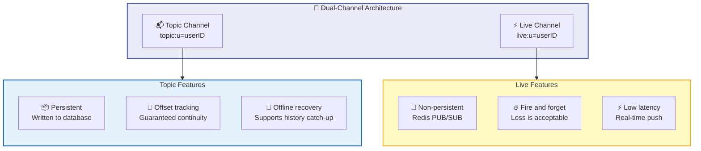
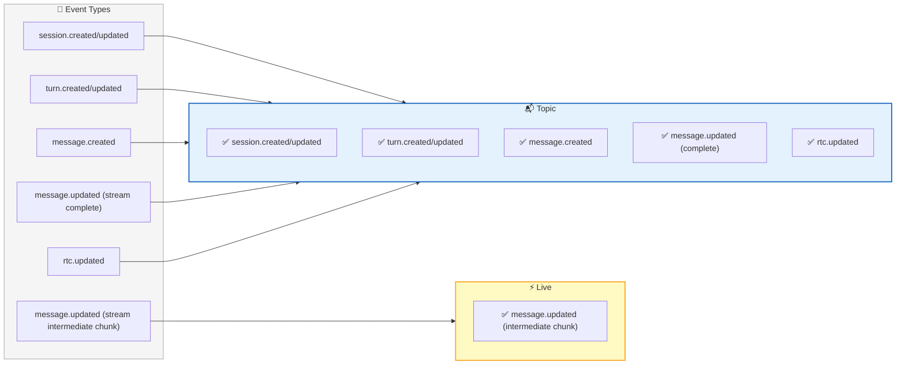
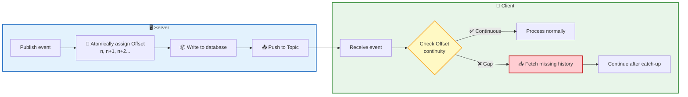
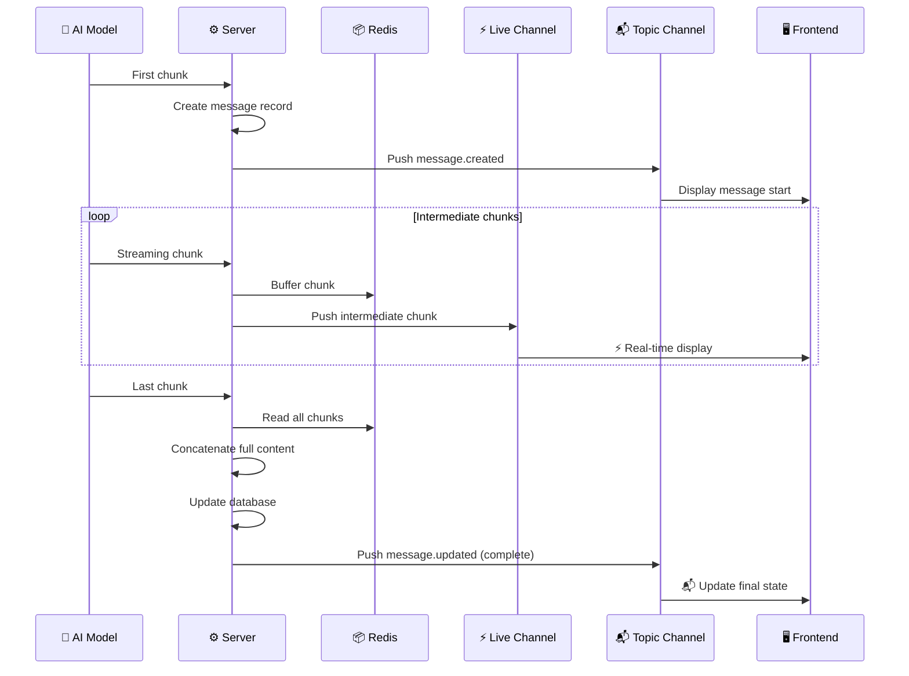
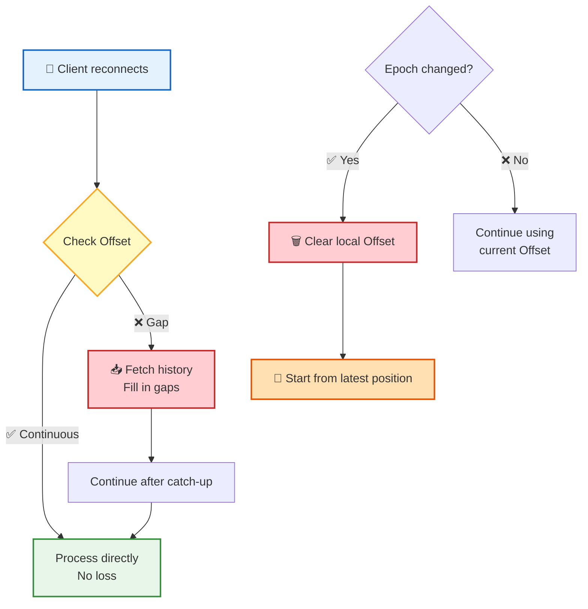
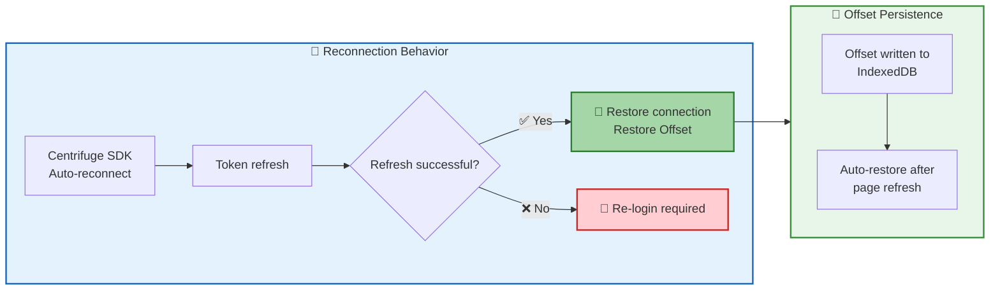
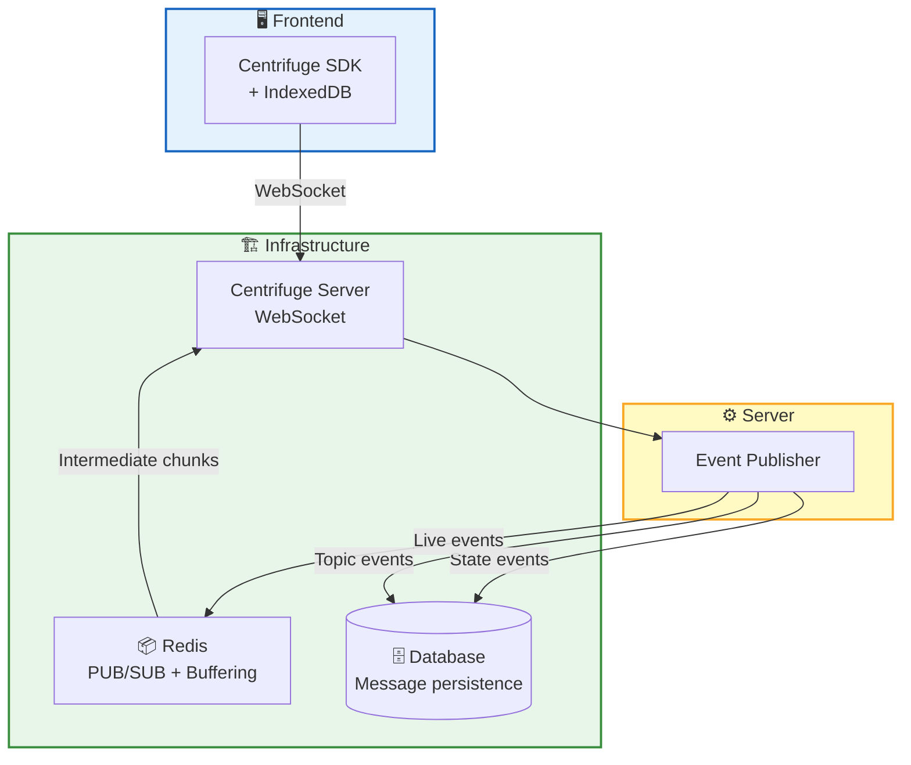

**Real-Time Communication** is the foundation of the RTC Agent user experience. Built on Centrifuge WebSocket, the system uses a **dual-channel architecture**: the Topic channel ensures no messages are lost, and the Live channel ensures low-latency streaming output — reliability and speed, without compromising either.

## Dual-Channel Architecture

| | Topic Channel | Live Channel |
|---|-----------|----------|
| **Purpose** | State change events | Streaming message intermediate chunks |
| **Persistence** | ✅ Written to database | ❌ Redis PUB/SUB |
| **Offset** | ✅ Strictly incrementing | ❌ None |
| **Offline Recovery** | ✅ Supported | ❌ Not supported |
| **Latency** | Lower (requires persistence) | Extremely low (in-memory forwarding) |

> 💡 Design principle: **Important messages go through Topic, speed-critical messages go through Live**. State changes must be delivered reliably, while losing one or two intermediate chunks of streaming output is harmless.

## Event Distribution

Different types of events are routed to different channels:

| Event Type | Topic | Live | Description |
|----------|:-----:|:----:|------|
| `session.created/updated` | ✅ | ❌ | Session state changes |
| `turn.created/updated` | ✅ | ❌ | Turn state changes |
| `message.created` | ✅ | ❌ | New message created |
| `message.updated` (stream complete) | ✅ | ❌ | Final state after stream completion |
| `message.updated` (stream intermediate chunk) | ❌ | ✅ | Intermediate fragments of streaming output |
| `rtc.updated` | ✅ | ❌ | RTC tool call state changes |

## Offset Mechanism

The Offset is the core of the Topic channel's reliability — each event is assigned a **strictly incrementing** sequence number. Clients detect lost messages by checking sequence continuity:

| Feature | Description |
|------|------|
| **Strictly incrementing** | Each Topic event's Offset is greater than the previous one |
| **Gap detection** | When the client detects an Offset gap, it automatically fetches missing history |
| **No loss, no duplicates** | Guarantees messages are neither lost nor duplicated |

## Streaming Message Flow

AI model streaming output is the most frequently perceived real-time feature by users. The system achieves both real-time and reliable streaming through **Topic + Live collaboration**:

| Phase | Channel | Action |
|------|------|------|
| First chunk | Topic | Create message record, push `message.created` |
| Intermediate chunks | Live | Append to Redis buffer, push to Live for real-time display |
| Last chunk | Topic | Concatenate full content, update database, push final state |

> 💡 **Why two steps?** The Live channel lets each chunk reach the frontend instantly, giving users a smooth typing effect. Finally, the Topic channel pushes the complete message, ensuring that even if Live lost some chunks, the final state is complete and correct.

## Offline Recovery

Network connections can't always be stable. The system provides different strategies for recovery after disconnection:

| Scenario | Behavior | User Perception |
|------|------|----------|
| 🟢 Brief disconnection | Messages from offline period are automatically pushed after reconnection | Nearly imperceptible |
| 🟡 Extended disconnection | Offset gap detected, proactively fetches history to fill in | Sees backfilled messages |
| 🔴 History cleaned up | Epoch changed, local Offset cleared, starts from latest position | Continues from current state |

**Epoch** is the timeline identifier for Offsets. When the server performs large-scale cleanup or rebuilding, the Epoch changes and clients need to reset their Offset to start from the latest position — because the old history no longer exists.

## Reconnection Mechanism

| Mechanism | Description |
|------|------|
| **Auto-reconnect** | Centrifuge SDK built-in reconnection with exponential backoff |
| **Token refresh** | Automatically refreshes authentication token when connection is restored |
| **Offset persistence** | Offset is stored in IndexedDB and restored after page refresh |
| **Fallback strategy** | User must re-login when token refresh fails |

> 📌 Offset persistence to IndexedDB means: even if the user closes the browser tab and reopens it, they can continue receiving messages from where they left off, without missing any updates.

## Architecture Overview

## Next Steps

- [Remote Tool Calling](/docs/concepts/rtc/) — Learn about the core protocol carried by real-time communication
- [Session Management](/docs/en/features/session/) — Learn how real-time events are organized within sessions
- [Context Management](/docs/en/features/context-management/) — Learn how messages are intelligently compressed
