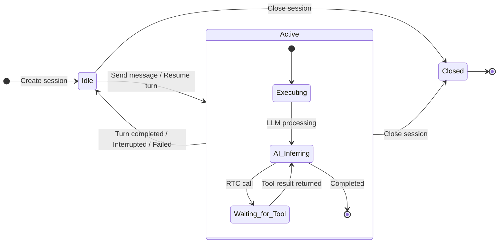
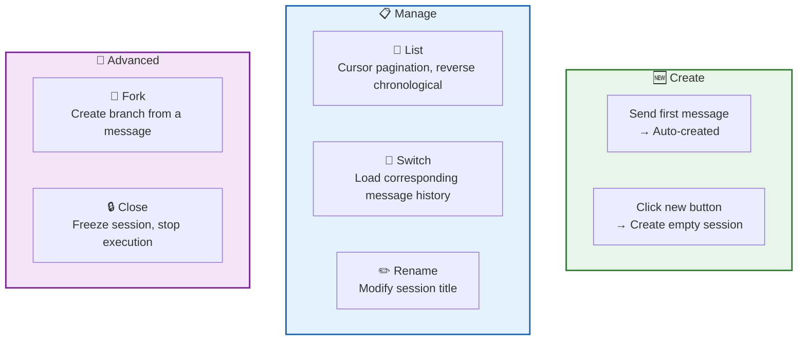
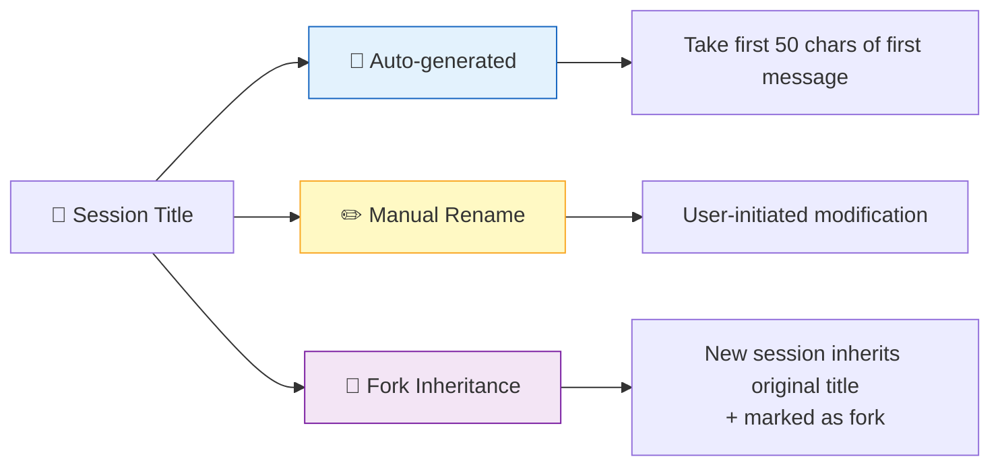
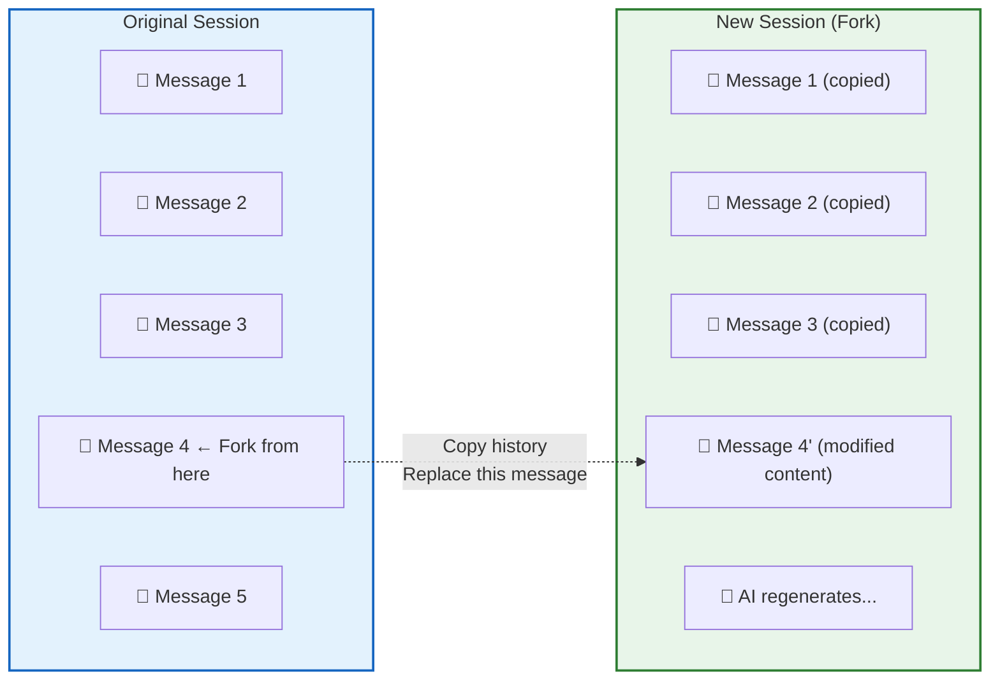
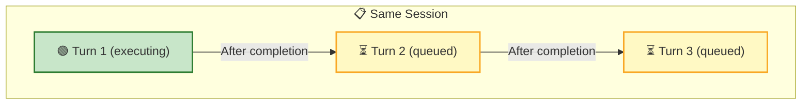
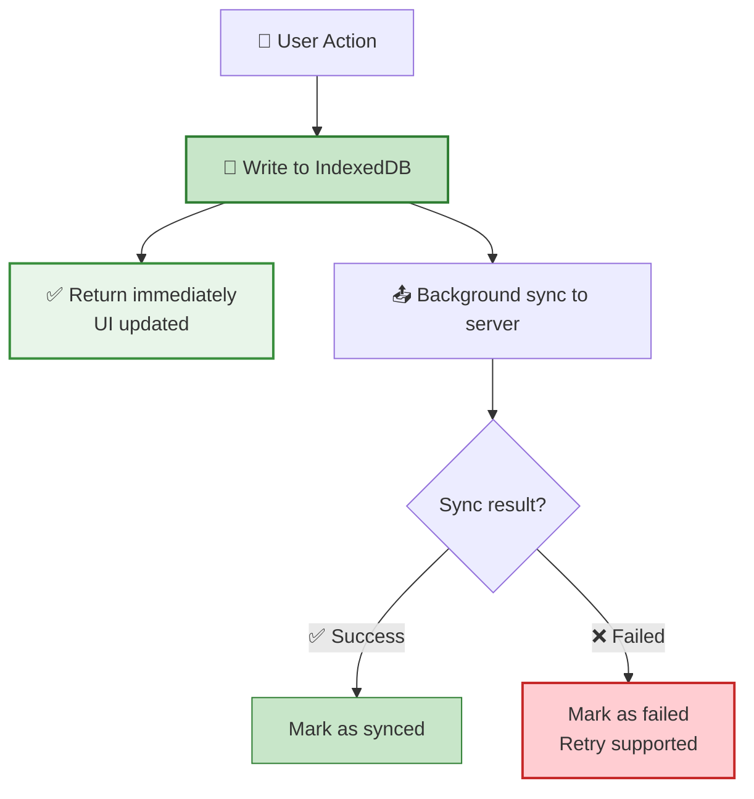
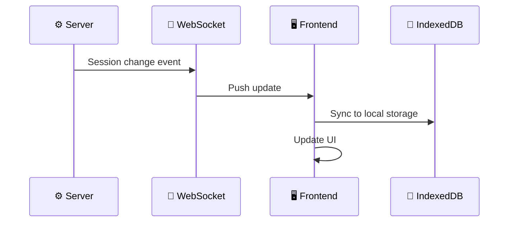

A **Session** is a container for user-AI conversations. Each session independently manages its own message history and execution state. Users can freely create, switch, and rename sessions, and can also **fork** a new session based on any historical message.

## Session States

| State | Meaning | Available Actions |
|:-----:|---------|-------------------|
| 🟢 `Idle` | Idle, ready to send new messages | Send message, Close |
| 🔵 `Active` | Turn is executing | Stop turn, Close |
| ⚫ `Closed` | Closed, no further writes allowed | View history, Fork |

## Session Operations

| Operation | Description |
|-----------|-------------|
| **Create** | Auto-created when sending the first message — no dedicated RPC; can also click the new button to create an empty session (purely frontend-local) |
| **List** | Reverse chronological by creation time, cursor-paginated |
| **Switch** | Pure frontend behavior, no RPC — loads message history from local IndexedDB |
| **Rename** | Modify the session title |
| **Fork** | Copy history based on a specific message, replace that message's content, and trigger a new AI flow |
| **Close** | Mark as `Closed` and stop the currently executing turn |

## Session Title

## Session Forking

Forking is a signature feature of RTC Agent — **unsatisfied with a previous answer? Edit the question and regenerate.**

Fork process:

| Step | Description |
|------|-------------|
| 1. Select message | Click on any historical message |
| 2. Click fork | Trigger the fork operation |
| 3. Copy history | Copy all messages before the selected message |
| 4. Replace content | Replace the selected message with new content |
| 5. Trigger AI | AI reprocesses based on the new content |

## Concurrency Constraints

| Constraint | Description |
|------------|-------------|
| **Single Turn Execution** | Only one turn can execute at a time per session |
| **Ownership Isolation** | Users can only operate on their own sessions |
| **Closed = Frozen** | Closed sessions cannot accept new messages |

## Local-First

RTC Agent adopts a **Local-First** data strategy — all operations are written locally first, then asynchronously synced to the server.

| Advantage | Description |
|-----------|-------------|
| ⚡ **Instant Response** | Returns after writing locally, no network wait |
| 📴 **Offline Capable** | Operations work offline, auto-sync on reconnection |
| 🔄 **Auto Retry** | Failed syncs marked as `failed`, manual retry supported |

## Real-time Updates

The server pushes session changes via WebSocket, and the frontend syncs automatically:

Pushed change types:

| Event | Description |
|-------|-------------|
| Created | A new session was created (e.g., auto-created) |
| Updated | Session title modified, state changed |
| Closed | Session was closed |

## Next Steps

- [Messaging](/docs/en/features/messaging/) — Learn about message interactions within sessions
- [Remote Tool Calling](/docs/en/concepts/rtc/) — Learn about tool calling within turns
- [Command System](/docs/en/features/commands/) — Learn about session-level commands (/compact, /loop, /goal)
