A **Session** is a container for user-AI conversations. Each session independently manages its own message history and execution state. Users can freely create, switch, and rename sessions, and can also **fork** a new session based on any historical message.

## Session States

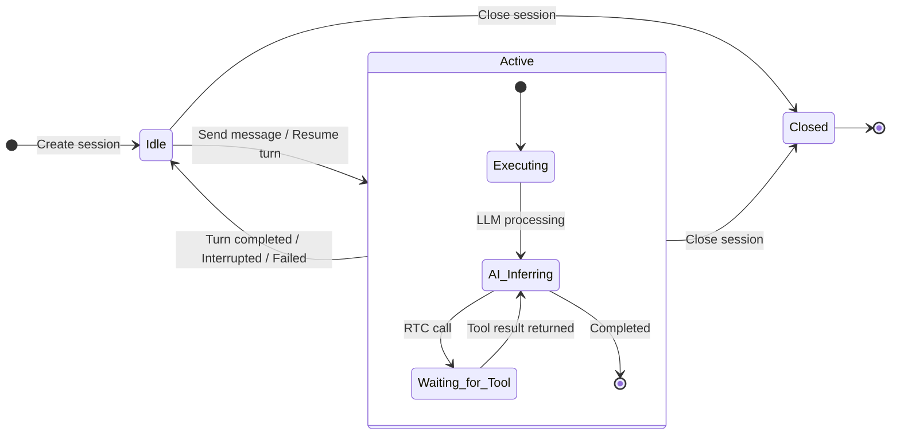

| State | Meaning | Available Actions |
|:-----:|---------|-------------------|
| 🟢 `Idle` | Idle, ready to send new messages | Send message, Close |
| 🔵 `Active` | Turn is executing | Stop turn, Close |
| ⚫ `Closed` | Closed, no further writes allowed | View history, Fork |

## Session Operations

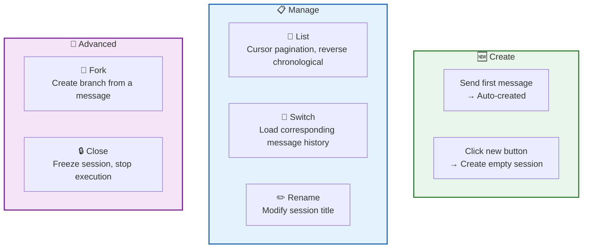

| Operation | Description |
|-----------|-------------|
| **Create** | Auto-created when sending the first message — no dedicated RPC; can also click the new button to create an empty session (purely frontend-local) |
| **List** | Reverse chronological by creation time, cursor-paginated |
| **Switch** | Pure frontend behavior, no RPC — loads message history from local IndexedDB |
| **Rename** | Modify the session title |
| **Fork** | Copy history based on a specific message, replace that message's content, and trigger a new AI flow |
| **Close** | Mark as `Closed` and stop the currently executing turn |

## Session Title

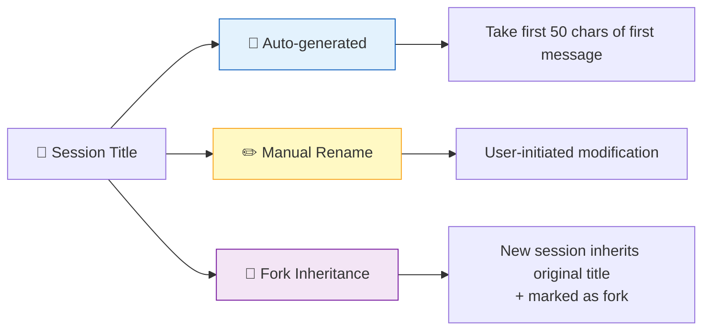

## Session Forking

Forking is a signature feature of RTC Agent — **unsatisfied with a previous answer? Edit the question and regenerate.**

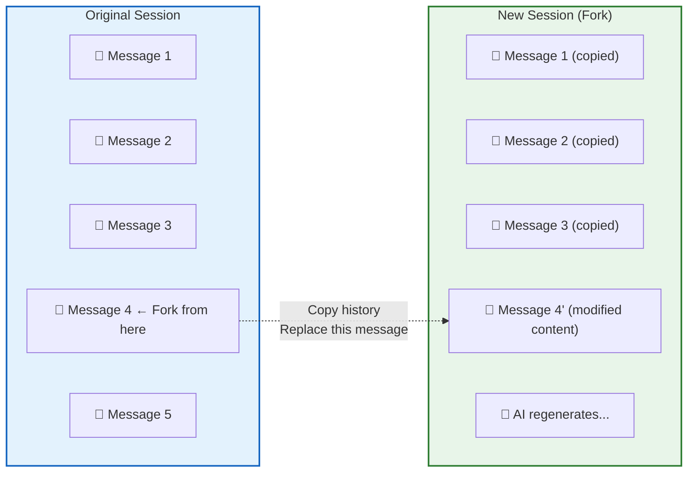

Fork process:

| Step | Description |
|------|-------------|
| 1. Select message | Click on any historical message |
| 2. Click fork | Trigger the fork operation |
| 3. Copy history | Copy all messages before the selected message |
| 4. Replace content | Replace the selected message with new content |
| 5. Trigger AI | AI reprocesses based on the new content |

## Concurrency Constraints

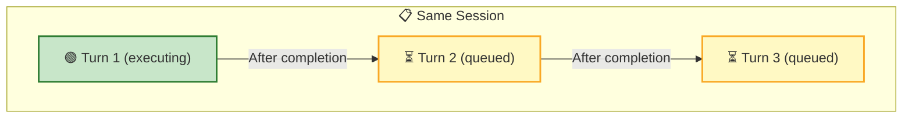

| Constraint | Description |
|------------|-------------|
| **Single Turn Execution** | Only one turn can execute at a time per session |
| **Ownership Isolation** | Users can only operate on their own sessions |
| **Closed = Frozen** | Closed sessions cannot accept new messages |

## Local-First

RTC Agent adopts a **Local-First** data strategy — all operations are written locally first, then asynchronously synced to the server.

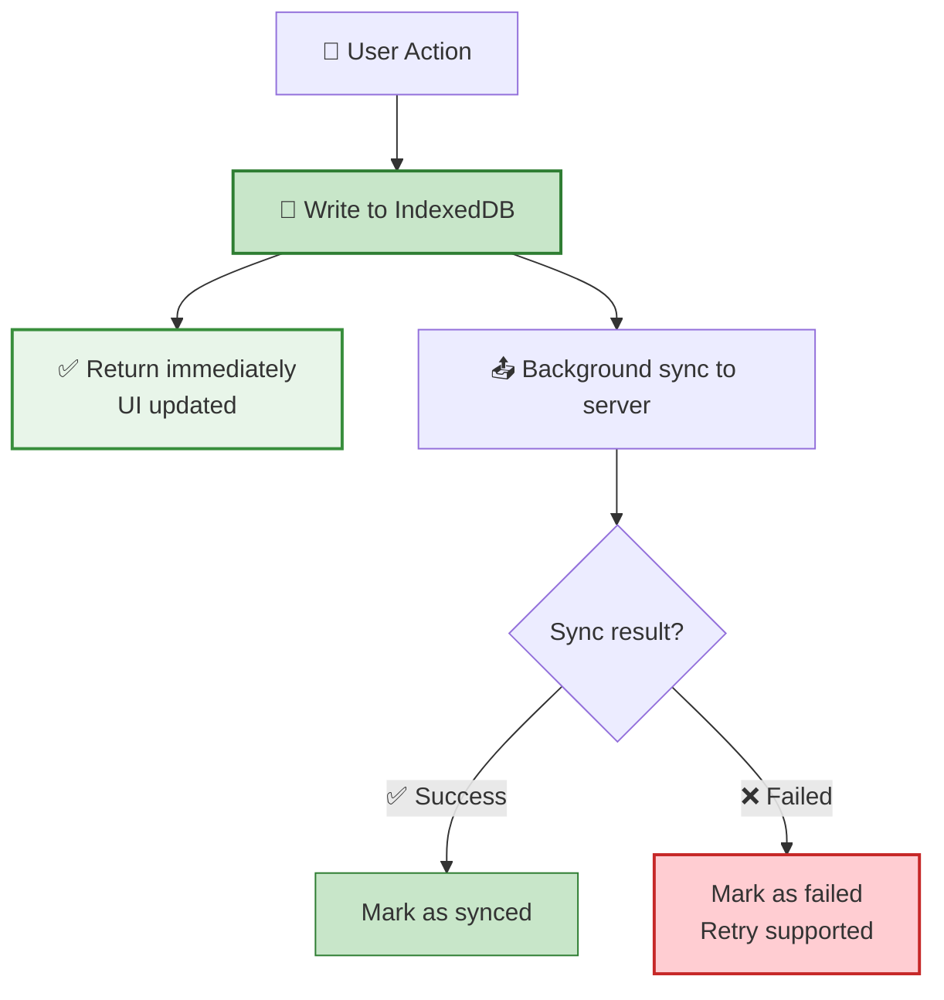

| Advantage | Description |
|-----------|-------------|
| ⚡ **Instant Response** | Returns after writing locally, no network wait |
| 📴 **Offline Capable** | Operations work offline, auto-sync on reconnection |
| 🔄 **Auto Retry** | Failed syncs marked as `failed`, manual retry supported |

## Real-time Updates

The server pushes session changes via WebSocket, and the frontend syncs automatically:

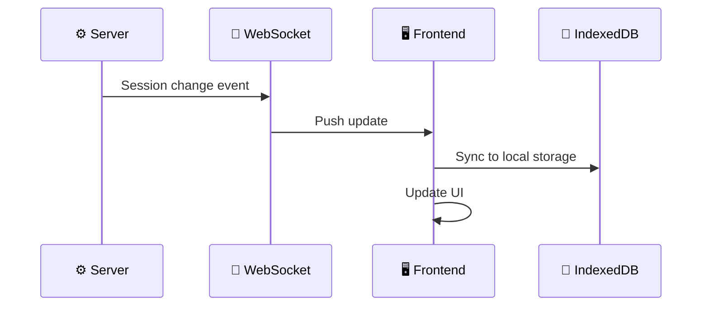

Pushed change types:

| Event | Description |
|-------|-------------|
| Created | A new session was created (e.g., auto-created) |
| Updated | Session title modified, state changed |
| Closed | Session was closed |

## Session Tree & Navigation

RTC Agent provides two session navigation methods: **Session Tree** (sidebar) and **Session Tabs** (tab bar), each suited for different use cases.

### Session Tree

The session tree is a VS Code-style hierarchical structure, ideal for managing large numbers of sessions and viewing session relationships.

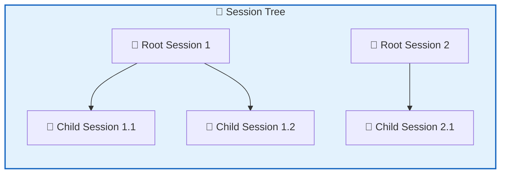

**Components**:
- `<rtc-session-tree>` — Session tree container with refresh, new, and delete buttons
- `<rtc-session-tree-item>` — Individual tree node with recursive child rendering

**Features**:
- 📂 **Hierarchical Structure**: Supports parent-child session relationships (linked via `rootClientSessionId`)
- 🔽 **Expand/Collapse**: Click arrow icons to expand or collapse child sessions
- ⌨️ **Keyboard Navigation**: Full ARIA `role="tree"` support (arrow keys, Home, End, Enter)
- 🎯 **Selection Highlight**: Currently selected session is highlighted

**Events**:

| Event | Description |
|-------|-------------|
| `rtc-session-tree-select` | User clicks or keyboard-activates a session node |
| `rtc-session-tree-toggle` | User clicks expand/collapse arrow |
| `rtc-session-tree-new` | User clicks new session button |
| `rtc-session-delete-requested` | User clicks delete button |

> ⚠️ **Breaking Change**: The new session creation event has been renamed from `rtc-new-session` to `rtc-session-tree-new` for better naming consistency.

### Session Tabs

Session tabs are browser-style tabs for quick switching between sessions.

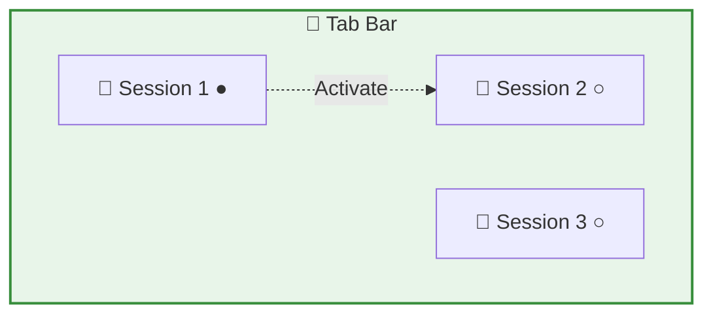

**Components**:
- `<rtc-session-tab-bar>` — Tab bar container
- `<rtc-session-tab>` — Individual tab

**Features**:
- 🔄 **Quick Switching**: Click a tab to switch sessions
- ❌ **Close Tabs**: Click the close button on a tab
- 💾 **State Persistence**: Tab order and active state saved to localStorage
- 📝 **Unsaved Drafts**: Supports temporary session tabs not yet persisted

### Chat Layout

`<rtc-chat-layout>` is the new main chat interface layout component, integrating session tree and tab bar:

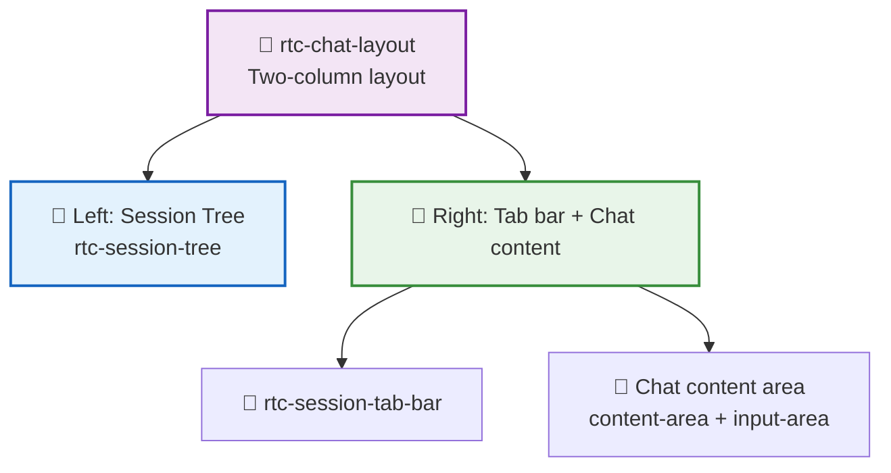

**Attributes**:

| Attribute | Type | Default | Description |
|-----------|------|---------|-------------|
| `sessionTreeVisible` | `boolean` | `true` | Whether to show the left session tree |
| `theme` | `'light' \| 'dark' \| 'system'` | `'system'` | Theme mode |

**Usage Example**:

```html
<!-- Default: show session tree -->
<rtc-chat-layout></rtc-chat-layout>

<!-- Hide session tree (show tab bar only) -->
<rtc-chat-layout session-tree-visible="false"></rtc-chat-layout>
```

### Controller Collaboration

Session tree and tabs are managed by two independent Controllers that collaborate through events:

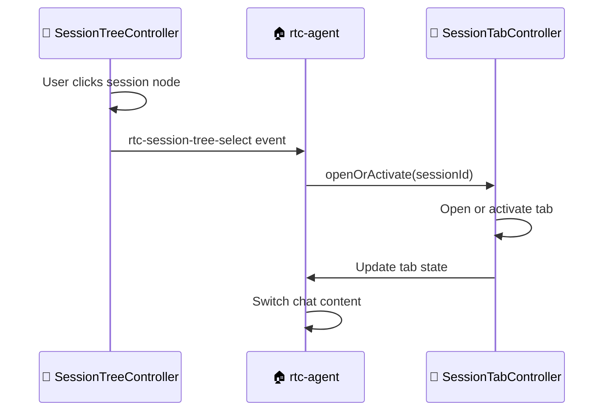

- **SessionTreeController**: Manages tree structure and expand state
- **SessionTabController**: Manages tab state and persistence
- **Collaboration**: Event-driven, with root component `<rtc-agent>` as the central orchestrator

## Token Usage & Cost Tracking

Each Session automatically accumulates LLM token consumption and cost, pushed to the frontend in real-time via `session.updated` events.

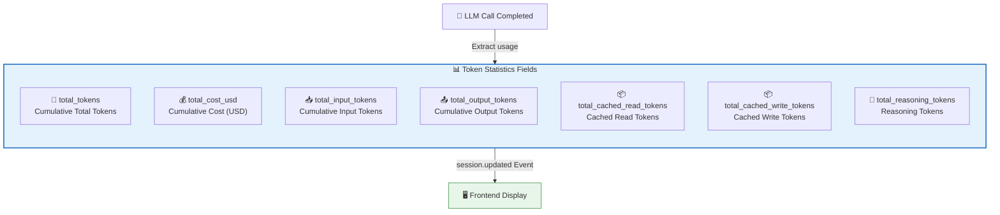

### Token Statistics Fields

| Field | Type | Description |
|-------|------|-------------|
| `total_tokens` | int64 | Cumulative total token count (all types) |
| `total_input_tokens` | int64 | Cumulative pure input tokens (excluding cached read/write) |
| `total_output_tokens` | int64 | Cumulative output token count |
| `total_cached_read_tokens` | int64 | Cumulative cached read token count |
| `total_cached_write_tokens` | int64 | Cumulative cached write token count |
| `total_reasoning_tokens` | int64 | Cumulative reasoning token count |
| `total_cost_usd` | float64 | Cumulative cost in USD |
| `last_token_update_at` | time | Last token statistics update timestamp |

### Token Estimation Fields

| Field | Type | Description |
|-------|------|-------------|
| `current_context_tokens` | int64 | Actual current context token count (written back by server cumulativeTokenCounter, updated with real value after compression) |
| `estimated_next_round_tokens` | int64 | EWMA-based prediction for next round tokens |
| `compression_progress` | float64 | Compression progress (0-100), computed from `current_context_tokens` and `compression_threshold` |
| `compression_threshold` | int64 | Compression trigger threshold (contextTokensLimit - autoCompactBufferTokens) |
| `rounds_until_compression` | int | Rounds until compression (-1 means threshold exceeded) |

> 💡 `current_context_tokens` replaces the old `total_tokens` as the baseline for compression progress display. After compression completes, this value is written back with the actual post-compression context size. For older sessions where this field is not yet initialized, the frontend falls back to `total_tokens`.

### Cost Calculation

The system supports multi-dimensional cost calculation, automatically computed based on model pricing configuration:

| Dimension | Description |
|-----------|-------------|
| Input Tokens | Cost for non-cached pure input tokens |
| Output Tokens | Cost for output tokens |
| Cached Read | Cost for cache-hit tokens (typically lower) |
| Cached Write | Cost for cache-write tokens |
| Reasoning Tokens | Cost for reasoning tokens (e.g., thinking) |

> 💡 Token statistics use a throttling mechanism (Throttle) to control the push frequency of `session.updated` events, avoiding event storms. The frontend displays this data via the `rtc-token-usage` component.

## Next Steps

- [Messaging](/docs/en/features/messaging/) — Learn about message interactions within sessions
- [Remote Tool Calling](/docs/en/concepts/rtc/) — Learn about tool calling within turns
- [Command System](/docs/en/features/commands/) — Learn about session-level commands (/compact, /loop, /goal)
