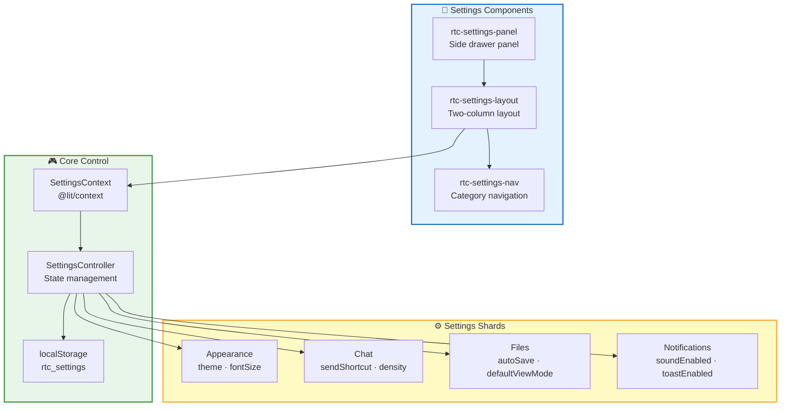
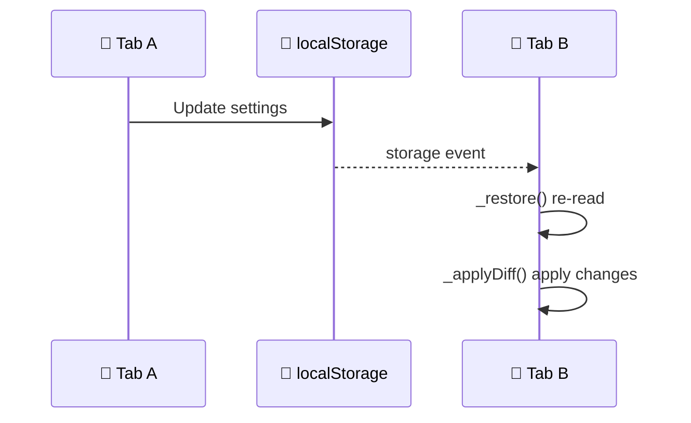
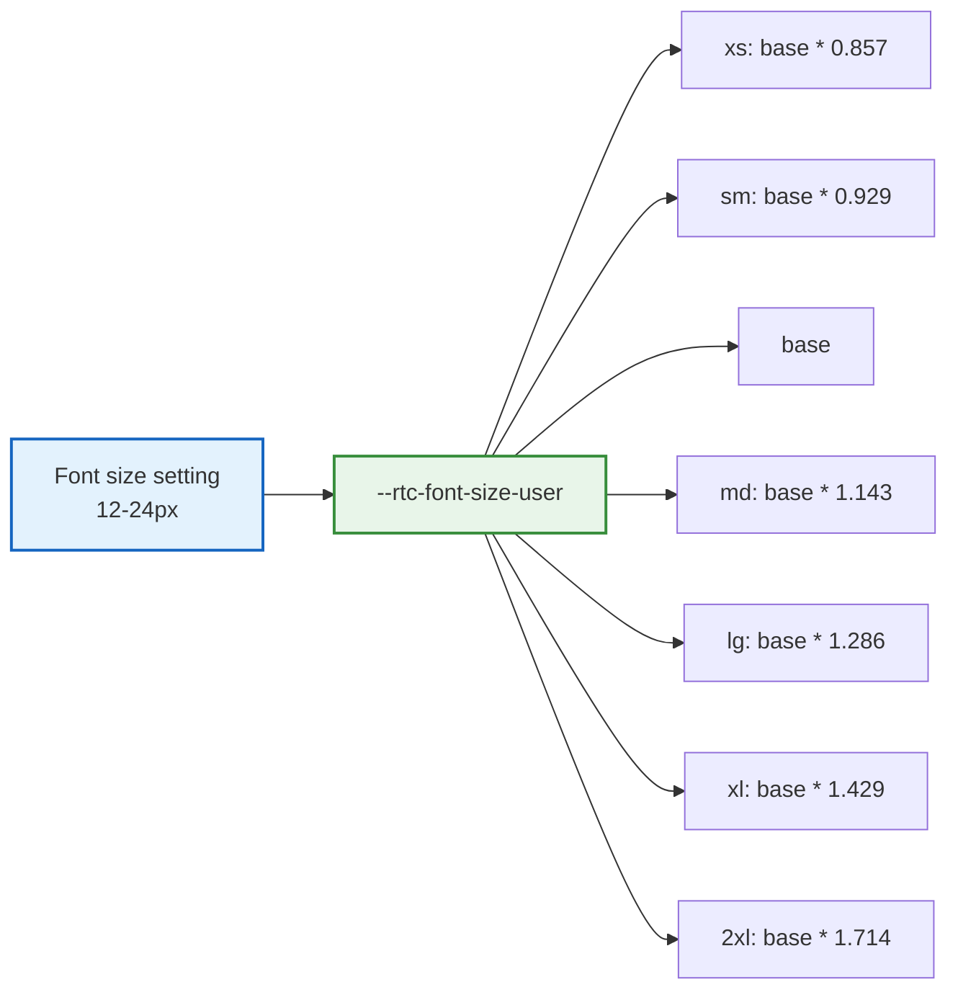

RTC Agent provides a complete global settings system supporting four categories: appearance, chat, files, and notifications. All settings are persisted to `localStorage` with multi-tab synchronization.

## Architecture Overview



## Components

### rtc-settings-panel

Side drawer panel wrapping `rtc-settings-layout`, providing overlay and keyboard navigation:

```html
<rtc-settings-panel theme="system"></rtc-settings-panel>
```

**Attributes**:

| Attribute | Type | Default | Description |
|:---------:|:----:|:-------:|:-----------:|
| `theme` | `'light' \| 'dark' \| 'system'` | `'system'` | Theme mode |

**Events**:

| Event | Description |
|:-----:|:-----------:|
| `close` | Triggered when the panel is closed |

**Keyboard Support**:

| Key | Behavior |
|:---:|:--------:|
| `Esc` | Close panel |
| Click overlay | Close panel |

### rtc-settings-layout

Two-column layout component: left column for category navigation + right column for settings content.

```html
<rtc-settings-layout theme="system"></rtc-settings-layout>
```

**Attributes**:

| Attribute | Type | Default | Description |
|:---------:|:----:|:-------:|:-----------:|
| `theme` | `'light' \| 'dark' \| 'system'` | `'system'` | Theme mode |

**Accessibility**:

- Uses `delegatesFocus: true` for keyboard focus delegation
- Uses `role="tabpanel"` and `aria-labelledby` to associate navigation
- Uses `aria-live="polite"` for screen reader real-time feedback

### rtc-settings-nav

Left-side category navigation component:

```html
<rtc-settings-nav .active=${'appearance'}></rtc-settings-nav>
```

**Properties**:

| Property | Type | Default | Description |
|:--------:|:----:|:-------:|:-----------:|
| `active` | `SettingsCategory` | `'appearance'` | Currently selected category |

**Events**:

| Event | Detail | Description |
|:-----:|:------:|:-----------:|
| `settings-nav-change` | `{ category: SettingsCategory }` | Category switch |

**Categories**:

| Category | Value | Icon |
|:--------:|:-----:|:----:|
| Appearance | `appearance` | ⚙️ |
| Chat | `chat` | 💬 |
| Files | `files` | 📁 |
| Notifications | `notifications` | ☑️ |
| Account | `account` | 👤 |
| About | `about` | 📝 |

## SettingsContext

### Type Definitions

```ts
interface SettingsState {
  appearance: {
    theme: 'light' | 'dark' | 'system';
    fontSize: number;  // 12-24px
  };
  chat: {
    sendShortcut: 'Enter' | 'Ctrl+Enter';
    density: 'compact' | 'comfortable';
  };
  files: {
    autoSave: boolean;
    defaultViewMode: 'edit' | 'preview' | 'split';
  };
  notifications: {
    soundEnabled: boolean;
    toastEnabled: boolean;
  };
}

interface SettingsActions {
  updateAppearance(partial: Partial<SettingsState['appearance']>): void;
  updateChat(partial: Partial<SettingsState['chat']>): void;
  updateFiles(partial: Partial<SettingsState['files']>): void;
  updateNotifications(partial: Partial<SettingsState['notifications']>): void;
  resetAll(): void;
}

interface SettingsContextValue {
  state: SettingsState;
  actions: SettingsActions;
}
```

### Default Values

```ts
const DEFAULT_SETTINGS_STATE: SettingsState = {
  appearance: { theme: 'system', fontSize: 14 },
  chat: { sendShortcut: 'Enter', density: 'comfortable' },
  files: { autoSave: true, defaultViewMode: 'split' },
  notifications: { soundEnabled: true, toastEnabled: true },
};
```

### Consuming Context

```ts
import { consume } from '@lit/context';
import { SettingsContext, type SettingsContextValue } from '../contexts/settings.js';

@consume({ context: SettingsContext, subscribe: true })
@property({ attribute: false })
private _settingsCtx: SettingsContextValue;

// Read settings
const theme = this._settingsCtx.state.appearance.theme;
const fontSize = this._settingsCtx.state.appearance.fontSize;

// Update settings
this._settingsCtx.actions.updateAppearance({ fontSize: 16 });
this._settingsCtx.actions.updateChat({ sendShortcut: 'Ctrl+Enter' });
```

## SettingsController

### Persistence

Settings are saved to `localStorage` with key `rtc_settings`:

```ts
// Read
const raw = localStorage.getItem(STORAGE_KEYS.settings);
const saved = JSON.parse(raw);

// Write
localStorage.setItem(STORAGE_KEYS.settings, JSON.stringify(this._state));
```

### DOM Side Effects

SettingsController automatically handles DOM side effects:

| Setting | DOM Side Effect |
|:-------:|:---------------:|
| `appearance.theme` | Updates `rtc-agent` element's `theme` attribute |
| `appearance.fontSize` | Sets `--rtc-font-size-user` CSS variable on `document.documentElement` |

```ts
// _applyTheme()
const rtcAgent = this.host.closest('rtc-agent') || this.host;
if ('theme' in rtcAgent) {
  rtcAgent.theme = theme;
}

// _applyFontSize()
document.documentElement.style.setProperty(
  '--rtc-font-size-user',
  `${clamped}px`
);
```

### Multi-Tab Synchronization

Listens for `storage` events to synchronize across tabs:



```ts
// SettingsController.hostConnected()
window.addEventListener('storage', this._storageListener);

// SettingsController._handleStorageChange()
private _handleStorageChange() {
  const oldState = this._state;
  this._restore();
  this._applyDiff(oldState, this._state);
  this.host.requestUpdate();
}
```

### System Theme Monitoring

Monitors system theme changes, automatically following when `theme: 'system'`:

```ts
this._themeMediaQuery = window.matchMedia('(prefers-color-scheme: dark)');
this._themeMediaQuery.addEventListener('change', () => {
  if (this._state.appearance.theme === 'system') {
    this._applyTheme();
  }
});
```

## Settings Details

### Appearance Settings

| Setting | Type | Default | Description |
|:-------:|:----:|:-------:|:-----------:|
| `theme` | `'light' \| 'dark' \| 'system'` | `'system'` | Theme mode |
| `fontSize` | `number` | `14` | Base font size (12-24px) |



### Chat Settings

| Setting | Type | Default | Description |
|:-------:|:----:|:-------:|:-----------:|
| `sendShortcut` | `'Enter' \| 'Ctrl+Enter'` | `'Enter'` | Send message shortcut |
| `density` | `'compact' \| 'comfortable'` | `'comfortable'` | Message density |

**sendShortcut**:

| Value | Behavior |
|:-----:|:--------:|
| `Enter` | Press Enter to send, Shift+Enter for newline |
| `Ctrl+Enter` | Press Ctrl/Cmd+Enter to send, Enter for newline |

**density**:

| Value | Message Spacing |
|:-----:|:--------------:|
| `compact` | Compact (smaller spacing) |
| `comfortable` | Comfortable (default spacing) |

### File Settings

| Setting | Type | Default | Description |
|:-------:|:----:|:-------:|:-----------:|
| `autoSave` | `boolean` | `true` | Auto-save when editing |
| `defaultViewMode` | `'edit' \| 'preview' \| 'split'` | `'split'` | Default view mode |

**defaultViewMode**:

| Value | Description |
|:-----:|:-----------:|
| `edit` | Editor only |
| `preview` | Preview only |
| `split` | Editor + Preview split |

### Notification Settings

| Setting | Type | Default | Description |
|:-------:|:----:|:-------:|:-----------:|
| `soundEnabled` | `boolean` | `true` | Enable sound notifications |
| `toastEnabled` | `boolean` | `true` | Enable Toast notifications |

## Usage Examples

### Programmatic Configuration

```ts
const agent = document.querySelector('rtc-agent');

agent.addEventListener('rtc-agent-ready', () => {
  // Get SettingsController (via Context)
  // Note: Typically operated by users in the settings panel
  
  // Listen for setting changes (by subscribing to Context)
});
```

### Using in Components

```ts
import { localized, msg } from '@lit/localize';
import { consume } from '@lit/context';
import { SettingsContext, type SettingsContextValue } from '../contexts/settings.js';

@localized()
@customElement('my-chat-component')
export class MyChatComponent extends LitElement {
  @consume({ context: SettingsContext, subscribe: true })
  @state()
  private _settingsCtx: SettingsContextValue;

  render() {
    const density = this._settingsCtx.state.chat.density;
    const shortcut = this._settingsCtx.state.chat.sendShortcut;

    return html`
      <div class="chat ${density}">
        <!-- Adjust message spacing based on density -->
        <p>Send shortcut: ${shortcut}</p>
      </div>
    `;
  }
}
```

### Resetting All Settings

```ts
this._settingsCtx.actions.resetAll();
```

## Next Steps

- [Notification System](/docs/en/features/notifications) — Learn how the notification system consumes settings
- [Internationalization Integration](/docs/en/integration/i18n) — Learn more about the font size system
- [Component API](/docs/en/integration/component-api) — Learn about the full component API
