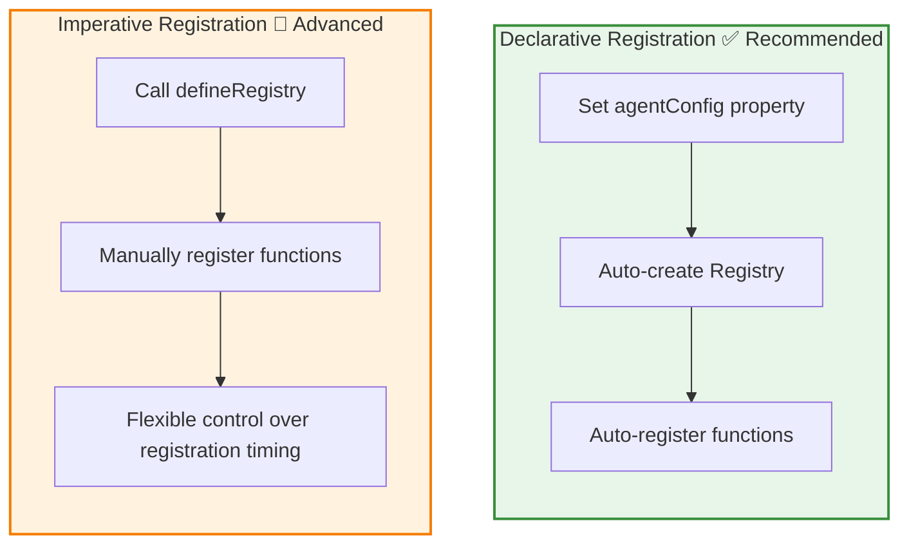
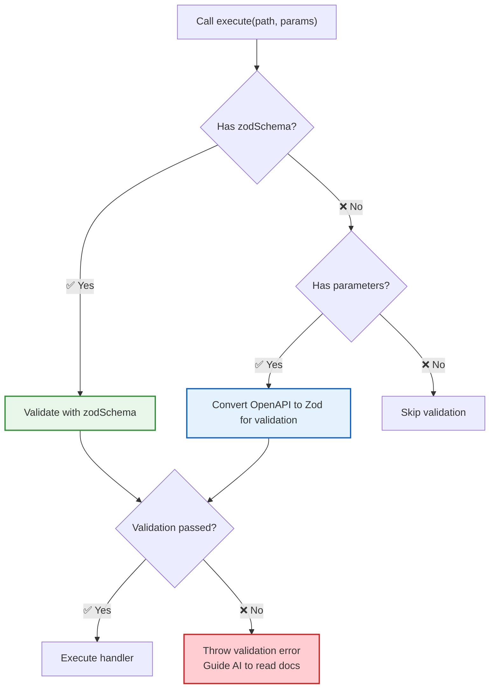
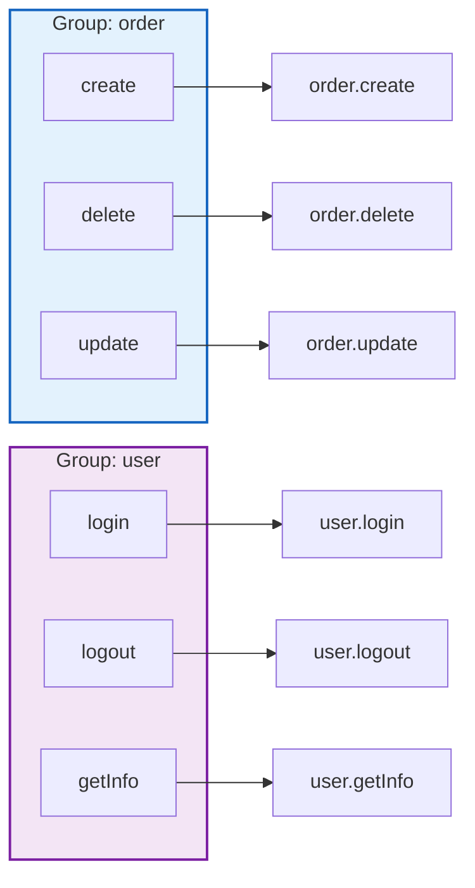
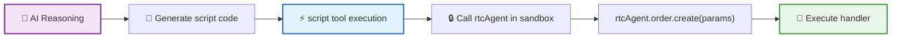
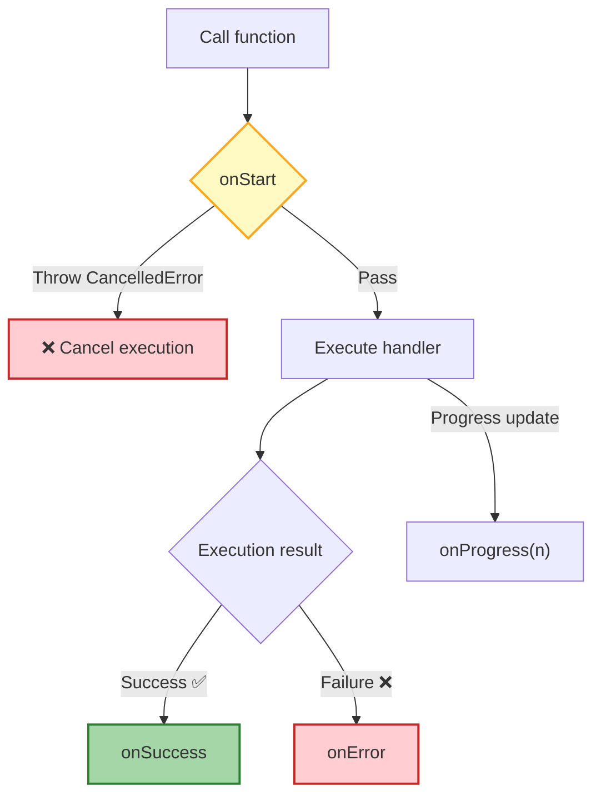
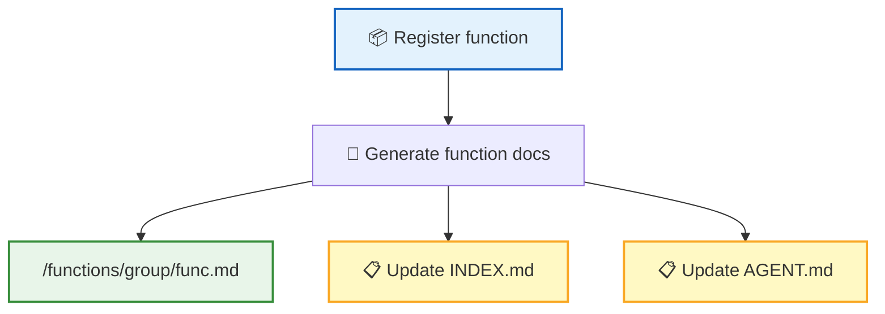
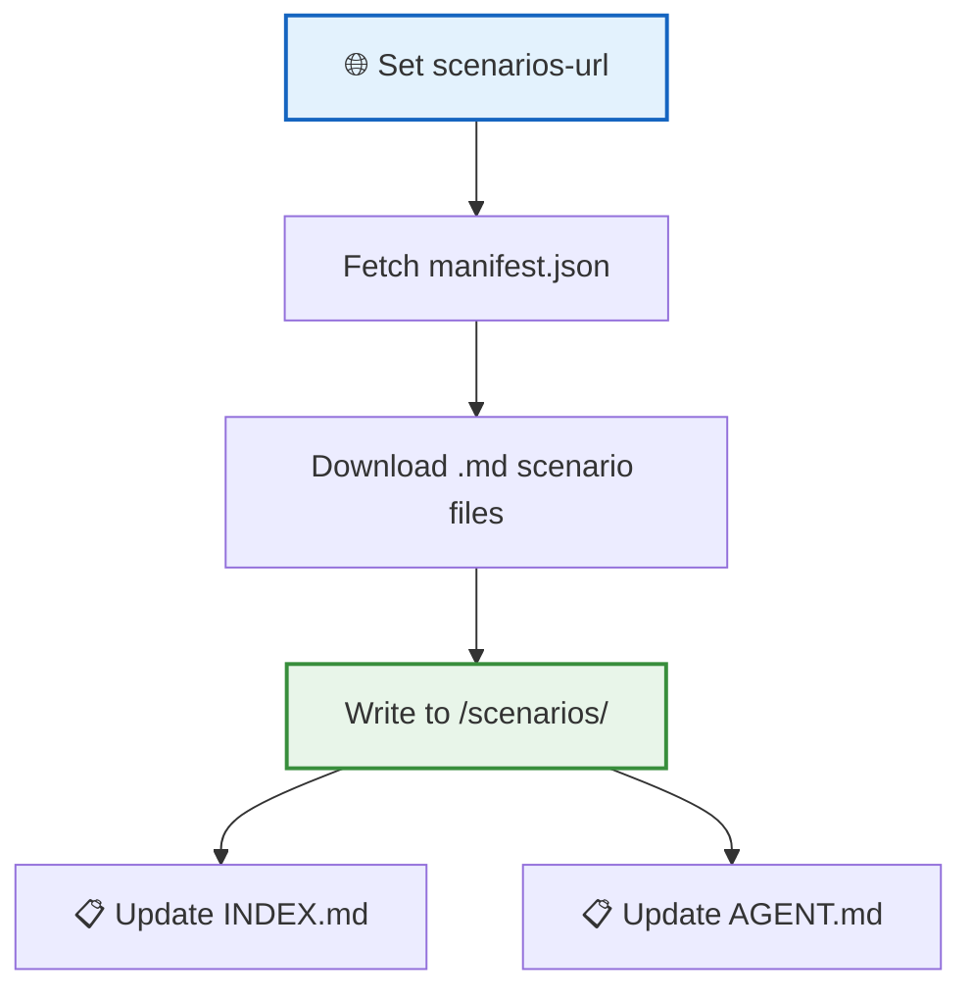

The **Skill System** allows the host application to expose business capabilities to the AI. You simply register functions, and the AI can call them via scripts — no extra adaptation needed, and documentation is auto-generated.

## Two Registration Approaches



| | Declarative (Recommended) | Imperative (Advanced) |
|---|:----------:|:----------:|
| **Registration Method** | Set `agentConfig` property | Call `defineRegistry` |
| **Ease of Use** | Zero config, works out of the box | Requires manual management |
| **Use Case** | Most scenarios | Dynamic or conditional registration needed |

**Declarative registration example**:

```ts
agent.agentConfig = {
  name: 'MyApp',
  persona: 'You are a ... assistant',
  groups: [{
    name: 'editor',
    description: 'Editor operations',
    functions: [
      {
        name: 'getCode',
        description: 'Get the current code in the editor',
        handler: () => editor.getCode()
      }
    ]
  }]
};
```

> 💡 After setting `agentConfig`, the system automatically creates the Registry and completes function registration — the entire process requires no manual intervention.

## Function Definition

Each function consists of the following fields:

| Field | Type | Description |
|:-----:|------|-------------|
| `name` | string | Function name |
| `description` | string | Function description, included in auto-generated documentation |
| `parameters` | ParameterDef[] | Parameter definition array (**ParameterDef[]** format) |
| `returns` | object | Return value definition |
| `handler` | function | Execution function (supports async) |
| `hooks` | object | UI hooks (see [Hook System](#hook-system)) |

`parameters` uses **ParameterDef[]** array format to describe parameters, enabling the AI to generate correct call code:

```ts
{
  name: 'createOrder',
  description: 'Create a new order',
  parameters: [
    { name: 'productId', schema: { type: 'string', description: 'Product ID' }, required: true },
    { name: 'quantity', schema: { type: 'number', description: 'Quantity' }, required: false }
  ],
  handler: async ({ productId, quantity }) => {
    return await api.createOrder(productId, quantity ?? 1);
  }
}
```

> 💡 Each parameter consists of `name` (parameter name), `schema` (parameter definition in OpenAPI Schema format), and `required` (whether it is required).

### Using Zod Schema for Parameters (Recommended)

Instead of manually writing OpenAPI Schema, you can use **Zod schema** to define function parameters — more concise, type-safe, and with automatic runtime validation.

```ts
import { z, withMeta } from '@rtc-agent/component';

{
  name: 'createOrder',
  description: 'Create a new order',
  zodSchema: z.object({
    productId: withMeta(z.string(), { example: 'PROD-001' }).describe('Product ID'),
    quantity: withMeta(z.number().int().min(1), { example: 2 }).default(1).describe('Quantity'),
  }),
  handler: async ({ productId, quantity }) => {
    return await api.createOrder(productId, quantity);
  }
}
```

> 💡 `zodSchema` and `parameters` are mutually exclusive. If both are provided, `zodSchema` takes priority.

**Zod vs OpenAPI Schema Comparison**:

| | Zod Schema | OpenAPI Schema (`parameters`) |
|---|---|---|
| **Definition Style** | `z.object({...})`, chain API | `ParameterDef[]` array, manual JSON Schema |
| **Type Safety** | TypeScript auto-infers handler parameter types | Requires manual type consistency |
| **Runtime Validation** | Automatic validation (type, range, format, etc.) | Validation via internal conversion to Zod |
| **Doc Generation** | Auto-converted to OpenAPI format for docs | Used directly |
| **Constraint Expression** | `.min()/.max()/.regex()/.enum()` etc. | `minimum/maximum/pattern/enum` fields |
| **Use Case** | Recommended for most scenarios | Useful when existing OpenAPI definitions can be reused |

**Supported Zod Features**:

| Zod Feature | Conversion Result |
|---|---|
| `.describe('...')` | Parameter description |
| `.optional()` | `required: false` |
| `.default(value)` | `default` value + `required: false` |
| `.min()` / `.max()` | `minimum` / `maximum` |
| `.minLength()` / `.maxLength()` | `minLength` / `maxLength` |
| `.regex()` | `pattern` |
| `.enum([...])` | `enum` |
| `z.array()` | `type: 'array'` + `items` |
| `z.number().int()` | `type: 'integer'` |

**Adding Example Values**: Use `withMeta` to add OpenAPI-specific example values to Zod schema:

```ts
import { z, withMeta } from '@rtc-agent/component';

zodSchema: z.object({
  name: withMeta(z.string(), { example: 'John Doe' }),
  age: withMeta(z.number().int(), { example: 30 }),
})
```

### Runtime Parameter Validation

`FunctionRegistry.execute()` automatically validates parameters before calling the handler:



On validation failure, the error message guides the AI to read `/functions/INDEX.md` for correct parameter formats, improving self-healing capability.

## Function Groups

Functions are organized through **groups**; group name + function name = full invocation path:



Groups keep function namespaces clear and organized, avoiding naming conflicts.

## AI Invocation Method

The AI executes code in a sandbox via the `script` tool, using **Proxy chain syntax** to call functions:



```ts
// Proxy chain invocation — natural API style
await rtcAgent.order.create({ productId: '123', quantity: 2 });

// Equivalent direct call
await rtcAgent.execute('order.create', { productId: '123', quantity: 2 });
```

> 💡 After reading the auto-generated function documentation, the AI knows how to call these functions — no extra configuration needed.

## Hook System

Hooks allow the host to inject custom logic at various stages of function execution:



| Hook | Trigger | Description |
|:----:|:-------:|-------------|
| `onStart` | Before execution | Can throw `CancelledError` to **cancel execution** |
| `onSuccess` | After success | Runs asynchronously, does not block return |
| `onError` | After failure | Runs asynchronously, does not block return |
| `onProgress` | Progress update | Triggered when handler calls `onProgress(n)` |

`onStart` is the only hook that can intercept execution — ideal for confirmation dialogs, permission checks, etc.

## Auto-generated Documentation

Each time a function is registered, the system generates comprehensive documentation:



| Generated Content | Description |
|-------------------|-------------|
| **Function Docs** | Includes description, parameter table, return values, and call examples |
| **INDEX.md** | Function index; the AI uses this to discover available functions |
| **AGENT.md** | Updates the Agent capability description |

> 📌 The AI learns how to use functions by reading this documentation — documentation quality directly affects the AI's calling accuracy.

## Scenarios

Scenarios load business workflow documentation, telling the AI how to handle specific business processes:



| Feature | Description |
|---------|-------------|
| **Scenario Docs** | Business workflow descriptions in Markdown format |
| **Loading Method** | Specified via the `<rtc-agent scenarios-url="...">` attribute |
| **Storage Location** | `/scenarios/{slug}.md` |
| **AI Usage** | AI reads scenario docs to understand business processes and operational guidelines |

For example, you can write scenario docs like "How to handle refunds" or "How to create an order", and the AI will execute operations according to your business specifications.

## Next Steps

- [RTC Protocol](/docs/en/concepts/rtc/) — Learn about the core mechanism for AI calling frontend tools
- [Virtual File System](/docs/en/concepts/virtual-fs/) — Learn where function docs and scenario docs are stored
- [Command System](/docs/en/features/commands/) — Learn about user-facing command interaction capabilities
