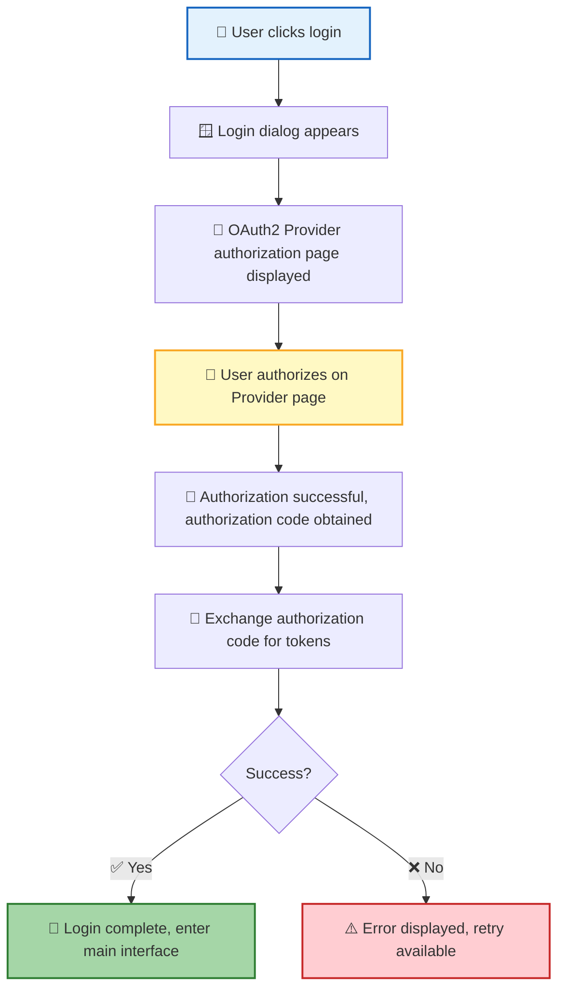
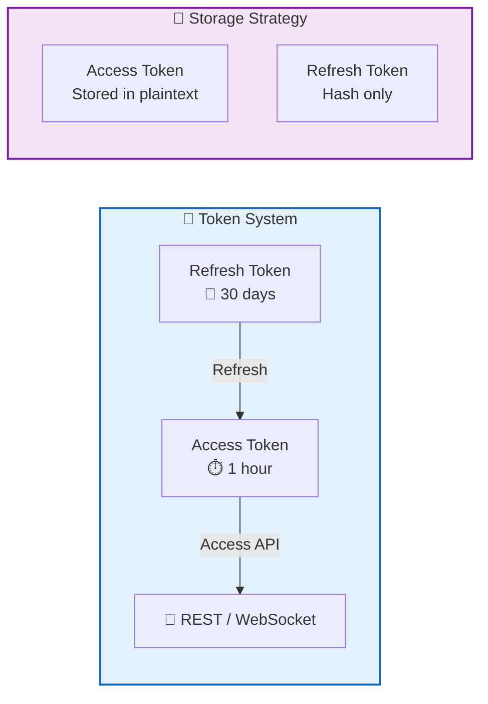
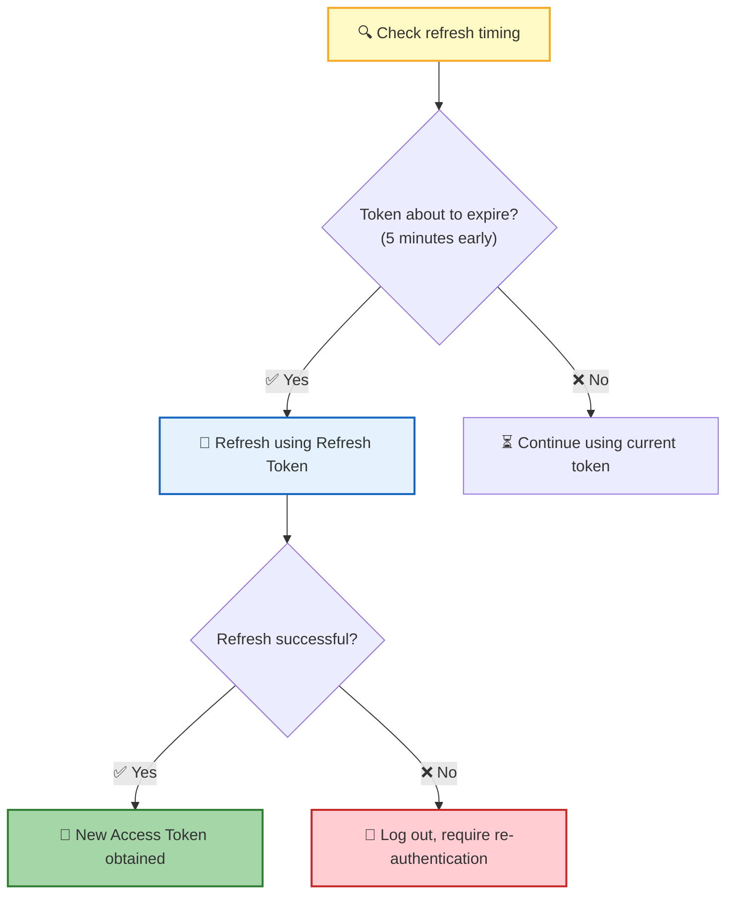
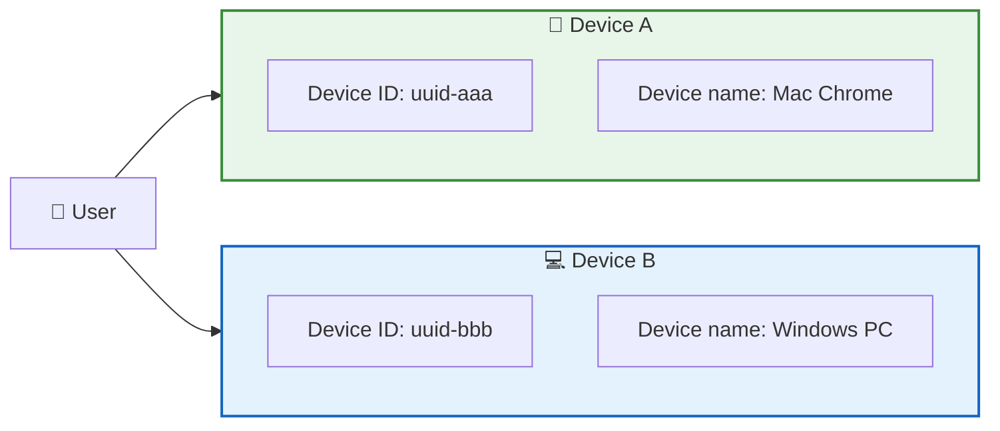
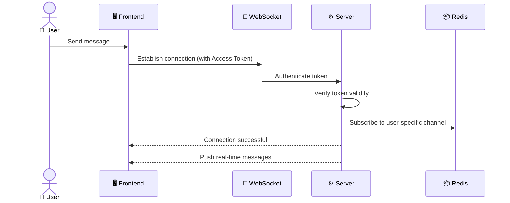
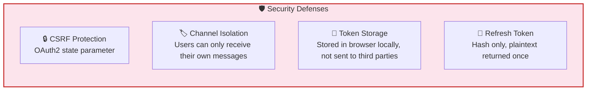

**Authentication & Authorization** is the security foundation of RTC Agent. Users log in via the OAuth2 authorization code flow, and the system maintains sessions using dual tokens (Access + Refresh). It supports parallel multi-device logins and automatic token refresh — users only need to sign in once for long-term use.

## Login Flow

| Step | Description |
|:----:|------|
| 1 | User clicks the login button, and a login dialog appears |
| 2 | The dialog displays the OAuth2 Provider's authorization page via an iframe |
| 3 | User completes authorization on the Provider page (e.g., GitHub, Google) |
| 4 | After successful authorization, the system obtains the authorization code and exchanges it for tokens |
| 5 | Tokens are stored in the browser locally, and login is complete |

> 💡 **Design Principle**: The login flow is fully delegated to the OAuth2 Provider — RTC Agent never handles user passwords; security is guaranteed by the Provider.

## Dual-Token Mechanism

| Token | Validity | Purpose | Storage |
|:----:|:------:|:----:|:--------:|
| 🔑 Access Token | 1 hour | Access API and WebSocket | Plaintext (short validity, manageable risk) |
| 🔄 Refresh Token | 30 days | Refresh Access Token | Hash only (plaintext returned once at issuance, then discarded) |

> 📌 **Security Key Point**: The Refresh Token's plaintext is only returned once at issuance; afterward, the server stores only the hash. Even if browser storage is compromised, attackers cannot impersonate the user long-term.

## Automatic Refresh

The system automatically refreshes tokens at multiple trigger points, completely transparent to the user:

| Trigger | Description |
|:--------:|------|
| ⏱️ Token about to expire | Automatically refreshed 5 minutes before expiration to avoid request interruption |
| 📱 Page returns to foreground | Token status is checked when switching back from background; refresh immediately if expired |
| 🔌 Establishing WebSocket | Ensure token is valid before connecting |

> 💡 Refresh failures don't leave users in a "half-dead" state — the system logs them out directly and guides them to re-authenticate.

## Device Management

| Concept | Description |
|------|------|
| 🔖 Device ID | Unique browser identifier (UUID), automatically generated on first visit |
| 📛 Device Name | Automatically inferred from browser type and OS (e.g., "Mac Chrome", "Windows PC") |
| 🔀 Multi-device | The same user can log in independently on multiple devices without interference |

> 📌 Tokens are independent per device — logging out on Device A does not affect the session on Device B.

## WebSocket Authentication

| Phase | Description |
|:----:|------|
| 🔗 Connect | WebSocket connection carries the Access Token for authentication |
| ✅ Verify | Server validates token validity; invalid tokens are rejected |
| 📡 Subscribe | After authentication, subscribe to the user-specific channel to receive real-time messages |
| 🔁 Disconnect | Reconnection requires re-authentication to ensure security |

> 💡 **Channel Isolation**: Each user can only receive messages from their own channel and cannot access other users' data.

## Security Constraints

| Constraint | Mechanism | Purpose |
|:----:|:----:|:----:|
| 🛡️ CSRF Protection | Use `state` parameter during OAuth2 authorization | Prevent cross-site request forgery attacks |
| 🏷️ Channel Isolation | Users can only subscribe to their own dedicated channel | Prevent data leaks and unauthorized access |
| 💾 Token Storage | Tokens stored only in browser locally | Not sent to third parties, reducing leak risk |
| 🔑 Refresh Token | Plaintext returned once; server stores hash only | Cannot be used long-term even if storage is compromised |

## Error Handling

| Scenario | User-facing behavior |
|:----:|:-------------:|
| ❌ Authorization failed | Login dialog shows error message; retry is available |
| ⏱️ Token expired and refresh failed | Automatically logged out; login page displayed |
| 🔌 WebSocket authentication failed | Connection disconnected; user prompted to log in again |

## Next Steps

- [Web Component API](/docs/en/integration/component-api/) — Learn how to integrate RTC Agent via the `<rtc-agent>` component
- [Function Registration Guide](/docs/en/integration/function-registration/) — Register custom functions to extend AI capabilities
- [Core Protocol RTC](/docs/en/concepts/rtc/) — Learn about the full lifecycle of Remote Tool Calling
