**Authentication & Authorization** is the security foundation of RTC Agent. Users log in via the OAuth2 authorization code flow, and the system maintains sessions using dual tokens (Access + Refresh). It supports parallel multi-device logins and automatic token refresh — users only need to sign in once for long-term use.

## Login Flow

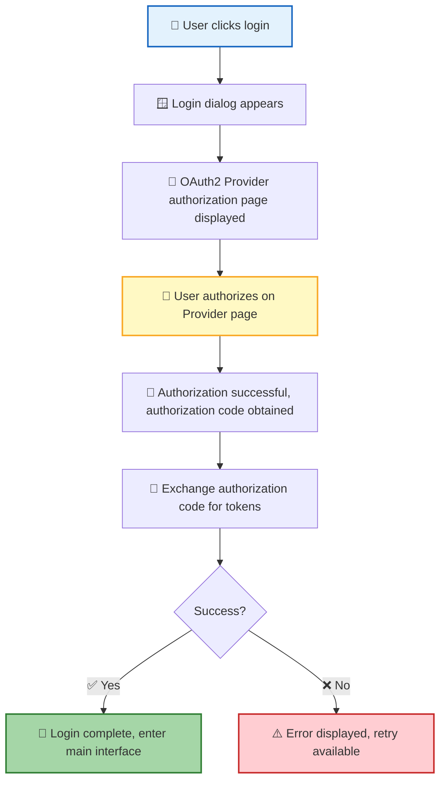

| Step | Description |
|:----:|------|
| 1 | User clicks the login button, and a login dialog appears |
| 2 | The dialog opens a popup window to load the OAuth2 Provider's authorization page |
| 3 | User completes authorization on the Provider page (e.g., GitHub, Google) |
| 4 | After successful authorization, the system obtains the authorization code and exchanges it for tokens |
| 5 | Tokens are stored in the browser locally, and login is complete |

> 💡 **Design Principle**: The login flow is fully delegated to the OAuth2 Provider — RTC Agent never handles user passwords; security is guaranteed by the Provider.

### Provider Selection UI

When the Server is configured with multiple OAuth2 providers, the frontend login page automatically displays all enabled providers for users to choose from:

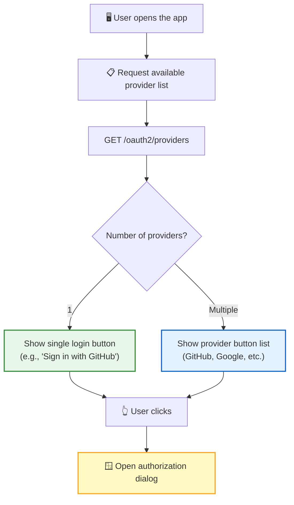

| Feature | Description |
|:-------:|-------------|
| 🔍 Dynamic Discovery | Frontend fetches available providers via `GET /oauth2/providers` — no hardcoded count |
| 🎨 Branded Styles | Known providers (GitHub, Google) have dedicated icons and brand colors |
| 📱 Adaptive Layout | Single provider shows a large primary button; multiple providers show a button list |
| 🔄 Fallback | If the provider list fails to load, falls back to showing a Mock Provider button |

### Popup Authorization Flow

After the user selects a provider, the authorization flow completes in a popup window:

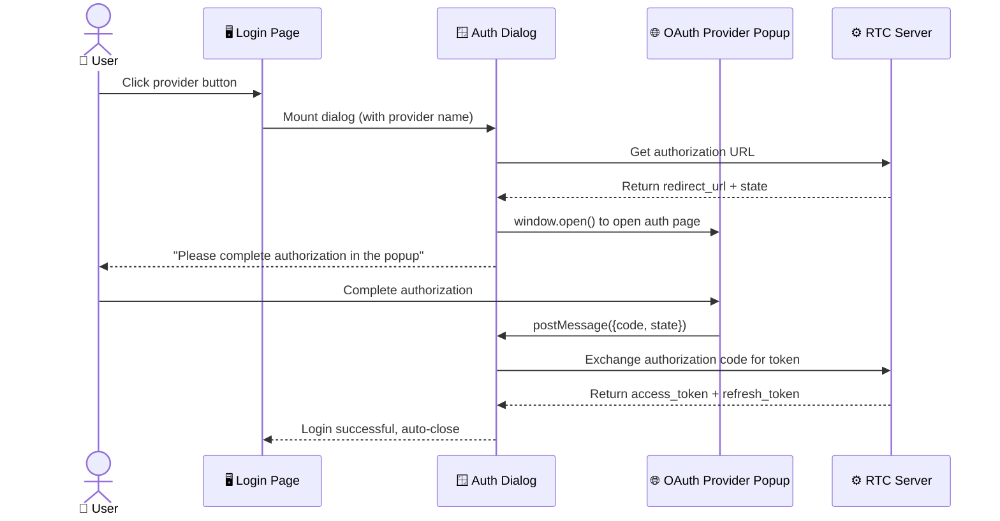

| State | User-Visible Behavior |
|:-----:|----------------------|
| Preparing | Loading animation + "Preparing authorization..." |
| Waiting | "Please complete authorization in the popup" + "Reopen authorization window" button |
| Verifying | Loading animation + "Verifying identity..." |
| Success | "Closing automatically...", auto-closes after 800ms |
| Error | Error message + "Retry" button |

> 💡 If the user manually closes the popup before completing authorization, the dialog shows "Authorization cancelled" and allows retry.

## Dual-Token Mechanism

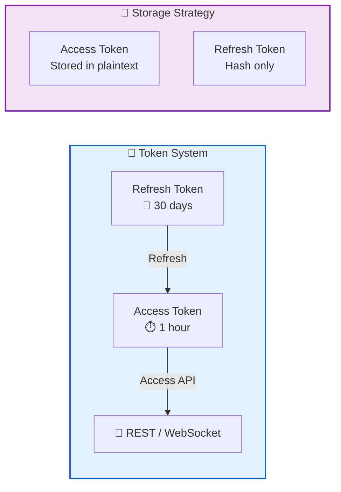

| Token | Validity | Purpose | Storage |
|:----:|:------:|:----:|:--------:|
| 🔑 Access Token | 1 hour | Access API and WebSocket | Plaintext (short validity, manageable risk) |
| 🔄 Refresh Token | 30 days | Refresh Access Token | Hash only (plaintext returned once at issuance, then discarded) |

> 📌 **Security Key Point**: The Refresh Token's plaintext is only returned once at issuance; afterward, the server stores only the hash. Even if browser storage is compromised, attackers cannot impersonate the user long-term.

## Automatic Refresh

The system automatically refreshes tokens at multiple trigger points, completely transparent to the user:

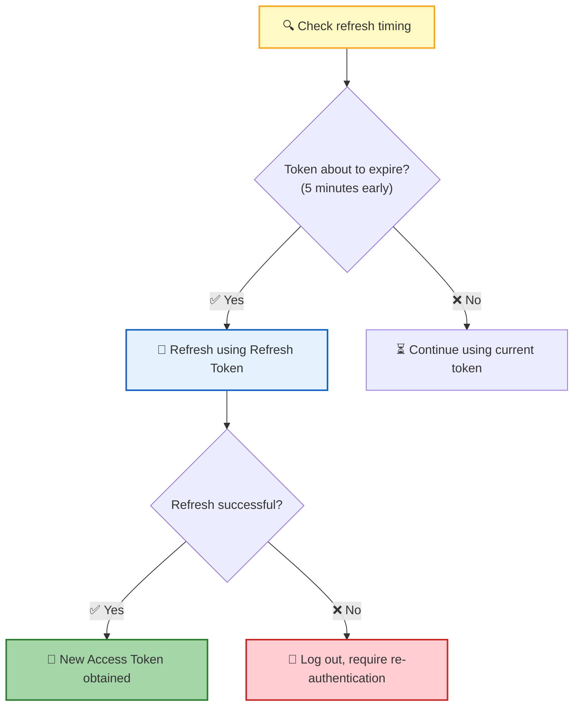

| Trigger | Description |
|:--------:|------|
| ⏱️ Token about to expire | Automatically refreshed 5 minutes before expiration to avoid request interruption |
| 📱 Page returns to foreground | Token status is checked when switching back from background; refresh immediately if expired |
| 🔌 Establishing WebSocket | Refresh token on demand during connection to ensure validity |

> 💡 Refresh failures don't leave users in a "half-dead" state — the system logs them out directly and guides them to re-authenticate.

## Device Management

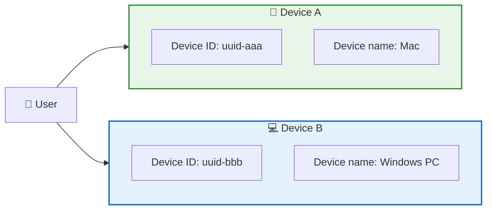

| Concept | Description |
|------|------|
| 🔖 Device ID | Unique browser identifier (UUID), automatically generated on first visit |
| 📛 Device Name | Automatically inferred from OS (e.g., "Mac", "Windows PC", "Linux PC") |
| 🔀 Multi-device | The same user can log in independently on multiple devices without interference |

> 📌 Tokens are independent per device — logging out on Device A does not affect the session on Device B.

## WebSocket Authentication

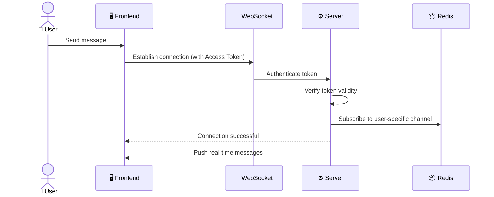

| Phase | Description |
|:----:|------|
| 🔗 Connect | WebSocket connection carries the Access Token for authentication |
| ✅ Verify | Server validates token validity; invalid tokens are rejected |
| 📡 Subscribe | After authentication, subscribe to the user-specific channel to receive real-time messages |
| 🔁 Disconnect | Reconnection requires re-authentication to ensure security |

> 💡 **Channel Isolation**: Each user can only receive messages from their own channel and cannot access other users' data.

## Security Constraints

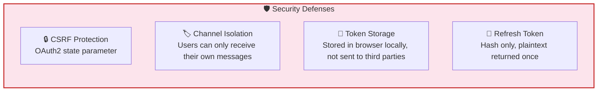

| Constraint | Mechanism | Purpose |
|:----:|:----:|:----:|
| 🛡️ CSRF Protection | Use `state` parameter during OAuth2 authorization | Prevent cross-site request forgery attacks |
| 🏷️ Channel Isolation | Users can only subscribe to their own dedicated channel | Prevent data leaks and unauthorized access |
| 💾 Token Storage | Tokens stored only in browser locally | Not sent to third parties, reducing leak risk |
| 🔑 Refresh Token | Plaintext returned once; server stores hash only | Cannot be used long-term even if storage is compromised |

## Error Handling

| Scenario | User-facing behavior |
|:----:|:-------------:|
| ❌ Authorization failed | Login dialog shows error message; retry is available |
| ⏱️ Token expired and refresh failed | Automatically logged out; login page displayed |
| 🔌 WebSocket authentication failed | Connection disconnected; user prompted to log in again |

## Next Steps

- [Client Authentication Modes](#-client-authentication-modes) — Integrate RTC Agent with your own auth system using StaticTokenAuth, DynamicTokenAuth, or AuthProvider
- [Web Component API](/docs/en/integration/component-api/) — Learn how to integrate RTC Agent via the `<rtc-agent>` component
- [Function Registration Guide](/docs/en/integration/function-registration/) — Register custom functions to extend AI capabilities
- [Core Protocol RTC](/docs/en/concepts/rtc/) — Learn about the full lifecycle of Remote Tool Calling

---

## 🧩 Client Authentication Modes

The built-in OAuth2 flow is great for standalone apps, but many developers integrate RTC Agent into existing products that already have their own auth systems. Starting from **web-components v0.2.5**, the `<rtc-agent>` component supports three client-side authentication modes — configured via the `auth` field in `RtcAgentConfig` when calling `createRtcAgent()`. These modes let you bring your own tokens, your own refresh logic, or even your own full auth provider, without relying on the server-side OAuth2 flow.

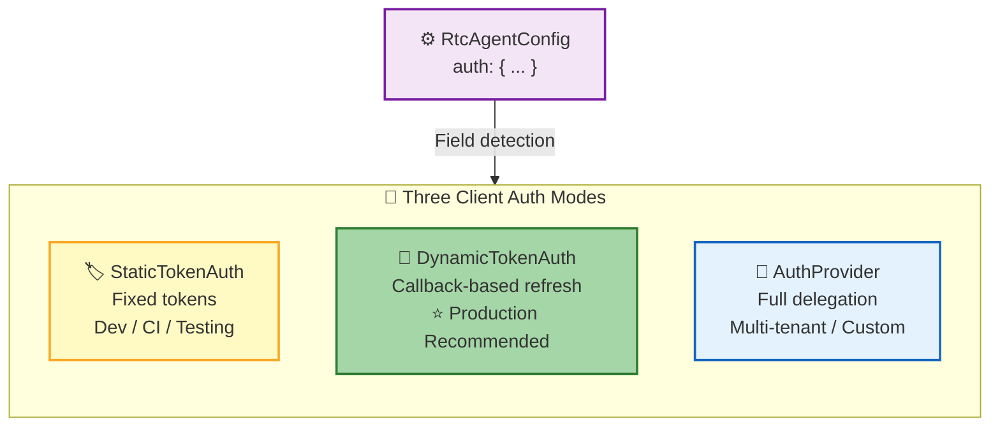

| Mode | Detection | Best For | Complexity |
|:----:|:---------:|:--------:|:----------:|
| 🏷️ StaticTokenAuth | `'accessToken' in auth` | Dev, CI, testing | ⭐ |
| 🔄 DynamicTokenAuth | `'getToken' in auth && !('isLoggedIn' in auth)` | Production apps | ⭐⭐ |
| 🧩 AuthProvider | `'isLoggedIn' in auth` | Multi-tenant, custom flows | ⭐⭐⭐ |

> 💡 **How modes are detected**: The component inspects which fields are present in the `auth` object — no explicit `type` field needed. The detection order is: `accessToken` first, then `isLoggedIn`, and the remaining case falls to DynamicTokenAuth.

### Mode 1: StaticTokenAuth — Fixed Tokens

The simplest integration — provide a fixed Access Token (and optionally a Refresh Token). The component uses these tokens as-is with no refresh logic. Ideal for **local development, CI pipelines, and automated testing**.

```typescript
import { createRtcAgent } from '@anthropic/rtc-agent';

const agent = createRtcAgent({
  serverUrl: 'https://your-server.com',
  auth: {
    accessToken: 'your-jwt-token',
    refreshToken: 'optional-refresh-token',
    userId: 'user-123',
    expiresIn: 3600, // optional, seconds
  },
});
```

| Field | Required | Description |
|:-----:|:--------:|-------------|
| `accessToken` | ✅ | A valid JWT token string |
| `refreshToken` | Optional | Refresh token for extending session |
| `userId` | ✅ | Unique user identifier |
| `expiresIn` | Optional | Token lifetime in seconds (default: server-decided) |

> ⚠️ **Not for production**: Static tokens expire and cannot be refreshed automatically. When the token expires, the user will be disconnected. Use Mode 2 for production deployments.

### Mode 2: DynamicTokenAuth — Callback-Based Refresh (Recommended)

The **recommended mode for production**. You provide `getToken()` and `refreshToken()` callbacks — the component calls them whenever it needs a token or when the current one expires. Your backend handles all token logic; the component just consumes the result.

```typescript
import { createRtcAgent } from '@anthropic/rtc-agent';

const agent = createRtcAgent({
  serverUrl: 'https://your-server.com',
  auth: {
    userId: 'user-123',
    getToken: async () => {
      // Fetch a fresh token from your backend
      const res = await fetch('/api/auth/token');
      return res.json();
    },
    refreshToken: async () => {
      // Called when the current token has expired
      const res = await fetch('/api/auth/refresh', { method: 'POST' });
      return res.json();
    },
  },
});
```

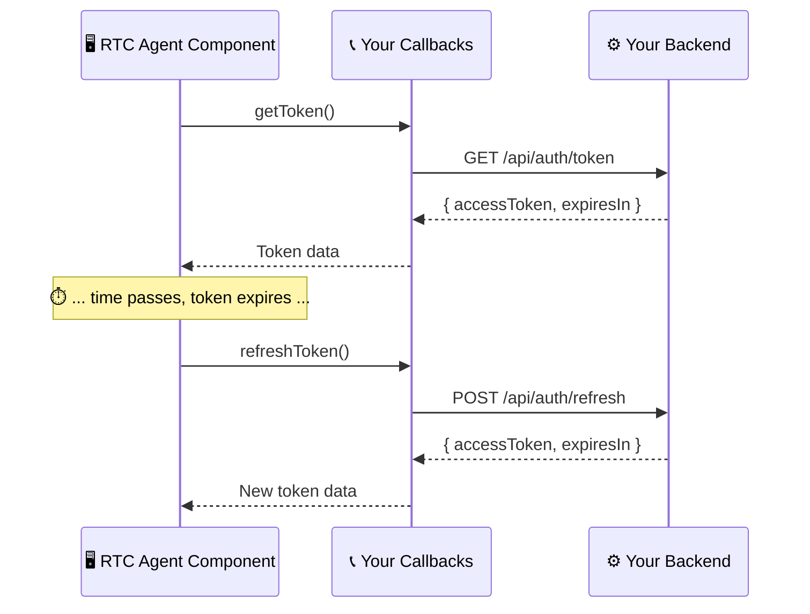

| Callback | Called When | Expected Return |
|:--------:|:-----------:|:---------------:|
| `getToken()` | Component needs a token (initial connection, reconnection) | `{ accessToken: string, expiresIn?: number }` |
| `refreshToken()` | Current token has expired or is about to expire | `{ accessToken: string, expiresIn?: number }` |

> 💡 **Why this mode is recommended**: Your backend retains full control over token issuance and revocation. The component never stores long-lived credentials — it fetches fresh tokens on demand. This follows the same security model as server-side OAuth2, but without requiring an OAuth2 provider.

### Mode 3: AuthProvider — Full Delegation (Advanced)

The most flexible mode — delegate **all** authentication concerns to your own provider. In addition to token management, you control login state checks (`isLoggedIn`) and logout behavior. Ideal for **multi-tenant platforms, SSO integrations, or apps with complex auth requirements**.

```typescript
import { createRtcAgent } from '@anthropic/rtc-agent';

const agent = createRtcAgent({
  serverUrl: 'https://your-server.com',
  auth: {
    getToken: async () => {
      // Your custom token retrieval logic
      return myAuthStore.getToken();
    },
    refreshToken: async () => {
      // Your custom refresh logic
      return myAuthStore.refresh();
    },
    isLoggedIn: () => {
      // Synchronous check — is the user currently authenticated?
      return myAuthStore.isAuthenticated();
    },
    logout: async () => {
      // Optional: clean up session, redirect to login page, etc.
      await myAuthStore.clearSession();
      window.location.href = '/login';
    },
  },
});
```

| Method | Required | Description |
|:------:|:--------:|-------------|
| `getToken()` | ✅ | Async — returns the current auth token |
| `refreshToken()` | ✅ | Async — refreshes the token when expired |
| `isLoggedIn()` | ✅ | **Synchronous** — returns `boolean` indicating whether the user is authenticated |
| `logout()` | Optional | Async — called when the component needs to terminate the session |

> 📌 **Key difference from Mode 2**: The `isLoggedIn` field is the telltale sign of Mode 3. It enables the component to proactively check auth state (e.g., before attempting a connection) rather than discovering it has expired mid-request.

### Choosing the Right Mode

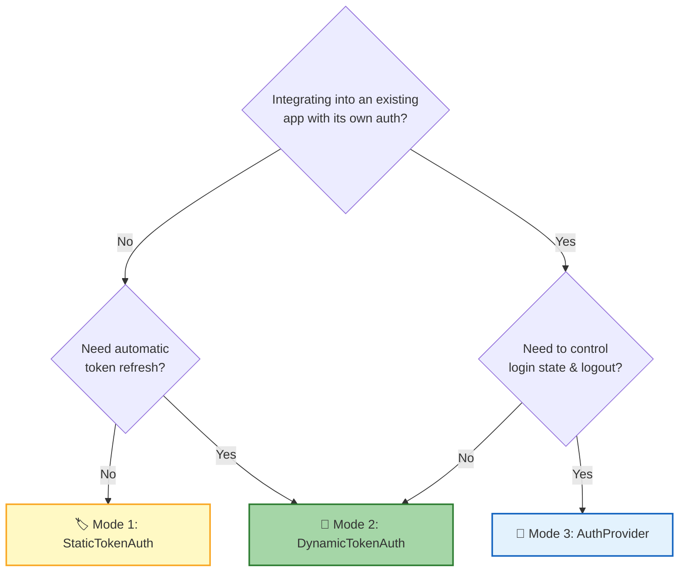

| Scenario | Recommended Mode |
|:---------|:----------------:|
| Local development or CI/CD testing | 🏷️ Mode 1 |
| Production app with a token-issuing backend | 🔄 Mode 2 |
| Multi-tenant SaaS with SSO / custom session management | 🧩 Mode 3 |
| Quick prototype or demo | 🏷️ Mode 1 |

> 💡 You can always start with Mode 1 for prototyping and migrate to Mode 2 or 3 later — the `auth` field is the only thing that changes.

---

## Developer Integration Guide

RTC Agent Server is an OAuth2 **consumer** — it needs to connect to an OAuth2 **provider** to authenticate users. The development environment includes a built-in `mock-oauth2` as a sample provider; for production deployments, you need to provide your own OAuth2 service.

### Architecture

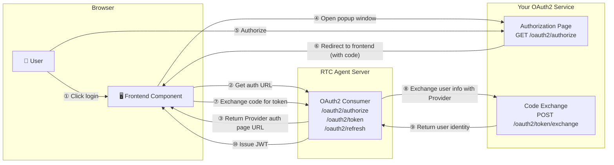

> RTC Agent Server handles JWT issuance and device management; your OAuth2 service is only responsible for **verifying user identity** and returning user information.

### Endpoints to Implement

Your OAuth2 service only needs to implement **2 endpoints**:

#### Endpoint 1: Authorization Page — `GET /oauth2/authorize`

Opened in a popup window, used to display the login/authorization UI.

**Request** (assembled by RTC Agent Server, accessed by the browser):

```http
GET /oauth2/authorize?state=<hex>&client_id=<id>&redirect_uri=<uri>
```

| Parameter | Description |
| --- | --- |
| `state` | Anti-CSRF random string, must be echoed back as-is |
| `client_id` | Client identifier |
| `redirect_uri` | Callback URL after successful authorization |

**Behavior requirements**:

1. Display a login/authorization page (can be your existing login system)
2. After user authorizes, generate a **short-lived, single-use** authorization code
3. HTTP 302 redirect to `redirect_uri` with `code` and `state` in the query string:

```http
Location: <redirect_uri>?code=<code>&state=<state>
```

**Page constraints**:

- The page will be opened in a popup window — no longer restricted by `X-Frame-Options` or `Content-Security-Policy: frame-ancestors`
- Content-Type must be `text/html; charset=utf-8`

#### Endpoint 2: Code Exchange — `POST /oauth2/token/exchange`

Called server-to-server directly by RTC Agent Server, exchanging the authorization code for user identity.

**Request**:

```http
POST /oauth2/token/exchange
Content-Type: application/x-www-form-urlencoded
Accept: application/json

client_id=<id>&client_secret=<secret>&code=<code>&redirect_uri=<uri>
```

**Success response** (200):

```json
{
  "provider_user_id": "user-12345",
  "username": "John Doe",
  "email": "john@example.com",
  "avatar_url": "https://example.com/avatar.png"
}
```

| Field | Required | Description |
| --- | :---: | --- |
| `provider_user_id` | ✅ | **Stable unique identifier** for the user in your system — must be the same value for the same user every time |
| `username` | Optional | Display name |
| `email` | Optional | Email address |
| `avatar_url` | Optional | Avatar URL |

**Error responses**:

```json
{
  "error": "invalid_client",
  "error_description": "Invalid client_id or client_secret"
}
```

| HTTP Status | `error` value | Meaning |
| :---: | --- | --- |
| 400 | `invalid_request` | Missing or invalid parameters |
| 400 | `invalid_grant` | Authorization code is invalid, already used, or expired |
| 401 | `invalid_client` | Invalid client credentials |
| 500 | `server_error` | Internal server error |

### Authorization Code Semantics

| Constraint | Description |
| --- | --- |
| Single-use | The same code can only be exchanged once |
| Short-lived | Recommend expiry within 10 minutes |
| User-bound | The code must be associated with the authenticated user's identity |

### What You Don't Need to Implement

- ❌ No need to issue access_token / refresh_token — RTC Agent Server issues JWTs itself
- ❌ No need to implement a standard OAuth2 `/token` endpoint — `/oauth2/token/exchange` is essentially a user info endpoint
- ❌ No need to support scope, PKCE, or other extensions

### Configure RTC Agent Server

After implementing your OAuth2 service, point the Server config to it:

```yaml
providers:
  mock:
    enabled: true
    url: "https://your-oauth-server.com"   # Your OAuth2 service address
    client_id: "your-client-id"            # client_id agreed with your service
    client_secret: "your-client-secret"    # client_secret agreed with your service
```

> ⚠️ The `mock` in `providers.mock` is the provider name (it doesn't mean "test only"). The Server will concatenate `{url}/oauth2/authorize` and `{url}/oauth2/token/exchange` as the two endpoint addresses. If your service uses different paths, you'll need to extend `BuildProviderClients` or keep the paths consistent.

#### Built-in Provider Configuration

In addition to the custom mock provider, the Server also includes built-in GitHub and Google OAuth2 provider support:

```yaml
providers:
  github:
    enabled: true
    client_id: "your-github-client-id"
    client_secret: "your-github-client-secret"
    scope: "read:user user:email"         # Optional, default value

  google:
    enabled: true
    client_id: "your-google-client-id"
    client_secret: "your-google-client-secret"
    scope: "openid email profile"         # Optional, default value
```

> 💡 Multiple providers can be enabled simultaneously — the frontend login interface will display all enabled providers for users to choose from. The Server validates that at least one provider is enabled at startup.

#### Frontend `redirect-uri` Attribute

The `<rtc-agent>` component supports a `redirect-uri` attribute to customize the callback URL after OAuth2 authorization:

```html
<rtc-agent
  server-url="https://your-server.com"
  redirect-uri="https://your-app.com/auth/callback.html"
></rtc-agent>
```

| Feature | Description |
|---------|-------------|
| Default | `window.location.origin + '/auth/callback.html'` |
| Relative path | When starting with `/`, the current origin is automatically prepended (e.g., `/auth/callback.html` → `https://your-app.com/auth/callback.html`) |
| Absolute path | Full URL, useful when the callback endpoint is hosted at a different origin |

> 💡 When `<rtc-agent>` is embedded in a page hosted at a different origin than your server, you need to explicitly specify the callback URL via `redirect-uri` to ensure the OAuth2 authorization code is returned correctly.
