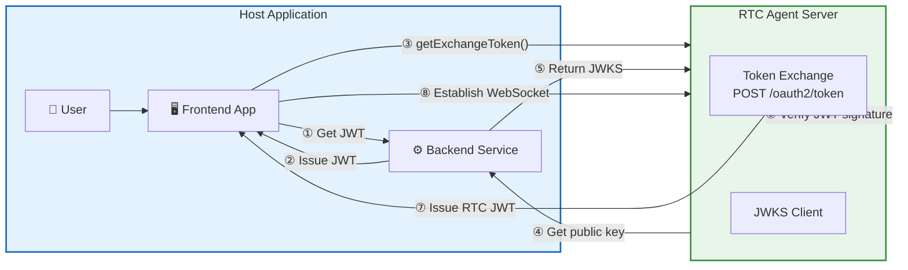
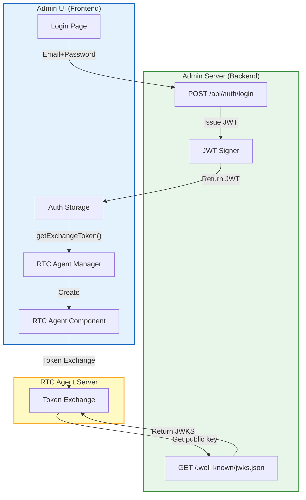

**Authentication & Authorization** is the security foundation of RTC Agent. RTC Agent supports multiple authentication methods, with **Token Exchange (RFC 8693)** being the recommended approach for enterprise integration scenarios—it allows you to seamlessly integrate RTC Agent into your existing authentication system without implementing a full OAuth2 flow.

## Why Choose Token Exchange?

Token Exchange is an OAuth2 extension standard (RFC 8693) designed for cross-system trust. Compared to traditional OAuth2 authorization code flow, it's better suited for enterprise integration scenarios:

| Feature | Token Exchange | OAuth2 Authorization Code |
|---------|----------------|---------------------------|
| **Use Case** | ✅ Enterprise apps with existing auth | Standalone apps needing full login flow |
| **Integration Complexity** | ✅ Low—just issue verifiable JWTs | ❌ High—implement auth pages, callbacks, etc. |
| **User Experience** | ✅ Seamless—no repeated logins | ⚠️ Requires redirect to login page |
| **Security** | ✅ High—asymmetric signing with JWKS | ✅ High—authorization code + PKCE |
| **Multi-tenant Support** | ✅ Native—JWT contains user info | ⚠️ Requires additional handling |

**Key Advantages**:
- 🚀 **Quick Integration**: Complete integration in 3 minutes
- 🔒 **Zero Password Contact**: RTC Agent never handles user passwords; security is your responsibility
- 🌐 **Cross-Domain Friendly**: No complex OAuth2 callbacks or redirects
- 📱 **Multi-Device Sync**: JWTs naturally support multiple devices and tabs

> 💡 **Design Principle**: In Token Exchange mode, your system issues JWTs, and RTC Agent verifies and exchanges them for internal access tokens. The entire process is fully automated with no user interaction required.

## Quick Start (3-Minute Integration)

This guide walks you through the simplest Token Exchange integration. We assume you already have:
- A backend service that can issue JWTs
- A frontend application using RTC Agent

### Step 1: Configure the Main Server to Trust Your JWT Issuer

Add the following to your RTC Agent Server's `config.yaml`:

```yaml
token_exchange:
  external_issuers:
    - name: "your-app"                          # Human-readable identifier
      issuer: "https://your-app.com"            # Your JWT issuer (must match iss in JWT)
      jwks_uri: "https://your-app.com/.well-known/jwks.json"  # JWKS endpoint
      allowed_algorithms: ["RS256"]             # Allowed signing algorithms
      cache_ttl: 3600                           # JWKS cache TTL (seconds)
      claims_mapping:                           # JWT claims mapping (optional)
        sub: "sub"                              # User unique identifier
        email: "email"                          # User email
        name: "name"                            # User display name
        avatar_url: "picture"                   # User avatar
```

### Step 2: Configure AuthProvider in Your Frontend

Configure RTC Agent in your frontend application:

```typescript
import { createRtcAgent } from '@rtc-agent/component';

const agent = createRtcAgent({
  server: { url: 'https://rtc-agent.your-app.com' },
  auth: {
    type: 'token-exchange',
    
    // Return the JWT issued by your system
    getExchangeToken: async () => {
      return await yourAuthStore.getAccessToken();
    },
    
    // Check if user is logged in
    isLoggedIn: () => {
      return yourAuthStore.isAuthenticated();
    },
    
    // Logout handler
    logout: async () => {
      await yourAuthStore.clearSession();
    },
    
    // Return current user's unique identifier (for IndexedDB isolation)
    getUserId: () => {
      return yourAuthStore.getUserId();
    },
    
    // Device unique identifier (UUID, persisted to localStorage)
    deviceId: crypto.randomUUID(),
  },
});

document.body.appendChild(agent);
```

### Step 3: Verify Integration

After completing the configuration, open the browser console to check:
1. ✅ No CORS errors
2. ✅ No JWT validation errors
3. ✅ WebSocket connection established successfully
4. ✅ Can send messages and invoke tools normally

> 🎉 **Congratulations!** If all the above steps succeeded, your RTC Agent is now integrated into your authentication system via Token Exchange.

---

## Complete Token Exchange Integration Guide

This section provides complete technical details for Token Exchange to help you build production-grade integrations.

### Architecture Overview


```mermaid
flowchart LR
    subgraph HostApp["Host Application"]
        User["👤 User"]
        Frontend["🖥️ Frontend App"]
        Backend["⚙️ Backend Service"]
    end
    
    subgraph RTCServer["RTC Agent Server"]
        TokenExchange["Token Exchange<br/>POST /oauth2/token"]
        JWKSClient["JWKS Client"]
    end
    
    User --> Frontend
    Frontend -->|"① Get JWT"| Backend
    Backend -->|"② Issue JWT"| Frontend
    Frontend -->|"③ getExchangeToken()"| RTCServer
    RTCServer -->|"④ Get public key"| Backend
    Backend -->|"⑤ Return JWKS"| RTCServer
    RTCServer -->|"⑥ Verify JWT signature"| TokenExchange
    TokenExchange -->|"⑦ Issue RTC JWT"| Frontend
    Frontend -->|"⑧ Establish WebSocket"| RTCServer
    
    style HostApp fill:#e3f2fd,stroke:#1565c0,stroke-width:2px
    style RTCServer fill:#e8f5e9,stroke:#388e3c,stroke-width:2px
```

**Flow Description**:
1. User logs into the host application
2. Host application backend issues a JWT (containing user information)
3. Frontend provides JWT via `getExchangeToken()`
4. RTC Agent component calls Token Exchange endpoint
5. RTC Agent Server fetches public key from JWKS endpoint
6. Verifies JWT signature and claims
7. Issues RTC Agent internal JWT
8. Uses RTC JWT to establish WebSocket connection

### Server Side: Issuing JWTs

Your backend service needs to implement JWT signing logic. Here are the key requirements:

#### JWT Claims Requirements

**Required Claims**:

| Claim | Type | Description | Example |
|-------|------|-------------|---------|
| `iss` | string | JWT issuer identifier, must match `issuer` in `config.yaml` | `"https://your-app.com"` |
| `sub` | string | User unique identifier (in your system) | `"user-123"` |
| `exp` | number | Expiration time (Unix timestamp in seconds) | `1699999999` |
| `iat` | number | Issued at time (Unix timestamp in seconds) | `1699996399` |

**Recommended Claims**:

| Claim | Type | Description | Example |
|-------|------|-------------|---------|
| `email` | string | User email | `"user@example.com"` |
| `name` | string | User display name | `"John Doe"` |
| `picture` | string | User avatar URL | `"https://example.com/avatar.png"` |
| `aud` | string[] | Audience (RTC Agent Server identifier) | `["https://rtc-agent.your-app.com"]` |
| `jti` | string | JWT ID (unique identifier, prevents replay attacks) | `"uuid-string"` |

#### Signing Algorithms

RTC Agent supports the following asymmetric signing algorithms:

| Algorithm | Description | Recommendation |
|-----------|-------------|----------------|
| **RS256** | RSA + SHA-256 | ⭐⭐⭐⭐⭐ Default recommended |
| RS384 | RSA + SHA-384 | ⭐⭐⭐⭐ |
| RS512 | RSA + SHA-512 | ⭐⭐⭐⭐ |
| ES256 | ECDSA + SHA-256 | ⭐⭐⭐⭐⭐ Better performance |
| ES384 | ECDSA + SHA-384 | ⭐⭐⭐⭐ |
| ES512 | ECDSA + SHA-512 | ⭐⭐⭐⭐ |
| EdDSA | Ed25519 | ⭐⭐⭐⭐⭐ Latest standard |

> 💡 **Recommendation**: Use RS256 or ES256 for production. ES256 offers better performance, but RS256 has broader compatibility.

#### Key Management

**Generate Key Pair** (RS256 example):

```bash
# Generate RSA private key (2048 bits)
openssl genpkey -algorithm RSA -out private.pem -pkeyopt rsa_keygen_bits:2048

# Extract public key from private key
openssl rsa -pubout -in private.pem -out public.pem
```

**Store Keys**:
- Private key: Only accessible by backend service, permissions `0600`
- Public key: Can be publicly accessed via JWKS endpoint, permissions `0644`

#### Example Code

**Go Example** (using `golang-jwt`):

```go
package main

import (
    "crypto/rsa"
    "os"
    "time"
    
    "github.com/golang-jwt/jwt/v5"
)

// Load private key
func loadPrivateKey(path string) (*rsa.PrivateKey, error) {
    data, err := os.ReadFile(path)
    if err != nil {
        return nil, err
    }
    return jwt.ParseRSAPrivateKeyFromPEM(data)
}

// Sign JWT
func signJWT(userID, email, name string, privateKey *rsa.PrivateKey) (string, error) {
    now := time.Now()
    claims := jwt.MapClaims{
        "iss":   "https://your-app.com",           // Issuer
        "sub":   userID,                            // User ID
        "email": email,                             // Email
        "name":  name,                              // Display name
        "iat":   now.Unix(),                        // Issued at
        "exp":   now.Add(1 * time.Hour).Unix(),     // Expiration (1 hour)
        "jti":   uuid.NewString(),                  // JWT ID
    }
    
    token := jwt.NewWithClaims(jwt.SigningMethodRS256, claims)
    token.Header["kid"] = "your-key-id"  // Key ID
    
    return token.SignedString(privateKey)
}
```

**Node.js Example** (using `jose`):

```javascript
import { SignJWT, importPKCS8 } from 'jose';
import { readFileSync } from 'fs';

// Load private key
const privateKeyPem = readFileSync('./private.pem', 'utf8');
const privateKey = await importPKCS8(privateKeyPem, 'RS256');

// Sign JWT
async function signJWT(userID, email, name) {
    const now = Math.floor(Date.now() / 1000);
    
    const token = await new SignJWT({
        sub: userID,
        email: email,
        name: name,
    })
        .setProtectedHeader({ alg: 'RS256', kid: 'your-key-id' })
        .setIssuedAt(now)
        .setExpirationTime(now + 3600)  // 1 hour
        .setIssuer('https://your-app.com')
        .sign(privateKey);
    
    return token;
}
```

**Python Example** (using `PyJWT`):

```python
import jwt
import uuid
from datetime import datetime, timedelta
from cryptography.hazmat.primitives import serialization

# Load private key
with open('./private.pem', 'rb') as f:
    private_key = serialization.load_pem_private_key(f.read(), password=None)

# Sign JWT
def sign_jwt(user_id: str, email: str, name: str) -> str:
    now = datetime.utcnow()
    claims = {
        'iss': 'https://your-app.com',
        'sub': user_id,
        'email': email,
        'name': name,
        'iat': now,
        'exp': now + timedelta(hours=1),
        'jti': str(uuid.uuid4()),
    }
    
    headers = {
        'kid': 'your-key-id',
        'alg': 'RS256',
    }
    
    return jwt.encode(claims, private_key, algorithm='RS256', headers=headers)
```

### Server Side: Exposing JWKS Endpoint

The JWKS (JSON Web Key Set) endpoint allows RTC Agent Server to fetch public keys to verify JWT signatures.

#### JWKS Response Format

```json
{
  "keys": [
    {
      "kty": "RSA",
      "kid": "your-key-id",
      "use": "sig",
      "alg": "RS256",
      "n": "0vx7agoebGcQSuuPiLJXZptN9nndrQmbXEps2aiAFbWhM78LhWx...",
      "e": "AQAB"
    }
  ]
}
```

**Field Description**:

| Field | Description |
|-------|-------------|
| `kty` | Key type (RSA / EC / OKP) |
| `kid` | Key ID (must match `kid` in JWT header) |
| `use` | Key usage (`sig` = signing) |
| `alg` | Algorithm (RS256 / ES256, etc.) |
| `n`, `e` | RSA public key parameters (modulus and exponent) |

#### Implementation Examples

**Go** (using `go-jose`):

```go
package main

import (
    "crypto/rsa"
    "encoding/json"
    "net/http"
    
    "github.com/go-jose/go-jose/v3"
)

func jwksHandler(publicKey *rsa.PublicKey, keyID string) http.HandlerFunc {
    return func(w http.ResponseWriter, r *http.Request) {
        jwk := jose.JSONWebKey{
            Key:       publicKey,
            KeyID:     keyID,
            Algorithm: "RS256",
            Use:       "sig",
        }
        
        jwks := jose.JSONWebKeySet{
            Keys: []jose.JSONWebKey{jwk},
        }
        
        w.Header().Set("Content-Type", "application/json")
        json.NewEncoder(w).Encode(jwks)
    }
}

// Register route
http.HandleFunc("/.well-known/jwks.json", jwksHandler(publicKey, "your-key-id"))
```

**Node.js** (using `jose`):

```javascript
import { exportJWK } from 'jose';
import express from 'express';

const app = express();

app.get('/.well-known/jwks.json', async (req, res) => {
    const jwk = await exportJWK(publicKey);
    jwk.kid = 'your-key-id';
    jwk.alg = 'RS256';
    jwk.use = 'sig';
    
    res.json({
        keys: [jwk],
    });
});
```

**Python** (using `jwcrypto`):

```python
from flask import Flask, jsonify
from jwcrypto import jwk
import json

app = Flask(__name__)

@app.route('/.well-known/jwks.json')
def jwks():
    with open('./public.pem', 'rb') as f:
        key = jwk.JWK.from_pem(f.read())
    
    key['kid'] = 'your-key-id'
    key['alg'] = 'RS256'
    key['use'] = 'sig'
    
    return jsonify(keys=[json.loads(key.export_public())])
```

#### Caching Strategy

The JWKS endpoint should set appropriate cache headers:

```http
Cache-Control: public, max-age=3600
```

RTC Agent Server will cache JWKS internally (default 1 hour) to reduce requests to your server.

### Client Side: Configuring AuthProvider

The frontend configures Token Exchange mode through the `auth` field in `createRtcAgent()`.

#### AuthProvider Interface

```typescript
interface AuthProvider {
  // Authentication mode: fixed to 'token-exchange'
  type: 'token-exchange';
  
  // Return external JWT (JWT issued by your system)
  getExchangeToken(): Promise<string>;
  
  // Check if user is logged in (synchronous)
  isLoggedIn(): boolean;
  
  // Logout handler (asynchronous)
  logout?(): Promise<void>;
  
  // Return current user's unique identifier (synchronous, strongly recommended)
  getUserId?(): string;
  
  // Device unique identifier (required)
  deviceId: string;
}
```

#### Complete Example

```typescript
import { createRtcAgent } from '@rtc-agent/component';

// Assume your authentication store
class YourAuthStore {
  getAccessToken(): string | null {
    return localStorage.getItem('access_token');
  }
  
  isAuthenticated(): boolean {
    const token = this.getAccessToken();
    if (!token) return false;
    
    // Check if expired
    const expiry = localStorage.getItem('token_expiry');
    if (!expiry) return false;
    
    return Date.now() < parseInt(expiry);
  }
  
  getUserId(): string {
    const userInfo = JSON.parse(localStorage.getItem('user_info') || '{}');
    return userInfo.id || '';
  }
  
  async clearSession(): Promise<void> {
    localStorage.removeItem('access_token');
    localStorage.removeItem('refresh_token');
    localStorage.removeItem('user_info');
    localStorage.removeItem('token_expiry');
  }
}

const authStore = new YourAuthStore();

// Generate or get Device ID (persisted)
function getDeviceId(): string {
  let deviceId = localStorage.getItem('device_id');
  if (!deviceId) {
    deviceId = crypto.randomUUID();
    localStorage.setItem('device_id', deviceId);
  }
  return deviceId;
}

// Create RTC Agent
const agent = createRtcAgent({
  server: { url: 'https://rtc-agent.your-app.com' },
  auth: {
    type: 'token-exchange',
    
    getExchangeToken: async () => {
      const token = authStore.getAccessToken();
      if (!token) {
        throw new Error('No access token available');
      }
      return token;
    },
    
    isLoggedIn: () => authStore.isAuthenticated(),
    
    logout: async () => {
      await authStore.clearSession();
    },
    
    getUserId: () => authStore.getUserId(),
    
    deviceId: getDeviceId(),
  },
});

// Add to DOM
document.body.appendChild(agent);
```

#### Token Refresh Strategy

RTC Agent component will call `getExchangeToken()` at the following times:
1. **Initial connection**: When establishing WebSocket
2. **Token about to expire**: Auto-refresh 5 minutes before expiration
3. **Page returns to foreground**: Check when switching back from background
4. **WebSocket reconnection**: When re-establishing connection

It's recommended to implement auto-refresh logic in `getExchangeToken()`:

```typescript
getExchangeToken: async () => {
  // Check if about to expire (5 minutes early)
  if (isTokenExpiringSoon()) {
    // Refresh token
    const newToken = await refreshToken();
    saveToken(newToken);
    return newToken;
  }
  
  return getAccessToken();
}
```

### Configuring RTC Agent Server

Configure trusted external JWT issuers in the main server's `config.yaml`:

```yaml
token_exchange:
  external_issuers:
    - name: "your-app"                          # Human-readable identifier
      issuer: "https://your-app.com"            # Expected value of JWT iss claim
      jwks_uri: "https://your-app.com/.well-known/jwks.json"
      allowed_algorithms: ["RS256", "ES256"]    # Allowed signing algorithms
      cache_ttl: 3600                           # JWKS cache TTL (seconds)
      claims_mapping:                           # JWT claims mapping
        sub: "sub"                              # User unique identifier
        email: "email"                          # User email
        name: "name"                            # User display name
        avatar_url: "picture"                   # User avatar
```

**Configuration Description**:

| Field | Required | Description |
|-------|:--------:|-------------|
| `name` | ✅ | Human-readable identifier |
| `issuer` | ✅ | Expected value of JWT `iss` claim (must match `iss` in JWT) |
| `jwks_uri` | ✅ | JWKS endpoint URL |
| `allowed_algorithms` | ✅ | List of allowed signing algorithms |
| `cache_ttl` | ❌ | JWKS cache TTL (seconds), default 3600 |
| `claims_mapping` | ❌ | JWT claims mapping relationship |

**Multiple Issuers**: You can configure multiple external issuers to support multi-tenant scenarios:

```yaml
token_exchange:
  external_issuers:
    - name: "admin-server"
      issuer: "http://admin-server:8081"
      jwks_uri: "http://admin-server:8081/.well-known/jwks.json"
      # ...
    
    - name: "customer-a"
      issuer: "https://customer-a.com"
      jwks_uri: "https://customer-a.com/.well-known/jwks.json"
      # ...
    
    - name: "customer-b"
      issuer: "https://customer-b.com"
      jwks_uri: "https://customer-b.com/.well-known/jwks.json"
      # ...
```

### JWT Claims Reference

#### Required Claims

| Claim | Type | Description | Validation Rule |
|-------|------|-------------|-----------------|
| `iss` | string | Issuer identifier | Must match `issuer` in `config.yaml` |
| `sub` | string | User unique identifier | Must be unique and stable in your system |
| `exp` | number | Expiration time (Unix timestamp) | Must be greater than current time |
| `iat` | number | Issued at time (Unix timestamp) | Must be less than or equal to current time |

#### Recommended Claims

| Claim | Type | Description | Mapping Config |
|-------|------|-------------|----------------|
| `email` | string | User email | `claims_mapping.email: "email"` |
| `name` | string | User display name | `claims_mapping.name: "name"` |
| `picture` | string | User avatar URL | `claims_mapping.avatar_url: "picture"` |
| `aud` | string[] | Audience | Optional, used to restrict JWT usage scope |
| `jti` | string | JWT ID | Optional, used to prevent replay attacks |

#### Claims Mapping

`claims_mapping` allows you to map custom claims in JWTs to RTC Agent standard fields:

```yaml
claims_mapping:
  sub: "user_id"              # Map JWT's user_id to sub
  email: "email_address"      # Map JWT's email_address to email
  name: "display_name"        # Map JWT's display_name to name
  avatar_url: "avatar"        # Map JWT's avatar to avatar_url
```

---

## Security Best Practices

### 1. Key Management

- ✅ **Private Key Security**: Private keys only accessible by backend service, permissions set to `0600`
- ✅ **Regular Rotation**: Regularly rotate key pairs (recommended annually)
- ✅ **Key Backup**: Properly backup private keys to prevent loss
- ❌ **No Sharing**: Never share private keys or transmit through insecure channels

### 2. JWT Signing

- ✅ **Use Asymmetric Algorithms**: RS256 / ES256 / EdDSA, don't use HS256 (symmetric algorithm)
- ✅ **Set Reasonable Expiration**: Recommend 1 hour, maximum 24 hours
- ✅ **Include jti Claim**: Prevent JWT replay attacks
- ✅ **Validate Audience**: If JWT has `aud` claim, ensure it includes RTC Agent Server

### 3. JWKS Endpoint

- ✅ **Use HTTPS**: Production environments must use HTTPS (localhost excepted)
- ✅ **Set Cache Headers**: `Cache-Control: public, max-age=3600`
- ✅ **Limit Response Size**: Prevent resource exhaustion from malicious requests
- ✅ **Monitor Access Logs**: Detect abnormal request patterns

### 4. Client Security

- ✅ **Token Storage**: Use `localStorage` to store JWTs, set appropriate expiration times
- ✅ **XSS Protection**: Ensure application has no XSS vulnerabilities
- ✅ **CSRF Protection**: For sensitive operations, use CSRF tokens
- ✅ **Auto Refresh**: Implement token auto-refresh to avoid frequent re-logins

---

## Troubleshooting

### Common Issues

#### 1. JWT Validation Failed

**Error Message**: `token_exchange.exchange_rejected: invalid_signature`

**Possible Causes**:
- ❌ JWT signing algorithm doesn't match configuration
- ❌ Public key not correctly deployed to JWKS endpoint
- ❌ JWT has been tampered with

**Solutions**:
1. Check if `allowed_algorithms` in `config.yaml` includes the algorithm used by JWT
2. Access JWKS endpoint to confirm returned public key is correct
3. Use JWT debugging tools (like [jwt.io](https://jwt.io)) to verify signature

#### 2. Issuer Mismatch

**Error Message**: `token_exchange.exchange_rejected: invalid_issuer`

**Possible Causes**:
- ❌ JWT's `iss` claim doesn't match `issuer` in `config.yaml`

**Solutions**:
- Ensure JWT's `iss` exactly matches configuration (including protocol and port)

#### 3. JWKS Fetch Failed

**Error Message**: `token_exchange.internal_error: failed to fetch JWKS`

**Possible Causes**:
- ❌ JWKS endpoint not accessible
- ❌ JWKS endpoint returns non-JSON response
- ❌ Network issues

**Solutions**:
1. Check if JWKS endpoint is accessible
2. Confirm response format is correct (`Content-Type: application/json`)
3. Check RTC Agent Server logs for detailed error information

#### 4. Device ID Mismatch

**Symptoms**: RTC scripts are filtered and cannot run normally

**Possible Causes**:
- ❌ Frontend's `deviceId` doesn't match JWT

**Solutions**:
- Ensure `AuthProvider.deviceId` is persisted to localStorage, remains consistent after page refresh
- Reference admin-ui implementation: `getOrCreateDeviceId()`

---

## Complete Example: Admin UI Integration

RTC Agent's built-in Admin UI is a complete Token Exchange integration example. It demonstrates how to integrate RTC Agent into an existing authentication system.

### Architecture


```mermaid
flowchart TB
    subgraph AdminUI["Admin UI (Frontend)"]
        Login["Login Page"]
        AuthStore["Auth Storage"]
        RTCManager["RTC Agent Manager"]
        RTCComponent["RTC Agent Component"]
    end
    
    subgraph AdminServer["Admin Server (Backend)"]
        LoginAPI["POST /api/auth/login"]
        JWSEndpoint["GET /.well-known/jwks.json"]
        JWTSigner["JWT Signer"]
    end
    
    subgraph RTCServer["RTC Agent Server"]
        TokenExchange["Token Exchange"]
    end
    
    Login -->|"Email+Password"| LoginAPI
    LoginAPI -->|"Issue JWT"| JWTSigner
    JWTSigner -->|"Return JWT"| AuthStore
    AuthStore -->|"getExchangeToken()"| RTCManager
    RTCManager -->|"Create"| RTCComponent
    RTCComponent -->|"Token Exchange"| TokenExchange
    TokenExchange -->|"Get public key"| JWSEndpoint
    JWSEndpoint -->|"Return JWKS"| TokenExchange
    
    style AdminUI fill:#e3f2fd,stroke:#1565c0,stroke-width:2px
    style AdminServer fill:#e8f5e9,stroke:#388e3c,stroke-width:2px
    style RTCServer fill:#fff9c4,stroke:#f9a825,stroke-width:2px
```

### Key Code

**Server Configuration** (`admin.yaml`):

```yaml
jwt:
  algorithm: "RS256"
  issuer: "http://admin-server:8081"
  audience: "http://server-1:8888"
  private_key_path: "/app/etc/keys/admin-private.pem"
  public_key_path: "/app/etc/keys/admin-public.pem"
  access_token_ttl: 3600      # 1 hour
  refresh_token_ttl: 604800   # 7 days
```

**Client Configuration** (`rtc-auth-provider.ts`):

```typescript
export function createAdminAuthProvider(): AuthProvider {
  return {
    type: 'token-exchange',
    
    getExchangeToken: async (): Promise<string> => {
      // Check if refresh needed (5 minutes early)
      if (isTokenExpiringSoon()) {
        const refreshToken = getRefreshToken();
        if (refreshToken) {
          // Refresh token
          const result = await apiRefreshToken({ refresh_token: refreshToken });
          setTokens(result.access_token, result.refresh_token, result.expires_in || 3600);
          return result.access_token;
        }
      }
      
      const token = getAccessToken();
      if (!token) {
        throw new Error('No admin access token available');
      }
      return token;
    },
    
    isLoggedIn: (): boolean => {
      return isAuthenticated();
    },
    
    logout: async (): Promise<void> => {
      const refreshToken = getRefreshToken();
      if (refreshToken) {
        try {
          await apiLogout({ refresh_token: refreshToken });
        } catch (error) {
          console.warn('Failed to revoke refresh token:', error);
        }
      }
      clearAuth();
    },
    
    getUserId: (): string => {
      const userInfo = getUserInfo();
      return userInfo?.id ?? '';
    },
    
    deviceId: getOrCreateDeviceId(),
  };
}
```

For complete code, please refer to:
- Server side: [server/cmd/admin/serve.go](https://github.com/rtc-agent/server/blob/main/cmd/admin/serve.go)
- Client side: [web-components/packages/admin-ui/src/utils/rtc-auth-provider.ts](https://github.com/rtc-agent/web-components/blob/main/packages/admin-ui/src/utils/rtc-auth-provider.ts)

---

## Next Steps

- [Web Component API](/docs/en/integration/component-api/) — Learn the complete API for the `<rtc-agent>` component
- [HTTP API - Token Exchange](/docs/en/protocol/http-api/#token-exchange) — Detailed protocol for Token Exchange endpoint
- [Function Registration Guide](/docs/en/integration/function-registration/) — Register custom functions to extend AI capabilities
- [Core Protocol RTC](/docs/en/concepts/rtc/) — Learn the full lifecycle of Remote Tool Calling

---

## OAuth2 Integration (Alternative)

For standalone applications or scenarios requiring a complete OAuth2 flow, RTC Agent also supports traditional OAuth2 authorization code mode. See [OAuth2 Integration Guide](/docs/en/integration/oauth2/).

> 💡 **Tip**: If your application already has its own authentication system, Token Exchange is strongly recommended over OAuth2. Token Exchange offers simpler integration, better user experience, and is more suitable for enterprise scenarios.
