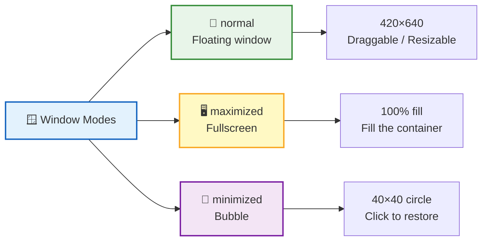
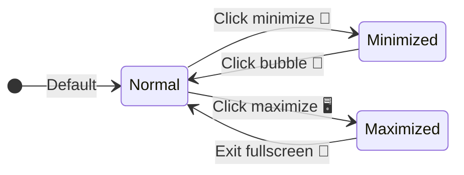
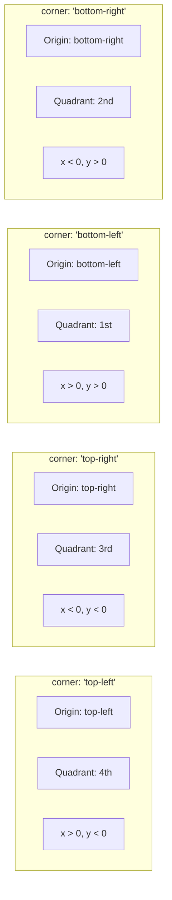
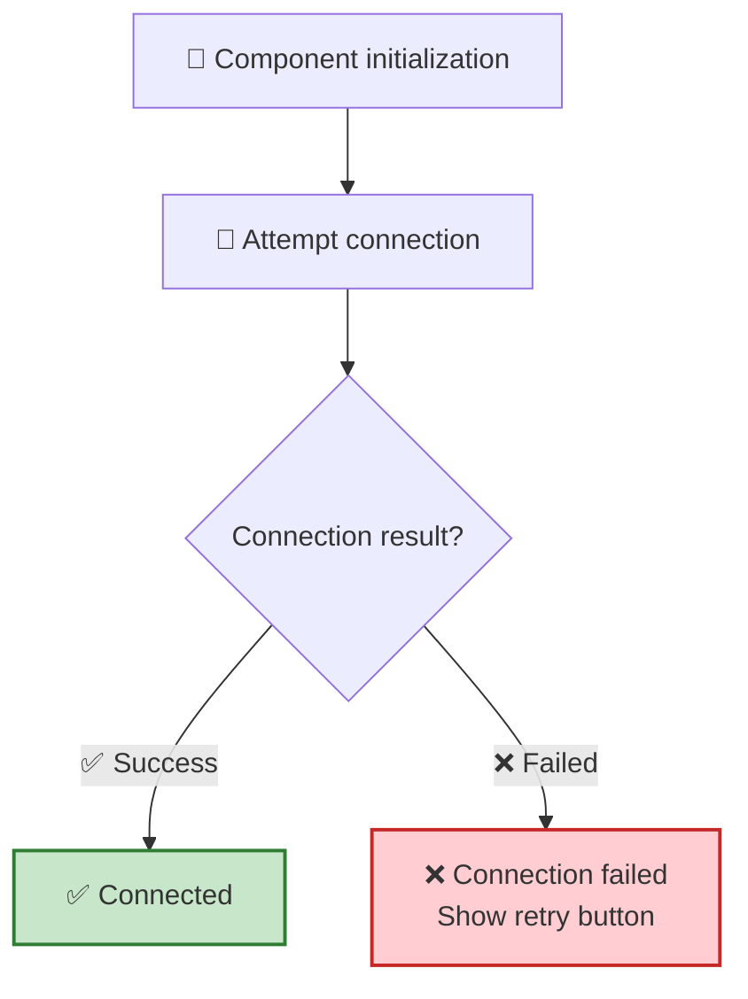
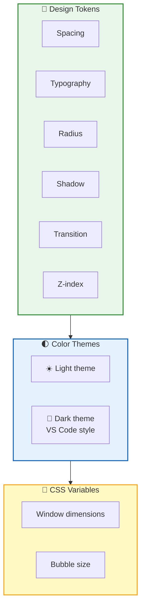

**`<rtc-agent>`** is the **sole component** exposed by RTC Agent. Built on Lit, it contains 47 sub-components and 19 Controllers internally, but presents only a clean Web Component interface externally — attribute configuration, event listening, and CSS variable customization.

## Creating the Component

### Factory Function (Recommended)

Use `createRtcAgent()` to create a component instance. **This is the recommended integration method**, providing full type safety and lifecycle management:

```typescript
import { createRtcAgent } from '@rtc-agent/component';
import type { RtcAgentConfig, RtcAgentWithLifecycle } from '@rtc-agent/component';

const config: RtcAgentConfig = {
  // Basic configuration
  appLabel: 'My AI Assistant',
  theme: 'system',
  lang: 'en-US',
  databaseName: 'my-app-rtc',
  
  // Server configuration
  server: {
    url: 'https://rtc-agent.cherish.chat',
    redirectUri: '/auth/callback.html',
  },
  
  // SharedWorker URL (required for multi-tab support)
  workerUrl: '/rtc-agent/shared-worker.js',
  
  // Authentication (3 modes, see "Auth Configuration" below)
  auth: {
    getToken: async () => localStorage.getItem('token') || '',
    userId: 'user-123',
  },
  
  // Window configuration
  window: {
    defaultMode: 'normal',
    draggable: true,
    resizable: true,
    bubblePosition: {
      corner: 'bottom-right',
      offset: { x: -24, y: 24 },
    },
  },
  
  // Function registration
  agentName: 'MyApp',
  agentDescription: 'AI assistant for my application',
  persona: 'You are a helpful assistant...',
  groups: [
    {
      name: 'editor',
      description: 'Editor operations',
      functions: [
        {
          name: 'getCode',
          description: 'Get the current code',
          handler: () => window.editorAPI.getCode(),
          returns: { schema: { type: 'string' } },
        },
      ],
    },
  ],
  
  // Event handlers
  on: {
    ready: () => {
      console.log('RTC Agent is ready');
    },
  },
};

const agent: RtcAgentWithLifecycle = createRtcAgent(config);

// ⚠️ Must be manually appended to DOM
document.body.appendChild(agent);

// Cleanup when done (removes all event listeners and WebSocket connections)
agent.destroy();
```

> 💡 **Important**: `createRtcAgent()` returns the component instance but **does not auto-append to DOM**. You must manually call `document.body.appendChild(agent)`.

### HTML Attributes (Simple Scenarios)

For simple scenarios or CDN quick previews, you can use HTML attributes directly:

```html
<script type="module" src="https://cdn.jsdelivr.net/npm/@rtc-agent/component@0.2.6-rc.1/dist/index.js"></script>

<rtc-agent theme="dark" app-label="My AI Assistant"></rtc-agent>
```

> ⚠️ HTML attributes cannot configure `auth`, `workerUrl`, and other complex options. Use the factory function for production.

### Lifecycle & Cleanup

The `destroy()` method performs a complete, ordered teardown of the component:

```ts
const agent = createRtcAgent(config);
document.body.appendChild(agent);

// When the component is no longer needed:
agent.destroy();
```

`destroy()` executes the following steps in order:

1. **Removes the element from the DOM** — calls `this.remove()` on the host element
2. **Clears pending auth references** — cancels in-flight token requests and drops cached credentials
3. **Calls all DOM event unsubscribe functions** — every `addEventListener` registered through the config `on` field or the `rtc-agent-*` DOM events is removed
4. **Calls all EventBus unsubscribe functions** — internal subscriptions (tool call events, session updates, etc.) are torn down
5. **Nullifies internal arrays** — event handler lists and controller references are set to `null` so the garbage collector can reclaim them

> 💡 **When to call**: Always call `destroy()` before removing the component from the page (e.g., in SPA route changes, modal close, or framework `unmount` hooks). Skipping it leaks event listeners and WebSocket connections.
>
> Full integration guide: [Integration Tutorial](/docs/en/integration/integration-tutorial/)

## Auth Configuration

The `auth` field in `RtcAgentConfig` controls how the component obtains authentication credentials. Three modes are supported, from simplest to most flexible:

### StaticTokenAuth

Provide tokens directly. Suitable for demos or environments where tokens are long-lived.

```ts
const config: RtcAgentConfig = {
  // ...other config
  auth: {
    accessToken: 'eyJhbGciOi...',
    refreshToken: 'dGhpcyBpcyBh...',  // optional
    userId: 'user-123',
    expiresIn: 3600,  // optional, seconds
  },
};
```

### DynamicTokenAuth (Recommended)

Provide callback functions that return tokens on demand. The component calls `getToken()` when it needs a token and `refreshToken()` when the current one expires.

```ts
const config: RtcAgentConfig = {
  // ...other config
  auth: {
    getToken: async () => {
      const res = await fetch('/api/auth/token');
      return res.json();  // { accessToken, refreshToken?, expiresIn? }
    },
    refreshToken: async () => {
      const res = await fetch('/api/auth/refresh');
      return res.json();
    },
    userId: 'user-123',
  },
};
```

### AuthProvider (Advanced)

Full control over the authentication lifecycle. Implement this when your host application already manages auth state and you want the component to integrate with it.

```ts
const config: RtcAgentConfig = {
  // ...other config
  auth: {
    getToken: async () => myAuthStore.getAccessToken(),
    refreshToken: async () => myAuthStore.refreshAccessToken(),
    isLoggedIn: () => myAuthStore.isAuthenticated,
    logout: async () => { await myAuthStore.signOut(); },
  },
};
```

> For detailed guidance on each auth mode, see [Authentication & Authorization](/docs/en/integration/auth/).

```mermaid
flowchart TD
    A["🧩 &lt;rtc-agent&gt;"] --> B["🎛️ Attributes"]
    A --> C["📡 Events"]
    A --> D["🎨 CSS Variables"]

    B --> B1["theme: light / dark / system"]
    B --> B2["lang: zh-CN / en-US"]
    B --> B3["database-name: IndexedDB prefix"]
    B --> B4["app-label: title text"]
    B --> B5["bubble-icon: bubble icon"]
    B --> B6["scenarios-url: scenario docs"]
    B --> B7["server-url: server address"]
    B --> B8["redirect-uri: OAuth callback URL"]
    B --> B9["agentConfig: declarative config (JS)"]

    C --> C1["rtc-agent-ready"]

    D --> D1["--rtc-window-default-width"]
    D --> D2["--rtc-window-default-height"]
    D --> D3["--rtc-bubble-size"]

    style A fill:#e3f2fd,stroke:#1565c0,stroke-width:3px
    style B fill:#e8f5e9,stroke:#388e3c,stroke-width:2px
    style C fill:#fff9c4,stroke:#f9a825,stroke-width:2px
    style D fill:#f3e5f5,stroke:#7b1fa2,stroke-width:2px
```



## Attributes

| Attribute | Type | Default | Description |
|:----:|:----:|:------:|:----:|
| 🎨 `theme` | `"light"` \| `"dark"` \| `"system"` | `"system"` | Theme mode. `system` follows the OS setting. Can be set dynamically via JS: `agent.theme = 'dark'` |
| 🌐 `lang` | `"zh-CN"` \| `"en-US"` | `"zh-CN"` | UI language. Priority: HTML attribute > localStorage > browser language > default (zh-CN). Can be set dynamically via JS: `agent.lang = 'en-US'` |
| 💾 `database-name` | `string` | `"rtc-agent"` | IndexedDB name prefix. The final DB name is `{prefix}-{userId}`. For example, `<rtc-agent database-name="my-app-rtc">` produces `my-app-rtc-{userId}` |
| 📛 `app-label` | `string` | `"RTC Agent"` | Title bar text + minimized bubble tooltip |
| 🖼️ `bubble-icon` | `string` | Default icon | SVG / HTML content displayed inside the minimized bubble |
| 📄 `scenarios-url` | `string` | — | URL of the scenario manifest, pointing to `manifest.json` |
| 🔗 `server-url` | `string` | `""` | Server address. Falls back to the current page's domain when empty |
| 🔁 `redirect-uri` | `string` | `window.location.origin + '/auth/callback.html'` | OAuth callback URL. Supports both absolute and relative paths |

**JS Properties** (set via JavaScript only, not HTML attributes):

| Property | Type | Default | Description |
|:----:|:----:|:------:|:----:|
| ⚙️ `agentConfig` | `object` | `null` | Declarative function registration (recommended approach) |
| 📦 `registry` | `FunctionRegistry` | `null` | Imperative function registration (created via `defineRegistry`) |
| 🪟 `windowConfig` | `WindowConfig` | `null` | Window behavior configuration (mode, size, interaction limits) |
| 🎛️ `activityBarConfig` | `ActivityBarConfig` | `null` | Activity Bar button visibility configuration |

### Quick Integration

```html
<!-- Minimal integration -->
<rtc-agent></rtc-agent>

<!-- Custom theme and title -->
<rtc-agent theme="dark" app-label="My AI Assistant"></rtc-agent>

<!-- Custom database name prefix and language -->
<rtc-agent database-name="my-app-rtc" lang="en-US"></rtc-agent>

<!-- With scenario docs and function registration -->
<rtc-agent
  app-label="Order Assistant"
  scenarios-url="https://example.com/scenarios"
  .agentConfig=${{
    name: 'OrderApp',
    persona: 'You are an order management assistant',
    groups: [{ /* ... */ }]
  }}
></rtc-agent>
```

```ts
// Window configuration (JS property, set after rtc-agent-ready)
const agent = document.querySelector('rtc-agent');

agent.addEventListener('rtc-agent-ready', () => {
  // Embedded panel: disable drag/resize/buttons, default to maximized
  agent.windowConfig = { embedded: true };

  // Keep only chat, hide files/settings buttons
  agent.activityBarConfig = {
    disabledActivities: ['files', 'settings'],
  };
});
```

## Events

All events support two listening patterns: DOM events (with the `rtc-agent-` prefix) and config callbacks (via the `on` field in `RtcAgentConfig`, using the unprefixed name).

### Lifecycle Events

| DOM Event | Config Callback | Trigger | Purpose |
|:---------:|:---------------:|:-------:|:-------:|
| 🟢 `rtc-agent-ready` | `on.ready` | Component initialization complete | Safe to access the component instance and set attributes |
| 🟡 `rtc-agent-beforeDestroy` | `on.beforeDestroy` | `disconnectedCallback` runs, before cleanup | Last chance to read state or cancel teardown |
| 🎨 `rtc-agent-themeChange` | `on.themeChange` | Theme changes (attribute, JS property, or system preference) | Sync external UI with the component's theme. `event.detail` is `{ theme: 'light' \| 'dark' \| 'system' }` |

### Message Interception Events

| DOM Event | Config Callback | Trigger | Purpose |
|:---------:|:---------------:|:-------:|:-------:|
| 📨 `rtc-agent-beforeMessageSend` | `on.beforeMessageSend` | User submits a message, before it is sent | Inspect or modify the message. Return `false` to cancel the send |

The `beforeMessageSend` callback receives `{ message: { content: string, metadata?: Record<string, unknown> } }` and must return `boolean | Promise<boolean>`. Return `false` to cancel the send. You can also mutate `message.content` in place to rewrite the message before it goes out.

### Tool Call Events

These events are bridged from the internal EventBus, giving host applications visibility into tool call progress.

| DOM Event | Config Callback | Trigger | `event.detail` |
|:---------:|:---------------:|:-------:|:--------------:|
| ⚡ `rtc-agent-toolCallStart` | `on.toolCallStart` | Tool call begins | `{ path, params }` |
| ✅ `rtc-agent-toolCallSuccess` | `on.toolCallSuccess` | Tool call completes successfully | `{ path, result }` |
| ❌ `rtc-agent-toolCallError` | `on.toolCallError` | Tool call fails | `{ path, error }` |
| 📊 `rtc-agent-toolCallProgress` | `on.toolCallProgress` | Tool call reports intermediate progress | `{ path, progress }` |

### Event Examples

```ts
const agent = createRtcAgent({
  // ...other config
  on: {
    // Lifecycle
    ready: () => {
      console.log('RTC Agent is ready');
    },
    beforeDestroy: () => {
      console.log('Component is about to be destroyed');
    },
    themeChange: (detail) => {
      console.log('Theme changed to:', detail.theme);
      document.body.dataset.theme = detail.theme;
    },

    // Message interception — validate before send
    beforeMessageSend: async ({ message }) => {
      // Block empty messages
      if (!message.content.trim()) {
        return false;
      }
      // Append a signature
      message.content += '\n\n— Sent from My App';
      return true;
    },

    // Tool call tracking
    toolCallStart: ({ path, params }) => {
      console.log(`Tool call started: ${path}`, params);
    },
    toolCallSuccess: ({ path, result }) => {
      console.log(`Tool call succeeded: ${path}`, result);
    },
    toolCallError: ({ path, error }) => {
      console.error(`Tool call failed: ${path}`, error);
    },
    toolCallProgress: ({ path, progress }) => {
      updateProgressBar(path, progress);
    },
  },
});
```

The same events can also be listened to via DOM `addEventListener` (useful when you cannot set config callbacks):

```ts
const agent = document.querySelector('rtc-agent');

agent.addEventListener('rtc-agent-ready', () => {
  // Component is ready, safe to operate
  agent.theme = 'dark';
  agent.lang = 'en-US';
  agent.appLabel = 'Custom Title';
});

agent.addEventListener('rtc-agent-themeChange', (e) => {
  console.log('Theme is now:', e.detail.theme);
});

agent.addEventListener('rtc-agent-beforeMessageSend', (e) => {
  const { message } = e.detail;
  if (containsSensitiveWords(message.content)) {
    e.returnValue = false;  // cancel send
  }
});

agent.addEventListener('rtc-agent-toolCallStart', (e) => {
  console.log('Tool call:', e.detail.path, e.detail.params);
});
```

> 💡 **Best Practice**: Always wait for the `rtc-agent-ready` event before interacting with the component to avoid errors caused by uninitialized state.

## Window System

`<rtc-agent>` includes three built-in window modes, supporting floating, fullscreen, and minimized bubble:





| Interaction | Description |
|:----:|------|
| 🖱️ Drag | The title bar serves as the drag handle |
| ↔️ Resize | Supports 8-directional resize operations |
| ⌨️ Keyboard | Arrow keys move the window; Shift to accelerate |
| 📏 Viewport constraint | Window always stays within the visible area and cannot be dragged off-screen |

### Window Configuration

Use the `windowConfig` property to control default window behavior and interaction limits:

```ts
agent.windowConfig = {
  // Default window mode
  defaultMode: 'maximized',  // 'normal' | 'maximized' | 'minimized'

  // Embedded mode (shortcut)
  // Equivalent to: defaultMode: 'maximized' + draggable: false + resizable: false
  //                + showMinimize: false + showMaximize: false
  embedded: true,

  // Fine-grained control
  draggable: false,       // Whether the window can be dragged
  resizable: false,       // Whether the window can be resized
  showMinimize: false,    // Whether to show the minimize button
  showMaximize: false,    // Whether to show the maximize button
  showClose: false,       // Whether to show the close button

  // Size and position
  initialSize: { width: 420, height: 640 },
  initialPosition: { x: 100, y: 100 },
  minWidth: 350,
  minHeight: 520,
  maxWidth: Infinity,
  maxHeight: Infinity,

  // Minimized bubble position
  bubblePosition: {
    corner: 'bottom-right',  // Origin corner of the coordinate system
    offset: { x: -20, y: 20 },  // Cartesian coordinate offset
  },
};
```

#### Bubble Position Configuration

`bubblePosition` uses a **mathematical Cartesian coordinate system** to control the position of the minimized bubble:



| Field | Type | Description |
|:-----:|:----:|:------------|
| `corner` | `'top-left'` \| `'top-right'` \| `'bottom-left'` \| `'bottom-right'` | The corner of the host application where the coordinate origin is placed |
| `offset.x` | `number` | Horizontal offset (positive = right, negative = left) |
| `offset.y` | `number` | Vertical offset (positive = up, negative = down, mathematical coordinate system) |

**Examples**:

```ts
// Bottom-right corner, 20px inward offset (default)
bubblePosition: { corner: 'bottom-right', offset: { x: -20, y: 20 } }

// Top-left corner, 20px offset to bottom-right
bubblePosition: { corner: 'top-left', offset: { x: 20, y: -20 } }

// Bottom-left corner, 30px offset to top-right
bubblePosition: { corner: 'bottom-left', offset: { x: 30, y: 30 } }
```

> 💡 **Expand Direction**: On the first restore from minimized state, the window expands based on the `corner` configuration. For example, with `corner: 'bottom-right'`, the window's bottom-right corner aligns with the bubble position, expanding toward the upper-left. Subsequent minimize/restore cycles use the remembered position.

**Common Scenarios**:

| Scenario | Configuration |
|:----:|------|
| Embedded panel | `{ embedded: true }` |
| Fixed position window | `{ draggable: false, resizable: false }` |
| No minimize button | `{ showMinimize: false, defaultMode: 'maximized' }` |
| Floating chat window | `null` (uses defaults) |

### Activity Bar Configuration

Use the `activityBarConfig` property to control button visibility in the Activity Bar:

```ts
agent.activityBarConfig = {
  // Activities to hide (chat is always visible and cannot be hidden)
  disabledActivities: ['files', 'settings'],

  // Default active activity
  defaultActivity: 'chat',  // 'chat' | 'files' | 'settings'
};
```

| Activity | Description | Hideable |
|:----:|:----:|:------:|
| 💬 `chat` | Chat interface | ❌ Always visible |
| 📁 `files` | File manager | ✅ |
| ⚙️ `settings` | Settings panel | ✅ |

## State Management

```mermaid
flowchart TD
    ROOT["🧩 &lt;rtc-agent&gt;<br/>Central Orchestration"] --> CORE["📦 9 Core Controllers"]
    ROOT --> UI["🎨 10 UI Controllers"]

    CORE --> C1["🪟 WindowState"]
    CORE --> C2["🔐 Auth"]
    CORE --> C3["💬 Session"]
    CORE --> C4["📨 Message"]
    CORE --> C5["🔧 Mode"]
    CORE --> C6["⚡ ToolCall"]
    CORE --> C7["💾 Persistence"]
    CORE --> C8["📚 Skill"]
    CORE --> C9["🖱️ WindowInteraction"]

    UI --> U1["Activity"]
    UI --> U2["EditorArea / Editor"]
    UI --> U3["FileExplorer"]
    UI --> U4["Fork"]
    UI --> U5["Notification / Toast"]
    UI --> U6["SessionTab / SessionTree"]
    UI --> U7["Settings / StatusBar"]

    style ROOT fill:#e3f2fd,stroke:#1565c0,stroke-width:3px
    style C1 fill:#e8f5e9,stroke:#388e3c
    style C2 fill:#e8f5e9,stroke:#388e3c
    style C3 fill:#e8f5e9,stroke:#388e3c
    style C4 fill:#e8f5e9,stroke:#388e3c
    style C5 fill:#e8f5e9,stroke:#388e3c
    style C6 fill:#e8f5e9,stroke:#388e3c
    style C7 fill:#e8f5e9,stroke:#388e3c
    style C8 fill:#e8f5e9,stroke:#388e3c
    style C9 fill:#e8f5e9,stroke:#388e3c
```

The component uses 19 **Controllers** internally to manage state. 9 core state Controllers handle business logic, and 10 UI Controllers handle interface interactions. Controllers do not reference each other directly; instead, the root component `<rtc-agent>` acts as the central hub orchestrating cross-Controller communication:



> 💡 **Design Principle**: Controllers are decoupled from each other; all cross-Controller communication goes through the root component. Sub-components obtain state via `@lit/context` and do not hold direct Controller references.

## Internationalization (i18n)

RTC Agent includes complete internationalization support, implemented with `@lit/localize` for runtime language switching.

### Supported Languages

| Language Code | Language | Description |
|:-------------:|:--------:|:-----------:|
| `zh-CN` | Simplified Chinese | Default language (source) |
| `en-US` | English | Target language |

### Switching Languages

Switch the interface language using the `switchLocale()` API:

```ts
import { switchLocale } from '@rtc-agent/component/core/i18n.js';

// Switch to English
await switchLocale('en-US');

// Switch to Chinese
await switchLocale('zh-CN');
```

### Language Persistence

Language selection is automatically saved to `localStorage` (key: `rtc-agent-locale`) and persists across page refreshes.

### Using in Components

Use the `@localized()` decorator and `msg()` function in components:

```ts
import { localized, msg } from '@lit/localize';
import { consume } from '@lit/context';
import { localeContext } from '@rtc-agent/component/core/i18n.js';

@localized()
@customElement('my-component')
export class MyComponent extends LitElement {
  @consume({ context: localeContext, subscribe: true })
  private _localeCtx!: LocaleContextValue;

  render() {
    // React to locale changes
    void this._localeCtx.locale;
    
    return html`
      <div>${msg('Welcome to RTC Agent')}</div>
    `;
  }
}
```

### Adding Translations

1. **Mark text**: Wrap translatable text with `msg()` in components
2. **Extract translations**: Run `npm run localize:extract` to generate XLIFF files
3. **Translate text**: Edit `xliff/en-US.xlf` file
4. **Build translations**: Run `npm run localize:build` to generate language packs

For detailed guidance, see [Internationalization Integration Guide](/docs/en/integration/i18n).

## CSS Variables

CSS variables allow you to customize the component's appearance and dimensions without modifying source code:

```css
rtc-agent {
  /* Window default dimensions */
  --rtc-window-default-width: 420px;
  --rtc-window-default-height: 640px;

  /* Minimized bubble size */
  --rtc-bubble-size: 40px;

  /* User-defined font size (affects all text) */
  --rtc-font-size-user: 16px;

  /* Brand colors */
  --rtc-color-primary-rgb: 39 65 254;  /* Light: #2741FE */
  --rtc-color-accent: #2741FE;
}
```

| Variable | Default | Description |
|:--------:|:-------:|:-----------:|
| `--rtc-window-default-width` | `420px` | Default width of the floating window |
| `--rtc-window-default-height` | `640px` | Default height of the floating window |
| `--rtc-bubble-size` | `40px` | Diameter of the minimized bubble |
| `--rtc-font-size-user` | `14px` | User-defined base font size (12-24px) |
| `--rtc-color-primary-rgb` | Light: `39 65 254`<br/>Dark: `26 122 176` | Primary color RGB value (for opacity calculations) |
| `--rtc-color-accent` | Light: `#2741FE`<br/>Dark: `#1A7AB0` | Accent color (links, buttons, etc.) |

### Font Size Scale

Setting `--rtc-font-size-user` proportionally scales all font sizes:

| Token | Formula | Example (base=14px) |
|:-----:|:-------:|:-------------------:|
| `--rtc-font-size-xs` | `base * 0.857` | 12px |
| `--rtc-font-size-sm` | `base * 0.929` | 13px |
| `--rtc-font-size-base` | `base` | 14px |
| `--rtc-font-size-md` | `base * 1.143` | 16px |
| `--rtc-font-size-lg` | `base * 1.286` | 18px |
| `--rtc-font-size-xl` | `base * 1.429` | 20px |
| `--rtc-font-size-2xl` | `base * 1.714` | 24px |

## Logo Customization

RTC Agent provides Lit rendering helpers for brand logos, supporting both light and dark variants.

### Using renderLogo()

```ts
import { renderLogo, renderBubbleLogo } from '@rtc-agent/component/icons/logo.js';

@customElement('my-component')
export class MyComponent extends LitElement {
  @property({ type: String })
  theme: 'light' | 'dark' | 'system' = 'system';

  render() {
    const isDark = this.theme === 'dark';
    
    return html`
      <div class="header">
        <!-- Full Logo (for login page, empty state, etc.) -->
        <div class="logo">${renderLogo(isDark)}</div>
        
        <!-- Bubble Logo (for minimized bubble) -->
        <div class="bubble-logo">${renderBubbleLogo(isDark)}</div>
      </div>
    `;
  }
}
```

### Logo Files

| File | Description | Usage |
|:----:|:-----------:|:-----:|
| `logo.svg` | Blue sky logo | Light theme |
| `logo-dark.svg` | Night sky logo | Dark theme |

### Customizing the Logo

To replace the brand logo, you can:

1. **Replace SVG files**: Modify `src/assets/logo.svg` and `src/assets/logo-dark.svg`
2. **Use custom rendering**: Render your own logo directly in components

## Connection & Retry

RTC Agent automatically attempts to establish a connection when the component initializes. Connection state is managed through an internal state machine, with the frontend reflecting connection progress in real-time.

### Connection Flow



> **Design Principle**: Connection failures do not trigger automatic retries. Instead, control is handed to the user, who can check network conditions before manually triggering a reconnection. This avoids wasting resources on repeated attempts during network outages.

### Manual Reconnection

When connection fails, users can manually reconnect in the following ways:

#### Method 1: Click the title bar retry button

After connection fails, a red retry button appears in the title bar. Click to trigger reconnection.

#### Method 2: Call the reconnect() method

```ts
const agent = document.querySelector('rtc-agent');

// Manually trigger reconnection
await agent.reconnect();
```

### Connection State Query

Connection state can be queried through the following read-only properties:

| Property | Type | Description |
|:---------|:-----|:------------|
| `connectionFailed` | `boolean` | Whether connection has failed |
| `connectionError` | `string` | Error message when connection failed |

```ts
// Check connection state
agent.addEventListener('rtc-agent-ready', () => {
  console.log('Connection failed:', agent.connectionFailed);
  console.log('Connection error:', agent.connectionError);

  if (agent.connectionFailed) {
    console.error('Connection failed:', agent.connectionError);
  }
});
```

> **Note**: Detailed connection states (`disconnected`, `connecting`, `connected`, `reconnecting`) are managed internally by the component and not exposed externally. External code can only determine connection success via `connectionFailed` and `connectionError`.

### Title Bar Status Display

The title bar shows different visual feedback based on connection state:

| State | Status Dot Color | Text | Retry Button |
|:-----:|:----------------:|:----:|:------------:|
| `connected` | 🟢 Green | "Connected" | ❌ Hidden |
| `connecting` | 🟡 Yellow pulse | "Connecting" | ❌ Hidden |
| `reconnecting` | 🟡 Yellow pulse | "Reconnecting" | ❌ Hidden |
| `disconnected` | 🔴 Red | "Disconnected" | ❌ Hidden |
| Connection failed | 🔴 Red blinking | "Connection failed: ..." | ✅ Shown |

## Style System

The component uses a three-layer style architecture, progressing from foundational tokens to top-level variables:



| Layer | Content | Description |
|:----:|:----:|:----:|
| 🏗️ Design Tokens | Spacing, typography, radius, shadow, transition, z-index | Foundational design constants ensuring visual consistency |
| 🌓 Color Themes | Light / Dark (VS Code style) | Two complete color schemes with automatic adaptation |
| 🔧 CSS Variables | Component-level customization (window dimensions, bubble size) | Overridable by host applications for personalization |

## Debug API

`<rtc-agent>` exposes a `window.rtcAgentDebug` object in all builds (dev + prod), providing 40+ methods for E2E testing, debugging, and automation.

```ts
const debug = window.rtcAgentDebug;
```

### Method Categories

| Domain | Methods | Description |
|:--:|------|------|
| **State** | `getState()`, `clearData()`, `seedData()` | State access and data management |
| **Auth** | `loginAs(userId, tokens?)`, `logout()` | Authentication simulation |
| **VirtualFS** | `listFiles(path?)`, `readFile(path)`, `writeFile(path, content)`, `deleteFile(path)` | Virtual file system operations |
| **Session** | `createSession()`, `switchSession(id)`, `deleteSession(id)`, `renameSession(id, title)`, `getSessions()`, `getCurrentSessionId()` | Session management |
| **Message** | `sendMessage(content)`, `getMessages()`, `addDemoMessage(content, role?)`, `clearMessages()` | Message operations |
| **Tool Call** | `getToolCalls()`, `addPendingToolCall(call)`, `approveToolCall(id)`, `denyToolCall(id)`, `approveAllToolCalls(toolName)` | Tool call simulation |
| **UI Control** | `click(selector)`, `scrollIntoView(selector)`, `typeText(selector, text)` | UI interaction simulation |
| **Toast** | `showToast(message, type?)`, `getToasts()` | Toast notifications |
| **Settings** | `getSettings()`, `updateSettings(section, patch)` | Settings management |
| **Activity** | `setActivity(activity)`, `getActivity()` | Activity Bar control |
| **Network** | `simulateOffline()`, `restoreNetwork()`, `isOffline` | Network simulation |
| **Event** | `triggerEvent(name, detail?)` | Custom event simulation |
| **Metrics** | `getMetrics()` | Performance metrics collection |
| **Component** | `element`, `waitForReady(timeout?)`, `waitForConnected(timeout?)` | Component reference and waiting |
| **Logs** | `logs`, `clearLogs()` | Log access |

### Usage Example

```ts
const debug = window.rtcAgentDebug;

// Wait for component to be ready
const agent = await debug.waitForReady(5000);

// Wait for connection
await debug.waitForConnected(10000);

// Create a session and send a message
const sessionId = debug.createSession();
debug.switchSession(sessionId);
await debug.sendMessage('Hello, help me write a Hello World');

// Simulate offline mode
debug.simulateOffline();
console.log('Is offline:', debug.isOffline);

// Restore network
debug.restoreNetwork();

// Get all messages
const messages = debug.getMessages();
console.log('Message count:', messages.length);

// Get current state
const state = debug.getState();
console.log('Current session:', debug.getCurrentSessionId());
```

### E2E Testing Best Practices

```ts
// Playwright example
test('send message and get response', async ({ page }) => {
  await page.goto('/');
  
  // Wait for component to be ready
  await page.waitForFunction(() => window.rtcAgentDebug?.waitForReady);
  await page.evaluate(() => window.rtcAgentDebug.waitForReady(5000));
  
  // Send a message
  await page.evaluate(() => window.rtcAgentDebug.sendMessage('Hello'));
  
  // Wait for AI response
  await page.waitForFunction(() => {
    const msgs = window.rtcAgentDebug.getMessages();
    return msgs.some(m => m.role === 'assistant');
  }, { timeout: 30000 });
  
  // Verify response
  const messages = await page.evaluate(() => window.rtcAgentDebug.getMessages());
  expect(messages.length).toBeGreaterThan(1);
});
```

> 💡 The Debug API is available in production builds too, which is useful for diagnosing live issues. However, we recommend using data-modifying methods like `seedData()` and `clearData()` only in development and test environments.

## Key Interactions

| Area | Behavior |
|:----:|:----:|
| ⌨️ **Input Area** | Textarea + bottom toolbar; Enter to submit, Shift+Enter for newline; toolbar includes attachments, tools, mode toggle, send/stop; when `scenarios-url` is configured, a scenario selection button is shown in the toolbar, opening the `rtc-scenario-panel` component for users to pick a scenario |
| 📨 **Message List** | Auto-scrolls to bottom; "New messages" button shown when user scrolls away; supports Markdown rendering and code highlighting |
| ⚡ **Tool Confirmation Dialog** | Displays tool name and parameters; Yes / No buttons; clicking the background is equivalent to rejecting |
| 🔄 **Connection Retry** | A retry button is displayed when the connection fails; you can also call `agent.reconnect()` programmatically to reconnect |

## Next Steps

- [Authentication & Authorization](/docs/en/integration/auth/) — Learn about the login flow and token mechanism
- [Function Registration Guide](/docs/en/integration/function-registration/) — Register custom functions via `agentConfig`
- [Scenario Authoring Guide](/docs/en/integration/scenario-authoring/) — Write scenario documents to guide AI behavior
