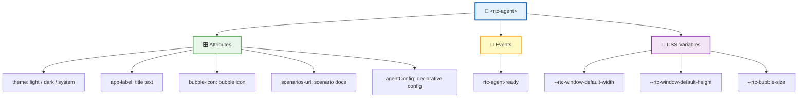
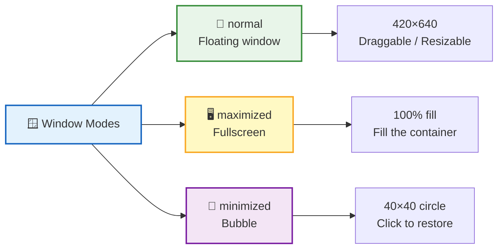
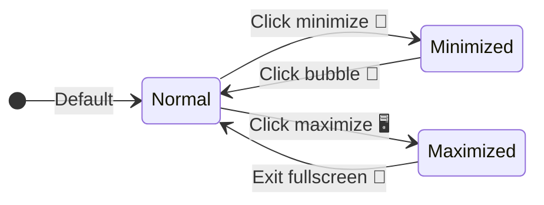
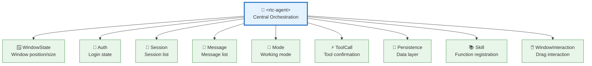
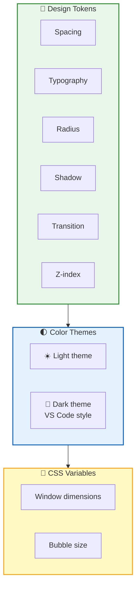

**`<rtc-agent>`** is the **sole component** exposed by RTC Agent. Built on Lit, it contains 16 sub-components and 9 Controllers internally, but presents only a clean Web Component interface externally — attribute configuration, event listening, and CSS variable customization.



## Attributes

| Attribute | Type | Default | Description |
|:----:|:----:|:------:|:----:|
| 🎨 `theme` | `"light"` \| `"dark"` \| `"system"` | `"system"` | Theme mode. `system` follows the OS setting |
| 📛 `app-label` | `string` | `"RTC Agent"` | Title bar text + minimized bubble tooltip |
| 🖼️ `bubble-icon` | `string` | Default icon | SVG / HTML content displayed inside the minimized bubble |
| 📄 `scenarios-url` | `string` | — | URL of the scenario manifest, pointing to `manifest.json` |
| ⚙️ `agentConfig` | `object` | — | Declarative function registration (recommended approach) |

### Quick Integration

```html
<!-- Minimal integration -->
<rtc-agent></rtc-agent>

<!-- Custom theme and title -->
<rtc-agent theme="dark" app-label="My AI Assistant"></rtc-agent>

<!-- With scenario docs and function registration -->
<rtc-agent
  app-label="Order Assistant"
  scenarios-url="https://example.com/scenarios"
  .agentConfig=${{
    name: 'OrderApp',
    persona: 'You are an order management assistant',
    groups: [{ /* ... */ }]
  }}
></rtc-agent>
```

## Events

| Event | Trigger | Purpose |
|:----:|:--------:|:----:|
| 🟢 `rtc-agent-ready` | Component initialization complete | Safe to access the component instance and set attributes at this point |

```ts
const agent = document.querySelector('rtc-agent');

agent.addEventListener('rtc-agent-ready', () => {
  // Component is ready, safe to operate
  agent.theme = 'dark';
  agent.appLabel = 'Custom Title';
});
```

> 💡 **Best Practice**: Always wait for the `rtc-agent-ready` event before interacting with the component to avoid errors caused by uninitialized state.

## Window System

`<rtc-agent>` includes three built-in window modes, supporting floating, fullscreen, and minimized bubble:





| Interaction | Description |
|:----:|------|
| 🖱️ Drag | The title bar serves as the drag handle |
| ↔️ Resize | Supports 8-directional resize operations |
| ⌨️ Keyboard | Arrow keys move the window; Shift to accelerate |
| 📏 Viewport constraint | Window always stays within the visible area and cannot be dragged off-screen |

## State Management

The component uses 9 **Controllers** internally to manage state. Controllers do not reference each other directly; instead, the root component `<rtc-agent>` acts as the central hub orchestrating cross-Controller communication:



> 💡 **Design Principle**: Controllers are decoupled from each other; all cross-Controller communication goes through the root component. Sub-components obtain state via `@lit/context` and do not hold direct Controller references.

## CSS Variables

CSS variables allow you to customize the component's appearance and dimensions without modifying source code:

```css
rtc-agent {
  /* Window default dimensions */
  --rtc-window-default-width: 420px;
  --rtc-window-default-height: 640px;

  /* Minimized bubble size */
  --rtc-bubble-size: 40px;
}
```

| Variable | Default | Description |
|:----:|:------:|:----:|
| `--rtc-window-default-width` | `420px` | Default width of the floating window |
| `--rtc-window-default-height` | `640px` | Default height of the floating window |
| `--rtc-bubble-size` | `40px` | Diameter of the minimized bubble |

## Style System

The component uses a three-layer style architecture, progressing from foundational tokens to top-level variables:



| Layer | Content | Description |
|:----:|:----:|:----:|
| 🏗️ Design Tokens | Spacing, typography, radius, shadow, transition, z-index | Foundational design constants ensuring visual consistency |
| 🌓 Color Themes | Light / Dark (VS Code style) | Two complete color schemes with automatic adaptation |
| 🔧 CSS Variables | Component-level customization (window dimensions, bubble size) | Overridable by host applications for personalization |

## Key Interactions

| Area | Behavior |
|:----:|:----:|
| ⌨️ **Input Area** | Textarea + bottom toolbar; Enter to submit, Shift+Enter for newline; toolbar includes attachments, tools, mode toggle, send/stop |
| 📨 **Message List** | Auto-scrolls to bottom; "New messages" button shown when user scrolls away; supports Markdown rendering and code highlighting |
| ⚡ **Tool Confirmation Dialog** | Displays tool name and parameters; Yes / No buttons; clicking the background is equivalent to rejecting |

## Next Steps

- [Authentication & Authorization](/docs/en/integration/auth/) — Learn about the login flow and token mechanism
- [Function Registration Guide](/docs/en/integration/function-registration/) — Register custom functions via `agentConfig`
- [Scenario Authoring Guide](/docs/en/integration/scenario-authoring/) — Write scenario documents to guide AI behavior
