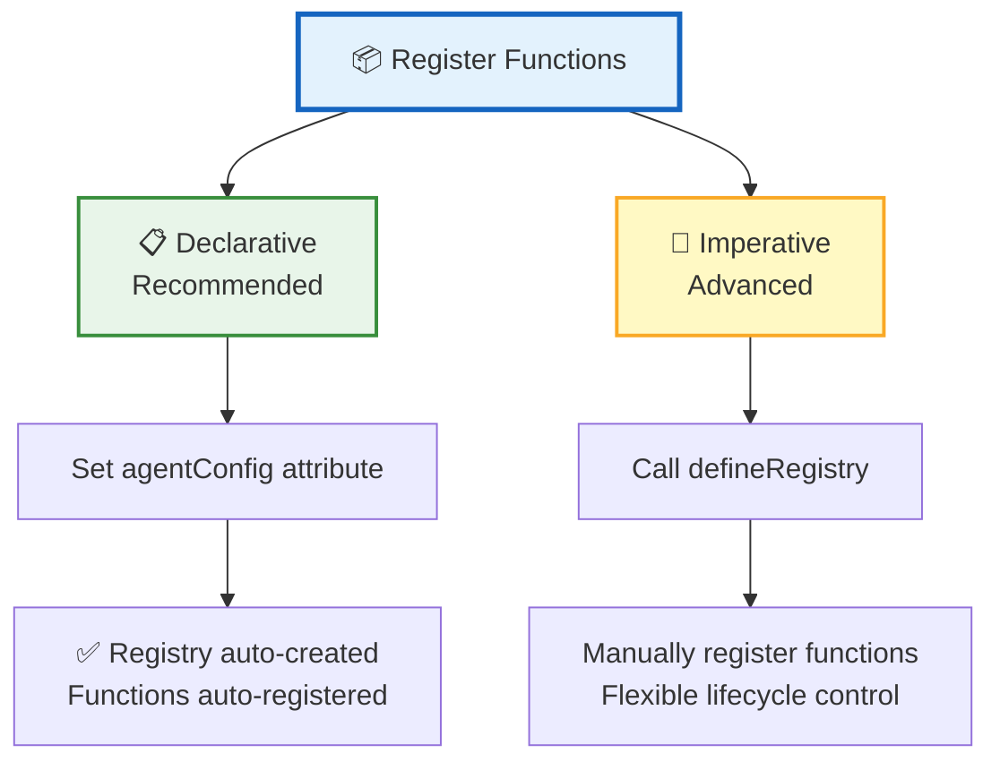
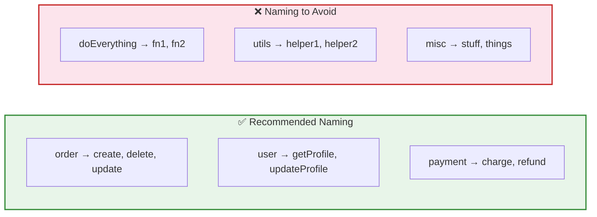
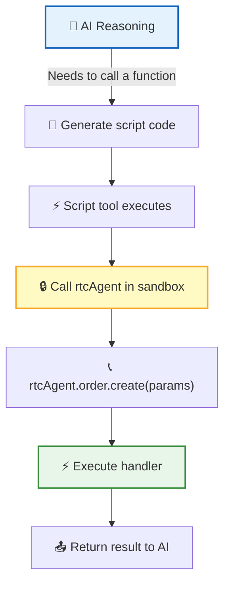
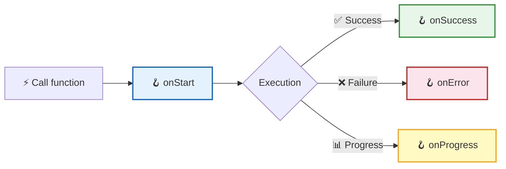
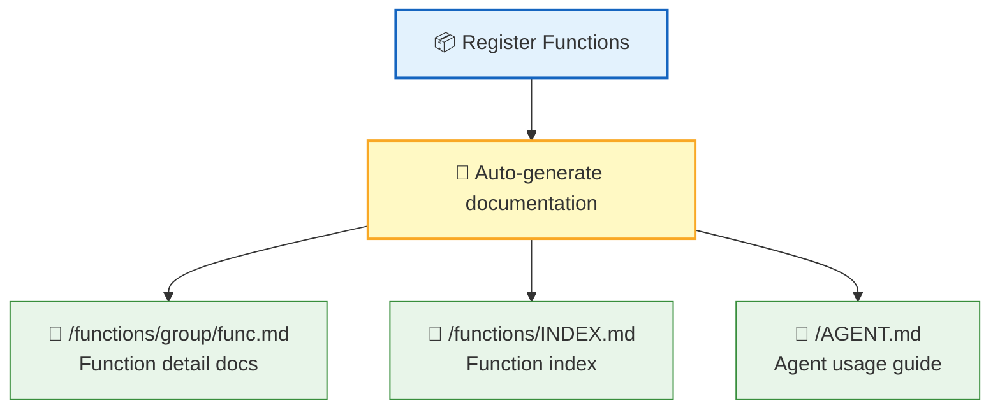

**Function Registration** is the bridge that lets AI invoke your business capabilities. Registered functions automatically generate documentation that AI can read and learn to use — no manual prompt engineering, no extra integration code needed.

## Two Registration Approaches



| Approach | Use Case | Advantages |
|:----:|:--------:|:----:|
| 📋 **Declarative** | Most scenarios (recommended) | Zero config, just set `agentConfig` |
| 🔧 **Imperative** | Fine-grained control needed (multiple Registries, dynamic registration) | Flexible, manual lifecycle management |

## Declarative Registration (Recommended)

The simplest approach — just set the `agentConfig` attribute:

```ts
const agent = document.querySelector('rtc-agent');

agent.agentConfig = {
  name: 'OrderApp',
  persona: 'You are an order management assistant, helping users create, query, and process orders.',
  groups: [
    {
      name: 'order',
      description: 'Order management operations',
      functions: [
        {
          name: 'create',
          description: 'Create a new order',
          parameters: [
            { name: 'productId', schema: { type: 'string' }, required: true, description: 'Product ID' },
            { name: 'quantity', schema: { type: 'number' }, description: 'Purchase quantity' }
          ],
          returns: { schema: { type: 'object' }, description: 'Order info, including orderId' },
          handler: async (params) => {
            const res = await api.createOrder(params.productId, params.quantity);
            return { orderId: res.id, status: res.status };
          }
        }
      ]
    }
  ]
};
```

> 💡 After setting `agentConfig`, the system automatically creates the Registry, registers functions, and generates documentation — completely zero-config.

## Imperative Registration (Advanced)

For fine-grained control, use `defineRegistry` to register manually:

```ts
import { defineRegistry } from '@rtc-agent/component';

const registry = defineRegistry({
  name: 'OrderApp',
  description: 'Order management application',
  persona: 'You are an order management assistant.'
});

const orderGroup = registry.createGroup({
  name: 'order',
  description: 'Order management operations'
});

orderGroup.register({
  name: 'create',
  description: 'Create a new order',
  handler: async (params) => {
    return await api.createOrder(params.productId, params.quantity);
  }
});
```

## Function Definition Fields

Each function consists of the following fields:

| Field | Type | Required | Description |
|:----:|:----:|:----:|:----:|
| 📛 `name` | `string` | ✅ | Function name; combined with group name to form the full path (e.g., `order.create`) |
| 📝 `description` | `string` | ✅ | Function description, **written into auto-generated documentation**; AI uses this to decide when to call |
| 📐 `parameters` | `ParameterDef[]` | — | Array of parameter definitions, each with `{name, schema, required?, description?}`; `schema` is OpenAPI Schema |
| 🔙 `returns` | `ReturnDef` | — | Return value definition `{schema, description?}`, helping AI understand the output |
| ⚡ `handler` | `function` | ✅ | Execution function; supports `async`, receives `params` argument |
| 🪝 `hooks` | `object` | — | UI hooks (`onStart` / `onSuccess` / `onError` / `onProgress`) |

### Complete Function Example

```ts
{
  name: 'refund',
  description: 'Initiate a refund for a specified order, supporting full and partial refunds',
  parameters: [
    { name: 'orderId', schema: { type: 'string' }, required: true, description: 'Order ID' },
    { name: 'amount', schema: { type: 'number' }, description: 'Refund amount (omit for full refund)' },
    { name: 'reason', schema: { type: 'string' }, required: true, description: 'Refund reason' }
  ],
  returns: { schema: { type: 'object' }, description: 'Refund result, including refundId and status' },
  handler: async (params, onProgress) => {
    onProgress?.(30);
    await validateOrder(params.orderId);
    onProgress?.(70);
    const result = await processRefund(params.orderId, params.amount);
    return { refundId: result.id, status: result.status };
  },
  hooks: {
    onStart: () => showToast('Processing refund...'),
    onSuccess: (result) => showToast(`Refund successful: ${result.refundId}`),
    onError: (err) => showToast(`Refund failed: ${err.message}`)
  }
}
```

## Group Naming Conventions



| Rule | Recommended | Avoid |
|:----:|:----:|:----:|
| 📛 Group name | Business domain nouns (`order`, `user`, `payment`) | Too broad (`utils`, `misc`, `do`) |
| 🔤 Function name | Verbs or verb-object phrases (`create`, `getProfile`) | Meaningless abbreviations (`fn1`, `doIt`) |
| 📐 Granularity | Each function does one thing | One function does everything |

> 📌 **Full Path**: Group name + function name = full invocation path. For example, `order.create`, `payment.refund`.

## How AI Calls Functions

After registration, AI calls functions in a sandbox via the `script` tool:



AI has two equivalent invocation syntaxes:

```ts
// Approach 1: Proxy chain call (natural syntax)
await rtcAgent.order.create({ productId: '123', quantity: 2 });

// Approach 2: callFunction method
await rtcAgent.callFunction('order.create', { productId: '123', quantity: 2 });
```

> 💡 Proxy chain calls let AI use registered functions just like calling a regular API — intuitive syntax, hard to get wrong.

## Hook System

Hooks let the host application intervene at various stages of function execution, enabling UI feedback, logging, and more:



| Hook | Trigger | Description |
|:----:|:--------:|:----:|
| 🟦 `onStart` | Before execution | Can throw `CancelledError` to cancel execution |
| 🟩 `onSuccess` | After success | Executes asynchronously, does not block main flow |
| 🟥 `onError` | After failure | Executes asynchronously, does not block main flow |
| 🟨 `onProgress` | Progress update | Triggered when handler calls `onProgress(n)` |

```ts
// Hook example: Show Toast notifications
{
  hooks: {
    onStart: () => showToast('Operation starting...'),
    onSuccess: (result) => showToast(`Operation complete: ${result.id}`),
    onError: (err) => showToastError(`Operation failed: ${err.message}`)
  }
}
```

## Automatic Documentation Generation



| Generated Content | Description |
|:--------:|:----:|
| 📄 Function Docs | One Markdown file per function, including description, parameter table, return values, and call examples |
| 📑 Index File | `INDEX.md` lists all available functions for easy AI browsing |
| 🧠 Agent Guide | `AGENT.md` summarizes all function capabilities, helping AI understand the overall context |

> 💡 **Register and Use Immediately**: Documentation is auto-generated at registration time; AI can read it directly to learn function usage — no extra prompt engineering needed.

## Next Steps

- [Scenario Authoring Guide](/docs/en/integration/scenario-authoring/) — Write scenario documents to guide AI's business behavior
- [Web Component API](/docs/en/integration/component-api/) — Learn about the component's attributes, events, and style system
- [Core Protocol RTC](/docs/en/concepts/rtc/) — Learn how AI invokes frontend tools
