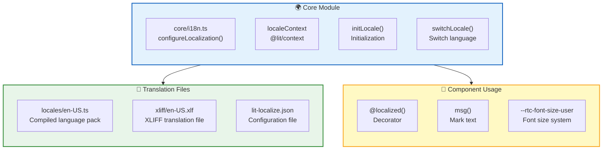
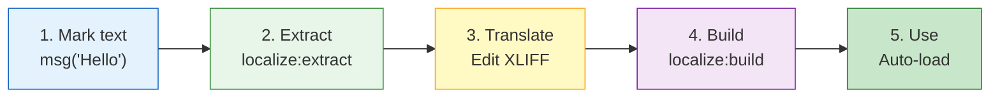

RTC Agent builds a complete internationalization system on `@lit/localize`, supporting runtime language switching without page reloads.

## Architecture Overview



## Initialization

### Language Priority

The component determines the initial language at startup according to the following priority:

1. **HTML attribute**: The `lang` attribute set on `<rtc-agent lang="en-US">` (highest priority)
2. **localStorage**: The user's choice saved under the key `rtc-agent-locale`
3. **Browser language**: `navigator.language`, used if it's in the supported list
4. **Default**: Falls back to the source language `zh-CN`

### initLocale()

Call `initLocale()` when the component starts to initialize the locale:

```ts
import { initLocale } from '@rtc-agent/component';

// Call at application startup
await initLocale();
```

**Initialization logic**:

1. Check if there's a saved language in `localStorage` (key: `rtc-agent-locale`)
2. Check if browser language `navigator.language` is in the supported list
3. Fall back to source language `zh-CN`
4. Sync `document.documentElement.lang` attribute (screen reader pronunciation rules)

### Configuration

`lit-localize.json` defines language configuration:

```json
{
  "sourceLocale": "zh-CN",
  "targetLocales": ["en-US"],
  "tsConfig": "tsconfig.json",
  "output": {
    "mode": "runtime",
    "localeCodesModule": "src/.generated/locale-codes.ts"
  }
}
```

## Switching Languages

### switchLocale()

Switch languages at runtime:

```ts
import { switchLocale, type SupportedLocale } from '@rtc-agent/component';

// Switch to English
await switchLocale('en-US');

// Switch back to Chinese
await switchLocale('zh-CN');
```

**switchLocale() behavior**:

| Step | Operation |
|:----:|:---------:|
| 1 | Call `@lit/localize`'s `setLocale()` to load language pack |
| 2 | Save to `localStorage` (key: `rtc-agent-locale`) |
| 3 | Update `document.documentElement.lang` attribute |
| 4 | All `@localized()` components automatically re-render |

### getLocale()

Get the currently active locale (synchronous):

```ts
import { getLocale } from '@rtc-agent/component';

const current = getLocale(); // 'zh-CN' | 'en-US'
```

### persistLocale()

Persist locale preference to `localStorage` without triggering a locale switch. Useful for saving user choice before the component is mounted:

```ts
import { persistLocale } from '@rtc-agent/component';

persistLocale('en-US');
```

### Supported Languages

| Language Code | Language | Type |
|:-------------:|:--------:|:----:|
| `zh-CN` | Simplified Chinese | Source language |
| `en-US` | English | Target language |

```ts
// Type-safe
type SupportedLocale = 'zh-CN' | 'en-US';

// Type guard
import { isValidLocale } from '@rtc-agent/component';
if (isValidLocale(userInput)) {
  await switchLocale(userInput);
}
```

## Using in Components

### @localized() Decorator

Use the `@localized()` decorator to mark components that need to respond to language changes:

```ts
import { LitElement, html } from 'lit';
import { customElement } from 'lit/decorators.js';
import { localized, msg } from '@lit/localize';
import { consume } from '@lit/context';
import { localeContext, type LocaleContextValue } from '@rtc-agent/component';

@localized()
@customElement('my-component')
export class MyComponent extends LitElement {
  @consume({ context: localeContext, subscribe: true })
  @state()
  private _localeCtx: LocaleContextValue = { /* ... */ };

  render() {
    // Reference locale to ensure re-render on language switch
    void this._localeCtx.locale;

    return html`
      <div>${msg('Welcome to RTC Agent')}</div>
      <p>${msg('This is an internationalized component')}</p>
    `;
  }
}
```

### msg() Function

`msg()` marks text that needs translation:

```ts
import { msg, str } from '@lit/localize';

// Simple text
msg('Hello World')

// Text with variables
const name = 'User';
msg(str`Hello, ${name}!`)

// Text with HTML (needs escaping)
msg(html`Click <a href="/help">${msg('Help')}</a>`)
```

### localeContext

Get the locale context via `@lit/context`:

```ts
import { consume } from '@lit/context';
import { localeContext, type LocaleContextValue } from '@rtc-agent/component';

@consume({ context: localeContext, subscribe: true })
@state()
private _localeCtx: LocaleContextValue = {
  locale: 'zh-CN',
  setLocale: async () => {},
  locales: ['zh-CN', 'en-US'],
};
```

## Adding Translations

### Translation Workflow



### Step 1: Mark Text

Wrap text that needs translation with `msg()` in components:

```ts
render() {
  return html`
    <h1>${msg('Settings')}</h1>
    <p>${msg('Choose interface language')}</p>
  `;
}
```

### Step 2: Extract Translations

Run the extract command to generate XLIFF files:

```bash
npm run localize:extract
```

This generates translation entries in `xliff/en-US.xlf`:

```xml
<trans-unit id="s8ef06a6080e58381">
  <source>Settings</source>
  <target state="new">Settings</target>
  <note from="lit-localize">Settings panel title</note>
</trans-unit>
```

### Step 3: Translate Text

Edit `xliff/en-US.xlf`, replacing `<target>` with the translated text:

```xml
<trans-unit id="s8ef06a6080e58381">
  <source>Settings</source>
  <target>Settings</target>
</trans-unit>
```

### Step 4: Build Language Packs

Run the build command to generate compiled language packs:

```bash
npm run localize:build
```

This generates optimized translation mappings in `src/locales/en-US.ts`.

## Font Size System

RTC Agent provides a proportional scaling font size system based on `--rtc-font-size-user`.

### Base Font Size

```css
rtc-agent {
  /* Set base font size (12-24px) */
  --rtc-font-size-user: 16px;
}
```

### Font Size Scale

All font size tokens scale proportionally to the base font size:

| Token | Formula | 12px | 14px (default) | 16px | 18px | 20px |
|:-----:|:-------:|:----:|:--------------:|:----:|:----:|:----:|
| `--rtc-font-size-xs` | `base * 0.857` | 10px | 12px | 14px | 15px | 17px |
| `--rtc-font-size-sm` | `base * 0.929` | 11px | 13px | 15px | 17px | 19px |
| `--rtc-font-size-base` | `base` | 12px | 14px | 16px | 18px | 20px |
| `--rtc-font-size-md` | `base * 1.143` | 14px | 16px | 18px | 21px | 23px |
| `--rtc-font-size-lg` | `base * 1.286` | 15px | 18px | 21px | 23px | 26px |
| `--rtc-font-size-xl` | `base * 1.429` | 17px | 20px | 23px | 26px | 29px |
| `--rtc-font-size-2xl` | `base * 1.714` | 21px | 24px | 27px | 31px | 34px |

### Settings Panel Integration

The settings panel provides a font size adjustment control:

```ts
// In rtc-settings-layout
private _renderAppearance() {
  return html`
    <div class="setting-row">
      <label for="font-size-input">${msg('Font Size')}</label>
      <input
        type="number"
        id="font-size-input"
        min="12"
        max="24"
        step="1"
        .value=${String(this._settingsCtx.state.appearance.fontSize)}
        @change=${(e: Event) => {
          const size = Number((e.target as HTMLInputElement).value);
          this._updateSetting('appearance', { fontSize: size });
        }}
      />
      <span>px</span>
    </div>
  `;
}
```

### DOM Side Effects

`SettingsController` automatically applies the font size to the document root:

```ts
// SettingsController._applyFontSize()
document.documentElement.style.setProperty(
  '--rtc-font-size-user',
  `${clamped}px`
);
```

This ensures all components in Shadow DOM can inherit the font size setting.

## Best Practices

| Practice | Description |
|:--------:|:-----------:|
| ✅ Always use `msg()` | All user-visible text should be wrapped in `msg()` |
| ✅ Reference `locale` | Reference `this._localeCtx.locale` in `render()` to ensure re-rendering |
| ✅ Use `@localized()` | Components that need to respond to language changes must add this decorator |
| ✅ Type safety | Use `SupportedLocale` type and `isValidLocale()` guard |
| ❌ Don't hardcode | Avoid hardcoding user-visible text outside `msg()` |
| ❌ Don't call `_setLocale` directly | Use `switchLocale()` to ensure persistence and DOM sync |

## Next Steps

- [Component API](/docs/en/integration/component-api) — Learn about the full component API
- [Settings System](/docs/en/features/settings) — Learn about the global settings system
