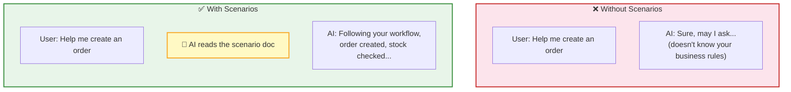
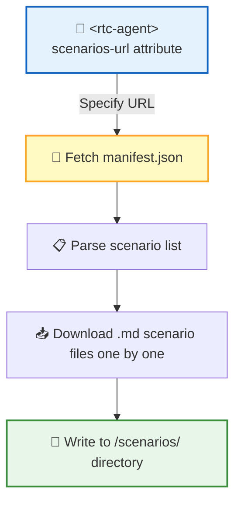
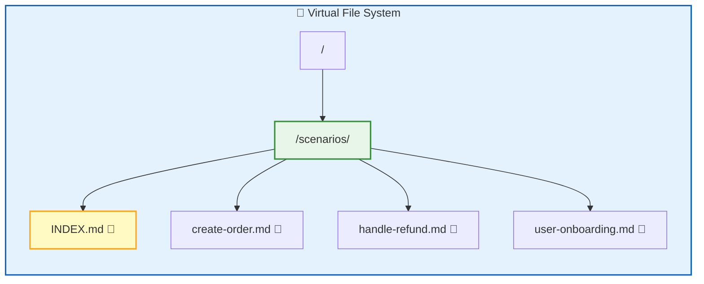
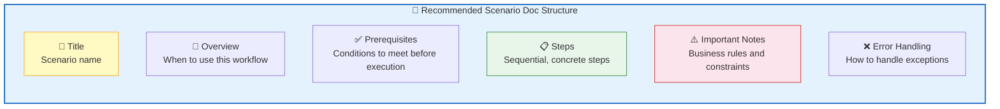
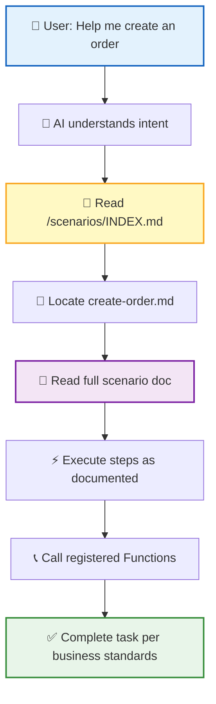

**Scenarios** are business workflow documents written in Markdown. They tell AI the operational procedures and considerations for specific situations — such as "how to create an order" or "how to handle a refund" — so that AI follows your business standards during execution.

## What Are Scenarios



| Concept | Description |
|:----:|:----:|
| 📄 Scenario Doc | Business workflow description in Markdown format |
| 📡 Loading | Specified via the `<rtc-agent scenarios-url="...">` attribute URL |
| 💾 Storage Location | `/scenarios/` directory in the virtual file system |
| 📑 Index File | `/scenarios/INDEX.md` (auto-generated when writing via `writeScenario()` API) |
| 🧠 AI Usage | AI reads scenario docs to learn business workflows, then executes accordingly |

> 💡 **In One Sentence**: Functions tell AI "what it can do"; Scenarios tell AI "how to do it."

## Loading Flow



| Step | Description |
|:----:|:----:|
| 1 | Host application sets the `scenarios-url` attribute on the `<rtc-agent>` component |
| 2 | Component fetches `manifest.json` from the specified URL to learn what scenarios are available |
| 3 | Downloads `.md` scenario files one by one and writes them to the virtual file system |
| 4 | Scenario files are now available; AI can access them via `ls` / `read` tools |

> ⚠️ **Note**: When loading scenarios via `scenarios-url`, the system does NOT auto-generate `INDEX.md` or update `AGENT.md`. To enable auto-generated indexing, use the `FunctionRegistry.writeScenario()` API to write scenarios individually.

## manifest.json

`manifest.json` is the scenario manifest that defines all available scenario files:

```json
{
  "scenarios": [
    {
      "file": "create-order.md",
      "name": "Create Order",
      "description": "New order creation workflow"
    },
    {
      "file": "handle-refund.md",
      "name": "Handle Refund",
      "description": "Refund request processing workflow"
    },
    {
      "file": "user-onboarding.md",
      "name": "User Onboarding",
      "description": "Guide new users through initial setup"
    }
  ]
}
```

| Field | Type | Required | Description |
|:----:|:----:|:----:|:----:|
| `scenarios` | `array` | ✅ | Scenario list |
| `scenarios[].file` | `string` | ✅ | Scenario Markdown filename (e.g., `create-order.md`) |
| `scenarios[].name` | `string` | — | Scenario name, displayed in the index |
| `scenarios[].description` | `string` | — | Scenario description, displayed in the index |
| `scenarios[].id` | `string` | — | Unique scenario identifier (optional) |

> 📌 Scenario titles and descriptions can also be defined via YAML frontmatter within the `.md` files themselves. Use either the manifest's `name` / `description` or frontmatter — not both.

## Directory Structure



Scenario files are stored uniformly in the `/scenarios/` directory. If scenarios are written via the `FunctionRegistry.writeScenario()` API, the system auto-generates an `INDEX.md` index file; if loaded via `scenarios-url` batch loading, the index is not auto-generated.

## Scenario Document Format

Scenario documents are written in standard Markdown. Below is the recommended structure:

```markdown
# Create Order

## Overview
When a user needs to create a new order, follow the workflow below.

## Prerequisites
- User is logged in
- Sufficient product stock (use `order.checkStock` to verify)

## Steps
1. Confirm the product and quantity the user wants to purchase
2. Call `order.checkStock` to verify stock availability
3. If stock is insufficient, inform the user and recommend alternatives
4. Call `order.create` to create the order
5. Call `payment.charge` to initiate payment
6. Inform the user of the order number and estimated shipping time

## Important Notes
- A single order can contain at most 10 product types
- Shipping address must be confirmed before creating the order
- On payment failure, order status is `pending`, retained for 30 minutes

## Error Handling
| Error | Handling |
|:----:|:--------:|
| Insufficient stock | Inform user, recommend alternatives |
| Invalid address | Guide user to modify the address |
| Payment failure | Retain order, prompt user to retry later |
```

### Recommended Document Structure



> 💡 **Writing Principle**: Write for AI, not for developers. Use clear, specific language to describe workflows and rules; avoid technical implementation details.

## How AI Uses Scenarios



| Phase | AI's Behavior |
|:----:|:---------:|
| 🔍 Understand Intent | Analyze user needs, determine if they match an existing scenario |
| 📑 Find Scenario | Read `INDEX.md` to locate the corresponding scenario file |
| 📖 Learn Workflow | Read the scenario doc to understand steps and business rules |
| ⚡ Execute Actions | Call registered Functions, complete the task following the doc's guidance |
| ❌ Handle Exceptions | When errors occur, follow the doc's error handling guidance |

> 📌 Scenario documents transform AI's behavior from "generic" to "professional" — it no longer just calls functions, but completes entire workflows according to your business standards.

## Complete Example: Integrating Scenarios

```html
<!-- 1. Prepare scenario files -->
<!-- https://example.com/scenarios/manifest.json -->
<!-- https://example.com/scenarios/create-order.md -->
<!-- https://example.com/scenarios/handle-refund.md -->

<!-- 2. Set scenarios-url -->
<rtc-agent scenarios-url="https://example.com/scenarios"></rtc-agent>

<!-- 3. AI automatically loads and uses scenario documents -->
```

## Authoring Best Practices

| Recommendation | Description |
|:----:|:----:|
| 🎯 One scenario per file | Keep documents focused; avoid covering multiple workflows in one file |
| 📋 Be specific in steps | "Call `order.create`" is more instructive than "Create the order" |
| ⚠️ Document important notes | Business rules (e.g., quantity limits, state constraints) are easily overlooked by AI |
| ❌ Cover error scenarios | Telling AI what to do when things go wrong is even more important than documenting the happy path |
| 🔗 Reference Function names | Directly reference registered function names so AI can locate and call them accurately |

## Next Steps

- [Function Registration Guide](/docs/en/integration/function-registration/) — Register the functions referenced in scenario documents
- [Web Component API](/docs/en/integration/component-api/) — Learn how to configure the `scenarios-url` attribute
- [Core Protocol RTC](/docs/en/concepts/rtc/) — Learn about the underlying mechanism of AI execution
