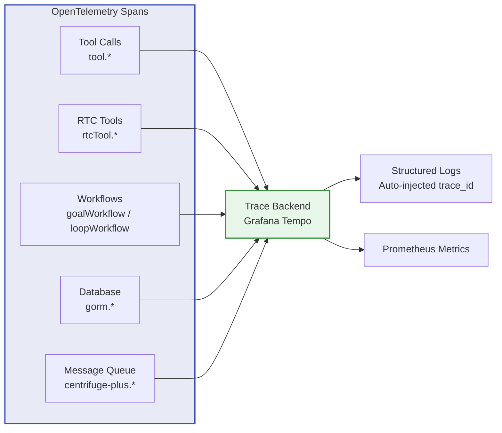

The Agent layer is the core of LLM intelligence, including Turn execution flow, LLM calls, token management, context compression, Sub-Agent orchestration, and more. These logs help you understand the Agent's decision-making process and resource consumption.

## Log Events

### LLM Calls and Tokens

| Event | Trigger | Key Fields |
|-------|---------|------------|
| `[turnagent] llm.complete` | LLM call completed | `session_id`, `turn_id`, `model`, `input_tokens`, `output_tokens`, `cached_read_tokens`, `cached_write_tokens`, `reasoning_tokens`, `total_tokens`, `cost_micros` |
| `[turnagent] token_callback.compression_approaching` | Token usage approaching compression threshold | `session_id`, `usage_ratio` |
| `[turnagent] cache hit rate below threshold` | Cache hit rate below threshold | `hit_rate`, `threshold` |
| `llm.http.request` | LLM HTTP request sent (payload log) | `method`, `url`, `host` |
| `llm.http.response (stream complete)` | LLM streaming response completed (payload log) | `url`, `total_bytes`, `stream_complete` |
| `llm.http.error` | LLM request failed (payload log) | `url`, `error` |

> **Note**: Each LLM call may produce two `llm.complete` log entries -- one with full token statistics (with model) and one with incremental statistics (model is empty). When investigating token consumption, focus on the entry that includes the model.

### Context Compression and Summarization

| Event | Trigger | Key Fields |
|-------|---------|------------|
| `[turnagent] compact.start` | Compression started | `session_id`, `turn_id` |
| `[turnagent] compact.completed` | Compression completed | `session_id`, `messages_before`, `messages_after`, `tokens_saved` |
| `[turnagent] compact.reestimate` | Re-estimate token count | `session_id`, `old_tokens`, `new_tokens` |
| `[turnagent] compress.completed` | Context compression completed | `session_id`, `turn_id`, `messages_compressed` |
| `[turnagent] summarize.threshold_fallback` | Summarization threshold fallback | `session_id`, `threshold` |
| `[turnagent] summarize.llm_token_usage` | Summarization LLM token consumption | `input_tokens`, `output_tokens` |
| `[turnagent] summarize.llm_complete` | Summarization LLM call completed | - |
| `[turnagent] reactive_compact.start` | Reactive compression started | `session_id`, `turn_id`, `reason` |

### Session Memory Extraction

| Event | Trigger | Key Fields |
|-------|---------|------------|
| `[session_memory_extractor] extractor.start` | Memory extraction started | `session_id`, `message_count` |
| `[session_memory_extractor] extractor.done` | Memory extraction completed | `session_id`, `memory_tokens` |
| `[session_memory_extractor] extractor.skip_threshold_not_met` | Extraction threshold not met | `session_id`, `token_count`, `threshold` |
| `[triggerSessionMemoryExtraction] extracted` | Memory extraction successful | `session_id`, `memory_tokens` |
| `save_session_memory.success` | Session memory extracted successfully (background agent) | `session_id`, `memory_tokens` |
| `saveMemory.success` | User memory saved successfully | `user_id`, `memory_id`, `category`, `importance` |
| `tool.webSearch.completed` | Web search completed | `session_id`, `query`, `result_count`, `provider` |
| `tool.webFetch.completed` | Web fetch completed | `session_id`, `url`, `bytes`, `status_code`, `cached` |

### Streaming Data Processing

| Event | Trigger | Key Fields |
|-------|---------|------------|
| `[turnagent] handleStreamEnd.start` | Stream response end processing started | `turn_id`, `session_id`, `role`, `token_usage_total`, `markdown_finalized`, `thinking_finalized` |
| `[turnagent] handleStreamEnd.update_token_usage` | Update token usage | `turn_id`, `session_id`, `input_tokens`, `output_tokens` |
| `[turnagent] appendStreamChunk.finalize` | Stream chunk final merge | `message_id`, `kind` (thinking/markdown), `chunk_count`, `full_content_len`, `full_content_preview` |
| `[turnagent] on_agent_events.start` | Agent event processing started | `session_id`, `turn_id` |
| `[turnagent] on_agent_events.done` | Agent event processing completed | `session_id`, `turn_id` |
| `[turnagent] on_agent_events.interrupted` | Agent event processing interrupted | `session_id`, `turn_id`, `num_contexts` |

### Agent Input and Recovery

| Event | Trigger | Key Fields |
|-------|---------|------------|
| `[turnagent] gen_input.start` | LLM input generation started | `session_id`, `turn_id`, `checkpoint_id`, `item_count`, `is_resume` |
| `[turnagent] gen_resume.called` | Resume parameters generated | `turn_id`, `session_id`, `checkpoint_id`, `interrupted_count`, `unhandled_count`, `newItems_count` |
| `[turnagent] gen_resume.resume_params` | Resume parameter details | `turn_id`, `session_id`, `interrupt_id`, `has_result` |
| `[turnagent] gen_resume.result` | Resume result | `turn_id`, `session_id`, `consumed_count`, `has_resume_params` |
| `[turnagent] normalizeMessagesForLLM.applied` | Message sequence normalized | `session_id`, `before`, `after` |

### Session Manager

| Event | Trigger | Key Fields |
|-------|---------|------------|
| `[turnagent] session_manager.created` | Session manager created | `session_id`, `turn_id`, `worker_id` |
| `[turnagent] session_manager.cleanup_done` | Session manager cleanup completed | `session_id`, `turn_id` |

### Notification Messages

| Event | Trigger | Key Fields |
|-------|---------|------------|
| `notificationMessage.created` | Notification message created (e.g., Loop triggered) | `session_id`, `text_len` |
| `[primitives.CreateMessage]` | Message persisted | `id`, `session`, `turn`, `role`, `content_type` |

### Sub-Agent Management

| Event | Trigger | Key Fields |
|-------|---------|------------|
| `[turnagent] subAgent.created` | Sub-Agent created | `sub_agent_session_id`, `parent_session_id`, `mode` |
| `[turnagent] subAgent.work_submitted` | Sub-Agent task submitted | `sub_agent_session_id`, `turn_id` |
| `[turnagent] subAgent.async.returned_immediately` | Async Sub-Agent returned immediately | `sub_agent_session_id` |
| `[turnagent] subAgent.resume.completed` | Sub-Agent resume completed | `sub_agent_session_id` |
| `[turnagent] stopSubAgent.stopped` | Sub-Agent stopped | `sub_agent_session_id` |
| `[turnagent] stopSubAgent.completed` | Sub-Agent cleanup completed | `sub_agent_session_id` |
| `[turnagent] resumeParentAfterSubAgent.done` | Parent Session resume completed | `parent_session_id` |
| `[turnagent] notifyParentAfterAsyncSubAgent.done` | Async Sub-Agent notifies parent Session | `parent_session_id` |

### Tool Calls

| Event | Trigger | Key Fields |
|-------|---------|------------|
| `[turnagent] createTools.done` | Agent tools created | `session_id`, `tool_count` |
| `[turnagent] createAgent.start` | Agent creation started | `session_id`, `turn_id` |
| `[turnagent] createAgent.done` | Agent creation completed | `session_id`, `turn_id` |
| `[turnagent] createAgent.failed` | Agent creation failed | `session_id`, `error` |
| `[turnagent] todoWriteTool.publish_update` | Todo tool update published | `session_id`, `turn_id` |

## Loki Queries

### View LLM Token Consumption Trends

```logql
{service="server"} | json input_tokens="input_tokens", output_tokens="output_tokens" | msg="[turnagent] llm.complete"
```

### View Token Compression Warnings

```logql
{service="server"} | json session_id="session_id", usage_ratio="usage_ratio" | msg="[turnagent] token_callback.compression_approaching"
```

### Trace Compression History for a Session

```logql
{service="server"} | json session_id="session_id" | msg=~"\\[turnagent\\] (compact\\.(start|completed|reestimate)|compress\\.completed|reactive_compact\\.start)" | session_id="session-abc"
```

### View Tokens Saved by Compression

```logql
{service="server"} | json tokens_saved="tokens_saved" | msg="[turnagent] compact.completed"
```

### View Session Memory Extraction Events

```logql
{service="server"} | json session_id="session_id", memory_tokens="memory_tokens" | msg=~"\\[session_memory_extractor\\] extractor\\.(start|done)|\\[triggerSessionMemoryExtraction\\] extracted"
```

### View Cache Hit Rate Alerts

```logql
{service="server"} | json hit_rate="hit_rate", threshold="threshold" | msg="[turnagent] cache hit rate below threshold"
```

### Trace Sub-Agent Creation and Completion

```logql
{service="server"} | json sub_agent_session_id="sub_agent_session_id" | msg=~"\\[turnagent\\] (subAgent\\.(created|work_submitted|resume\\.completed|async\\.returned_immediately)|stopSubAgent\\.(stopped|completed))"
```

### View Sub-Agent Errors

```logql
{service="server"} | json | msg=~"\\[turnagent\\] (subAgent|stopSubAgent|resumeParentAfterSubAgent|notifyParentAfterAsyncSubAgent)\\..*(failed|error)"
```

### View Agent Creation Failures

```logql
{service="server"} | json session_id="session_id", error="error" | msg="[turnagent] createAgent.failed"
```

### View LLM Request Errors (Payload Logs)

```logql
{service="server"} | json | msg="llm.http.error"
```

### View LLM Initialization Status

```logql
{service="server"} | json provider="provider", model="model" | msg="LLM initialized"
```

### View LLM Not Configured Cases

```logql
{service="server"} | msg="LLM not configured"
```

### View Stream Processing Duration

```logql
{service="server"} | json chunk_count="chunk_count", full_content_len="full_content_len", kind="kind" | msg="[turnagent] appendStreamChunk.finalize"
```

### View LLM Call Token Details (Including Cache Hits)

```logql
{service="server"} | json model="model", input_tokens="input_tokens", output_tokens="output_tokens", cached_read_tokens="cached_read_tokens", reasoning_tokens="reasoning_tokens", cost_micros="cost_micros" | msg="[turnagent] llm.complete" | model!=""
```

### View Agent Event Interruptions

```logql
{service="server"} | json session_id="session_id", turn_id="turn_id", num_contexts="num_contexts" | msg="[turnagent] on_agent_events.interrupted"
```

### View Message Normalization (Context Trimming)

```logql
{service="server"} | json session_id="session_id", before="before", after="after" | msg="[turnagent] normalizeMessagesForLLM.applied"
```

### View Resume Parameters (Troubleshoot RTC Interrupt Recovery)

```logql
{service="server"} | json turn_id="turn_id", interrupt_id="interrupt_id", has_result="has_result" | msg="[turnagent] gen_resume.resume_params"
```

### View Notification Message Creation

```logql
{service="server"} | json session_id="session_id", text_len="text_len" | msg="notificationMessage.created"
```

### Trace the Full Agent Execution Chain for a Session

```logql
{service="server"} | json session_id="session_id", msg="msg" | msg=~"\\[turnagent\\] (agent\\.process|createTurn|beginTurn|turn\\.(start|end)|llm\\.complete|on_agent_events|session_manager)" | session_id="session-abc"
```

## Prometheus Metrics

| Metric | Type | Labels | Purpose |
|--------|------|--------|---------|
| `rtc_llm_tokens_total` | Counter | `model`, `type` (input/output) | Total LLM token consumption |
| `rtc_llm_request_duration_seconds` | Histogram | `model`, `status` | LLM API latency |
| `rtc_llm_http_request_total` | Counter | - | Total LLM HTTP requests |
| `rtc_llm_http_request_duration_seconds` | Histogram | - | LLM HTTP request latency |
| `rtc_llm_http_response_tokens_total` | Counter | - | LLM HTTP response token count |

### Common PromQL

```promql
# Token consumption rate per minute
sum by (model, type) (rate(rtc_llm_tokens_total[5m]))

# LLM API latency P95
histogram_quantile(0.95, sum(rate(rtc_llm_request_duration_seconds_bucket[5m])) by (le, model))

# LLM request error rate
sum(rate(rtc_llm_request_duration_seconds_count{status="error"}[5m])) / sum(rate(rtc_llm_request_duration_seconds_count[5m]))
```

## OpenTelemetry Distributed Tracing

In addition to structured logs and Prometheus metrics, the Agent layer automatically creates **OpenTelemetry** Spans for key operations, enabling you to view complete call chains in tracing backends like Grafana Tempo.

> 💡 All structured logs are automatically injected with `trace_id` and `span_id` (from the OpenTelemetry context), allowing you to correlate logs with Spans via Trace ID. See [Common Log Query Patterns — Query by Trace ID](/docs/en/operations/common-query-patterns/) for details.

### Tracing Coverage

| Span Name | Trigger | Key Attributes |
| --------- | ------- | -------------- |
| `tool.searchMemory` | searchMemory tool call | `query`, `limit`, `result_count` |
| `tool.saveMemory` | saveMemory tool call | `category`, `importance` |
| `tool.updateMemory` | updateMemory tool call | `memory_id` |
| `tool.deleteMemory` | deleteMemory tool call | `memory_id` |
| `tool.listMemories` | listMemories tool call | — |
| `tool.webSearch` | webSearch tool call | `query`, `provider`, `result_count` |
| `tool.webFetch` | webFetch tool call | `url`, `cached` |
| `tool.subAgent` | subAgent tool call | `mode` |
| `tool.stopSubAgent` | stopSubAgent tool call | — |
| `tool.createGoal` | createGoal tool call | — |
| `tool.todoWrite` | todoWrite tool call | — |
| `rtcTool.<name>` | RTC tool calls (ls/read/write/grep/find/script, etc.) | `tool_name` |
| `goalWorkflow.onTurnComplete` | Goal workflow turn check | — |
| `loopWorkflow.onTurnComplete` | Loop workflow progress check | — |
| `loopWorkflow.scheduleNext` | Loop scheduling next execution | — |
| `gorm.*` | All SQL operations (GORM tracing plugin) | SQL statements, affected rows |
| `centrifuge-plus.*` | Centrifuge publish/subscribe operations | `channel`, `offset`, `queue` |

### Tracing Architecture



> 📌 OpenTelemetry tracing is enabled in production by configuring a `TracerProvider`. When not configured, a no-op tracer is used with zero overhead.

## Alert Rules

| Alert | Condition | Description |
|-------|-----------|-------------|
| High LLM error rate | LLM request error rate > 5% | LLM service is unstable |
| Excessive token consumption | `rate(rtc_llm_tokens_total[5m])` abnormally high | Possible context leak |
| Low cache hit rate | `cache hit rate below threshold` appears frequently | AutoCacheControl may have failed |
