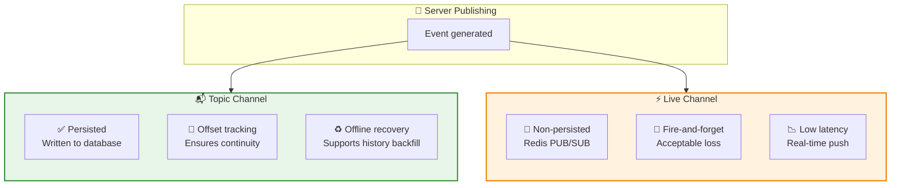
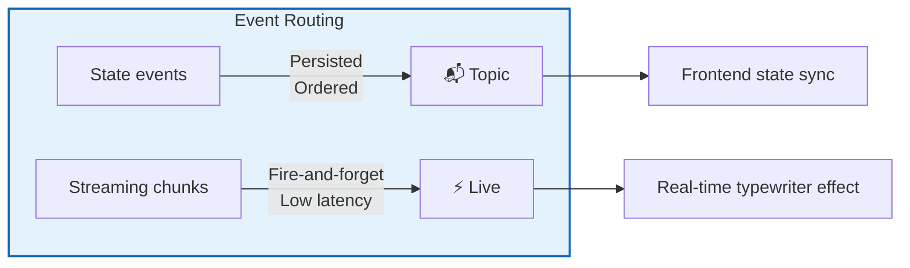
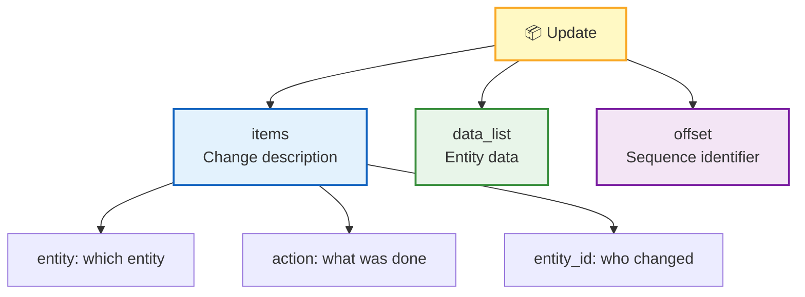
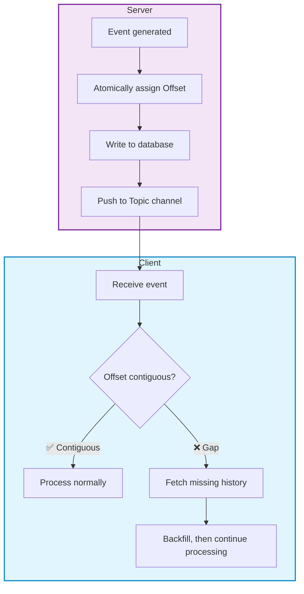
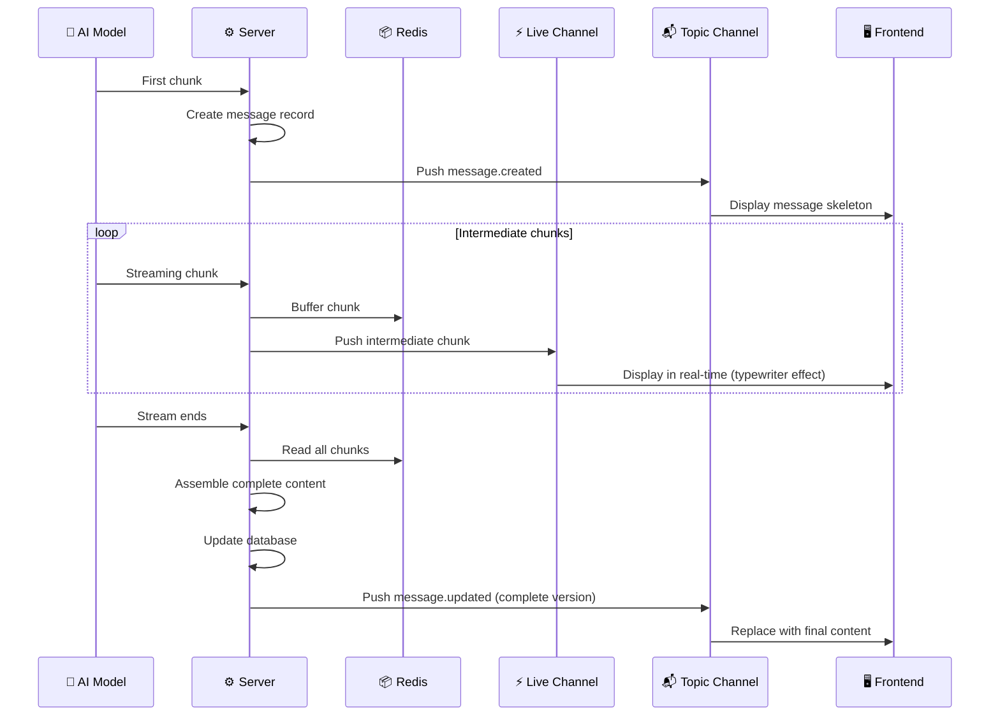
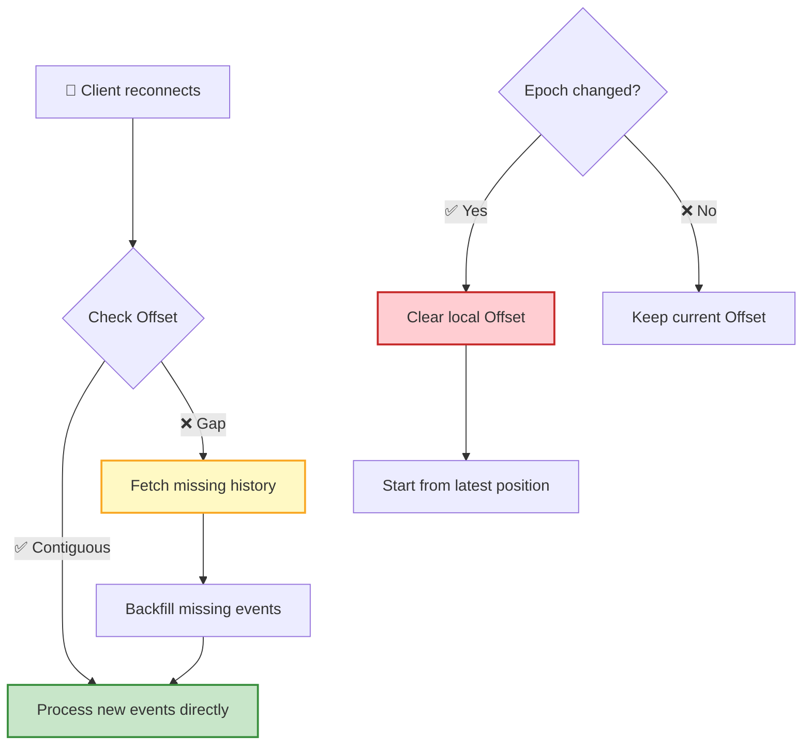
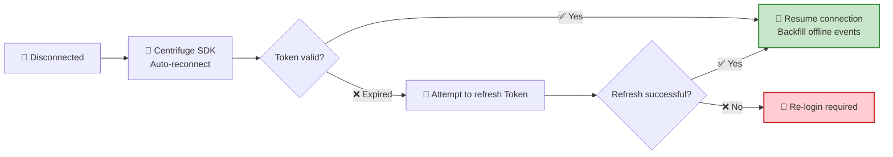

RTC Agent pushes real-time events via **Centrifuge WebSocket**, using a **dual-channel architecture**: the Topic channel ensures reliability, while the Live channel provides low latency. The frontend updates local state upon receiving events, achieving real-time frontend-backend synchronization.

## Dual-Channel Architecture



| Channel | Identifier | Storage | Purpose | Features |
|------|------|:----:|------|------|
| **Topic** | `topic:u=<userID>` | Persisted | State change events | Reliable, ordered, supports offline recovery |
| **Live** | `live:u=<userID>` | Non-persisted | Streaming message intermediate chunks | Low latency, fire-and-forget |

> 💡 **Why two channels?** State changes (e.g., message creation, Turn completion) must not be lost — they need persistence and ordering guarantees. But streaming intermediate chunks only need to "arrive as fast as possible" — it's fine if one is lost, because the complete message will eventually be received. Handling them separately leverages the strengths of each.

---

## Event Distribution

| Event Type | Topic Channel | Live Channel | Description |
|---------|:----------:|:---------:|------|
| `session.created` | ✅ | ❌ | Session created |
| `session.updated` | ✅ | ❌ | Session updated (title, status, etc.) |
| `turn.created` | ✅ | ❌ | Turn created |
| `turn.updated` | ✅ | ❌ | Turn state changed |
| `message.created` | ✅ | ❌ | Message created |
| `message.updated` (stream complete) | ✅ | ❌ | Final complete version of a streamed message |
| `message.updated` (stream intermediate chunk) | ❌ | ✅ | Real-time fragments for the typewriter effect |
| `rtc.created` | ❌ | ❌ | Reserved (not currently emitted) |
| `rtc.updated` | ✅ | ❌ | RTC state changed |



---

## Update Model

Each event is an **Update** — describing changes to an entity (Session / Turn / Message / RTC):

```json
{
  "id": "update-uuid",
  "items": [
    { "entity": "message", "action": "created", "entity_id": "msg-uuid" }
  ],
  "data_list": [{ "id": "msg-uuid", "role": "assistant", "..." : "..." }],
  "offset": 42
}
```

| Field | Type | Description |
|------|:----:|------|
| `id` | UUID | Update unique identifier |
| `items` | array | List of change entries |
| `items[].entity` | string | Entity type: `session` / `turn` / `message` / `rtc` (`file` is reserved, currently unused) |
| `items[].action` | string | Action type: `created` / `updated` (`deleted` is reserved, currently unused; deletion is expressed via `deleted_at` in `data_list`) |
| `items[].entity_id` | UUID | Entity ID |
| `data_list` | array | Complete entity data (optional, corresponds one-to-one with items) |
| `offset` | integer | Monotonically increasing offset per user |



---

## Offset Mechanism

**Offset** is the core guarantee for event reliability — each Topic event is assigned a strictly increasing Offset, and the client detects lost events by checking Offset continuity.



| Feature | Description |
|------|------|
| **Monotonically increasing** | Topic event Offsets for the same user are strictly increasing |
| **Continuity detection** | Client automatically backfills when an Offset gap is detected |
| **Persisted** | Offset is stored in IndexedDB, restored after page refresh |
| **Epoch mechanism** | When historical data is cleaned up, the Epoch changes and the client starts from the latest position |
| **Gap placeholder** | During offline recovery, the server sends `{"type": "gap", "data": {}}` events to fill Offset gaps; the client only advances the Offset without any business processing |

> 💡 **Analogy**: Offset is like the numbering on letters. If you receive letters #1, #2, and #4, you realize #3 is missing — then you go to the post office to claim it.

---

## Streaming Message Flow

AI replies use streaming output. Intermediate chunks are pushed in real-time via the Live channel, and the final complete message is delivered via the Topic channel to ensure reliability.



| Phase | Channel | Behavior |
|------|:----:|------|
| **First chunk** | Topic | Create message record, push `message.created`, also write to Redis buffer |
| **Intermediate chunks** | Live | Append to Redis buffer, push to Live channel for real-time display |
| **Stream ends** | Topic | Read all chunks from Redis, assemble complete content, update database, push `message.updated` |

---

## Offline Recovery

After a client reconnects following a network disconnection, the system automatically checks the Offset and backfills missing events.



| Scenario | Behavior | User Perception |
|------|------|----------|
| **Brief disconnection** | Automatically pushes messages from the offline period | Seamless; messages appear automatically |
| **Extended disconnection** | Detects Offset gap, fetches history | Short loading, then messages are filled in |
| **History cleaned up** | Epoch changes, starts from the latest position | Historical messages no longer displayed |

## Reconnection Behavior



| Component | Responsibility |
|------|------|
| **Centrifuge SDK** | Auto-reconnection, Token refresh |
| **IndexedDB** | Persist Offset, restore after page refresh |
| **Topic Channel** | Ensures offline events are not lost |

## Next Steps

- [WebSocket RPC](/docs/en/protocol/rpc/) — Learn how to perform business operations via RPC
- [Remote Tool Calling](/docs/concepts/rtc/) — Learn about the full RTC tool call lifecycle
- [Protocol Overview](/docs/en/protocol/) — Return to the protocol panorama
