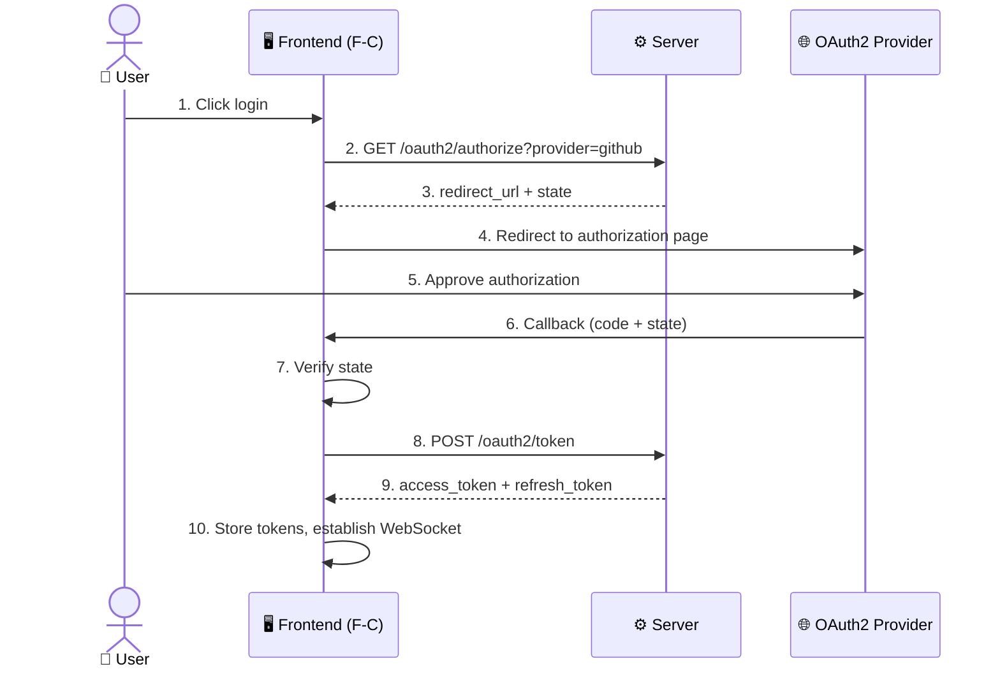
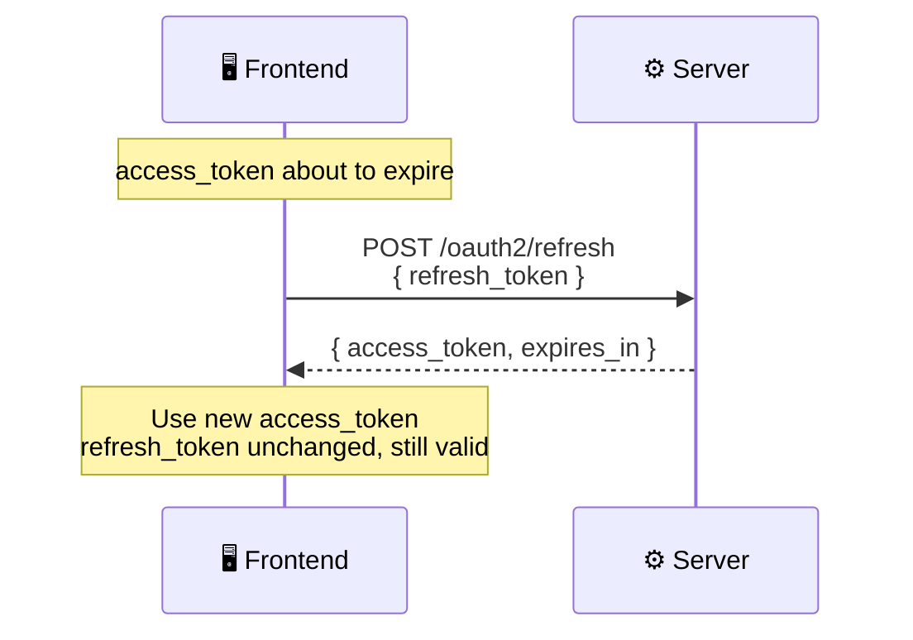
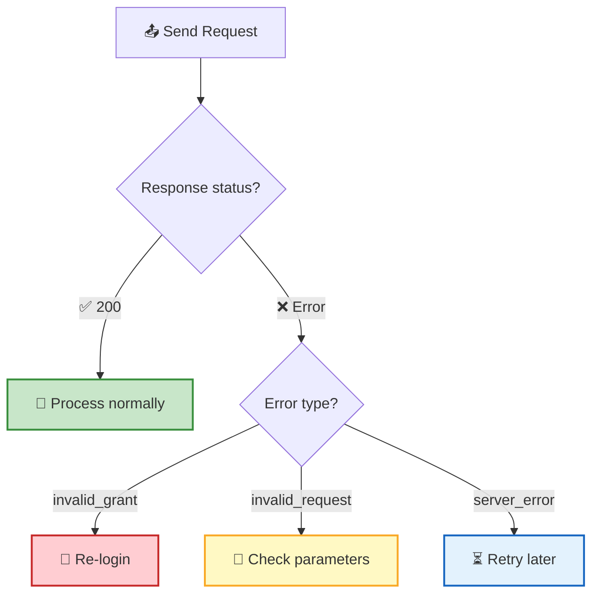

RTC Agent's HTTP API provides **3 OAuth2 endpoints** for user authentication and token management. The entire flow follows the standard OAuth2 authorization code pattern, compatible with common Providers like GitHub and Google.

## Authentication Flow



> 💡 **Design note**: The frontend (F-C) calls `/oauth2/authorize` to get the redirect URL, then navigates the user to the OAuth2 Provider's authorization page. After authorization is complete, the Provider calls back to the frontend, which then calls `/oauth2/token` to complete the token exchange.

## Endpoint Summary

| Endpoint | Method | Function | When Called |
|------|:----:|------|----------|
| `/oauth2/authorize` | GET | Get authorization redirect URL | User clicks login |
| `/oauth2/token` | POST | Exchange authorization code for tokens | After authorization callback |
| `/oauth2/refresh` | POST | Refresh access_token | When token is about to expire |

---

## GET /oauth2/authorize

Get the redirect URL for the OAuth2 authorization page. The frontend uses this URL to navigate the user to the Provider's authorization page.

### Request Parameters

| Parameter | Location | Required | Type | Description |
|------|:----:|:----:|:----:|------|
| `provider` | query | ✅ | string | OAuth2 Provider name (e.g., `"github"`) |
| `redirect_uri` | query | ❌ | string | Callback URL after authorization (optional, required by some Providers) |

### Response

```json
{
  "redirect_url": "https://github.com/login/oauth/authorize?client_id=xxx&state=yyy",
  "state": "a1b2c3d4e5"
}
```

| Field | Type | Description |
|------|:----:|------|
| `redirect_url` | string | Full URL to the OAuth2 Provider's authorization page |
| `state` | string | CSRF protection random state parameter; must be returned as-is in the callback |

---

## POST /oauth2/token

Exchange an authorization code for an access_token and refresh_token. This is the core step of the OAuth2 authorization code flow.

### Request Body

```json
{
  "code": "auth_code_from_callback",
  "redirect_uri": "https://your-app.com/callback",
  "state": "a1b2c3d4e5",
  "device_id": "uuid-generated-by-client",
  "device_name": "Chrome on Mac",
  "user_agent": "Mozilla/5.0 ..."
}
```

| Field | Required | Type | Description |
|------|:----:|:----:|------|
| `code` | ✅ | string | Authorization code, carried in the query parameters of the authorization callback URL |
| `redirect_uri` | ❌ | string | Callback URL, recommended to match the one from the authorization request |
| `state` | ✅ | string | CSRF protection state; must match the state from the authorization request and be used only once |
| `device_id` | ❌ | string | Client-generated device UUID, used to identify the client device |
| `device_name` | ❌ | string | Device display name, e.g., `"Chrome on Mac"` |
| `user_agent` | ❌ | string | Client User-Agent, used for device identification |

### Response

```json
{
  "access_token": "eyJhbGciOi...",
  "refresh_token": "dGhpcyBpcyBh...",
  "expires_in": 3600,
  "user_id": "user-uuid"
}
```

| Field | Type | Description |
|------|:----:|------|
| `access_token` | string | JWT access token, validity period specified by `expires_in` |
| `refresh_token` | string | Refresh token, used to obtain a new token after the access_token expires |
| `expires_in` | integer | Access token expiration time (seconds), typically **3600** (1 hour) |
| `user_id` | string | Unique ID of the authenticated user |

### Token Refresh



> 💡 **Refresh Token Reuse**: The refresh_token can be **reused multiple times** within its validity period, returning a new access_token each time. The refresh_token itself is not replaced or revoked until it naturally expires (default 30 days).

---

## POST /oauth2/refresh

Exchange a refresh_token for a new access_token. The refresh_token can be reused within its validity period.

### Request Body

```json
{
  "refresh_token": "dGhpcyBpcyBh..."
}
```

| Field | Required | Type | Description |
|------|:----:|:----:|------|
| `refresh_token` | ✅ | string | Refresh token, reusable within its validity period |

### Response

```json
{
  "access_token": "eyJhbGciOi...(new)",
  "expires_in": 3600
}
```

| Field | Type | Description |
|------|:----:|------|
| `access_token` | string | New JWT access token |
| `expires_in` | integer | New access token expiration time (seconds) |

---

## Error Handling

All endpoints return a unified error format when an error occurs:

```json
{
  "error": "invalid_grant",
  "error_description": "Authorization code has expired"
}
```

| Error Code | HTTP Status | Description | Common Causes |
|--------|:----------:|------|----------|
| `invalid_request` | 400 | Invalid request parameters | Missing required fields, format errors |
| `invalid_client` | 400 | Client authentication failed | Provider misconfiguration |
| `invalid_grant` | 401 | Authorization code invalid or expired | Authorization code already used or past its validity period |
| `server_error` | 500 | Internal server error | Server-side exception |

> 💡 **Content-Type Support**: POST endpoints (`/oauth2/token` and `/oauth2/refresh`) support both `application/json` and `application/x-www-form-urlencoded` request formats.



## Next Steps

- [WebSocket RPC](/docs/en/protocol/rpc/) — After authentication, perform business operations over WebSocket
- [Real-Time Events](/docs/en/protocol/events/) — Learn about the real-time event push mechanism
- [Protocol Overview](/docs/en/protocol/) — Return to the protocol panorama
