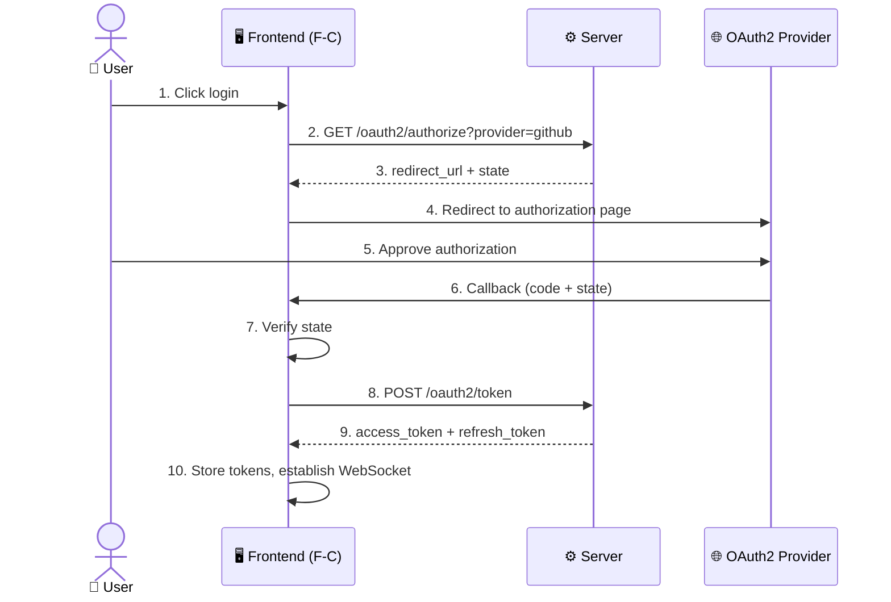
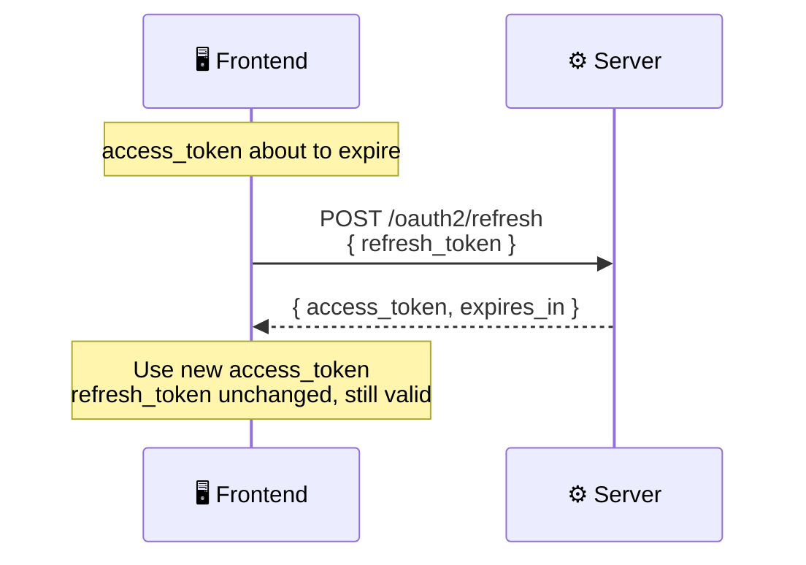
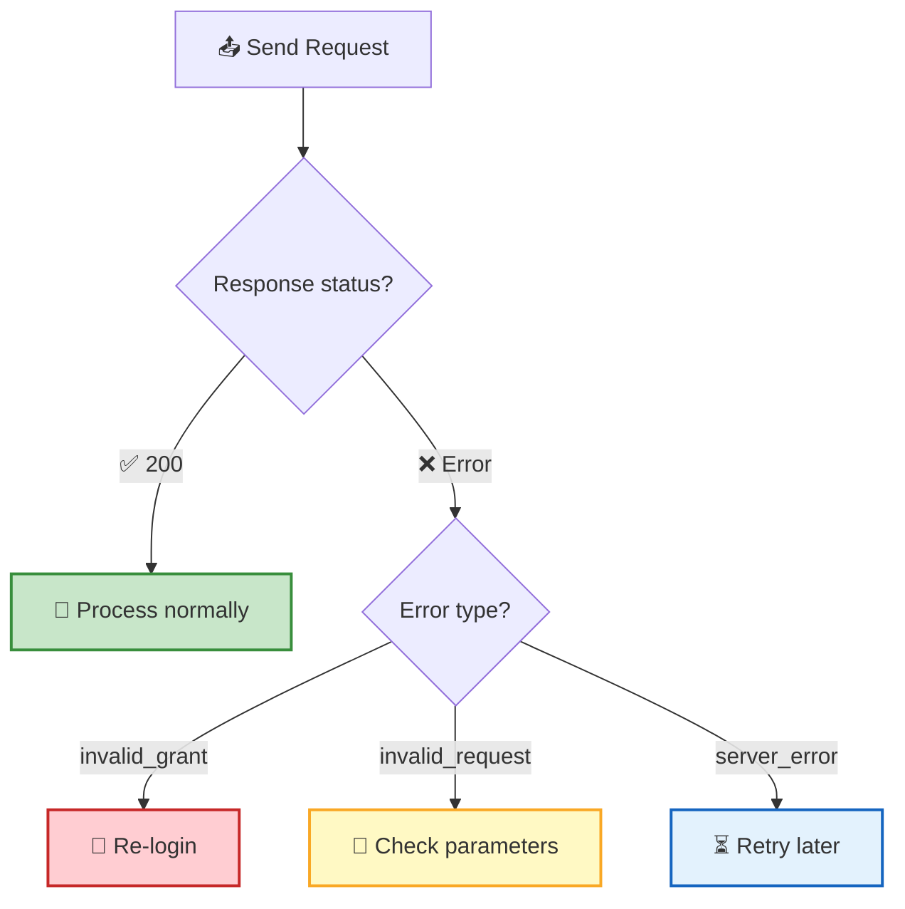
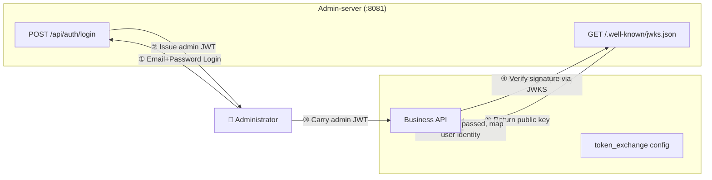

RTC Agent's HTTP API includes three categories of endpoints: **OAuth2 Authentication** handles user login and token management, **Operational Endpoints** provide health checks and metrics collection, and **Business Endpoints** support interrupt answers and memory export. The authentication flow follows the standard OAuth2 authorization code pattern, compatible with common Providers like GitHub and Google.

## Endpoint Summary

### OAuth2 Authentication Endpoints

| Endpoint            | Method | Function                             | When Called                     |
| ------------------- | ------ | ------------------------------------ | ------------------------------- |
| `/oauth2/authorize` | GET    | Get authorization redirect URL       | User clicks login               |
| `/oauth2/providers` | GET    | Get list of enabled OAuth Providers  | Frontend initializes login page |
| `/oauth2/token`     | POST   | Exchange authorization code for tokens | After authorization callback  |
| `/oauth2/refresh`   | POST   | Refresh access_token                 | When token is about to expire   |

### Admin-server Endpoints (Independent Service, Port 8081)

| Endpoint                       | Method | Function                                    | Authentication |
| ------------------------------ | ------ | ------------------------------------------- | -------------- |
| `/api/auth/login`              | POST   | Admin email/password login                  | None           |
| `/api/auth/refresh`            | POST   | Refresh admin access_token                  | None           |
| `/api/auth/me`                 | GET    | Get current admin info                      | Admin JWT      |
| `/api/auth/logout`             | POST   | Logout, revoke refresh_token                | Admin JWT      |
| `/.well-known/jwks.json`       | GET    | JWKS public key set (for Main Server JWT verification) | None  |
| `/health`                      | GET    | Health check                                | None           |

**Operational Endpoints** (no JWT required): `/healthz` (health check), `/readyz` (readiness check), `/metrics` (Prometheus metrics).

> 📌 **Security change**: In production, `/metrics` and debug endpoints require authentication. Configure Basic Auth via `metrics.user` and `metrics.password`; the server will reject access when unconfigured.

**Business Endpoints** (JWT required): `/api/sessions/{sessionID}/interrupts/{interruptID}/answer` (submit interrupt answer), `/api/memories/export` (export memory data), `/api/credentials/temporary` (get S3 temporary credentials), `/api/presigned-url` (generate presigned URL).

## Authentication Flow


```mermaid
sequenceDiagram
    actor User as 👤 User
    participant FE as 🖥️ Frontend (F-C)
    participant Server as ⚙️ Server
    participant Provider as 🌐 OAuth2 Provider

    User->>FE: 1. Click login
    FE->>Server: 2. GET /oauth2/authorize?provider=github
    Server-->>FE: 3. redirect_url + state
    FE->>Provider: 4. Redirect to authorization page
    User->>Provider: 5. Approve authorization
    Provider->>FE: 6. Callback (code + state)
    FE->>FE: 7. Verify state
    FE->>Server: 8. POST /oauth2/token
    Server-->>FE: 9. access_token + refresh_token
    FE->>FE: 10. Store tokens, establish WebSocket
```

> 💡 **Design note**: The frontend (F-C) calls `/oauth2/authorize` to get the redirect URL, then navigates the user to the OAuth2 Provider's authorization page. After authorization is complete, the Provider calls back to the frontend, which then calls `/oauth2/token` to complete the token exchange.

---

## GET /oauth2/authorize

Get the redirect URL for the OAuth2 authorization page. The frontend uses this URL to navigate the user to the Provider's authorization page.

### Request Parameters

| Parameter | Location | Required | Type | Description |
|------|:----:|:----:|:----:|------|
| `provider` | query | ✅ | string | OAuth2 Provider name (e.g., `"github"`) |
| `redirect_uri` | query | ❌ | string | Callback URL after authorization (optional, required by some Providers) |
| `code_challenge` | query | ❌ | string | PKCE code_challenge (RFC 7636), derived from `code_verifier` via SHA-256 + base64url encoding |
| `code_challenge_method` | query | ❌ | string | PKCE challenge method, recommended `S256` (default); also supports `plain` |

### Response

```json
{
  "redirect_url": "https://github.com/login/oauth/authorize?client_id=xxx&state=yyy",
  "state": "a1b2c3d4e5"
}
```

| Field | Type | Description |
|------|:----:|------|
| `redirect_url` | string | Full URL to the OAuth2 Provider's authorization page |
| `state` | string | CSRF protection random state parameter; must be returned as-is in the callback |

---

## GET /oauth2/providers

Get the list of currently enabled OAuth2 Providers. The frontend calls this endpoint when initializing the login page to dynamically display available login options.

### Request Parameters

None.

### Response

```json
{
  "providers": ["github", "google"]
}
```

| Field | Type | Description |
|------|:----:|------|
| `providers` | string[] | List of enabled provider names (e.g., `"github"`, `"google"`, `"mock"`) |

> 💡 The frontend dynamically renders login buttons based on the returned provider list. If only the mock provider is enabled, the list will be `["mock"]`.

---

## POST /oauth2/token

Exchange an authorization code for an access_token and refresh_token. This is the core step of the OAuth2 authorization code flow.

### Request Body

```json
{
  "code": "auth_code_from_callback",
  "redirect_uri": "https://your-app.com/callback",
  "state": "a1b2c3d4e5",
  "device_id": "uuid-generated-by-client",
  "device_name": "Chrome on Mac",
  "user_agent": "Mozilla/5.0 ..."
}
```

| Field | Required | Type | Description |
|------|:----:|:----:|------|
| `code` | ✅ | string | Authorization code, carried in the query parameters of the authorization callback URL |
| `redirect_uri` | ❌ | string | Callback URL, recommended to match the one from the authorization request |
| `state` | ✅ | string | CSRF protection state; must match the state from the authorization request and be used only once |
| `device_id` | ❌ | string | Client-generated device UUID, used to identify the client device |
| `device_name` | ❌ | string | Device display name, e.g., `"Chrome on Mac"` |
| `user_agent` | ❌ | string | Client User-Agent, used for device identification |
| `code_verifier` | ❌ | string | PKCE code_verifier (RFC 7636); pass the original verifier when `code_challenge` was sent during authorization |

> 📌 **PKCE constraint**: If `code_challenge` was included in the authorization request, `code_verifier` becomes **required** during token exchange. The server validates that `code_verifier` matches the stored `code_challenge`.

### Response

```json
{
  "access_token": "eyJhbGciOi...",
  "refresh_token": "dGhpcyBpcyBh...",
  "expires_in": 3600,
  "user_id": "user-uuid"
}
```

| Field | Type | Description |
|------|:----:|------|
| `access_token` | string | JWT access token, validity period specified by `expires_in` |
| `refresh_token` | string | Refresh token, used to obtain a new token after the access_token expires |
| `expires_in` | integer | Access token expiration time (seconds), typically **3600** (1 hour) |
| `user_id` | string | Unique ID of the authenticated user |

### Token Refresh


```mermaid
sequenceDiagram
    participant FE as 🖥️ Frontend
    participant Server as ⚙️ Server

    Note over FE: access_token about to expire
    FE->>Server: POST /oauth2/refresh<br/>{ refresh_token }
    Server-->>FE: { access_token, expires_in }
    Note over FE: Use new access_token<br/>refresh_token unchanged, still valid
```

> 💡 **Refresh Token Reuse**: The refresh_token can be **reused multiple times** within its validity period, returning a new access_token each time. The refresh_token itself is not replaced or revoked until it naturally expires (default 30 days).

---

## POST /oauth2/refresh

Exchange a refresh_token for a new access_token. The refresh_token can be reused within its validity period.

### Request Body

```json
{
  "refresh_token": "dGhpcyBpcyBh..."
}
```

| Field | Required | Type | Description |
|------|:----:|:----:|------|
| `refresh_token` | ✅ | string | Refresh token, reusable within its validity period |

### Response

```json
{
  "access_token": "eyJhbGciOi...(new)",
  "expires_in": 3600
}
```

| Field | Type | Description |
|------|:----:|------|
| `access_token` | string | New JWT access token |
| `expires_in` | integer | New access token expiration time (seconds) |

---

## Error Handling

All endpoints return a unified error format when an error occurs:

```json
{
  "error": "invalid_grant",
  "error_description": "Authorization code has expired"
}
```

| Error Code | HTTP Status | Description | Common Causes |
|--------|:----------:|------|----------|
| `invalid_request` | 400 | Invalid request parameters | Missing required fields, format errors |
| `invalid_client` | 400 | Client authentication failed | Provider misconfiguration |
| `invalid_grant` | 401 | Authorization code invalid or expired | Authorization code already used or past its validity period |
| `server_error` | 500 | Internal server error | Server-side exception |

> 💡 **Content-Type Support**: POST endpoints (`/oauth2/token` and `/oauth2/refresh`) support both `application/json` and `application/x-www-form-urlencoded` request formats.


```mermaid
flowchart TD
    A["📤 Send Request"] --> B{"Response status?"}
    B -->|"✅ 200"| C["🎉 Process normally"]
    B -->|"❌ Error"| D{"Error type?"}
    D -->|"invalid_grant"| E["🔄 Re-login"]
    D -->|"invalid_request"| F["🔧 Check parameters"]
    D -->|"server_error"| G["⏳ Retry later"]

    style C fill:#c8e6c9,stroke:#388e3c,stroke-width:2px
    style E fill:#ffcdd2,stroke:#c62828,stroke-width:2px
    style F fill:#fff9c4,stroke:#f9a825,stroke-width:2px
    style G fill:#e3f2fd,stroke:#1565c0,stroke-width:2px
```

---

## Operational Endpoints

Operational endpoints do not require JWT authentication and are intended for infrastructure use.

### GET /healthz

Health check endpoint for load balancer and Kubernetes liveness probes.

**Response**:

```json
{"status": "ok"}
```

### GET /readyz

Readiness check endpoint for Kubernetes readiness probes. Returns 200 only when the server is fully started and ready to accept requests. Checks database, Redis, and Centrifuge connection status.

**Response** (when ready):

```json
{
  "status": "ready",
  "checks": {
    "db": "ok",
    "redis": "ok",
    "centrifuge": "ok"
  }
}
```

**Response** (when not ready, HTTP 503):

```json
{
  "status": "not ready",
  "checks": {
    "db": "ok",
    "redis": "error",
    "centrifuge": "not configured"
  }
}
```

| Field               | Type   | Description                                                |
| ------------------- | ------ | ---------------------------------------------------------- |
| `status`            | string | Overall status: `"ready"` or `"not ready"`                 |
| `checks`            | object | Check results for each dependency component                |
| `checks.db`         | string | Database connection status: `"ok"` or `"error"`            |
| `checks.redis`      | string | Redis connection status: `"ok"` or `"error"`               |
| `checks.centrifuge` | string | Centrifuge status: `"ok"`, `"error"`, or `"not configured"`|

### GET /metrics

Prometheus metrics endpoint exposing runtime metrics for monitoring systems (Prometheus / Grafana).

**Response**: Prometheus metrics in `text/plain` format.

**Authentication**: Optional Basic Auth. Enabled via the `metrics.user` and `metrics.password` configuration options. Production deployments should configure authentication; the server logs a warning when the endpoint is unprotected.

> 💡 For a complete list of Prometheus metrics, Grafana dashboards, and alert rules, see [Monitoring](/docs/en/operations/monitoring/).

---

## Business Endpoints

Business endpoints require JWT authentication (`Authorization: Bearer <token>` header). In development mode, `X-User-ID` / `X-Device-ID` headers are accepted as a bypass.

### POST /api/sessions/{sessionID}/interrupts/{interruptID}/answer

Submit an interrupt answer. When the AI encounters a question requiring user decision during execution, it pauses via the interrupt mechanism and sends the question to the frontend. The frontend collects the user's answer and submits it through this endpoint.

**Path Parameters**:

| Parameter     | Type   | Description                          |
| ------------- | ------ | ------------------------------------ |
| `sessionID`   | UUID   | Session ID                           |
| `interruptID` | string | Interrupt ID (carried by interrupt event) |

**Request Body**:

```json
{
  "answer": "User's answer to the interrupt question"
}
```

| Field    | Required | Type   | Description              |
| -------- | -------- | ------ | ------------------------ |
| `answer` | ✅       | string | The user's answer content |

**Response**: Returns 202 Accepted on success with body `{"status": "accepted"}`.

> 💡 The internal implementation uses Redis `SET+PUBLISH` pattern to deliver the answer to the waiting interrupt handler goroutine, ensuring no answer is lost. See [Interrupt Flow](/docs/en/features/messaging/) for details.

### POST /api/memories/export

Export memory data as an OKF (Open Knowledge Format) bundle. Supports filtering by scope (session / user / global), type, and tags.

**Request Body**:

```json
{
  "scope": "user",
  "scopeId": "user-uuid",
  "format": "okf-bundle",
  "types": ["user", "feedback"],
  "tags": ["work"],
  "includeLog": false
}
```

| Field          | Required | Type     | Description                                            |
| -------------- | -------- | -------- | ------------------------------------------------------ |
| `scope`        | ✅       | string   | Export scope: `session` / `user` / `global`            |
| `scopeId`      | ✅       | string   | ID corresponding to scope (session UUID / user UUID / empty string) |
| `format`       | ✅       | string   | Export format, currently only `okf-bundle` is supported |
| `types`        | —        | string[] | Filter by memory types (optional)                      |
| `tags`         | —        | string[] | Filter by tags (optional)                              |
| `includeLog`   | —        | boolean  | Generate log.md (default false)                        |

**Response**: `Content-Type: application/gzip`, returns a gzip-compressed OKF bundle stream.

> 💡 Because this uses a streaming response, JSON error responses are no longer possible once writing to the response body begins. Clients should check HTTP status code and `Content-Length` to determine export success.
>
> 📌 Timestamps in the OKF bundle use **UTC timezone**, formatted as RFC 3339 (e.g., `2026-09-26T08:30:00Z`).

---

## Admin-server Authentication

Admin-server is an independent management service separate from the Main Server, providing administrator login, user management, and other features. After administrators log in to admin-server, they receive a JWT that can be recognized by the Main Server via the RFC 8693 Token Exchange mechanism.

### Architecture


```mermaid
flowchart LR
    subgraph Admin["Admin-server (:8081)"]
        LOGIN["POST /api/auth/login"]
        JWKS["GET /.well-known/jwks.json"]
    end

    subgraph Main["Main Server (:8888)"]
        TE["token_exchange config"]
        API["Business API"]
    end

    AdminUser["👤 Administrator"] -->|"① Email+Password Login"| LOGIN
    LOGIN -->|"② Issue admin JWT"| AdminUser
    AdminUser -->|"③ Carry admin JWT"| API
    API -->|"④ Verify signature via JWKS"| JWKS
    JWKS -->|"⑤ Return public key"| API
    API -->|"⑥ Verification passed, map user identity"| Main
```

### Main Server Configuration

Configure `token_exchange` in the Main Server's `config.yaml` to trust JWTs issued by admin-server:

```yaml
token_exchange:
  external_issuers:
    - name: "admin-server"
      issuer: "http://admin-server:8081"       # admin-server address
      jwks_uri: "http://admin-server:8081/.well-known/jwks.json"
      allowed_algorithms: ["RS256", "ES256"]
      cache_ttl: 3600
      claims_mapping:
        sub: "sub"
        email: "email"
        name: "name"
        avatar_url: "picture"
```

| Field | Description |
| --- | --- |
| `name` | Identifier name for the issuer |
| `issuer` | Value that the JWT `iss` claim must match |
| `jwks_uri` | JWKS public key endpoint address |
| `allowed_algorithms` | Allowed signature algorithms (ES256 or RS256 recommended) |
| `cache_ttl` | JWKS public key cache time (seconds) |
| `claims_mapping` | Mapping from JWT claims to user fields |

### JWT Key Management

Admin-server uses asymmetric keys (RS256 / ES256) to sign JWTs. The Main Server obtains public keys via the JWKS endpoint for verification, with no shared secrets required.

```bash
# Generate key pairs
./scripts/generate-keys.sh all     # RS256 + ES256
./scripts/generate-keys.sh es256   # ES256 only (recommended)

# Auto mode (admin-server auto-generates keys on startup if none exist)
# Production environments should use persistent keys to avoid invalidating all JWTs after restart
```

| Environment | Key Storage Recommendation |
| --- | --- |
| Development | Local `etc/keys/` directory (already excluded `*.pem` in `.gitignore`) |
| Production | KMS service (AWS KMS / Alibaba Cloud KMS / HashiCorp Vault) |

> 💡 Rotate keys every 90 days. When rotating, retain old public keys for 24-48 hours to maintain compatibility with already-issued tokens. See `etc/keys/README.md` for details.

### Admin-server Endpoint Details

> 💡 Admin-server uses the Ant Design Pro unified response format: `{ "success": true, "data": {...} }` on success, `{ "success": false, "errorCode": "...", "errorMessage": "..." }` on failure (HTTP status code is always 200).

#### POST /api/auth/login

Administrator email/password login.

**Request Body**:

```json
{
  "email": "admin@example.com",
  "password": "your-password"
}
```

**Success Response** (200):

```json
{
  "success": true,
  "data": {
    "access_token": "eyJhbGciOi...",
    "refresh_token": "dGhpcyBpcyBh...",
    "expires_in": 3600,
    "token_type": "Bearer",
    "user": {
      "id": "uuid",
      "email": "admin@example.com",
      "name": "Admin",
      "avatar_url": ""
    }
  }
}
```

#### POST /api/auth/refresh

Exchange a refresh_token for a new access_token. Each refresh returns a new refresh_token (rotation mechanism), and the old refresh_token is immediately invalidated.

**Request Body**:

```json
{
  "refresh_token": "previous-refresh-token"
}
```

#### GET /api/auth/me

Get current administrator information. Requires `Authorization: Bearer <admin-jwt>` header.

#### POST /api/auth/logout

Revoke a refresh_token. Requires JWT authentication.

**Request Body**:

```json
{
  "refresh_token": "refresh-token-to-revoke"
}
```

#### GET /.well-known/jwks.json

Returns the admin-server's JWK Set (RFC 7517). The Main Server uses this endpoint to obtain public keys for verifying JWT signatures.

### Error Code Reference

Admin-server error responses always return HTTP 200, distinguishing error types via the `errorCode` field:

| `errorCode` | Trigger | Description |
| --- | --- | --- |
| `invalid_request` | Malformed request body, field validation failure | Client should check request parameters |
| `invalid_credentials` | Incorrect email or password | Login credentials are wrong |
| `invalid_grant` | refresh_token is invalid, revoked, or expired | User should re-login |
| `unauthorized` | Missing/invalid/expired Authorization header | JWT authentication failed |
| `user_not_found` | No user found for the given user ID | Data consistency issue |
| `server_error` | Internal server error (key generation failure, database exception, etc.) | Retryable; investigate if persistent |

## Next Steps

- [WebSocket RPC](/docs/en/protocol/rpc/) — After authentication, perform business operations over WebSocket
- [Real-Time Events](/docs/en/protocol/events/) — Learn about the real-time event push mechanism
- [Object Storage](/docs/en/integration/object-storage/) — Use S3 SDKs for file upload and download
- [Protocol Overview](/docs/en/protocol/) — Return to the protocol panorama
