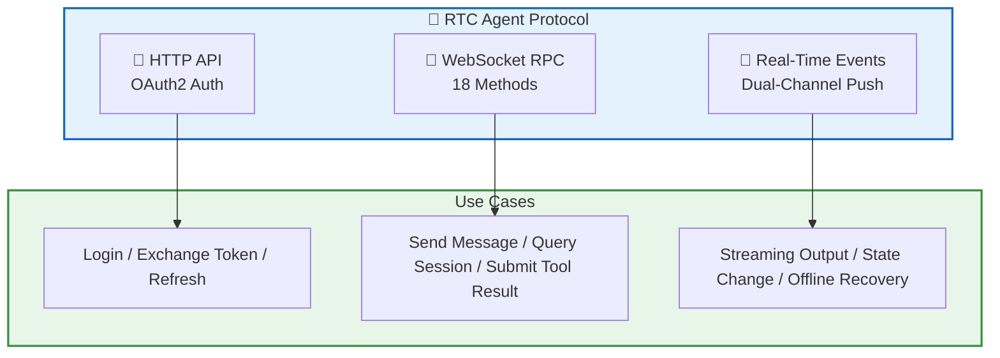
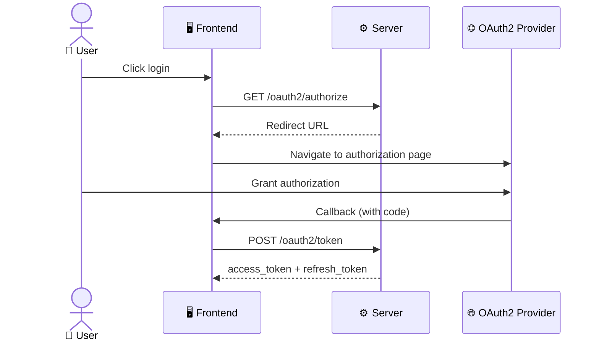
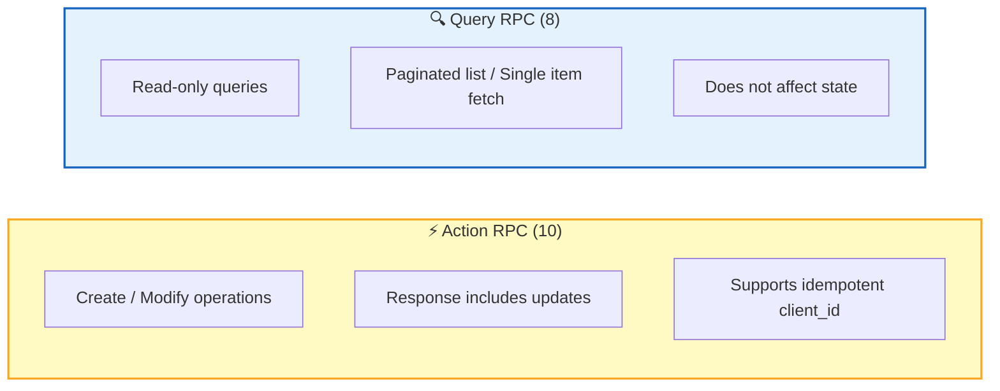
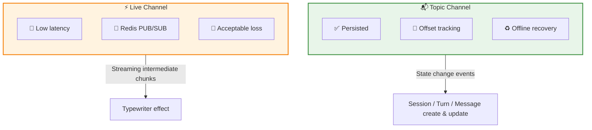
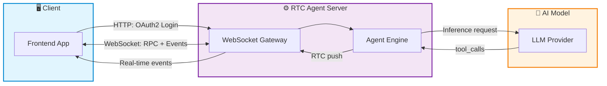

The RTC Agent protocol consists of three layers, each with its own role: **HTTP API** handles authentication, **WebSocket RPC** handles all business operations, and **real-time events** drive frontend-backend state synchronization.

## Protocol Layers

| Layer | Protocol | Purpose | Features |
|:--:|:----:|------|------|
| 🔐 **Auth Layer** | HTTPS | OAuth2 authorization code flow | Standard HTTP, compatible with all OAuth2 Providers |
| 💬 **Operation Layer** | WebSocket RPC | Session, Message, Turn, RTC operations | 18 methods, divided into Action and Query types |
| 📢 **Event Layer** | WebSocket Pub/Sub | Real-time state push | Dual-channel (Topic + Live), supports offline recovery |

## Auth Layer: HTTP API

Handles user login and token management, following the standard OAuth2 authorization code flow.

**3 endpoints** cover the complete authentication lifecycle:

| Endpoint | Method | Function |
|------|:----:|------|
| `/oauth2/authorize` | GET | Get OAuth2 authorization redirect URL |
| `/oauth2/token` | POST | Exchange authorization code for access_token |
| `/oauth2/refresh` | POST | Refresh access_token |

👉 [Detailed docs: HTTP API](/docs/en/protocol/http-api/)

## Operation Layer: WebSocket RPC

All business operations are performed over WebSocket RPC — sending messages, querying sessions, submitting tool results — all on a single persistent connection.

**4 business domains, 18 methods**:

| Domain | Action | Query |
|:--:|:------:|:-----:|
| **Session** | `close` · `update` · `fork` · `compact` | `list` · `get` |
| **Message** | `send` | `list` · `get` |
| **Turn** | `stop` | `list` · `get` |
| **RTC** | `update_status` · `submit_result` | `list` · `get` |

👉 [Detailed docs: WebSocket RPC](/docs/en/protocol/rpc/)

## Event Layer: Real-Time Events

The server pushes real-time events through a **dual-channel** architecture, balancing reliability and low latency.

| Channel | Purpose | Features |
|------|------|------|
| **Topic** | State change events | Persisted, Offset tracking, Offline recovery |
| **Live** | Streaming message intermediate chunks | Non-persisted, low latency, fire-and-forget |

👉 [Detailed docs: Real-Time Events](/docs/en/protocol/events/)

## Data Flow Panorama

## Next Steps

- [HTTP API](/docs/en/protocol/http-api/) — Detailed definition of OAuth2 authentication endpoints
- [WebSocket RPC](/docs/en/protocol/rpc/) — Complete reference for all 18 RPC methods
- [Real-Time Events](/docs/en/protocol/events/) — Dual-channel event push mechanism
- [Architecture Overview](/docs/en/architecture/) — Learn about the overall architecture design of RTC Agent
