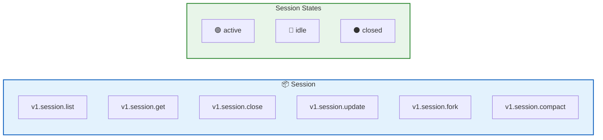
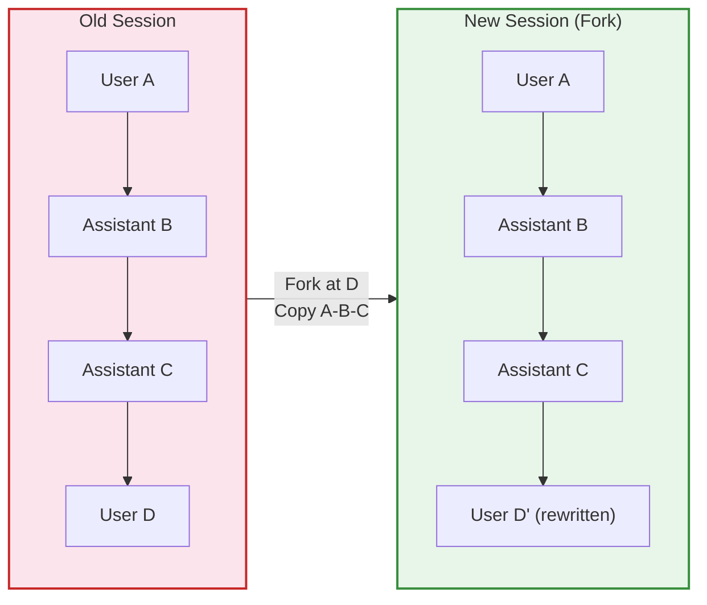
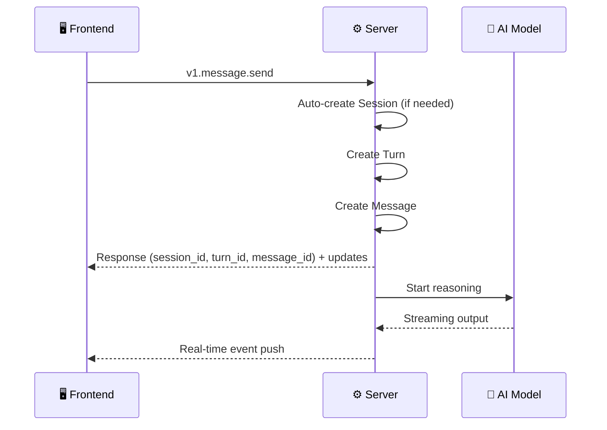
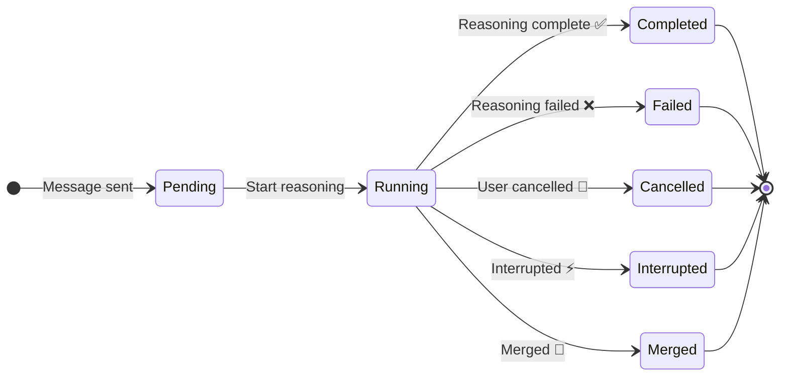
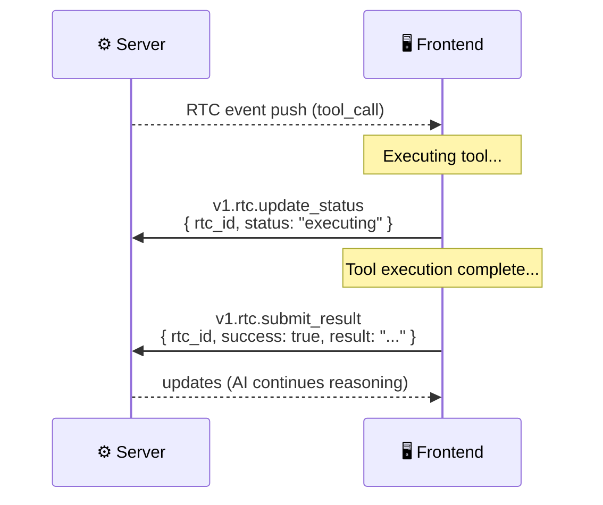
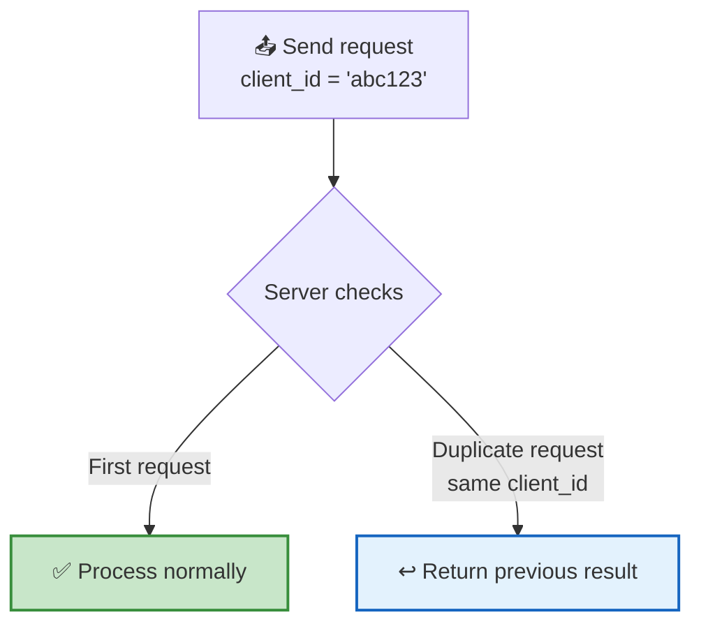
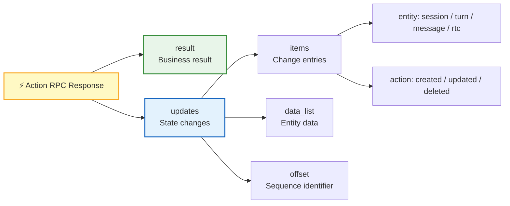

After authentication, the frontend performs all business operations over a **persistent WebSocket connection**. The RPC defines **18 methods** in total, divided into two types: **Action** and **Query**.

## RPC Classification

```mermaid
flowchart TD
    subgraph ACTION["⚡ Action RPC (10)"]
        direction TB
        A1["Create / Modify / Delete operations"]
        A2["Response includes updates events"]
        A3["Supports client_id idempotency"]
        A4["Frontend updates local state upon receipt"]
    end

    subgraph QUERY["🔍 Query RPC (8)"]
        direction TB
        Q1["Read-only query operations"]
        Q2["Paginated list + Single item fetch"]
        Q3["Does not affect server state"]
        Q4["Response does not include updates"]
    end

    style ACTION fill:#fff9c4,stroke:#f9a825,stroke-width:2px
    style QUERY fill:#e3f2fd,stroke:#1565c0,stroke-width:2px
```



| Comparison | Action RPC | Query RPC |
|------|:----------:|:---------:|
| **Operation Type** | Create / Modify / Delete | Read-only queries |
| **Response includes updates** | ✅ Yes | ❌ No |
| **Idempotency support** | ✅ client_id | — |
| **Typical scenarios** | Send message, close session | Load message list |

---

## Method Summary

The 18 methods are organized across **4 business domains**:

| Domain | Action | Query |
|:--:|:------:|:-----:|
| **Session** | `v1.session.close` · `v1.session.update` · `v1.session.fork` · `v1.session.compact` | `v1.session.list` · `v1.session.get` |
| **Message** | `v1.message.send` | `v1.message.list` · `v1.message.get` |
| **Turn** | `v1.turn.stop` | `v1.turn.list` · `v1.turn.get` |
| **RTC** | `v1.rtc.update_status` · `v1.rtc.submit_result` | `v1.rtc.list` · `v1.rtc.get` |

---

## Session Domain

A session is a container for user-AI conversations. Each session contains multiple messages and turns.



| Method | Type | Function | Key Parameters |
|------|:----:|------|----------|
| `v1.session.list` | 🔍 Query | Get session list | `cursor` (pagination), `limit` (default 20) |
| `v1.session.get` | 🔍 Query | Get a single session | `session_id` |
| `v1.session.close` | ⚡ Action | Close a session | `session_id`, `client_id` |
| `v1.session.update` | ⚡ Action | Update session title / soft delete | `session_id`, `title`, `deleted_at` |
| `v1.session.fork` | ⚡ Action | Fork a conversation (create a new session based on history) | `old_server_session_id`, `new_client_session_id`, `old_server_message_id`, `content_data`, `limit` (default 200, max 1000) |
| `v1.session.compact` | ⚡ Action | Manually trigger context compression | `session_id`, `custom_instruction` |

### Fork a Conversation



> 💡 **Typical Fork scenario**: The user wants to start a new direction from a branching point in the historical conversation. Specify the old message position, and the system copies the preceding context, replaces content after the specified position with new messages, and triggers new AI reasoning.

---

## Message Domain

Messages are the basic communication units within a session, supporting multiple content types.

| Method | Type | Function | Key Parameters |
|------|:----:|------|----------|
| `v1.message.send` | ⚡ Action | Send a message (automatically creates session and turn) | `content_data`, `client_session_id`, `client_id`, `server_session_id` (optional) |
| `v1.message.list` | 🔍 Query | Get message list | `session_id`, `cursor` (global_offset), `limit` (default 50) |
| `v1.message.get` | 🔍 Query | Get a single message | `message_id` |

### Message Sending Flow



> 💡 **Auto-creation**: When calling `v1.message.send`, if `server_session_id` is empty, the server will automatically create a new session. This means "create new conversation" and "send message" can be combined into a single call.

### Content Types

| Type | Description | Data Structure |
|------|------|-----------|
| `markdown` | Markdown text | String |
| `text` | Plain text | String |
| `thinking` | AI reasoning process | String |
| `summary` | Context summary | `SummaryItem[]` |
| `toolcall_input` | Tool call request | `ToolCall` object |
| `toolcall_output` | Tool call result | `ToolCall` object |

---

## Turn Domain

A Turn represents a complete AI reasoning round — from the user sending a message to the AI completing its response.



| Method | Type | Function | Key Parameters |
|------|:----:|------|----------|
| `v1.turn.stop` | ⚡ Action | Stop the current Turn | `session_id`, `client_id` |
| `v1.turn.list` | 🔍 Query | Get Turn list | `session_id`, `cursor`, `limit` (default 50) |
| `v1.turn.get` | 🔍 Query | Get a single Turn | `turn_id` |

| State | Description |
|:----:|------|
| `pending` | Waiting to start |
| `running` | AI is reasoning |
| `completed` | Reasoning completed |
| `failed` | Reasoning failed |
| `cancelled` | User explicitly cancelled |
| `interrupted` | Interrupted by the system |
| `merged` | Merged with another Turn |

---

## RTC Domain

RTC (Remote Tool Calling) is the mechanism by which AI calls frontend tools. The frontend uses RTC domain RPCs to report tool execution status and results.



| Method | Type | Function | Key Parameters |
|------|:----:|------|----------|
| `v1.rtc.update_status` | ⚡ Action | Update RTC execution status | `rtc_id`, `status`, `client_id` |
| `v1.rtc.submit_result` | ⚡ Action | Submit tool execution result | `rtc_id`, `success`, `result` / `error`, `client_id` |
| `v1.rtc.list` | 🔍 Query | Get RTC list | `session_id`, `cursor`, `limit` (default 50) |
| `v1.rtc.get` | 🔍 Query | Get a single RTC | `rtc_id` |

### RTC State Transitions

| State | Description | Frontend Action |
|:----:|------|----------|
| `pending` | Waiting for frontend to receive | Receive RTC event |
| `sent` | Delivered to frontend | Display tool call UI |
| `executing` | Currently executing | Call `update_status` |
| `completed` | Execution successful | Call `submit_result(success=true)` |
| `failed` | Execution failed | Call `submit_result(success=false)` |
| `timeout` | Execution timed out | Automatically marked by the system |
| `rejected` | User rejected | User clicks reject |

---

## Idempotency Mechanism

All Action RPCs support **`client_id` idempotency** — a client-generated unique ID that ensures duplicate requests do not produce side effects.



> 💡 **Why idempotency?** WebSocket messages may be retransmitted due to network issues. `client_id` guarantees that "sending once" and "sending twice" have exactly the same effect — the frontend can retry with confidence, without worrying about duplicate message creation or duplicate tool execution.

| Feature | Description |
|------|------|
| **Generated by** | Client (frontend) |
| **Format** | String, UUID recommended |
| **Scope** | Unique within the same method |
| **Duplicate behavior** | Returns the result of the first processing; no new record is created |

---

## Update Model

Action RPC responses uniformly include both **`result`** and **`updates`**:

```json
{
  "result": { "...business data..." },
  "updates": [
    {
      "id": "update-uuid",
      "items": [
        { "entity": "message", "action": "created", "entity_id": "msg-uuid" }
      ],
      "data_list": [{ "...complete entity data..." }],
      "offset": 42
    }
  ]
}
```



> 💡 **After receiving updates**: The frontend directly updates local state (IndexedDB / memory), keeping it consistent with the server. No need to send another query request — this is the "operation equals synchronization" design philosophy.

## Next Steps

- [Real-Time Events](/docs/en/protocol/events/) — Learn about the dual-channel push mechanism behind updates
- [Remote Tool Calling](/docs/concepts/rtc/) — Deep dive into the full RTC tool call lifecycle
- [Protocol Overview](/docs/en/protocol/) — Return to the protocol panorama
