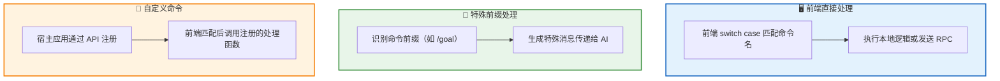
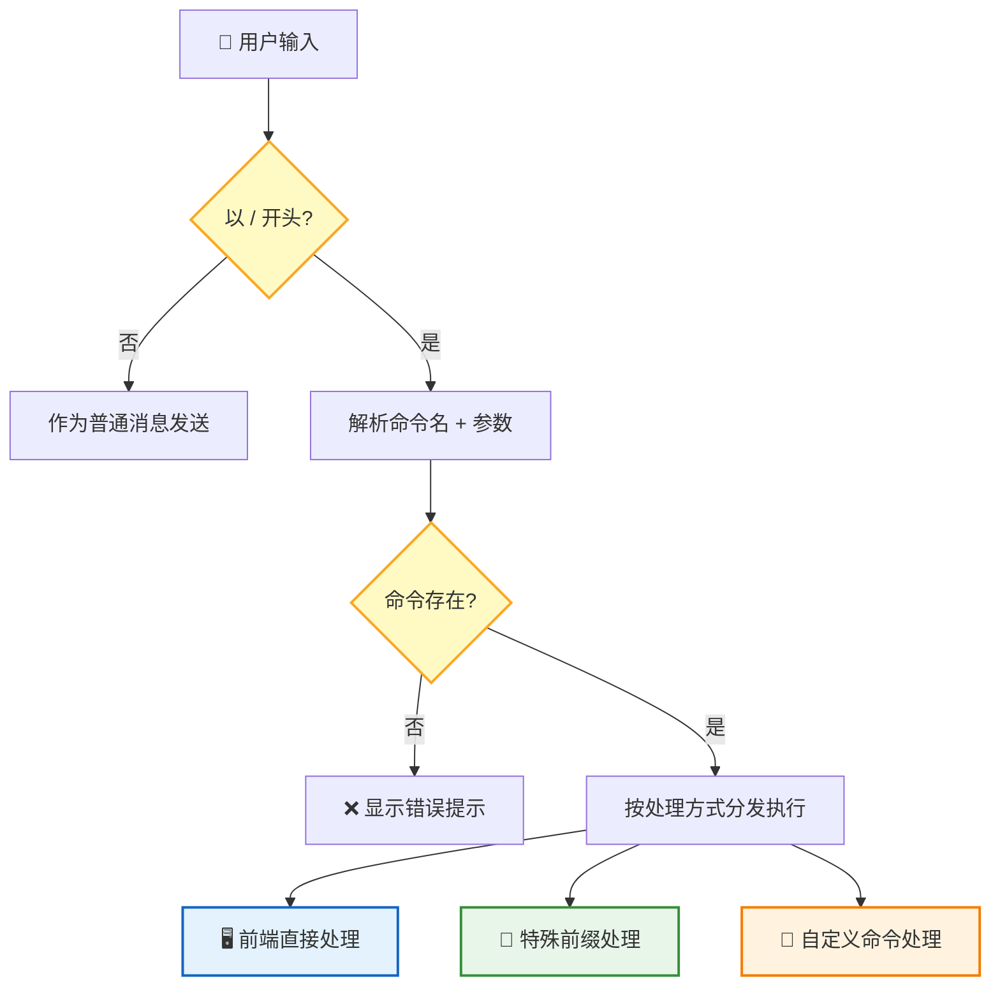
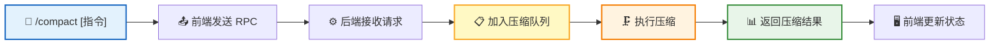
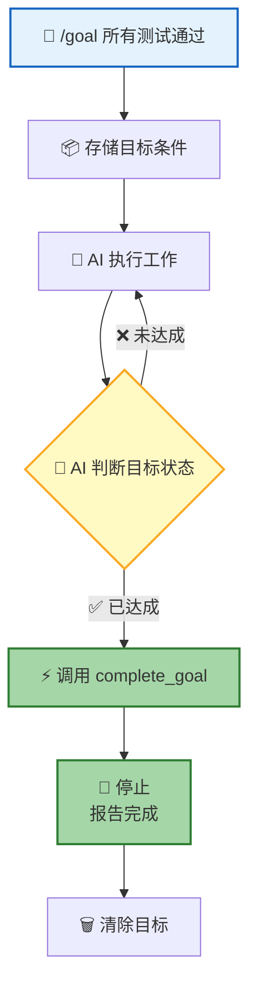
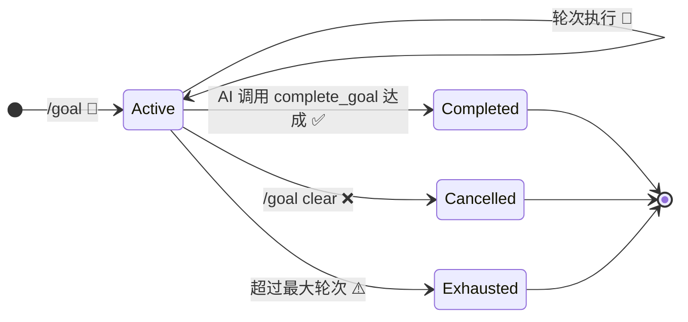

**命令系统** 让用户通过 `/command` 语法快速触发特定功能。输入 `/` 开头的文本，前端自动识别命令名和参数，分发到对应的处理逻辑——就像终端命令行一样高效。

## 命令处理方式

命令根据实现方式分为以下几种处理模式：

| 处理方式 | 说明 | 示例 |
|:-------:|------|------|
| **前端直接处理** | 前端 switch case 匹配命令名，执行本地逻辑或发送 RPC 到后端 | `/compact`：前端发送 RPC 调用后端压缩接口 |
| **特殊前缀处理** | 前端识别命令前缀，生成特殊消息（`isMeta: true`）传递给 AI | `/goal`：生成目标设定消息，AI 据此理解任务目标 |
| **自定义命令** | 宿主应用通过 API 注册自定义命令，前端匹配后调用注册的处理函数 | 宿主注册的任意自定义命令 |

## 命令解析流程

解析规则：
- `/` 后第一个单词为**命令名**
- 剩余部分为**参数**（原始字符串传递）
- 命令名匹配优先级：**精确匹配** > **别名匹配**

命令来自两个渠道：系统**内置命令**（`/compact`、`/goal`）和宿主应用通过 API 注册的**自定义命令**。

---

## /compact — 手动压缩

暴露已有的自动压缩功能，允许用户主动触发上下文压缩，释放 token 空间。

| 参数 | 必填 | 说明 |
|:----:|:----:|------|
| 自定义指令 | 否 | 覆盖默认压缩 prompt 的自定义摘要指令 |

| 关键规则 | 说明 |
|---------|------|
| **异步执行** | 压缩走队列，不阻塞当前对话 |
| **完成通知** | 压缩完成后通过 Live 频道推送通知 |
| **防重复** | 压缩中禁止重复触发 |
| **结果反馈** | 压缩完成后返回 `{Success: true}`，通过 Live 频道推送通知 |

---

## /loop — 循环执行（规划中）

> ⚠️ **此功能尚在规划中，代码未实现。** 以下描述为设计方案。

用户用自然语言描述需要循环执行的任务，Agent 理解意图后选择合适的循环模式执行。

### 设计目标

| | 定时循环 | 动态循环 |
|---|:------:|:------:|
| **触发方式** | 固定时间间隔 | 目标驱动，轮次相关 |
| **适用场景** | 监控部署、轮询状态 | 测试迭代、代码优化、批量处理 |
| **设计思路** | 前端管理定时器 | 系统管理轮次状态 |

---

## /goal — 目标驱动

用户设定一个**完成条件**，AI 持续工作直到条件满足。AI 在执行过程中自行判断目标是否达成，通过 `complete_goal` 工具声明目标已达成，或通过 `cancel_goal` 取消目标。

### 核心流程

### 核心机制

AI 在执行过程中持续评估目标完成度。当 AI 认为目标已达成时，调用 `complete_goal` 工具声明完成；当 AI 认为目标无法完成或需要取消时，调用 `cancel_goal` 工具。

| 组件 | 职责 |
|------|------|
| **AI** | 执行工作并自行判断目标是否达成，通过 `complete_goal`/`cancel_goal` 工具声明状态变化 |

### 目标作为独立实体

Goal 是独立于 Session 的实体，有自己的生命周期：

| 状态 | 说明 |
|:----:|------|
| `Active` | 目标激活中，AI 持续工作 |
| `Completed` | AI 调用 `complete_goal` 声明条件达成 |
| `Cancelled` | 用户手动取消 |
| `Exhausted` | 超过最大轮次上限（默认 50 轮） |

### 状态显示

| 元素 | 说明 |
|------|------|
| **状态栏** | 显示当前目标条件摘要 |
| **Overlay 面板** | 显示已执行轮次、累计 token、运行时长 |
| **完成通知** | 目标达成时弹出通知 |

### 相关命令

| 命令 | 说明 |
|------|------|
| `/goal` | 显示当前目标 |
| `/goal <condition>` | 设定目标 |
| `/goal clear` | 清除目标 |

| 关键规则 | 说明 |
|---------|------|
| **单一目标** | 单次会话只能有一个活跃目标 |
| **会话内有效** | 目标仅在当前会话有效 |
| **安全上限** | 最大轮次上限（默认 50 轮），防止失控 |

---

## 前端交互

命令执行后通过 Toast 向用户提供反馈。

**命令反馈**：

| 场景 | 反馈方式 |
|------|------|
| 命令执行成功 | Toast 通知 ✅ |
| 命令执行失败 | Toast 错误提示 ❌ |

## 下一步

- [Skill 系统](/docs/features/skill-system/) — 了解宿主如何注册自定义函数扩展 AI 能力
- [RTC 协议](/docs/concepts/rtc/) — 了解命令背后的远程工具调用机制
- [会话管理](/docs/features/session/) — 了解命令在会话中的上下文
