**命令系统** 让用户通过 `/command` 语法快速触发特定功能。输入 `/` 开头的文本，前端自动识别命令名和参数，分发到对应的处理逻辑——就像终端命令行一样高效。

## 命令类型

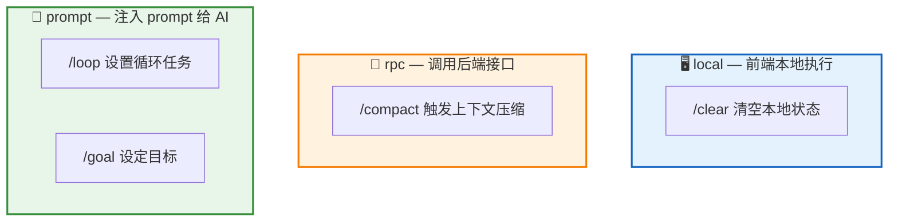

| 类型 | 执行方式 | 说明 | 示例 |
|:----:|:-------:|------|------|
| **local** | 前端直接处理 | 不经过后端，如清空本地状态 | `/clear` |
| **rpc** | 调用后端 RPC | 需要后端配合，如触发压缩 | `/compact` |
| **prompt** | 生成 prompt 注入对话 | 交给 AI 处理，如设置循环任务 | `/loop`、`/goal` |

## 命令解析流程

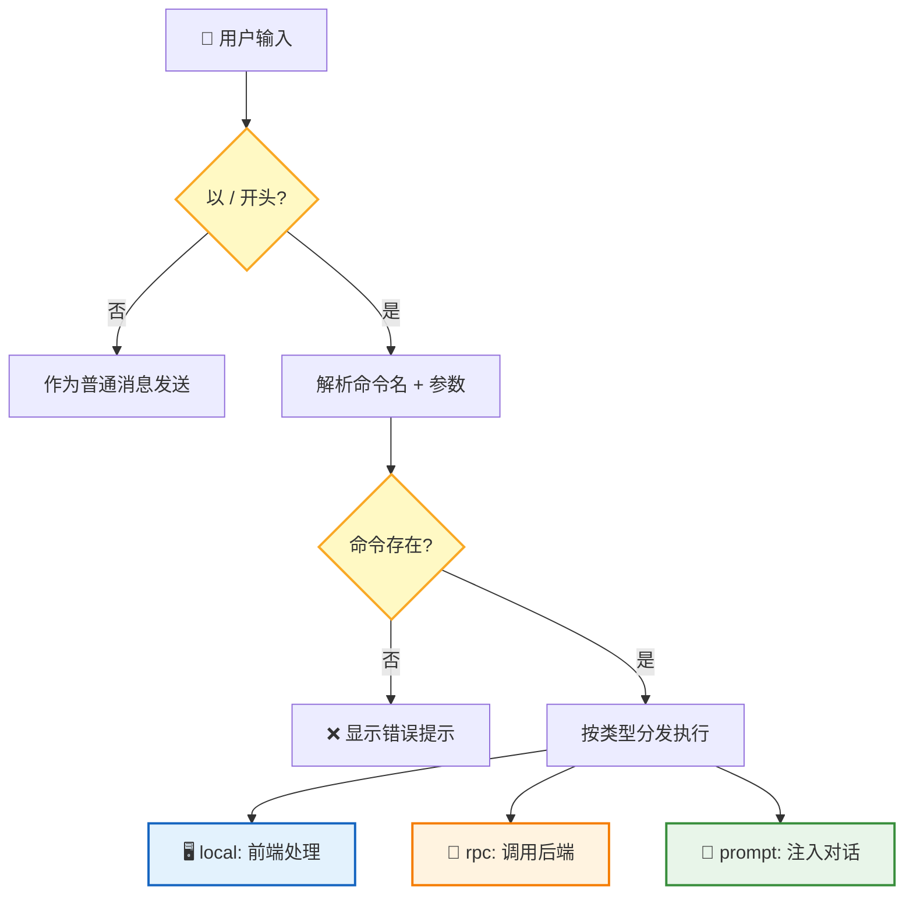

解析规则：
- `/` 后第一个单词为**命令名**
- 剩余部分为**参数**（原始字符串传递）
- 命令名匹配优先级：**精确匹配** > **别名匹配**

命令来自两个渠道：系统**内置命令**（`/compact`、`/loop`、`/goal`）和宿主应用通过 API 注册的**自定义命令**。

---

## /compact — 手动压缩

暴露已有的自动压缩功能，允许用户主动触发上下文压缩，释放 token 空间。

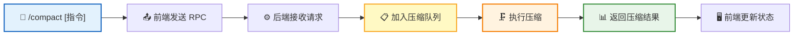

| 参数 | 必填 | 说明 |
|:----:|:----:|------|
| 自定义指令 | 否 | 覆盖默认压缩 prompt 的自定义摘要指令 |

| 关键规则 | 说明 |
|---------|------|
| **异步执行** | 压缩走队列，不阻塞当前对话 |
| **完成通知** | 压缩完成后通过 Live 频道推送通知 |
| **防重复** | 压缩中禁止重复触发 |
| **结果反馈** | 返回压缩前 token 数、压缩后 token 数、压缩比 |

---

## /loop — 循环执行

用户用自然语言描述需要循环执行的任务，Agent 理解意图后选择合适的循环模式执行。

### 两种循环模式

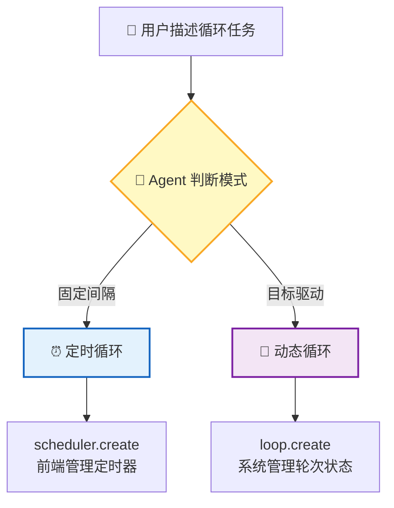

| | 定时循环 | 动态循环 |
|---|:------:|:------:|
| **触发方式** | 固定时间间隔 | 目标驱动，轮次相关 |
| **适用场景** | 监控部署、轮询状态 | 测试迭代、代码优化、批量处理 |
| **状态存储** | IndexedDB（前端） | 后端数据库 |
| **实现方式** | RTC tool `scheduler.*` | RTC tool `loop.*` |
| **页面关闭** | 暂停，重新打开恢复 | 持久化，不依赖前端 |

### 模式判断

Agent 根据用户描述中的关键词自动判断使用哪种模式：

| 用户描述 | 判断依据 | 选择模式 |
|----------|:-------:|:-------:|
| "每 5 分钟检查一次" | 固定时间间隔 | ⏰ 定时循环 |
| "每小时轮询" | 固定时间间隔 | ⏰ 定时循环 |
| "循环 5 轮" | 固定轮次，轮次相关 | 🔄 动态循环 |
| "直到测试通过" | 目标驱动 | 🔄 动态循环 |
| "处理这 100 个文件" | 批量处理，每批相关 | 🔄 动态循环 |
| "反复优化直到满意" | 迭代优化 | 🔄 动态循环 |

### 模式 1：定时循环（Scheduled Loop）

用于固定间隔的独立任务。Agent 调用 `scheduler.create` 在前端创建定时器。

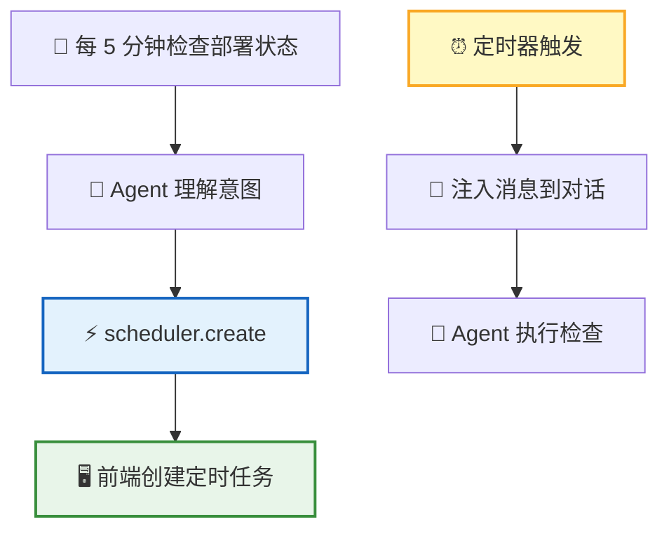

**RTC 工具**：

| 工具 | 功能 |
|:----:|------|
| `scheduler.create` | 创建定时任务（参数：`interval`、`prompt`、`max_age`） |
| `scheduler.list` | 列出所有定时任务 |
| `scheduler.cancel` | 取消定时任务 |
| `scheduler.pause` | 暂停定时任务 |
| `scheduler.resume` | 恢复定时任务 |

**间隔格式**：

| 输入 | 含义 |
|:----:|------|
| `30s` | 30 秒（最小粒度 1 分钟，向上取整） |
| `5m` | 5 分钟 |
| `2h` | 2 小时 |
| `1d` | 1 天 |

**任务生命周期**：

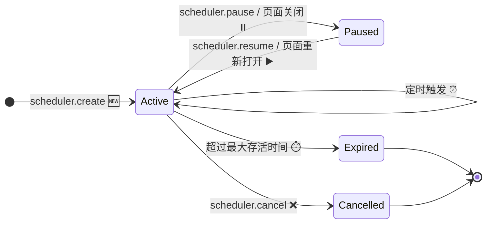

| 阶段 | 行为 |
|:----:|------|
| **创建** | 立即执行一次 + 注册定时器 |
| **触发** | 注入消息到对话，Agent 执行（消息标记为 `isMeta: true`） |
| **暂停** | 页面关闭时暂停，不执行 |
| **恢复** | 页面重新打开后，从当前时间重算下次触发 |
| **过期** | 默认 7 天后自动过期（可配置） |
| **取消** | 调用 `scheduler.cancel` 手动取消 |

> 📌 定时任务存储在前端 IndexedDB 中，仅在当前会话有效，页面关闭后暂停。

### 模式 2：动态循环（Dynamic Loop）

用于目标驱动、轮次相关的关键任务。**系统显式管理任务状态**，保证执行完成，不依赖 LLM 上下文记忆。

> 💡 **为什么不能用 ReAct？** ReAct 依赖 LLM 上下文记忆任务进度，上下文过长时 LLM 可能"遗忘"任务——不可靠，用户不敢放心使用。

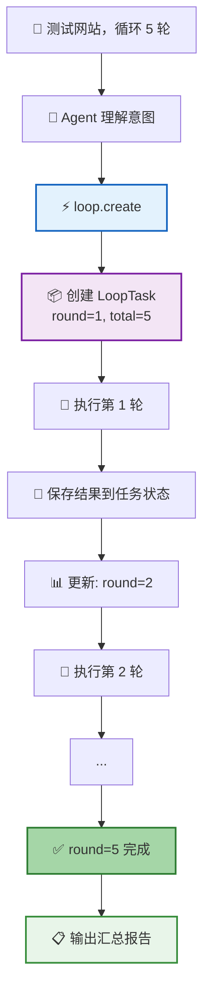

**设计原则**：

| 原则 | 说明 |
|------|------|
| **显式状态管理** | 当前轮次、总轮次、每轮参数、每轮结果都存在任务状态中 |
| **系统控制循环** | 不是 LLM 决定何时停止，而是系统检查任务状态 |
| **持久化** | 存储在数据库，即使上下文被压缩，任务状态不丢失 |
| **不达目的不罢休** | 保证执行完成，除非用户取消或达到最大轮次 |

**RTC 工具**：

| 工具 | 功能 | 关键参数 |
|:----:|------|----------|
| `loop.create` | 创建动态循环任务 | `task`、`total_rounds`、`termination_condition` |
| `loop.get_status` | 获取任务状态 | — |
| `loop.submit_round_result` | 提交当前轮次结果，触发下一轮 | `task_id`、`result`、`next_params` |
| `loop.cancel` | 取消任务 | `task_id` |

| 关键规则 | 说明 |
|---------|------|
| **状态注入** | 每轮执行前，系统注入任务状态到 Agent 上下文 |
| **结果提交** | 每轮执行后，Agent 必须调用 `loop.submit_round_result` |
| **终止检查** | 系统检查终止条件（轮次完成 / 条件满足）决定是否继续 |
| **暂停恢复** | 页面关闭时暂停，重新打开后恢复 |

---

## /goal — 目标驱动

用户设定一个**完成条件**，AI 持续工作直到条件满足。每次 AI 准备停止时，系统用独立评判模型检查条件是否达成，未达成则强制 AI 继续。

### 核心流程

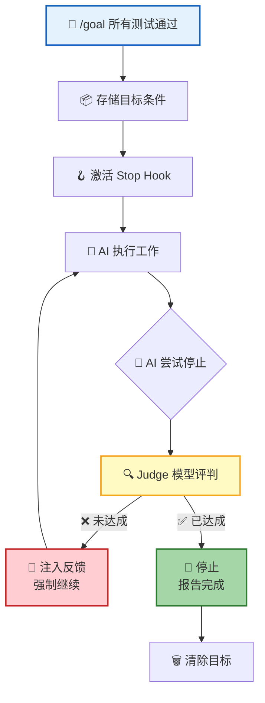

### 核心机制

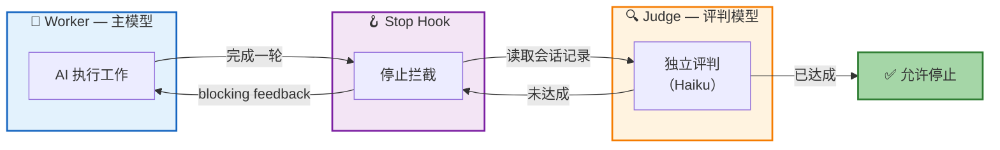

| 组件 | 职责 |
|:----:|------|
| **Worker** | 执行工作的主模型 |
| **Judge** | 独立评判模型（使用轻量模型如 Haiku，降低成本），读取会话记录判断目标是否达成 |
| **Stop Hook** | 在 AI 停止时触发，调用 Judge 检查条件 |

### 目标作为独立实体

Goal 是独立于 Session 的实体，有自己的生命周期：

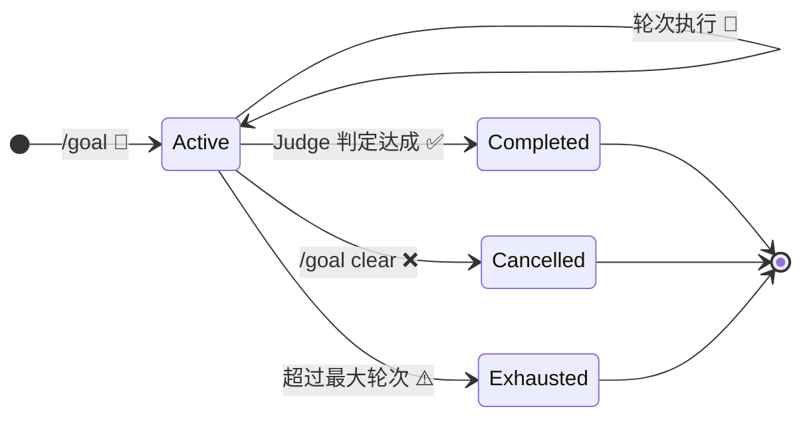

| 状态 | 说明 |
|:----:|------|
| `Active` | 目标激活中，AI 持续工作 |
| `Completed` | Judge 判定条件达成 |
| `Cancelled` | 用户手动取消 |
| `Exhausted` | 超过最大轮次上限（默认 50 轮） |

### Judge 评判

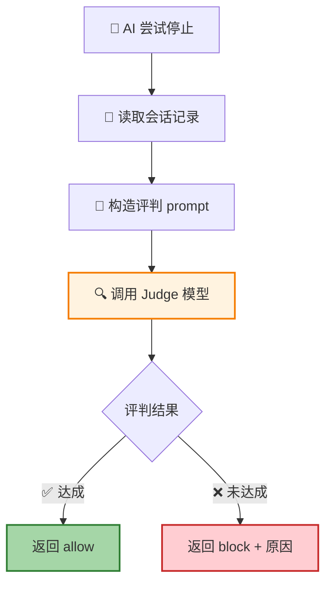

Judge 使用**轻量模型**（如 Haiku），输入目标条件 + 最近 N 轮会话记录，输出 `{ achieved: boolean, reason: string }`。评判失败时（API 错误等）默认允许停止，避免死循环。

### 状态显示

| 元素 | 说明 |
|------|------|
| **状态栏** | 显示当前目标条件摘要 |
| **Overlay 面板** | 显示已执行轮次、累计 token、运行时长 |
| **完成通知** | 目标达成时弹出通知 |

### 相关命令

| 命令 | 说明 |
|------|------|
| `/goal` | 显示当前目标 |
| `/goal <condition>` | 设定目标 |
| `/goal clear` | 清除目标 |

| 关键规则 | 说明 |
|---------|------|
| **单一目标** | 单次会话只能有一个活跃目标 |
| **会话内有效** | 目标仅在当前会话有效 |
| **安全上限** | 最大轮次上限（默认 50 轮），防止失控 |
| **失败兜底** | Judge 评判失败时默认允许停止 |

---

## 前端交互

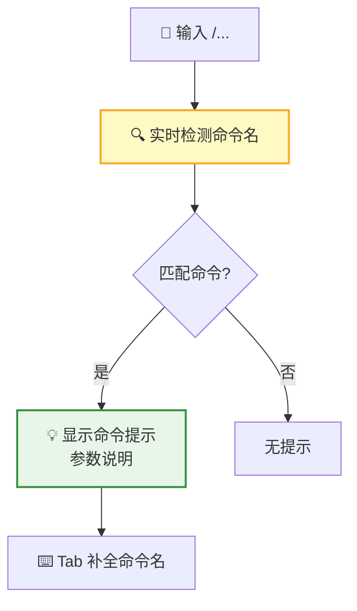

| 交互特性 | 说明 |
|---------|------|
| **Typeahead** | 输入 `/` 后显示命令列表 |
| **Tab 补全** | Tab 键自动补全命令名 |
| **参数提示** | 匹配命令后显示参数说明（灰色文字） |
| **Toast 反馈** | 命令执行成功/失败时弹出 Toast 通知 |

**命令反馈**：

| 场景 | 反馈方式 |
|------|:-------:|
| 命令执行成功 | Toast 通知 ✅ |
| 命令执行失败 | Toast 错误提示 ❌ |
| 命令返回结果 | 系统消息显示在对话中 |
| 命令需要交互 | 弹出对话框 |

**状态栏** 实时显示活跃命令：Loop 任务显示任务数量和下次触发时间，Goal 目标显示条件摘要和运行时长。

## 下一步

- [Skill 系统](/docs/features/skill-system/) — 了解宿主如何注册自定义函数扩展 AI 能力
- [RTC 协议](/docs/concepts/rtc/) — 了解命令背后的远程工具调用机制
- [会话管理](/docs/features/session/) — 了解命令在会话中的上下文
